# Monthly Change Log: June 2017

## ATSD

| Issue| Category    | Type    | Subject              |
|------|-------------|---------|----------------------|
| 4311 | sql | Feature | Enable Excel export in the [SQL Console](../../sql/sql-console.md) |
| 4291 | jdbc | Feature | Add JDBC driver property to expose user-defined tables in database metadata. |
| 4284 | core | Feature | Collect aggregate data table size metrics. |
| 4259 | sql | Bug | Return a meaningful error if the `WHERE` clause does not select metrics as expected from the reserved `atsd_series` table. |
| 4139 | installation | Feature | Add yum installer option `--prefix` to override the default installation directory |
| 4035 | sql | Bug | Fix `NULL` value returned in `metric.lastInsertTime` field for newly inserted metrics. |
| 4287 | UI | Bug | Enable syntax highlighting for extended SQL keywords. |
| 4282 | UI | Bug | Statistics page link does not generate a valid SQL query for metrics with tags. |
| 4275 | security | Bug | Enforce logout for the deleted user .|
| [4273](#issue-4273) | UI | Bug | User Interface **More** link drop-down replaced with icons. |
| 4268 | core | Support | Java 8 startup validation added. |
| 4264 |rule editor | Bug | Unable to set schedule in the Rule Editor. |
| 4256 | statistics | Bug | Invalid interval gap displayed on series statistics page. |
| 4249 | core | Bug | Prevent deletions of column families on restart, if the column family is not described in new schema. |
| [4243](#issue-4243) | administrator | Feature | Add new object types to backup: Replacement Tables, Named Collections, Users, User Groups, Entities. |
| 4237 | UI | Bug | Modify standard tooltips to bootstrap tooltips. |
| 4236 | sql | Bug | Resolved error when using [`JOIN`](../../sql/README.md#joins)  and [`INTERPOLATE(DETAIL)`](../../sql/README.md#interpolation) clauses together. |
| 4224 | sql | Bug | Fixed a bug which caused the `datetime` column to be rendered in milliseconds when referenced by the [`CONCAT`](../../sql/README.md#string-functions) function.|
| 4199 | administrator | Bug | Fixed a bug which failed to update `HOSTNAME` and server URL in **Settings > Server Properties** at runtime. |
| [4163](#issue-4163) | UI | Feature | Several enhancements to the web interface: tooltips, column visibility, icons, auto-completes. |
| [4144](#issue-4144) | rule engine | Feature | Add a page displaying all active email subscribers in the Rule Engine.|
| 4107 | UI | Bug | Layout of several forms refactored to adhere to the latest guidelines. |
| 3900 | UI | Bug | Fixed an issue with message counter chart failing to render on timespan change. |
| 4233 | sql | Bug | [`CONCAT`](../../sql/README.md#string-functions) function fails when one of the arguments is an [ISO format](../../shared/date-format.md) date. |
| 4225 | sql | Feature | Allow [`datetime`](../../sql/README.md#predefined-columns) column without table qualifier in JOIN queries. |
| 4221 | sql | Bug | `ISNULL(t1.datetime, t2.datetime)` function returns time in milliseconds for string data types. |
| 4217 | sql | Bug | Incorrect `INNER`-mode interpolation with multiple interval conditions. |
| 4203 | rule engine | Feature | Replace custom logger in Rule Engine with logback appenders. |
| 4157 | sql | Bug | Incorrect result from [`OUTER JOIN USING ENTITY`](../../sql/examples/outer-join-with-aggregation.md) clause. |
| 4089 | sql | Feature | [`JOIN`](../../sql/README.md#joins) clause is now supported against the reserved [`atsd_series`](../../sql/README.md#atsd_series-table) table. |
| 4084 | api-network | Bug | OoM Error on a large number of commands sent to [`/api/v1/command`](../../api/data/ext/command.md) API method. |
| 3556 | UI | Feature | Add Text field to Data Entry form. |
| 4262 | UI | Bug | Support for [calendar](../../shared/calendar.md) expressions added to Rule Editor > Test tab. |
| 4260 | sql | Bug | Corrected [`ROUND`](../../sql/README.md#mathematical-functions) function error with [`NaN`](../../sql/README.md#not-a-number-nan) values.|
| 4258 | sql | Bug | Fixed an error that occurred when using non-overlapping interval conditions from different metrics. |
| [4247](#issue-4247) | sql | Feature | [`NaN`](../../sql/README.md#not-a-number-nan) comparison logic changed. `NaN` is compared similar to `NULL`. |
| 4231 | sql | Bug | Fixed an error that occurred when trying to compare [`date_format`](../../sql/README.md#date_format) with date string. |
| 4192 | client | Feature | Enable support for GZIP compression in [ATSD Java API](https://github.com/axibase/atsd-api-java) client. |
| [4187](#issue-4187) | UI | Feature | Add support for SQL syntax themes. |
| [4166](#issue-4166) | UI | Feature | Apply user-defined **Time Format** to [`date_format`](../../sql/README.md#date_format) function results in the [SQL Console](../../sql/sql-console.md). |
| 4129 | sql | Bug | Disallow non-positive period in [`PERIOD`](../../sql/README.md#period) and [`INTERPOLATE`](../../sql/README.md#interpolation). |
| 4121 | sql | Bug | [`ORDER BY`](../../sql/README.md#ordering) clause cannot reference non-grouped columns. |
| 3838 | sql | Feature | Add support for column aliases in [ORDER BY](../../sql/README.md#ordering) clause. |

---

### Issue 4243

**Settings > Diagnostics > Backup**, daily `.xml` backups made for the following object types:

* Replacement Tables
* Named Collections
* Users
* User Groups (with membership)
* Entities (with entity tags, and non-default settings)

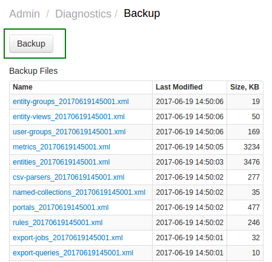

### Issue 3556

Text field added to Metrics > Data Entry form.

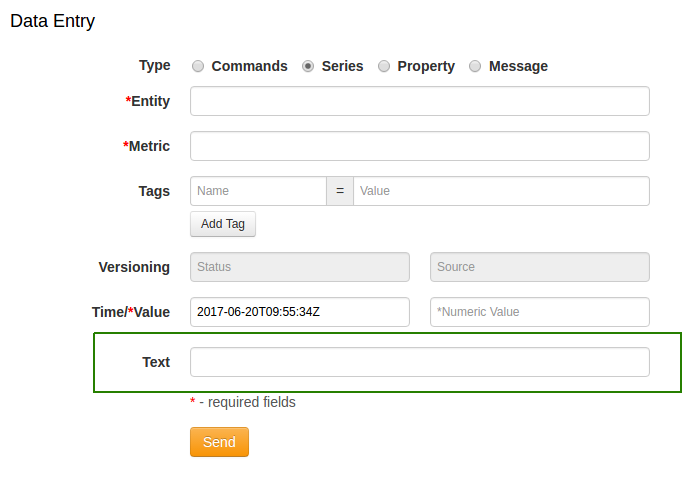

### Issue 4273

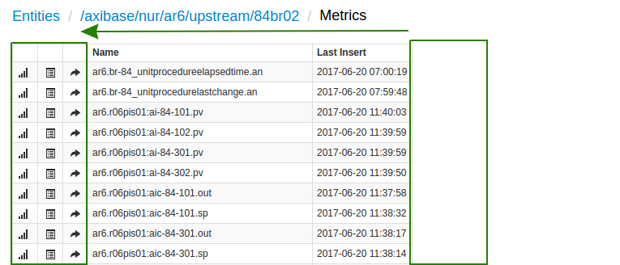

### Issue 4247

Compare [`NaN`](../../sql/README.md#not-a-number-nan) values similar to [`NULL`](../../sql/README.md#null).

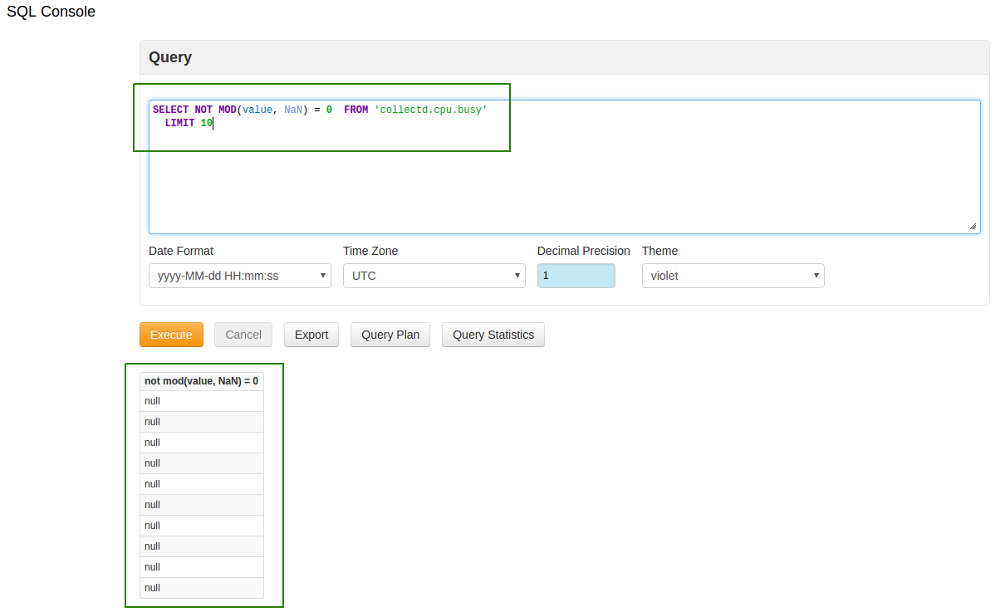

### Issue 4187

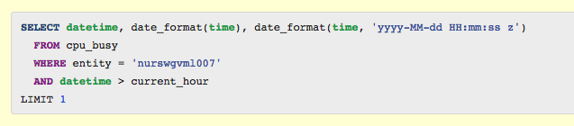

### Issue 4166

Apply user-applied date format on the [SQL Console](../../sql/sql-console.md).

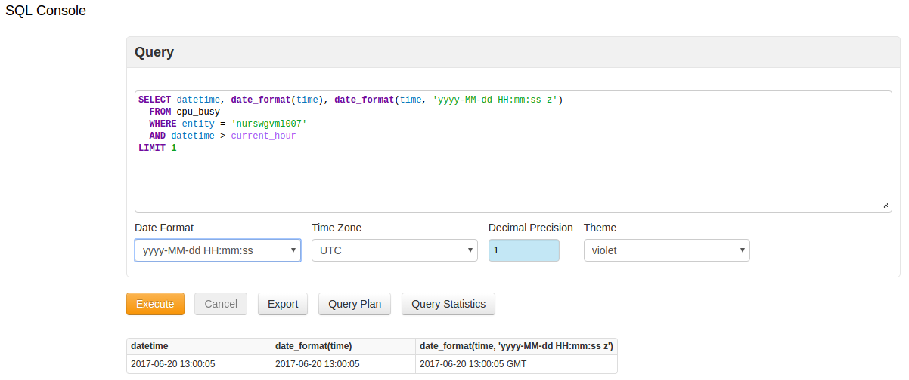

### Issue 4163

**Settings > Server Properties** page. Modified to display differences between actual and default property values:

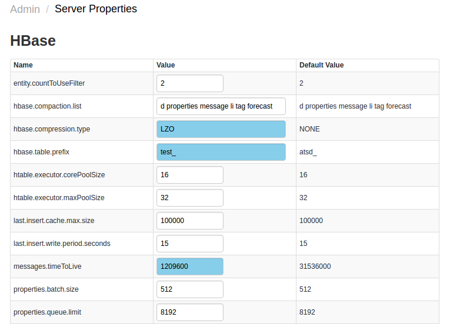

Settings > System Information, table headers added to web interface:

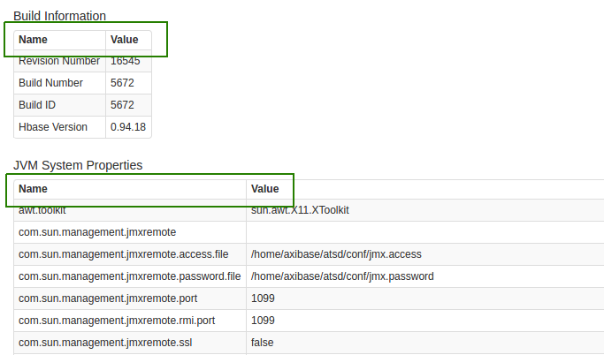

Portals tab, **View** button allows viewing of the Portal during configuration.

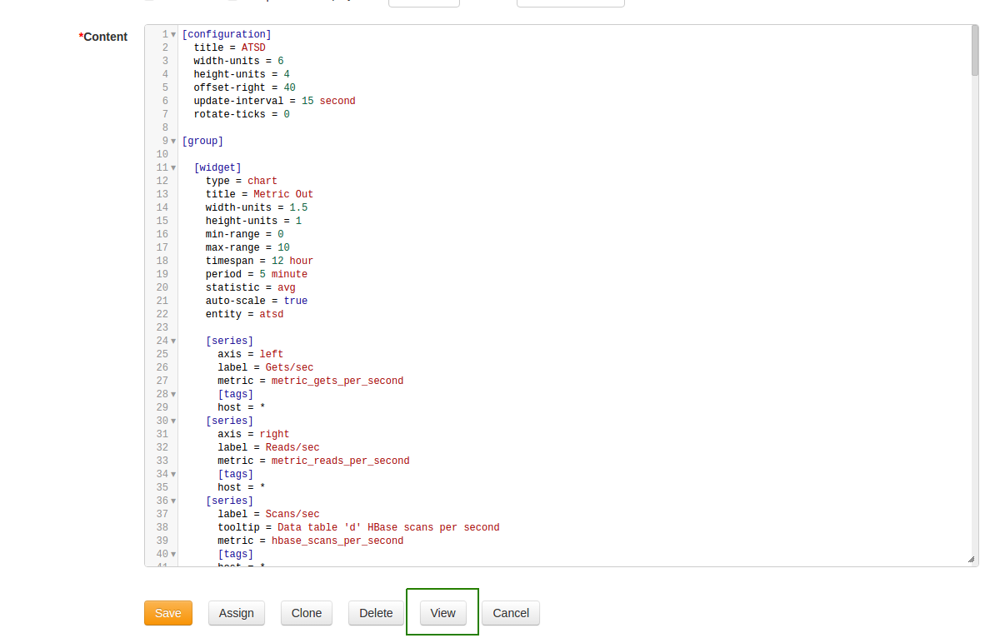

**Remember Me** tooltip added:

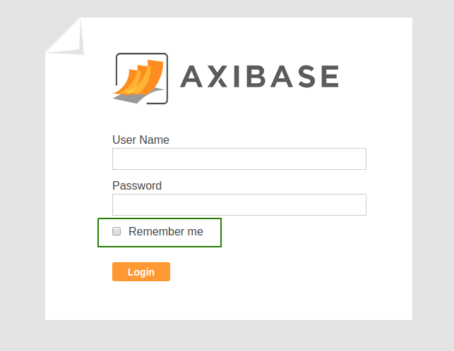

Settings > Users. `ROLE_` prefix removed:

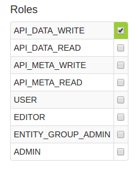

Detailed columns removed from the Entities tab.

Alerts, second precision added to date column, `ACKNOWLEDGE` column shortened to `ACK`:

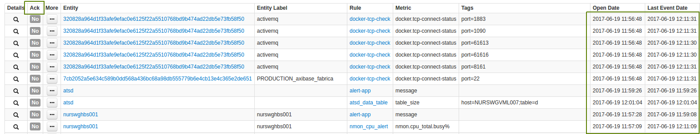

Messages, Millisecond precision added to date column.

### Issue 4144

Alerts > Rules

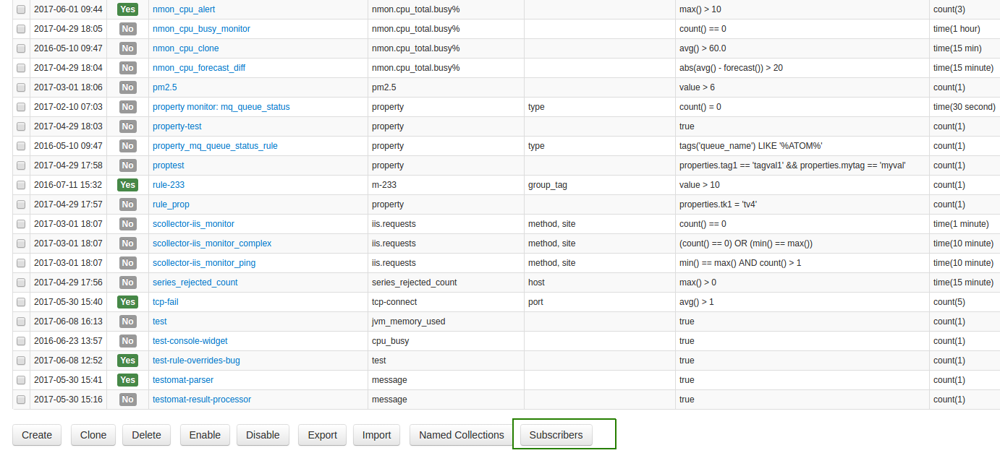

Subscribers button displays all email subscribers.