# Monthly Change Log: March 2017

## ATSD

| Issue| Category    | Type    | Subject                                                                              |
|------|-------------|---------|--------------------------------------------------------------------------------------|
| 4037 | sql | Bug | Ignore deleted entities with pending delete action from results. |
| [3915](#issue-3915) | api-rest | Feature | Add support for `tagExpression` parameter in [series query](../../api/data/series/query.md#tag-filter) method to filter returned series by tag value condition (multiple tags, negation). |
| 4021 | sql | Bug | [`CASE`](../../sql/README.md#case-expression) expression can be used without specifying the table. |
| 3981 | sql | Feature | Add support for [`CASE`](../../sql/README.md#case-expression) expression in aggregation functions. |
| 3837 | sql | Feature | Add support for constant strings and numbers in the [`SELECT`](../../sql/README.md#select-expression) expression. |
| 4007 | sql | Bug | Fix referencing error if series tag does not exist. |
| [3658](#issue-3658) | sql | Feature | Add support for referencing all metric fields (label, units, etc.) |
| 4017 | sql | Bug | Fix [`CONCAT`](../../sql/README.md#string-functions) function with constant string arguments. |
| [3907](#issue-3907) | applications | Feature | Implement ATSD query_runner in Redash. |
| 4010 | core | Bug | Prevent HBase filters from entering an infinite loop if metric id overflows. |
| 3978 | portal | Bug | Display disabled portals on Entity Group portal assignment page. |
| 3950 | sql | Bug | `SUM` function fails to accept arguments. |
| 3913 | sql | Feature | Add support [`CASE`](../../sql/README.md#case-expression) expression as part of another expression. |
| 3888 | sql | Bug | Add support for entity fields `label`, `timeZone` in the `WHERE` clause. |
| 3881 | sql | Bug | Fixed NullPointerException in queries with aggregation of metrics with decimal datatype. |
| 3842 | sql | Feature | Add support for column alias in [`CAST`](../../sql/README.md#cast) and [ROW_NUMBER](../../sql/README.md#row_number-syntax) functions. |
| 3838 | sql | Bug | Add support for column alias in `ORDER BY` clause |
| 3963 | client | Bug | Replace `last` with `cache` parameter in series query method within the Java API client. |
| 4005 | sql | Bug | Fix ArrayIndexOutOfBoundsException error in external serializer. |
| 4008 | sql | Feature | Implement a custom serializer for external sorting. |
| 3924 | UI | Feature | Add syntax highlighting to configuration files in the [Configuration Files Editor](../../administration/editing-configuration-files.md). |
| 3852 | sql | Feature | Add support for [column alias](../../sql/examples/alias-column.md) for columns created with [`CASE`](../../sql/README.md#case-expression) expression. |
| 4034 | sql | Bug | Incorrect filtering of rows with multiple [`LIKE` expressions](../../sql/README.md#like-expression) combined with OR operator. |
| 4030 | sql | Bug | Add support for metric [`LIKE` expression](../../sql/README.md#like-expression) in `FROM atsd_series` queries. |
| [4029](#issue-4029) | UI | Feature | Consolidate diagnostic tool links on the **Settings > Diagnostics** page. |
| 4027 | sql | Bug | Metric tags and fields are set to `null` in [`JOIN`](../../sql/README.md#joins) queries.|
| 4003 | csv | Bug | Enforce 1 GB limit on CSV files uploaded using [csv-upload](../../api/data/ext/csv-upload.md) method.|
| 4028 | sql | Bug | Fix `ORDER BY tag.name` if some series do not have values for the tag used in sorting. |
| 4002 | sql | Feature | Implement `GROUP BY` for the `text` column |
| 3945 | sql | Bug | Remove rows with non-existing tags in [`JOIN`](../../sql/README.md#joins) queries. |
| [3882](#issue-3882) | sql | Feature | Add support for metric fields in SQL queries. |
| 3855 | sql | Bug | Fix `GROUP BY` operation on entity.label field. |
| 4013 | sql | Bug | Allow `tags.*` expression in the `SELECT` clause if `GROUP BY` clause contains `tags` column.  |
| 4014 | sql | Bug | `BETWEEN` condition cannot be combined with other conditions in the `WHERE` clause. |
| [3940](#issue-3940) | client          | Feature | Added the `sendCommands` method to the [Python API client](https://github.com/axibase/atsd-api-python).                                            |
| 3918 | api-rest        | Bug     | Removed the `last` parameter in [series](../../api/data/series/query.md) queries. Use [`limit=1`](../../api/data/series/query.md#control-fields) instead.

---

## Charts

| Issue| Category    | Type    | Subject                                                                              |
|------|-------------|---------|--------------------------------------------------------------------------------------|
| [4006](#issue-4006) | widget-settings | Feature | Add fixed-fraction formatter. |
| [3997](#issue-3997) | time-chart | Bug | Change legend style for forecast series. |
| [3956](#issue-3956) | data-loading | Bug | Treat [tags] containing comma as separate tag values. |
| [3975](#issue-3975) | widget-settings | Feature | Implement `tag-expression` setting to filter series by tag values. |
| 3970 | treemap         | Bug     | Fixed `display = false` behavior.                                                         |
| 3964 | table           | Bug     | Made calculated alert values available in the `hide-columns` function.                                      |
| [3961](#issue-3961) | treemap         | Feature | Implemented new `mode` settings: row, column, auto.                                                                     |
| 3960 | time-chart      | Bug     | Fixed legend visibility for wildcard series requested for multiple entities or an entity group.                                 |
| [3959](#issue-3959) | api             | Feature | Removed support for `last` setting due to ATSD API changes.                              |
| [3941](#issue-3941) | widget-settings | Feature | Implemented functions to retrieve entity and metric tags in `threshold` and other calculations. |
| 3927 | core            | Bug     | Fixed the order of widget content geometry calculation.                                |

---

### Collector

| Issue| Category    | Type    | Subject                                                                              |
|------|-------------|---------|--------------------------------------------------------------------------------------|
| 3989 | json | Bug | Unescape HTML-escaped values in textarea with syntax highlight. |
| [3682](#issue-3682) | pi | Feature | Implement the PI job to copy incremental PI tag values using the JDBC driver. |
| [3996](#issue-3996) | socrata | Feature | Display top-10 rows in tabular format in Test mode. |
| 4026 | core | Bug | Add support for specific dates in [ISO format](../../shared/date-format.md) in [calendar](../../shared/calendar.md#specific-time) expressions. |
| 4019 | docker | Bug | Do not interrupt the job if there are no free ATSD connections in pool. |
| 4025 | core | Bug | Remove `m:{name}=NaN` field in `series` command if text value is specified. |
| [4001](#issue-4001) | jdbc | Feature | Substitute Replacement Tables with LOOKUP function and Item Lists. |
| 3992 | socrata | Bug | Apply encoding to JSON output. |
| 4004 | socrata | Bug | Handle optional request parameters in the URL wizard. |
| 3972 | json | Bug | Replace non-printable characters to underscores in generated entity names. |
| 3931 | json | Bug | Add support for referencing field names containing dots by quoting the field name. |
| 3828 | administrator | Bug | Expose atsd-api-java request logging via logback configuration. |
| [3827](#issue-3827) | file | Feature | Add support for [placeholders](https://axibase.com/docs/axibase-collector/jobs/placeholders.html) in **First Line Contains** field. |
| 3990 | collection | Bug | Ignore `stderr` when reading SCRIPT Item List. |
| 3970 | treemap         | Bug     | Fixed `display = false` behavior.                                                         |
| 3964 | table           | Bug     | Made calculated alert values available in the `hide-columns` function.                                      |
| [3961](#issue-3961) | treemap         | Feature | Implemented new `mode` settings: row, column, auto.                                                                     |
| 3960 | time-chart      | Bug     | Fixed legend visibility for wildcard series requested for multiple entities or an entity group.                                 |
| [3959](#issue-3959) | api             | Feature | Removed support for `last` setting due to ATSD API changes.                              |
| [3941](#issue-3941) | widget-settings | Feature | Implemented functions to retrieve entity and metric tags in `threshold` and other calculations. |
| 3927 | core            | Bug     | Fixed the order of widget content geometry calculation.                                |

---

### Issue 3827

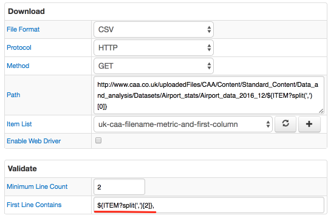

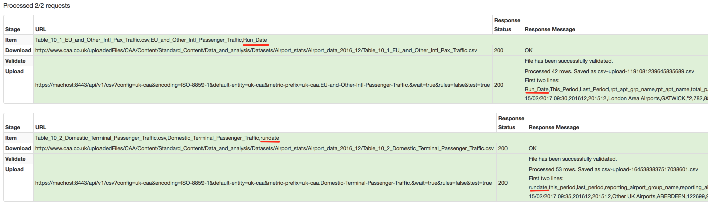

### Issue 3956

[ChartLab](https://apps.axibase.com/chartlab/558ba4c1)

### Issue 3975

| Setting | Description |
|---------|-------------|
| tag-expression | Applies server-side filter to series based on series tag values. |

[ChartLab](https://apps.axibase.com/chartlab/906238e2/4/)

### Issue 3658

```sql
SELECT metric,
    metric.dataType,
    metric.description,
    metric.enabled,
    metric.filter,
    metric.id,
    metric.interpolate,
    metric.invalidValueAction,
    metric.label,
    metric.lastInsertTime
FROM df.disk_used
LIMIT 1
```

```ls
| metric | metric.dataType | metric.description | metric.enabled | metric.filter | metric.id | metric.interpolate | metric.invalidValueAction | metric.label | metric.lastInsertTime |
|---|---|---|---|---|---|---|---|---|---|
| df.disk_used | FLOAT | null | true | tags.file_system != 'none' | 35 | LINEAR | NONE | null | null |
```

```sql
SELECT metric,
    metric.maxValue,
    metric.minValue,
    metric.name,
    metric.persistent,
    metric.retentionIntervalDays,
    metric.tags,
    metric.timePrecision,
    metric.timeZone,
    metric.units,
    metric.versioning
FROM df.disk_used
LIMIT 1
```

```ls
| metric | metric.maxValue | metric.minValue | metric.name | metric.persistent | metric.retentionIntervalDays | metric.tags | metric.timePrecision | metric.timeZone | metric.units | metric.versioning |
|---|---|---|---|---|---|---|---|---|---|---|
| df.disk_used | null | null | df.disk_used | true | 0 | null | MILLISECONDS | null | null | false |
```

### Issue 3907

See the [guide](https://redash.io/help/data-sources/axibase_tsd.html) on how to integrate Redash with ATSD.

### Issue 4001

Replacement tables are deprecated. Similar functionality is provided by the `LOOKUP` function.

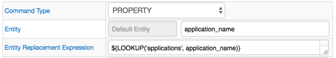

### Issue 4006

| Setting | Description |
|---------|-------------|
| format = fixed(n) | Format numbers with the specified number of digits in the fraction portion of a number.<br>Default: 0 fractional digits. |

[ChartLab](https://apps.axibase.com/chartlab/b510b820)

### Issue 3997

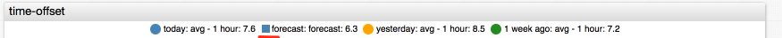

[ChartLab](https://apps.axibase.com/chartlab/075941a0/2/)

### Issue 3915

[Documentation](../../api/data/series/query.md)

URI

```elm
POST /api/v1/series/query
```

Payload

```json
[{
  "startDate": "2017-02-13T08:00:00Z",
  "endDate":   "2017-02-13T09:00:00Z",
  "entity": "nurswgvml007",
  "metric": "disk_used",
  "tagExpression": "tags.file_system NOT LIKE '*your-backup*'",
  "limit": 1
}]

```

Response

```json
[{"entity":"nurswgvml007","metric":"disk_used","tags":{"file_system":"/dev/mapper/vg_nurswgvml007-lv_root","mount_point":"/"},"type":"HISTORY","aggregate":{"type":"DETAIL"},"data":[{"d":"2017-02-13T08:59:53.000Z","v":9242420.0}]}]
```

### Issue 4029

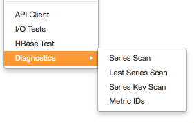

### Issue 3882

[List of predefined columns](../../sql/README.md#predefined-columns)

### Collector

### Issue 3682

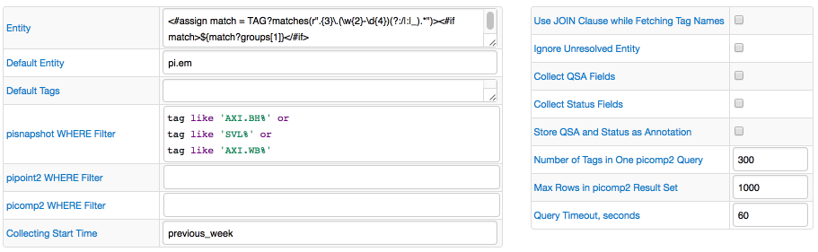

### Issue 3996

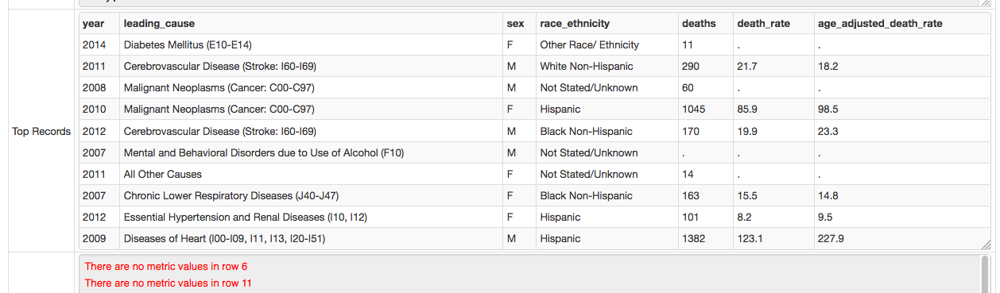

### Issue 3940

New `sendCommands` method:

```python
import atsd_client
from atsd_client.services import CommandsService
conn = atsd_client.connect()
commandsService = CommandsService(conn)
commands_to_send = ["metric m:stat.step p:integer",
                    "series e:process m:stat.step=0 x:stat.step=initial"]
commandsService.send_commands(commands_to_send)
```

### Issue 3977

The configuration pages for Databases, HTTP Pools, and Replacement Tables now display linked jobs.

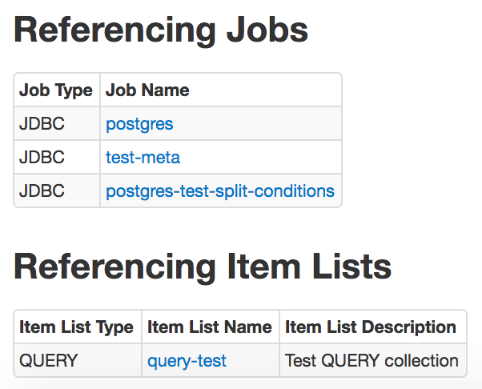

For the HTTP pool, the linked task configurations, item lists, and ATSD configurations are now shown.

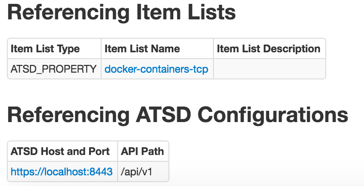

For the Replacement table, the linked task configurations are shown.

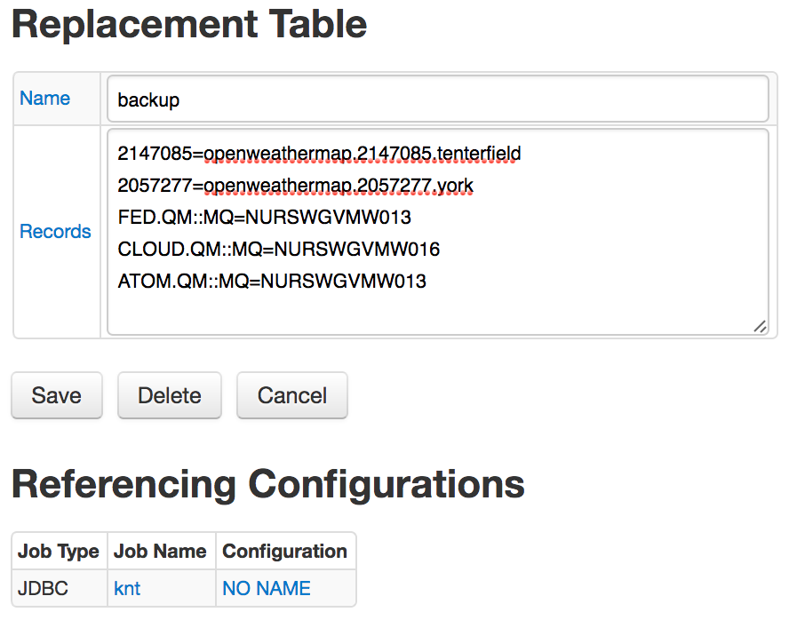

### Issue 3976

**Command** field containing the path to the executable script renamed **Path to the script**.
New field allows entering commands returning **Item List** elements, one per line.
The commands from the text area are copied to a file in the `$AXIBASE_COLLECTOR_HOME/conf/scripts` directory and executed as a script.
You must set `script.text.execute.allow=true` in the `$AXIBASE_COLLECTOR_HOME/conf/server.properties` file to enable this feature.

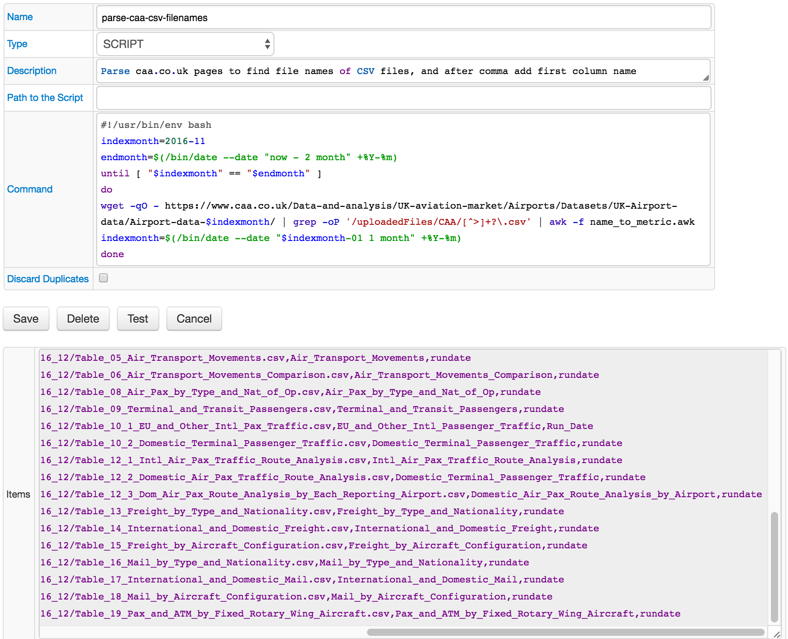

### Issue 3932

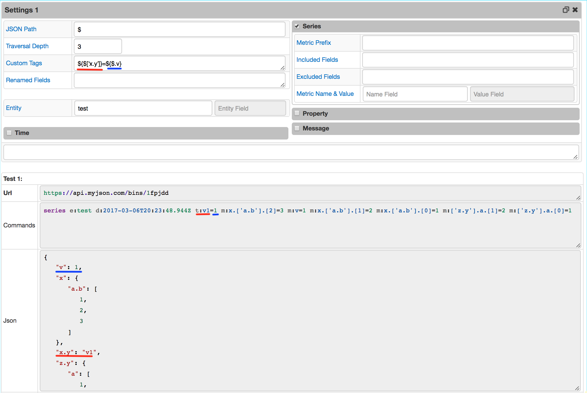

### Issue 3817-a

New checkbox **Skip Old Data** introduced. If enabled, the last data row from the target dataset is stored by Collector. When the task is executed next time, only new rows are sent into ATSD as series.

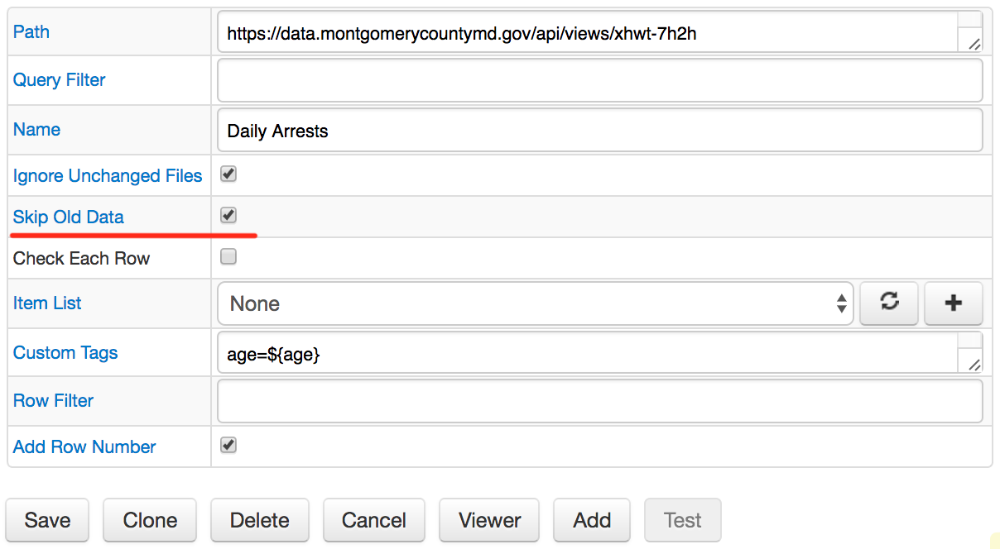

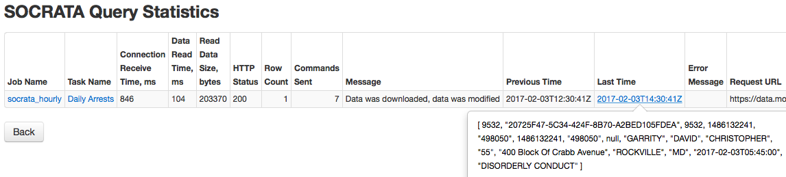

### Issue 3817-b

The new field **Query Filter** has been introduced to allow applying a filter expression as part of a request.

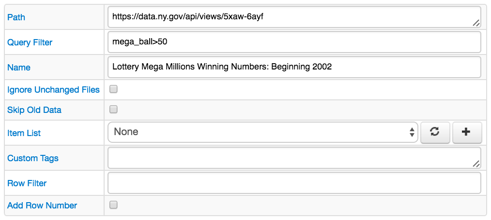

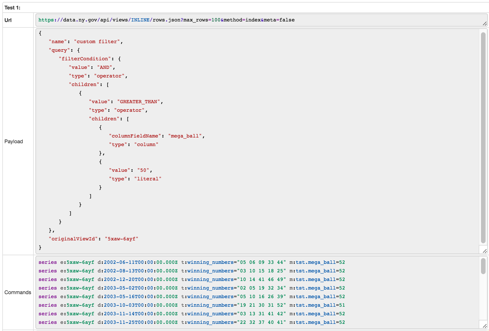

## Charts

### Issue 3961

The new settings introduced in Treemap configurations:

| Setting | Description | Available options |
|------|-------------|-------------------|
| mode | Layout mode to control how rectangles are positioned. |– `default` <br> – `row` (align rectangles as rows) <br> – `column` (align rectangles as columns) <br> – `auto` (switch between row and column modes depending on widget size)

[ChartLab](https://apps.axibase.com/chartlab/fc68bae4/7/)

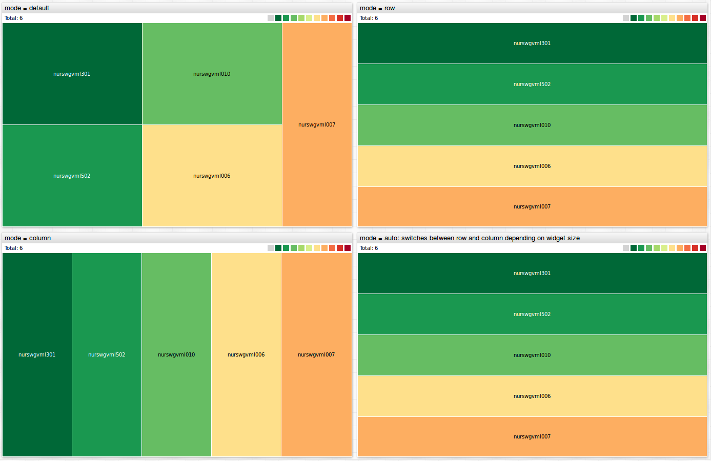

### Issue 3959

`last = true` is deprecated. Replace it with `limit: 1`.

[ChartLab](https://apps.axibase.com/chartlab/25551747)

### Issue 3941

Functions `meta()`, `entityTag()`, and `metricTag()`, which return entity or metric tags retrieved from the server, are now available in widget settings:

```python
meta('alias') – returns ‘meta’ object for series with alias ‘alias’.
meta() – returns ‘meta’ object for the current series.
entityTag('alias', 'tag_name') – return entity tag value for series with the specified alias
entityTag('tag_name') – return entity tag value for the current series
metricTag('alias', 'tag_name') – return metric tag value for series with the specified alias
metricTag('tag_name') – return metric tag value for the current series
```

Refer to [metadata](https://axibase.com/products/axibase-time-series-database/visualization/widgets/metadata/) documentation for additional examples.

[ChartLab](https://apps.axibase.com/chartlab/2b15e6f9)

[ChartLab](https://apps.axibase.com/chartlab/c4c1f7b8)

[ChartLab](https://apps.axibase.com/chartlab/c9bd5eb5)
