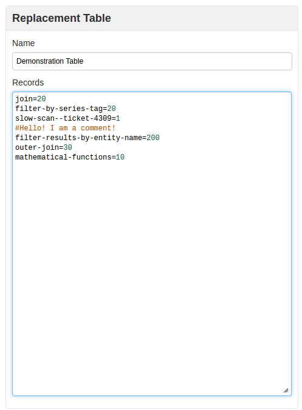
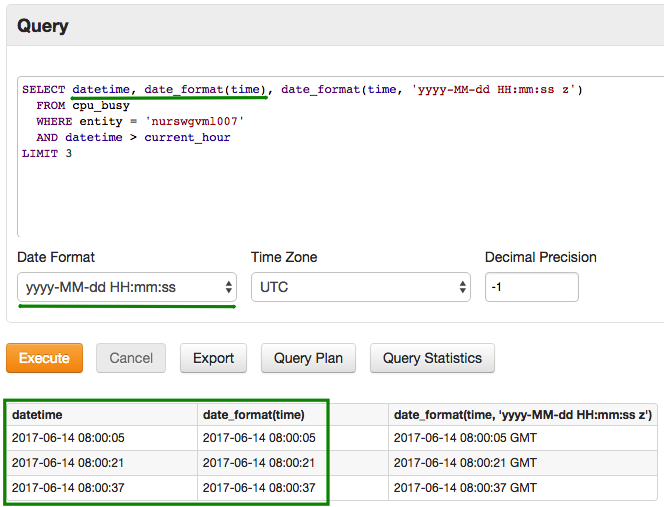
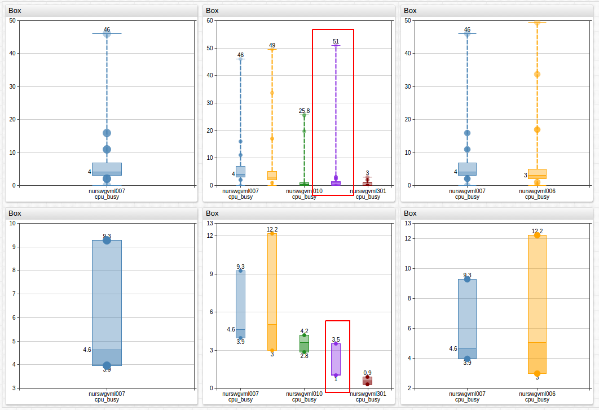
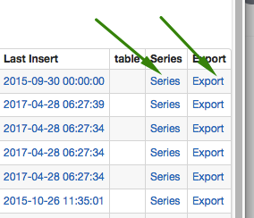
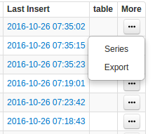
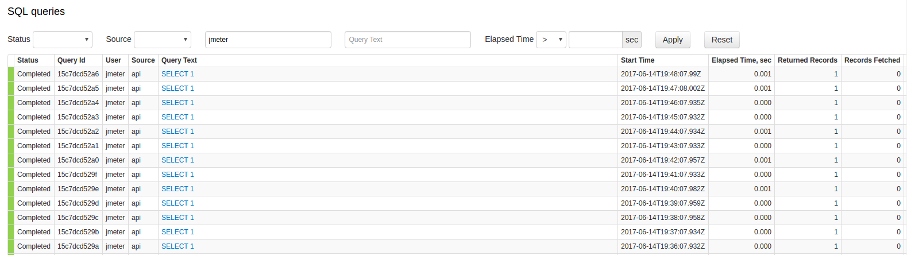
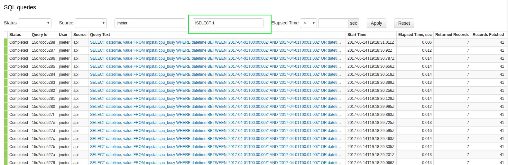
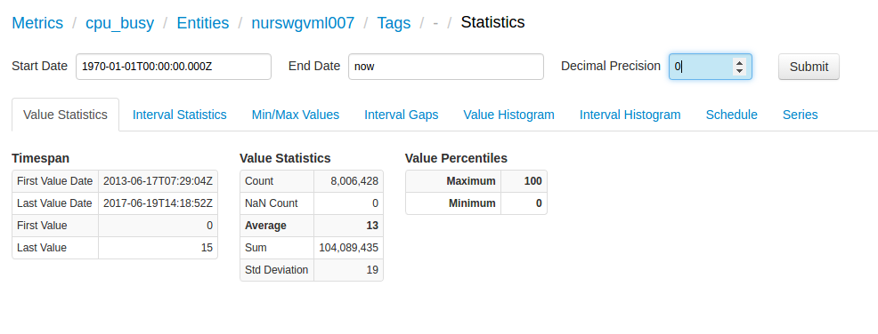
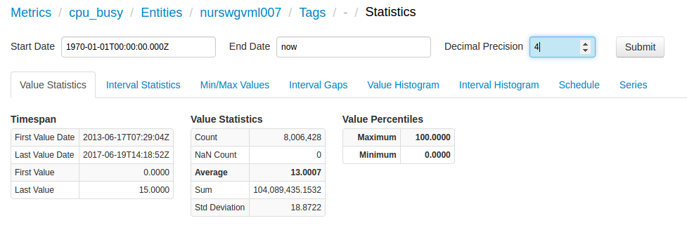

# Monthly Change Log: May 2017

## ATSD

| Issue| Category    | Type    | Subject              |
|------|-------------|---------|----------------------|
| 4222 | export | Bug | Optimize export scan by adding entity to the scan filter. |
| 4219 | UI | Bug | Add series tags to SQL queries generated on the **Series Statistics** page. |
| 4216 | api-rest | Bug | Fix `OutOfMemory` error by applying limit on the server for [`/api/v1/messages/query`](../../api/data/messages/query.md#result-filter-fields) method. |
| 4214 | api-rest | Feature | Enable support for GZIP compression of the payload in [`/api/v1/command`](../../api/data/ext/command.md) method. |
| 4212 | data-in| Bug| Fix Number Format Exception in `ChannelHandler`. |
| 4211 | sql | Bug | Error when evaluating interval condition if end date is earlier than '1970-01-01T00:00:00Z'. |
| 4208 | data-in| Bug | Clear long command buffer if disconnect on error is disabled. |
| 4207 | core | Bug | Add missing `HOST` tags to all internal ATSD metrics.|
| 4205 | UI | Bug | Refresh replacement table cache after the table is modified. The cache is used in SQL queries to replace field values similar to a lookup table or a dictionary.|
| 4202 | csv | Bug | Consolidate error log events when parsing CSV files for simplified troubleshooting. |
| [4196](#issue-4196) | api-network | Feature | Enable support for GZIP compression in [/api/v1/command](../../api/data/ext/command.md) method. |
| 4191 | UI | Bug | **Clone** button in the scheduled SQL configuration fails to redirect to the new configuration. |
| 4189 | sql | Bug | Fix [`LIKE`](../../sql/README.md#where-clause) comparator when comparing tags using wildcards. |
| [4184](#issue-4184) | core | Feature | Add support for comments (hash symbol) in replacement tables. |
| 4183 | sql | Bug | Fixed an NullPointerException caused by empty output path in scheduled SQL queries. |
| 4176 | UI | Bug | Fixed a paging issue on Entities page. |
| 4174 | csv | Support | Ensure compatibility of schema-based browsers with Java 8. |
| 4172 | rule engine | Bug | Fixed broken rendering of the Alerts History detail page. |
| [4166](#issue-4166) | UI | Feature | Apply user-defined time format to `datetime` column in the [SQL Console](../../sql/sql-console.md). |
| 4165 | UI | Feature | Extend SQL syntax highlighter with extended ATSD keywords. |
| 4159 | UI | Bug | Removed unused sorting option on the **Settings > System Information** page. |
| 4156 | sql | Bug | Ensure email delivery in case of file write errors in scheduled SQL queries. |
| 4149 | sql | Bug | Fixed a self-join exception that occurred when using the [`metrics()`](../../sql/README.md#metrics) function |
| 4131 | Test | Bug | Fixed an error caused by ignoring Daylight Savings Time when using a [`GROUP BY PERIOD`](../../sql/README.md#period) clause with a user-defined time zone.|
| 4130 | sql | Bug | Fixed an error causing the display of duplicate rows when performing aggregation without grouping.|
| 4112 | sql | Bug | Fixed [`ISNULL`](../../sql/README.md#isnull) function evaluation that ignored the first condition unless another condition is present in the `WHERE` clause.|
| 4105 | sql | Bug | Fixed an error causing missing rows in [sub-queries](../../sql/examples/filter-by-date.md#query-using-between-subquery) containing the `WHERE` condition.|
| 4097 | UI | Bug | Fixed a concurrency problem causing multiple queries to be stopped with a single cancel request. |
| [4146](#issue-4146) | sql | Feature | Modified [`GROUP BY PERIOD`](../../sql/README.md#grouping) processing to include all samples within the period. |
| [4140](#issue-4140) | UI | Feature | Replace named links with drop-down lists in record tables. |
| 3838| sql | Feature | Add support for column aliases in the `ORDER BY` clause. |
| 4182 | sql | Bug |Fix parsing error when [`CAST`](../../sql/README.md#cast) function is used within [`ISNULL`](../../sql/README.md#isnull) function with a string argument: `CAST(ISNULL(LOOKUP('tab-1', entity), '0') AS NUMBER)`.|
| [4179](#issue-4179) | sql | Feature | Add an option to exclude queries from the SQL query statistics page using `!` as the negation symbol. |
| 4178 | export | Bug | Fixed a bug with email notifications when **Output Path** is not specified. |
| 4175 | sql | Bug | Incorrect period start calculated for YEAR period and END_TIME alignment.|
| 4169 | rule engine | Bug | Fix `FileNotFoundException` when `/tmp/atsd/alert.log` is removed by the operating system. |
| 4161 | sql | Bug | Apply syntax highlighting prior to displaying the result set in the [SQL Console](../../sql/sql-console.md). |
| 4132 | collectd | Feature | Force [`collectd`](https://github.com/axibase/atsd-collectd-plugin) to use a short hostname instead of a Fully Qualified Domain Name when FQDN is `localhost`.|
| 4115 | UI | Bug | Fix localization issue with submit buttons without the value attribute. |
| 4195 | sql | Bug | Fix exception when multiple conditions are enclosed in parentheses. |
| 4181 | sql | Bug | Fixed an interpolation error is start date is '1970-01-01T00:00:00Z'. |
| 4152 | sql | Bug | Failure to parse complex metric condition in `atsd_series` syntax: `(metric LIKE 'tv6.pack*' OR metric LIKE 'tv6.ela*')`. |
| [3834](#issue-3834) |UI | Feature| Client-side formatting on series statistics page. |

---

## Collector

| Issue| Category    | Type    | Subject                                                             |
|------|-------------|---------|----------------------
| 4154 | docker | Bug | Fixed an `async` exception that listens for Docker events. |
| 4151 | docker | Bug | Fixed data gap when ATSD is temporarily down. |

---

## Charts

| Issue| Category    | Type    | Subject                                                             |
|------|-------------|---------|----------------------
| [4153](#issue-4153) | box | Bug | Fixed an auto-scaling error for aggregated series in the [Box Chart](https://axibase.com/docs/charts/widgets/box-chart/). |
| 4124 | refactoring | Bug | Optimize [`series-labels`](https://axibase.com/docs/charts/widgets/pie-chart/#series-labels) rendering. |

---

### Issue 4196

Sample `curl` command:

```bash
curl -k -X POST --data-binary @command.txt.gz \
  http://atsd_hostname:8443/api/v1/command \
  --header "Content-Encoding:gzip" \
  --header "Content-Type:text/plain;charset=UTF-8"
```

### Issue 4184



### Issue 4166

```sql
SELECT datetime, date_format(time), date_format(time, 'yyyy-MM-dd HH:mm:ss z')
  FROM mpstat.cpu_busy
  WHERE entity = 'nurswgvml007'
  AND datetime > current_hour
LIMIT 3
```



### Issue 4153



[](https://apps.axibase.com/chartlab/27dc8b67)

Application of the `statistic` command yielded incorrect displays for the `entity = *` fields
under particular `[series]` clusters which can be viewed in ChartLab.

### Issue 4146

```sql
SELECT datetime, avg(value), count(value)
  FROM mpstat.cpu_busy
WHERE datetime >= '2017-05-01T00:05:00Z' AND datetime < '2017-05-02T00:00:00Z'
  GROUP BY PERIOD(1 HOUR)
```

The period starting at '2017-05-01T00:00:00Z' is now included even though it starts earlier than the selection interval start time '2017-05-01T00:05:00Z'.

```ls
| datetime             | avg(value) | count(value) |
|----------------------|------------|--------------|
| 2017-05-01T00:00:00Z | 1          | 1            | <-- included
| 2017-05-01T01:00:00Z | 3          | 3            |
| 2017-05-01T02:00:00Z | 5          | 1            |
```

### Issue 4140



These links have been compressed to a drop-down list, as shown below:



### Issue 4179

In **SQL > Query Statistics**:



Using an exclamation point in the Query Text search bar hides results that include the
indicated text, in this case `!SELECT 1` hides results which include `SELECT 1` in the
query text, as shown below:



### Issue 3834



Modifying these fields no longer requires performing the query a second time.


