# Monthly Change Log: November 2017

## ATSD

| Issue| Category    | Type    | Subject              |
|------|-------------|---------|----------------------|
| [4745](#issue-4745) | rule engine | Feature | Implement `matchList` function to simplify name collection checks. |
| 4745| rule engine | Bug | Skip variable replacement in logging messages if rule logging is disabled. |
| [4734](#issue-4734) | rule engine | Bug | The screenshot portal must include functions specified in user variables. |
| 4732 | administrator | Feature | Compress backup XML files to `gz` format to save local disk space. |
| [4730](#issue-4730) | rest api | Feature | Add support for `addMeta` parameter in [series](../../api/meta/metric/series.md) method. |
| [4724](#issue-4724) | rule engine | Feature | Implement functions to access status of another rule for correlation purposes. |
| [4715](#issue-4715) | rest api | Feature | Implement [series tags](../../api/meta/metric/series-tags.md) method to retrieve unique tag values. |
| 4713 | rest api | Bug | Include entity and metric metadata in series queries for `FORECAST` datatype. |
| [4710](#issue-4710) | rule engine | Feature | Include alert screenshots as inline images instead of attachments. |
| 4704 | rule engine | Feature | Customize charts used in alert screenshots to display aggregation functions referenced in the rule expression. |
| [4599](#issue-4599) | security | Feature | Add support for user IP access restrictions. |
| [4718](#issue-4718) | data-api | Feature | Add support for additional [percentile functions](../../api/data/aggregation.md) in the [series query](../../api/data/series/query.md) method:<br>`PERCENTILE_25` = 25% percentile<br>`PERCENTILE_10` = 10% percentile<br>`PERCENTILE_5` =  5% percentile<br>`PERCENTILE_1` = 1% percentile<br>`PERCENTILE_05` = 0.5% percentile<br>`PERCENTILE_01` = 0.1% percentile |
| [4714](#issue-4714) | data-api | Bug | Fix error when the [series query](../../api/data/series/query.md) request includes two queries with aggregations using different periods. |
| 4709 | portal | Support | Upgrade the built-in portals to the latest syntax by removing Freemarker functions where possible. |
| [4708](#issue-4708) | sql | Bug | `LIMIT` clause not applied correctly with `ORDER BY datetime DESC`. |
| [4707](#issue-4707) |UI| Feature | Multiple web interface enhancements. |
| [4706](#issue-4706) | install | Feature | Add support for JVM environment variables in the ATSD [Docker image](https://github.com/axibase/dockers#environment-variables). |
| [4675](#issue-4675) | rule-engine | Feature | Attach charts to email notifications. |
| 4694 | sql | Bug | Storing results into new series fails for new metric/entity if **Check Last Time** is enabled. |
| 4693 | installation | Bug | Fix failing HBase shell tests by increasing a timeout for the last test. |
| 4692 | rule-engine| Bug | Import of an existing rule with a webhook breaks the current rule with the same name. |
| [4687](#issue-4687) | api-rest | Feature | Added support for wildcards when requesting metric/entity tags. |
| [4686](#issue-4686) |UI| Feature | Tag templates: added support for **Entity Link** field type. |
| 4685 | core | Bug | Entity group built with the `hasMetric(name, hours)` function is empty after the scheduled update. |
| [4684](#issue-4684) |UI| Feature | Entity group editor refactored. |
| 4665 | client | Feature | [Python API client](https://github.com/axibase/atsd-api-python) models and utility classes refactored. |
| [4652](#issue-4652) |UI| Feature | New top menu implemented. |
| [4658](#issue-4658) |UI| Feature | Redesign icon drop-down list in the entity view editor. |
| [4600](#issue-4600) | security | Feature | Stored login history. |
| [4585](#issue-4585) |UI| Feature | Multiple layout enhancements. |
| [3269](#issue-3269) | sql | Feature | `LIMIT n` optimization for descending date queries. |
| [4588](#issue-4588) | sql | Feature | Allow referencing the entity column in the `atsd_series` metric filter. |

---

## Charts

| Issue| Category    | Type    | Subject              |
|------|-------------|---------|----------------------|
| 4699 | core | Bug | Prevent duplicate series from being displayed when creating derived series from wildcard series.  |
| [4611](#issue-4611) | bar | Feature | Add support for `multiple-column` setting.|
| 4683| external | Feature | Update client adapter for external JavaScript libraries. |
| 4690 | widgets | Feature | Speed up series filtering in dependent charts. |
| 4678 | api | Feature | Upgrade JavaScript adapter for external charting libraries. |
| 4630 | api | Feature | Implement [`previous()`](https://github.com/axibase/charts/blob/master/syntax/functions.md#previous) function. |

---

## Collector

| Issue| Category    | Type    | Subject              |
|------|-------------|---------|----------------------|
| 4740 | docker | Bug | Container entity tags are missing if storage driver is not properly configured on collector startup.  |
| 4703 | docker | Bug | Collector CPU gets abnormally high when multiple Docker jobs are running. |
| 4695 | docker | Bug | Docker job hangs when multiple Docker jobs are running. |
| 4720 | docker | Bug | Increase Docker API request timeout from 3 to 10 seconds to eliminate errors when the container properties are requested with `size` option.  |
| 4696 | core | Bug | Update the built-in ATSD JDBC driver URL definition according the [url schema](https://github.com/axibase/atsd-jdbc#jdbc-url).  |
| 4677 | docker | Bug | Delete stale records for deleted containers from the embedded database. |
| 4674 | jdbc | Bug | Fix incorrect ATSD JDBC driver URL. |
| 4673 | docker | Bug | Prevent `docker.sum.diskio.ioservicebytes.write` metric overflow. |

---

### Issue 4745

The `matchList` functions is a less verbose alternative to `likeAny` function.

```java
matchList(tags.request_ip, 'ip_white_list')

likeAny(tags.request_ip, collection('ip_white_list'))
```

### Issue 4734

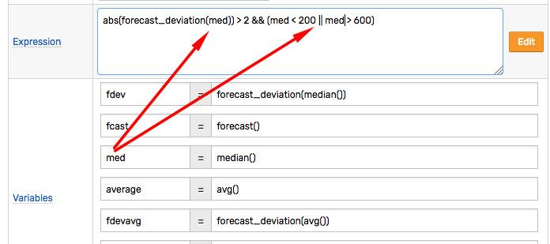

### Issue 4730

Support for `addMeta` parameter added to the [series](../../api/meta/metric/series.md#query-parameters) method.

```elm
/api/v1/metrics/gc_time_percent/series?addMeta=true
```

```json
[{
  "metric": "gc_time_percent",
  "entity": "atsd",
  "tags": {
    "collector": "Copy",
    "host": "NURSWGVML007"
  },
  "lastInsertDate": "2017-11-24T16:05:26.945Z",
  "meta": {
    "metric": {
      "name": "gc_time_percent",
      "enabled": true,
      "dataType": "FLOAT",
      "persistent": true,
      "tags": {},
      "timePrecision": "MILLISECONDS",
      "retentionDays": 0,
      "seriesRetentionDays": 0,
      "invalidAction": "NONE",
      "versioned": false,
      "interpolate": "LINEAR"
    },
    "entity": {
      "name": "atsd",
      "enabled": true,
      "tags": {
        "test": "test",
        "testkey": "testvalue"
      }
    }
  }
}]
```

### Issue 4724

[Rule functions](../../rule-engine/functions-rules.md) check the status of windows created by other rules.

The `rule_open` function checks if there is at least one window with the `OPEN` or `REPEAT` status for the specified rule.

```java
rule_open(S ruleName)

// example
avg() > 10 && rule_open('disk_used_check')
```

The `rule_window` function returns the first matching window for the specified rule.

```java
rule_window(S ruleName)
// example
avg() > 10 && rule_window('disk_used_check') != null && rule_window('disk_used_check').status != 'CANCEL'
```

### Issue 4715

The [series tags](../../api/meta/metric/series-tags.md) method returns unique series tags values for the specified metric.

```elm
/api/v1/metrics/disk_used/series/tags?entity=nurswgvml007
```

```json
{
  "file_system": ["/dev/mapper/vg_nurswgvml006-lv_root", "/dev/sdb1"],
  "mount_point": ["/", "/media/datadrive"]
}
```

### Issue 4710

The inline screenshots are positioned after the message content and before the message footer.

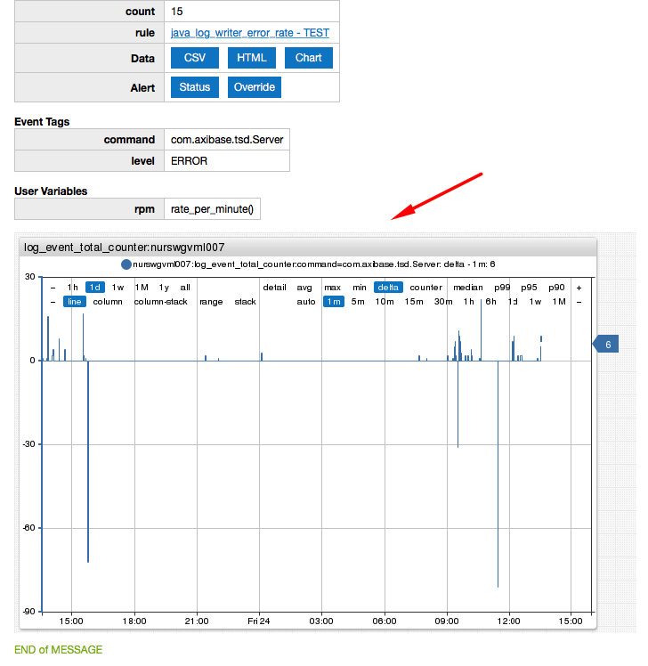

### Issue 4599

The **Allowed IPs** field enables specifying a list of addresses or address ranges in CIDR format from which the user is allowed to access the database.

The checks are enforced to requests made over the HTTP and HTTPS protocols.

Both IPv4 and IPv6 protocols are supported.

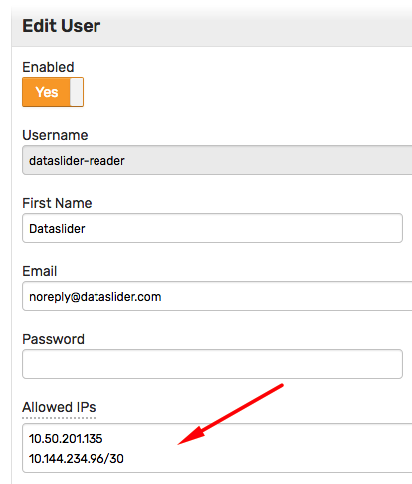

### Issue 4718

```json
[
  {
    "startDate": "2017-11-17T14:00:00Z",
    "endDate":   "2017-11-17T15:00:00Z",
    "entity": "nurswgvml007",
    "metric": "cpu_busy",
    "aggregate": {
      "period": { "count": 5, "unit": "MINUTE"},
      "types": ["MEDIAN", "PERCENTILE_5", "PERCENTILE_95"]
    }
  }
]
```

### Issue 4714

```json
[
  {
    "startDate": "2017-11-17T14:00:00Z",
    "endDate":   "2017-11-17T15:00:00Z",
    "entity": "nurswgvml007",
    "metric": "cpu_busy",
    "aggregate": {
      "period": { "count": 15, "unit": "MINUTE"},
      "type": "MAX"
    }
  },
  {
    "startDate": "2017-11-17T14:00:00Z",
    "endDate":   "2017-11-17T15:00:00Z",
    "entity": "nurswgvml007",
    "metric": "cpu_busy",
    "aggregate": {
      "period": { "count": 1, "unit": "MINUTE"},
      "type": "MAX"
    }
  }
]
```

### Issue 4708

The query with `ORDER BY datetime DESC LIMIT n` only returns `1` record instead of `n`.

```sql
SELECT datetime, value, tags.city, tags.state,
  FROM "cdc.pneumonia_and_influenza_cases"
WHERE tags.city = 'Boston'
  ORDER BY datetime DESC
LIMIT 10
```

### Issue 4707

* Add group action to **Settings > Users** page to Enable/Disable multiple users at once.
* Implement a consistent style to highlight fields with tooltips.
* Auto-size sub-menu panels in the top menu.

### Issue 4706

New environmental variables:

| **Name** | **Required** | **Description** |
|:---|:---|:---|
|`JAVA_OPTS` | No | Additional arguments to be passed to ATSD JVM process. |
|`HADOOP_OPTS` | No | Additional arguments to be passed to Hadoop/HDFS JVM processes. |
|`HBASE_OPTS` | No | Additional arguments to be passed to HBase JVM processes. |

### Issue 4687

The `tags` parameter in [Entity Group: Get Entities](../../api/meta/entity-group/get-entities.md#query-parameters), [Entities: List](../../api/meta/entity/list.md#query-parameters), [Metrics: List](../../api/meta/metric/list.md#query-parameters) now accepts wildcards to control the list of tags in the response.

* Retrieve members of the `docker-images` group. Add entity tags that begin with `env.` to the response.

```ls
/api/v1/entity-groups/docker-images/entities?tags=env.*
```

### Issue 4686

The **Entity Link** field resolves the tag value to an entity and displays a link the entity editor. The tooltip displays the entity label, if available.

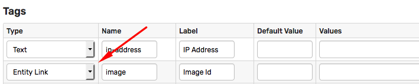

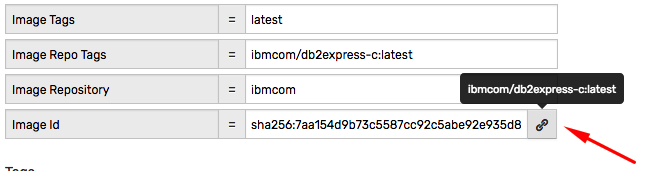

### Issue 4684

* The new `Author` field is automatically pre-filled with the name of the current user to coordinate group management in large organizations.

* The member type options renamed with a new status message.

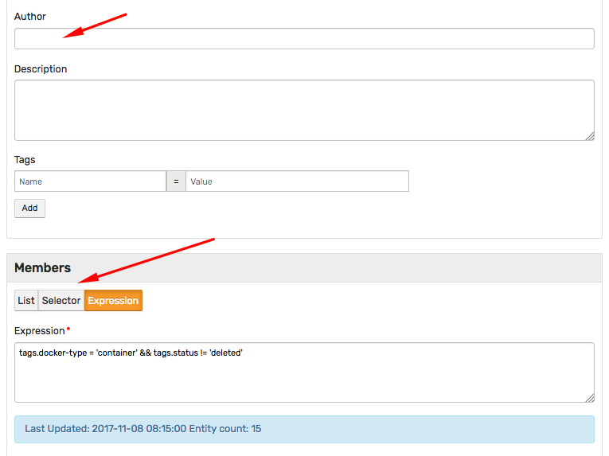

### Issue 4652

* Navigation flow changed from `top/down` to `left/right`.

* Collapse mode minimizes the amount of space required for top menu links.

* Links are grouped based on the function instead of the user role.

* Portals can be easily accessed from the top toolbar.

* Entity views can be added to the top menu with a custom icon.

 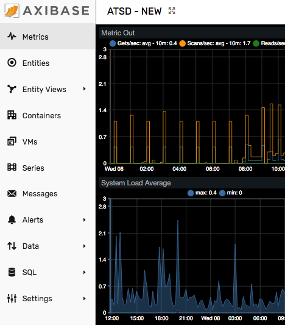

### Issue 4675

Email notifications can include screenshots of the underlying metric captured using the built-in portal.

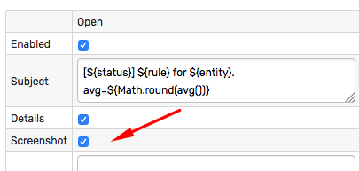

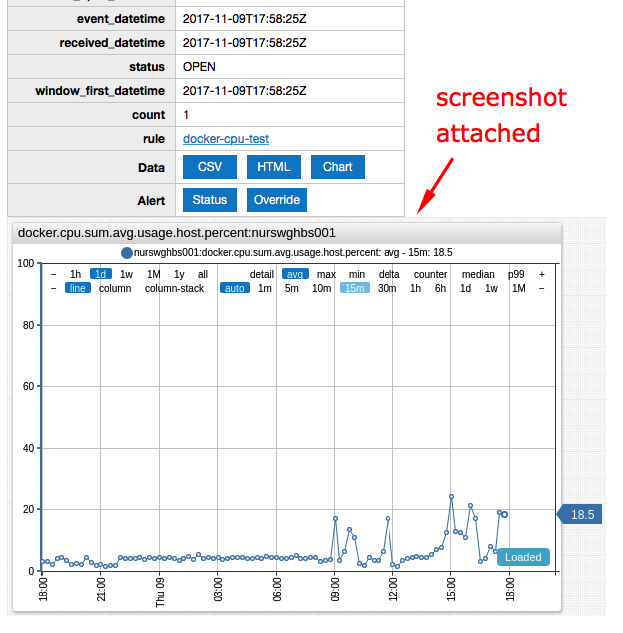

### Issue 4658

Entity view can be added to the top menu with a custom icon.

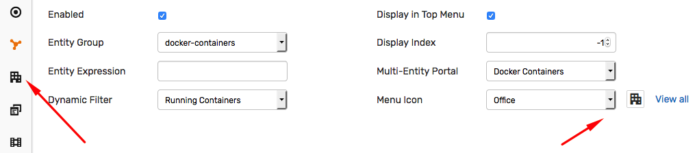

### Issue 4600

Successful user authentication requests are stored in the database and can be reviewed by administrators to identify idle accounts and to measure user activity.

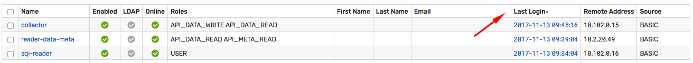

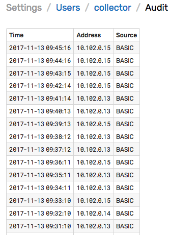

### Issue 4585

* Add new columns to summary tables.
* Add form validations.
* Highlight important settings.
* Add an option to clone user accounts.
* Add toggle between tag labels and names in the **Entity Editor** and **Metric Editor**.
* Replace fonts.
* Standardize spacing between buttons.
* Adjust layout on the user authorization page.

### Issue 3269

Speed up SQL queries that select more than 1 row with descending `datetime` order.

```sql
SELECT *
  FROM cpu_busy
ORDER BY datetime DESC LIMIT 10
```

### Issue 4588

The metric filter in `atsd_series` queries can now accept entity column as part of the filter:

```sql
SELECT metric, entity, tags, date_format(MAX(time)) as "max_time"
  FROM atsd_series
WHERE datetime >= NOW - 14*DAY -- condition to select series with last insert date within the last 14 days
  AND ( metric = 'disk_used' AND entity IN ('nurswgvml006', 'nurswgvml007', 'nurswgvml010', 'nurswgvml502')
     OR metric = 'cpu_user'  AND entity IN ('nurswgvml010', 'nurswgvml502')
     OR metric = 'cpu_busy'  AND entity = 'nurswgvml006'
      )
GROUP BY metric, entity, tags
  HAVING MAX(time) < NOW - 24 * HOUR -- condition to exclude series that have recent data
```

### Issue 4611

The `multiple-column` setting is applicable to wildcard configurations in bar widgets.

If the settings is set to `true`, series with the same entity and tags are added to the same column.

This applies to derived series which is placed into the same column along with the underlying series.

```ls
[widget]
  type = bar
  group = label-format
  hide-empty-columns = true
  column-label-format = tags.mount_point

 [tags]
    mount_point = *
    file_system = *

  [column]
    multiple-column = true
  [series]
    label = Used
    alias = used
    metric = disk_used
    color = green
  [series]
    label = Size
    alias = size
    metric = disk_size
    color = orange
    display = false
  [series]
    label = Free
    value = value("size") - value("used")
    color = grey
```

Examples:

* [ChartLab](https://apps.axibase.com/chartlab/6e37edc8/2/)
* [ChartLab](https://apps.axibase.com/chartlab/1b8d6e3f/1/)
