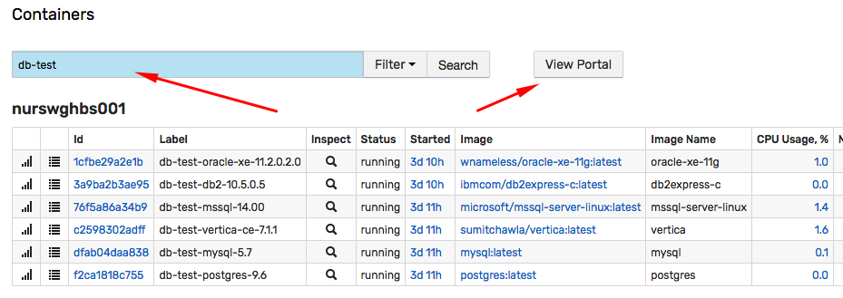
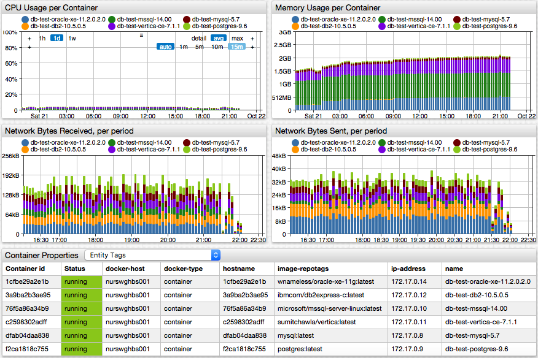
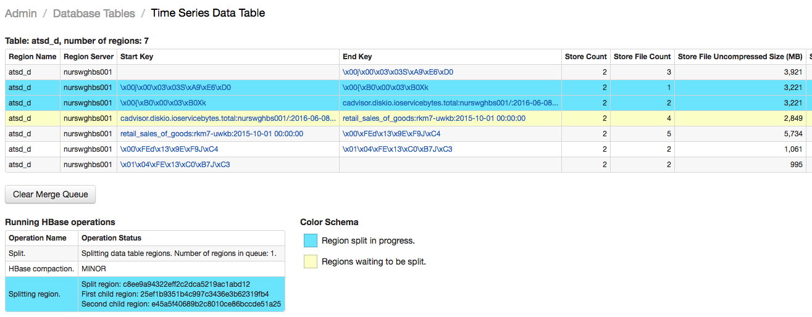
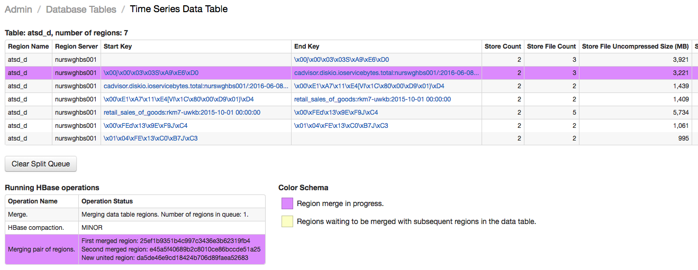
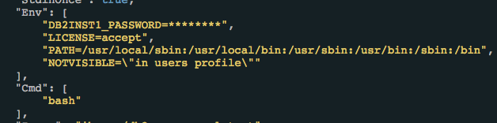
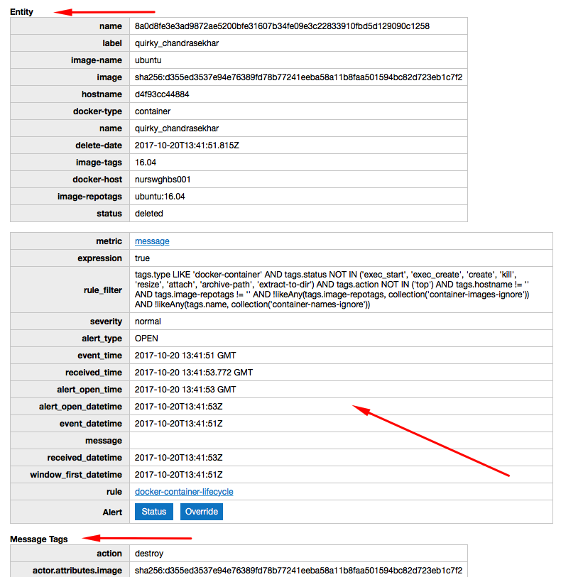

# Monthly Change Log: October 2017

## ATSD

| Issue| Category    | Type    | Subject              |
|------|-------------|---------|----------------------|
| 4671 | sql | Bug | Query with `ORDER BY datetime DESC` returns no rows. |
| 4669 |UI| Bug | Portal editor layout is broken in Firefox. |
| 4666 | api-rest | Bug | [Search API](../../api/meta/misc/search.md) method. Ensure `LastInsertDate` and `CreatedDate` millisecond precision. |
| 4664 | message | Bug | Tag filter is not applied if the tag is specified more than once. |
| [4663](#issue-4663) | installation | Feature | Adjust HBase and ATSD max heap size allocation based on available server memory. |
| 4662 | api-rest | Bug | Series query response contains escape symbol in the entity name. |
| [4656](#issue-4656) | api-rest | Feature | Implement series query with limit in DESC order. |
| 4644 | api-rest | Bug | Unicode patterns are not escaped in entity expression in series query. |
| 4640 | api-rest | Bug | Incorrect escaping in the entity filter. |
| 4635 | api-rest | Bug | Series query limit with ascending order. |
| [4631](#issue-4631) | sql | Bug | Filter not applied to `metric.name` field in the `WHERE` clause. |
| 4555 | sql | Bug | `NOT BETWEEN` operator error. |
| 4653 |UI| Bug | HTML entities inside editable fields are not escaped. |
| 4648 | sql | Bug | `WHERE tags LIKE` causes an NPE. |
| 4644 | api-rest | Bug | Unicode patterns are not escaped in entity expressions. |
| [4641](#issue-4641) | rule-engine | Feature | Implement `LOOKUP` function to retrieve replacement table items by key. |
| [4636](#issue-4636) | api-rest | Feature | Add support for metric and entity fields to the `expression` parameter in `list` methods. |
| 4630 | rule-engine | Bug | Dictionary service: fix caching for non-lowercased keys. |
| [4627](#issue-4627) | entity_views | Feature | Implement multi-entity portal displayed for entities matched with search. |
| 4623 | storage | Bug | Fix error when region split is initiated in the UI. |
| 4622 | client | Bug | Resolve python installation errors due to broken pandas module. |
| 4617 | storage | Bug | Not all records deleted for metrics with enabled retention policy. |
| [4619](#issue-4619) | api | Feature | Modify how `maxInsertDate` parameter is processed to search for metrics and entities without last insert date.   |
| 4618 | sql | Bug | Fix empty file name '.xlsx' for scheduled SQL reports in Excel format. |
| 4613 | administrator | Bug | Default alert logger is deleted when logback configuration is reloaded. |
| 4607 | entity | Feature | Speed up adding new entities to expression-based groups. |
| 4606 | jdbc | Bug | Remove 'commons-lang3' dependency conflict. |
| 4606 | installation | Feature | Include default entity tag templates for 'docker*' entities in the distribution. |
| [4589](#issue-4589) | core | Feature | Implement administrator interface to split and merge regions. |
| 4580 | client | Feature | Upgrade the [Python client](https://github.com/axibase/atsd-api-python) with new methods and parameters. |
| 4608 | client | Bug | Python client upgrade failure. |
| [4605](#issue-4605)  | api-rest | Feature | Add support for `SLOPE` and `INTERCEPT` aggregators in series query. |
| 4598 | security | Feature | Enable auto-login on server restart if **Remember Me** option is checked on login. |
| 4592 | sql | Bug | Incorrect `datetime OR` complex filter. |
| 4554 | sql | Bug | Change behavior of `datetime !=` operator. |
| 4489 | sql | Bug | Incorrect reference to the `value` column in the `WHERE` clause. |
| [4353](#issue-4353) | sql | Feature | Allow column aliases to be the same as column names. |
| 4103 | sql | Bug | Fix `WITH INTERPOLATE` clause with user-defined time zone. |
| [4643](#issue-4643) | email | Feature | Split email notification message into multiple tables. |
| [4635](#issue-4635) | api-rest | Feature | Add support for limits in series query with ascending order. |
| 4632 |UI| Bug | Export page: aggregate function drop down broken. |
| 4603 | administrator | Bug | Logging: removed Freemarker Log4j runtime warnings.  |
| 4576 | rule_engine | Feature | Implemented [lookup functions](../../rule-engine/functions.md#lookup) `entity_tags` and `entity_tag`.  |
| 4593 | security | Feature | Retain session when the built-in administrator account is created. |
| 4587 | security | Feature | Create built-in user groups to simplify initial configuration. |
| 4586 | api | Feature | Store `createDate` for new entities and metrics. |
| 4584 | api | Bug | Fix concurrency error when deleting a large set of entities using Meta API. |
| 4581 | api | Bug | Incorrect last insert date in the response object if last insert date filter is specified in the request. |
| 4631 | sql | Bug | Metrics not filtered if specified with `WHERE metric.name = {name}` syntax. |
| 4629 |UI| Bug | Export page fails to display tag values when aggregator is selected. |
| 4615 | rule-engine | Feature | Add support for `metric.label` and other `entity.*` and `metric.*` fields in the [rule engine](../../rule-engine/window-fields.md). |
| 4614 | rule-engine | Bug | `entity_tags` placeholder does not work. |
| [4590](#issue-4590) | client | Feature | Python API client examples. |
| 4555 | sql | Bug | Fix SQL `datetime NOT BETWEEN` condition. |
| [4544](#issue-4544) | sql | Feature | `ESCAPE` keyword to customize `LIKE` escape character. |
| [4404](#issue-4404) | api-rest | Feature | Add API method `/api/v1/search` to search series. |

---

## Collector

| Issue| Category    | Type    | Subject              |
|------|-------------|---------|----------------------|
| 4651 | docker | Bug | Host availability rule enhancements. |
| 4637 | docker | Bug | Freeze experienced on one of the containers with collector. |
| 4634 | docker | Bug | Apply limit to `docker.cpu.sum.usage.total.percent` calculation. |
| 4633 | security | Feature | Enable auto-login on server restart if **Remember Me** option is checked on login. |
| [4625](#issue-4625) | docker | Feature | Read credentials from environment variables. |
| [4616](#issue-4616) | docker | Feature | Mask secrets (passwords) in properties and inspect files. |
| 4609 | docker | Feature | Send `entity` command for new objects to ensure they are quickly added to expression-based groups. |
| 4594 | installation | Support | Speed up collector installation and start-up. |
| 4065 | installation | Support | Print detailed information during the startup process. |
| 4582 | docker | Feature | Add shutdown hook in collector to update docker host status on shutdown. |
| 4596 | docker | Feature | Validate atsd_url and collector password in the `entrypoint` script prior to starting the collector. |
| 4577 | core | Bug | Update packages to latest stable versions without known security issues. |

---

## Charts

| Issue| Category    | Type    | Subject              |
|------|-------------|---------|----------------------|
| 4626 | time-chart | Bug | Prevent duplicate series from being displayed after incremental data is loaded. |
| 4601 | widget-settings | Bug | Rename `getValueAtPoint` function as `getValueForDate`. |
| 2185 | time-chart | Feature | Speed up rendering of column-stack charts with many series. |

---

### Issue 4641

The [`LOOKUP`](../../rule-engine/functions.md#collection) function returns a matching value for key from the specified replacement table.

```java
lookup(S replacementTable, S key)
```

```java
lookup("cities", "Baltimore")
```

### Issue 4636

The `expression` parameter in [metric](../../api/meta/metric/list.md#expression) and [entity](../../api/meta/entity/list.md#expression) list methods now supports all [metric](../../api/meta/metric/list.md#fields) and [entity](../../api/meta/entity/list.md#fields) fields respectively.

* Entities

```ls
name NOT LIKE 'aws*' AND lower(label) NOT LIKE 'aws*' AND createdDate > '2017-10-01T00:00:00Z'
```

* Metrics

```ls
retentionDays > 0 OR seriesRetentionDays > 0
```

### Issue 4627

The multi-entity portal in entity views displays key metrics for entities matched with a search keyword.





### Issue 4619

```elm
GET /api/v1/metrics?maxInsertDate=1970-01-01T00:00:00Z&limit=3
```

Refer to [entity](../../api/meta/entity/list.md#additional-examples) examples and [metric](../../api/meta/metric/list.md#additional-examples) examples.

### Issue 4589





### Issue 4605

The complete list of statistical functions is provided [here](../../api/data/aggregation.md).

```json
[{
  "startDate": "2017-10-21T19:00:00Z",
  "endDate":   "2017-10-21T20:00:00Z",
  "entity": "nurswgvml007",
  "metric": "cpu_busy",
  "aggregate": {
    "types": ["AVG", "SLOPE", "INTERCEPT"],
    "period": {"count": 15, "unit": "MINUTE"}
  }
}]
```

### Issue 4353

```sql
SELECT "export_test"."datetime" AS "datetime",
   "export_test"."entity" AS "entity",
   "export_test"."metric" AS "metric",
   "export_test"."tags" AS "tags",
   "export_test"."text" AS "text",
   "export_test"."time" AS "time",
   "export_test"."value" AS "value"
 FROM "export_test" LIMIT 100
```

### Issue 4625

Add support for the following environment variables:

```ls
--env COLLECTOR_USER_NAME=username
--env COLLECTOR_USER_PASSWORD=password
--env ATSD_URL=https://atsd_hostname:8443
```

### Issue 4616

The values are masked in the following cases:

* If variable name contains `password` (case insensitive).
* If command arguments contain URL with credentials.



### Issue 4663

* If RAM exceeds 4 GB, set Java max heap to 1 GB for HDFS, 1 GB for HBase, and 2 GB for ATSD.
* If RAM exceeds 8 GB, set Java max heap to 2 GB for HDFS, 4 GB for HBase, and 4 GB for ATSD.

### Issue 4656

```json
[{
  "startDate": "1970-01-01T00:00:00Z",
  "endDate":   "now",
  "entity": "nurswgvml007",
  "metric": "cpu_busy",
  "limit":2,
  "direction": "DESC",
  "exactMatch":true
}]
```

### Issue 4631

```sql
SELECT datetime, value
  FROM "cache.size"
WHERE metric.name = 'cache.size'
  LIMIT 10
```

### Issue 4643



### Issue 4635

The `ASC` direction allows retrieving first value for the specified series.

```json
[{
  "startDate": "1970-01-01T00:00:00Z",
  "endDate":   "now",
  "entity": "nurswgvml007",
  "metric": "mpstat.cpu_busy",
  "limit": 10,
  "direction": "ASC"
}]
```

Refer to [series query](../../api/data/series/query.md#control-fields) for additional details.

### Issue 4590

The list of examples is provided [here](https://github.com/axibase/atsd-api-python#examples).

### Issue 4544

Wildcard symbols present in the pattern can be escaped with a backslash `\` which serves as the default escape character.

```sql
-- Default escape character
WHERE tags.file_system LIKE '%a\_b%'
```

The escape character can be customized by adding an ESCAPE clause after the LIKE expression.

```sql
-- Custom escape character
WHERE tags.file_system LIKE '%a~_b%' ESCAPE '~'
```

In the example above, the underscore is evaluated as a regular character (not as a wildcard) because the underscore is preceded by an ~ escape character.

### Issue 4404

Refer to [API documentation](../../api/meta/misc/search.md) for additional details.

```elm
GET /api/v1/search?query=inflation*&limit=2&metricTags=*&metricFields=units,dataType&entityTags=*&entityFields=timeZone
```

```json
{
  "query": "contents:inflation.cpi.categories*",
  "recordsTotal": 496621,
  "recordsFiltered": 20,
  "time": 136,
  "data": [
    [
      "inflation.cpi.categories.price",
      "CPI - Non-negotiable",
      {
        "units": "million",
        "dataType": "LONG"
      },
      {
        "pricebase": "Current prices",
        "seasonaladjustment": "Seasonally Adjusted",
        "source": "CBS"
      },
      "fed",
      "U.S. FED",
      {
        "timeZone": "US/Eastern"
      },
      {
        "source": "FRED"
      },
      {
        "category": "Health"
      },
      1.5
    ],
    [
      "inflation.cpi.categories.price",
      "CPI - Non-negotiable",
      {
        "units": "million",
        "dataType": "LONG"
      },
      {
        "pricebase": "Current prices",
        "seasonaladjustment": "Seasonally Adjusted",
        "source": "CBS"
      },
      "fed",
      "U.S. FED",
      {
        "timeZone": "US/Eastern"
      },
      {
        "source": "FRED"
      },
      {
        "category": "Energy"
      },
      1.5
    ]
  ]
}
```