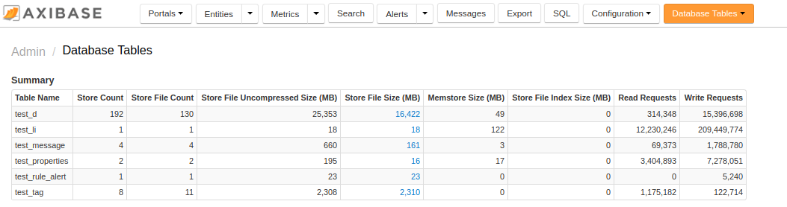
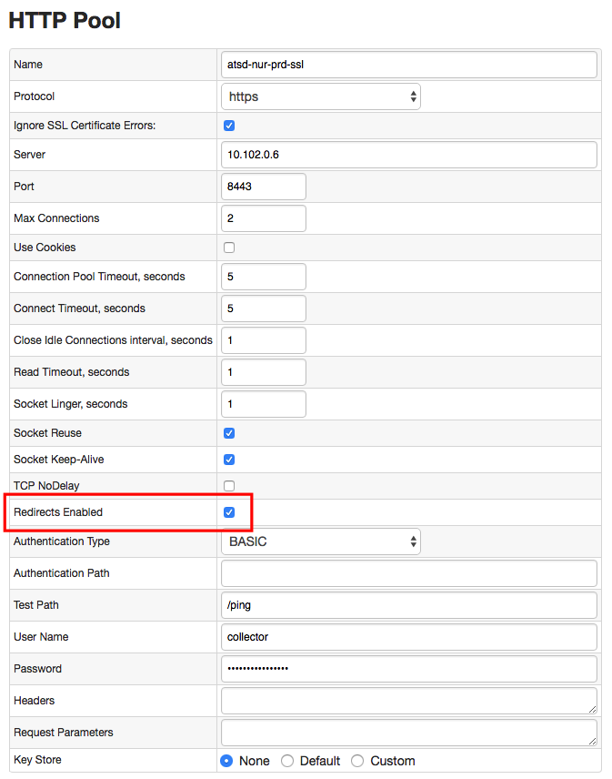
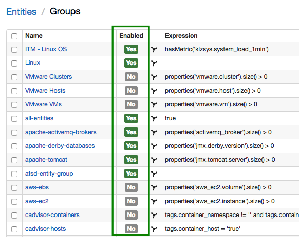
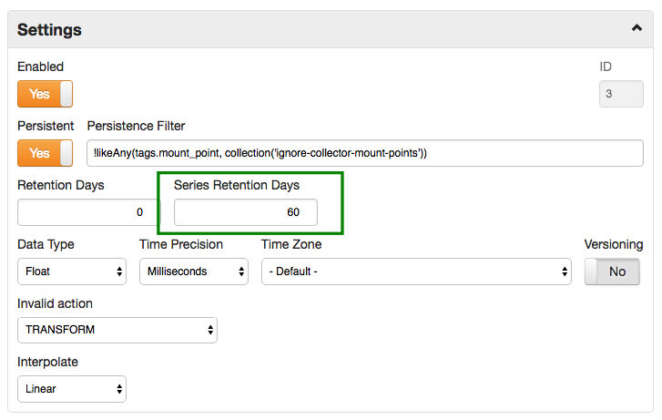
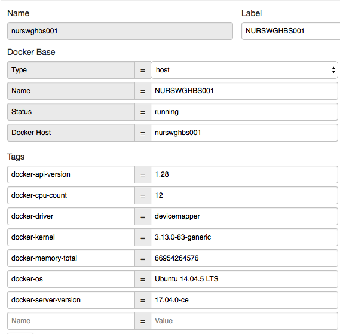

# Monthly Change Log: September 2017

## ATSD

| Issue| Category    | Type    | Subject              |
|------|-------------|---------|----------------------|
| 4578 | rule engine | Bug | Custom alias not resolved in Alter Message text.  |
| 4576 | core | Bug | Duplicate samples stored after data compaction.  |
| 4574 | administrator | Bug | Reduce excessive ATSD at startup. |
| 4571 |UI| Bug | Fix missing suggestions in auto-complete if entries contain non-ASCII characters. |
| 4569 |UI| Feature | Standardize available fields for filtering in the API and UI. |
| 4565 | administrator | Bug | Remove redundant roles assigned to the built-in administrator account.  |
| 4562 | meta-api | Bug | Requests to delete malformed entities (containing space) are failing.  |
| 4561 | meta-api | Bug | Requests to delete a non-existent entity must return `400` status code instead of code `200 OK`.  |
| 4559 | core | Bug | Table size and region count can be under-reported if metrics are sampled immediately after compaction.  |
| 4546 | security | Bug | User with `USER` role can access unauthorized records via API requests to `/api/v1/metrics` and `/api/v1/metrics` methods. |
| [4518](#issue-4518) | sql | Bug | Fix invalid expression error for `time`/`datetime` column in inline views. |
| [4508](#issue-4508) | sql | Feature | Add support for joins in subqueries. |
| [4397](#issue-4397) | sql | Feature | Allow `JOIN ON` syntax if the `ON` condition is the same as the implicit condition. |
| [4272](#issue-4272) | sql | Bug | Incorrect `datetime` filtering if the between condition is grouped in parenthesis. |
| [4555](#issue-4555) | sql | Bug | `time`/`datetime` `NOT BETWEEN` filter error. |
| [4554](#issue-4554) | sql | Feature | Add support for `datetime !=` condition in the `WHERE` clause. |
| [4499](#issue-4499) |UI| Feature | Add support for Enabled/Disabled field for Entity Groups. |
| 4475 |UI| Bug | Display warnings if the entity record is missing in the last insert table. |
| [4545](#issue-4545) | sql | Feature | Custom SQL wildcards `*` and `?` replaced with standard [wildcards](../../sql/README.md#match-expressions) `%` and `_`. |
| 4537 | search | Bug | Fixed an `IndexNotFoundException` if the series search indexing is not ready immediately after the installation. |
| [4533](#issue-4533) | UI | Feature | User Group membership form refactored to allow adding/removing multiple members at once. |
| [4532](#issue-4532) | security | Feature | Add support for **Guest** access to portals. |
| 4531 | api-rest | Bug | Fix bug causing `message` commands to be logged as `series` commands in the `command.log`. |
| 4528 | statistics | Bug | Fix the estimated schedule for series that are collected with monthly frequency. |
| [4525](#issue-4525) | UI | Feature | Summary Table added to **Database Tables** page to simplify data growth monitoring. |
| 4519 | core | Feature | Licensing restrictions removed to allow all database editions to compress data with `gz` and `lzo` algorithms. |
| 4503 | UI | Bug | Restrict access to **Rules** and **Entity Views** pages for users with an Editor role. |
| 4502 | sql | Bug | Add the `encodeTags` parameter to [SQL API](../../sql) method. |
| 4477 | core | Feature | Add HBase coprocessors to ATSD tables programmatically to avoid changing `hbase-site.xml`. |
| 4410 | Bug | Java API | Add missing metric methods to the [Java API Client](https://github.com/axibase/atsd-api-java). |
| [4351](#issue-4351) | jdbc | Feature | Add support for extended [tag methods](https://github.com/axibase/atsd-jdbc#tag-columns) in the JDBC driver. |
| 4524 | core | Feature | Collect `table_size` metric before and after the compaction. |
| 4516 | core | Feature | Add validator for ATSD coprocessor jar file at startup. |
| 4511 | UI | Feature | Implement `formatNumber` and `convert` functions in rule engine and entity views. |
| 4506 | security | Bug | Deny metadata export for unauthorized users without necessary entity permissions. |
| 4501 | UI | Bug | UI: Format stack trace in the [SQL Console](../../sql/sql-console.md). |
| 4488 | csv | Bug | CSV Parser: fixed length split broken. |
| 4307 | sql | Bug | Fix row ordering for samples timestamped before January 1, 1970. |
| [4235](#issue-4235) | api-rest | Feature | `FIRST`, `LAST`, `MIN_VALUE_TIME`, `MAX_VALUE_TIME` aggregators added to series queries with [grouping](../../api/data/series/group.md#grouping-functions). |
| 2792 | api-rest | Support | `counter` field removed from [metric](../../api/meta/metric/list.md#fields) schema. |
| 2605 | UI | Bug | Rename old fields on the CSV parser editor form. |
| [4437](#issue-4437) | sql | Bug | Date literal must not be implicitly converted to time data type. |
| [4295](#issue-4295) | sql | Bug | `DETAIL` interpolation with `OUTER` range fails to calculate values. |
| [4281](#issue-4281) | sql | Bug | Incorrect `ISNULL` result with `null` tags field. |
| [4147](#issue-4147) | sql | Feature | Support for `entity.timeZone` and `metric.timeZone` in PERIOD and `WITH INTERPOLATE` functions. |
| [2766](#issue-2766) | core | Feature | Series Retention Days setting to delete expired series. |

---

## Charts

| Issue| Category    | Type    | Subject              |
|------|-------------|---------|----------------------|
| 4543 | core | Feature | Add support for [user-defined](https://github.com/axibase/charts/tree/master/syntax/udf.md) functions. |

---

## Collector

| Issue| Category    | Type    | Subject              |
|------|-------------|---------|----------------------|
| [4563](#issue-4563)  | docker | Feature | Add entity tags to docker host entities. |
| 4577 | jdbc | Bug | Execute SQL tasks in the same order as they are specified in the job configuration. |
| 4573 | docker | Bug | Fix entity label collision if container has a label named `LABEL`. |
| [4566](#issue-4566)  | docker | Bug | Add **Redirects Enabled** setting to HTTP pool to handle authentication errors with `302` status response. |
| 4513 | docker | Bug | Set correct entity name for the docker host when the `/etc/hosts` files resolves to `localhost`. |
| 4022 | jdbc | Bug | Perform only one query execution during test. |

---

### Issue 4532

The **Guest Access** checkbox controls unauthenticated access to a selected portal.


### Issue 4525

The Summary Table in **Configuration** > **Database Tables** displays totals for key data tables.



### Issue 4351

```java
//serialize
Map<String, String> seriesTags = new HashMap<String, String>();
seriesTags.put("surface", "Outer");
seriesTags.put("status", "Initial");
// ...
aps.setTags(2, seriesTags);

// de-serialize
Map<String, String> seriesTags = rs.getTags(3);
```

### Issue 4518

```sql
SELECT COUNT(value) FROM (
  SELECT max(time) as "time", entity, COUNT(value) as "value"
    FROM "bom.gov.au.air_temp"
    WHERE datetime > current_day GROUP BY entity
)
```

### Issue 4508

```sql
SELECT max(value) FROM (
  SELECT datetime, (cpi.value - ppi.value) AS "value"
    FROM cpi
    JOIN ppi
)
GROUP BY PERIOD (1 YEAR)
```

### Issue 4397

* JOIN ON condition:

```sql
SELECT *
  FROM disk_used t1
  JOIN disk_size t2
  ON (t1.entity = t2.entity AND t1.datetime = t2.datetime AND t1.tags = t2.tags)
WHERE t1.datetime BETWEEN '2017-07-15T09:00:00Z' AND '2017-07-15T09:00:05Z'
```

* Implicit JOIN condition

```sql
SELECT *
  FROM cpu_busy t1
  JOIN USING ENTITY disk_size t2
  --ON (t1.entity = t2.entity AND t1.datetime = t2.datetime)
WHERE t1.datetime BETWEEN '2017-07-15T09:00:20Z' AND '2017-07-15T09:00:30Z'
```

### Issue 4272

```sql
SELECT datetime
  FROM test_m1
WHERE (datetime BETWEEN '2017-01-01T00:00:00.000Z' AND '2017-01-02T00:00:00.000Z')
   OR (datetime = '2017-01-04T00:00:00.000Z')
```

### Issue 4566



### Issue 4555

```sql
SELECT datetime, value
  FROM "cache.size"
WHERE datetime NOT BETWEEN '2017-01-02T00:00:00.000Z' AND '2017-01-02T00:00:00.000Z'
  LIMIT 3
```

### Issue 4554

```sql
SELECT datetime, value
  FROM test_m1
WHERE datetime != '2017-01-01T00:00:00.000Z'
```

### Issue 4499

Disabled entity groups are not displayed in the end-user web interface and are excluded from scheduled synchronization to reduce the load on the database.



### Issue 4437

```sql
SELECT '2017-08-01T00:00:00Z'
```

### Issue 4295

```sql
SELECT datetime AS 'datetime',
  COALESCE(t1.entity, t2.entity) AS 'entity',
  t1.value AS 'calc.cpu_busy',
  t2.value AS 'calc.memory_free',
  t2.tags.file_system AS 'tags.file_system',
  t2.tags.mount_point AS 'tags.mount_point'
  FROM cpu_busy t1
  OUTER JOIN USING entity disk_used t2
WHERE t1.datetime BETWEEN '2017-06-16T14:00:00Z' AND '2017-06-16T14:01:00Z'
  AND t1.entity = 'nurswgvml006' AND t2.entity = 'nurswgvml006'
  WITH INTERPOLATE(DETAIL, LINEAR, OUTER)
```

### Issue 4281

```sql
SELECT
    tags, tags IS NULL, ISNULL(tags, '-'),
    tags.tag, tags.tag IS NULL, ISNULL(tags.tag, '-')
FROM test_tags_null
```

### Issue 4147

```sql
SELECT datetime, date_format(time, 'yyyy-MM-dd HH:mm:ss z', metric.timeZone) AS metric_datetime, date_format(time, 'yyyy-MM-dd HH:mm:ss z', entity.timeZone) AS entity_datetime, value
  FROM cpu_busy
  WHERE entity = 'nurswgvml007'
    AND date_format(time, 'yyyy-MM-dd HH:mm:ss', metric.timeZone) >= '2017-05-01 12:00:00'
    AND date_format(time, 'yyyy-MM-dd HH:mm:ss', metric.timeZone)  < '2017-05-03 12:00:00'
  WITH INTERPOLATE(1 DAY, LINEAR, INNER, NONE, CALENDAR, metric.timeZone)
```

### Issue 2766

The new **Series Retention Days** setting allows deleting series which have not been updated for a long period of time.



---

### Issue 4543

```ls
[configuration]
  height-units = 2
  width-units = 2
  import mm = my_math.js

[group]
  [widget]
    type = chart
    timespan = 1 hour
    [series]
      metric = mpstat.cpu_busy
      entity = nurswgvml007
      alias = s1
    [series]
      value = mm.multiplyBy('s1', 2)
```

[ChartLab Example](https://apps.axibase.com/chartlab/bc36b341)

### Issue 4563



### Issue 4545

```sql
SELECT datetime, entity, value, tags.mount_point, tags.file_system
  FROM "df.disk_used_percent"
WHERE datetime >= PREVIOUS_HOUR
  AND tags.file_system LIKE '/dev/%'
-- old syntax
-- AND tags.file_system LIKE '/dev/*'
```

### Issue 4533

Group membership can be modified using the checkbox at the left of the screen, under the **Members** Tab.


### Issue 4235

```json
[
  {
    "entities": [
      "nurswgvml007",
      "nurswgvml006"
    ],
    "metric": "mpstat.cpu_busy",
    "group": {
      "type": "LAST",
      "period": {
        "count": 1,
        "unit": "MINUTE"
      }
    },
    "startDate": "2017-05-30T00:57:00.000Z",
    "endDate": "2017-05-30T01:00:00.000Z"
  }
]

```
