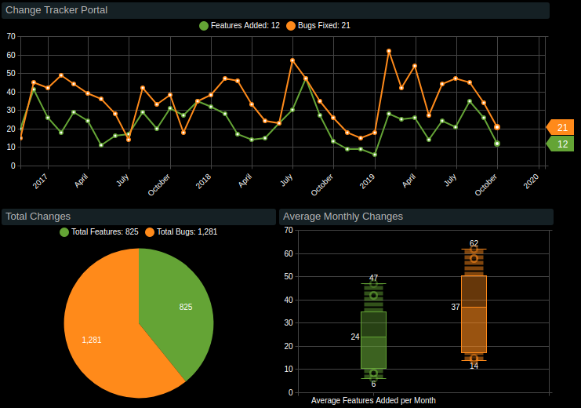

# Change Logs

Follow development in the **Change Tracker Portal** and review details in the **Change Logs** below.

## Year 2019

| **Month** | **Features** | **Bugs** | &nbsp;
|---|---:|---:|---|
| December | `18` | `37` | [↗](2019_dec/README.md)
| November | `20` | `40` | [↗](2019_nov/README.md)
| October | `12` | `21` | [↗](2019_oct/README.md)
| September | `26` | `34` | [↗](2019_sep/README.md)
| August | `35` | `45` | [↗](2019_aug/README.md)
| July | `21` | `47` | [↗](2019_jul/README.md)
| June | `24` | `44` | [↗](2019_june/README.md)
| May | `14` | `27` | [↗](2019_may/README.md)
| April | `26` | `54` | [↗](2019_apr/README.md)
| March | `25` | `42` | [↗](2019_mar/README.md)
| February | `28` | `62` | [↗](2019_feb/README.md)
| January | `6` | `18` | [↗](2019_jan/README.md)
---

## Year 2018

| **Month** | **Features** | **Bugs** | &nbsp;
|---|---:|---:|---|
| December  | `9` | `15` | [↗](2018_dec/README.md)
| November  | `9` | `18` | [↗](2018_nov/README.md)
| October  | `13` | `26` | [↗](2018_oct/README.md)
| September  | `27` | `35` | [↗](2018_sep/README.md)
| August | `47` | `47` | [↗](2018_aug/README.md)
| July | `30` | `57` | [↗](2018_jul/README.md)
| June | `23` | `23` | [↗](2018_jun/README.md)
| May | `15` | `24` | [↗](2018_may/README.md)
| April | `14` | `33` | [↗](2018_apr/README.md)
| March | `17` | `46` | [↗](2018_mar/README.md)
| February | `28` | `47` | [↗](2018_feb/README.md)
| January | `32` | `38` | [↗](2018_jan/README.md)

---

## Year 2017

| **Month** | **Features** | **Bugs** | &nbsp;
|---|---:|---:|---|
| December | `35` | `35` | [↗](2017_dec/README.md)
| November | `27` | `18` | [↗](2017_nov/README.md)
| October | `31` | `38` | [↗](2017_oct/README.md)
| September | `20` | `33` | [↗](2017_sep/README.md)
| August | `29` | `42` | [↗](2017_aug/README.md)
| July | `17` | `14` | [↗](2017_jul/README.md)
| June | `16` | `28` | [↗](2017_jun/README.md)
| May | `11` | `36` | [↗](2017_may/README.md)
| April | `24` | `39` | [↗](2017_apr/README.md)
| March | `29` | `44` | [↗](2017_mar/README.md)
| February | `18` | `49` | [↗](2017_feb/README.md)
| January | `26` | `42` | [↗](2017_jan/README.md)

---

## Year 2016

| **Month** | **Features** | **Bugs** | &nbsp;
|---|---:|---:|---|
| December | `41` | `45` | [↗](2016_dec/README.md)
| November| `20` | `15` | [↗](2016_nov/README.md)
