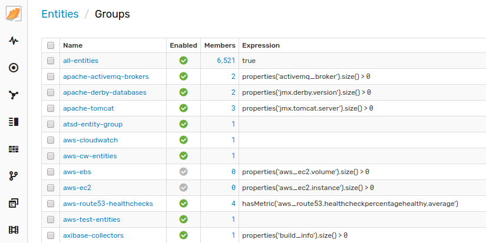
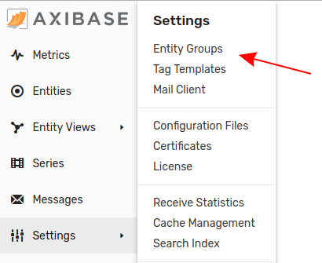
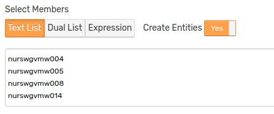
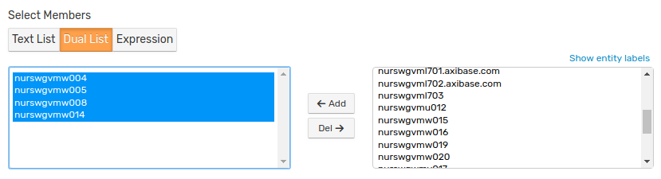
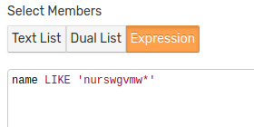
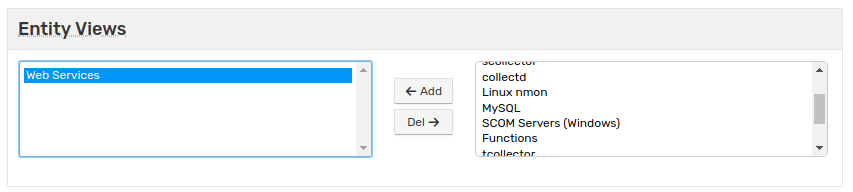
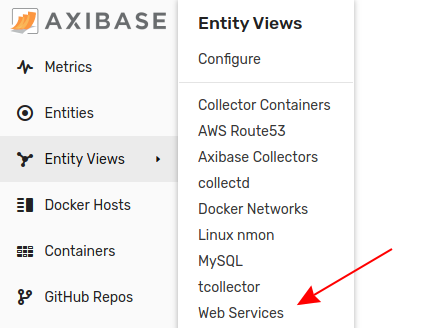

# Entity Groups

## Overview

Entity groups organize similar entities into logical collections that can be used when managing user permissions, filtering data, or calculating aggregations.



## Members

An entity group can be compiled **manually** by enumerating the names of each entity to be included.

It can be also created **programmatically** by specifying a boolean criteria against which all entities that exist in the database, or parent group entities, are evaluated. Those entities which match the criteria are added as members. Such groups are continuously updated in the background.

The parent group, if specified, restricts possible members to members of the parent group.

Open the **Settings > Entity Groups** page to configure a new or existing entity group.



The Entity Group Editor provides the following options for adding or removing members:

### Text List



Copy a list of entity names, one per line, into the text area. Names are **case-insensitive**.

If **Create Entities** is enabled, new entities are automatically created when the form is saved. Otherwise, names for which there are no existing entities found are ignored.

### Dual list



Select one or multiple existing entities in the right pane and click **Add** to add members.

Select current members in the left pane and click **Remove** to delete members from the group.

### Expression



Specify a boolean expression to add and remove entities automatically. Expression-based groups are updated by the server at a fixed interval specified by the `entity.group.update.interval` setting.

The expression can include the following entity fields and supports wildcards in field values:

* `name`
* `label`
* `enabled`
* `tags.tag-name` or `tags['tag-name']`

```javascript
name LIKE '*vml*' && tags.location = 'NUR'
```

#### Supported Functions

* Property Functions
  * [`property`](functions-entity-groups-expression.md#property)
  * [`properties`](functions-entity-groups-expression.md#properties)
  * [`property_values`](functions-entity-groups-expression.md#property_values), access to returned objects is not supported
  * [`hasProperty`](functions-entity-groups-expression.md#hasproperty)
* Lookup Functions
  * [`entity_tags`](functions-entity-groups-expression.md#entity_tags)
* Collection Functions
  * [`collection`](functions-entity-groups-expression.md#collection)
  * [`likeAll`](functions-entity-groups-expression.md#likeall)
  * [`likeAny`](functions-entity-groups-expression.md#likeany)
  * [`matches`](functions-entity-groups-expression.md#matches)
  * [`collection_contains`](functions-entity-groups-expression.md#collection_contains)
  * [`collection_intersects`](functions-entity-groups-expression.md#collection_intersects)
  * [`contains`](functions-entity-groups-expression.md#contains)
  * [`size`](functions-entity-groups-expression.md#size)
  * [`isEmpty`](functions-entity-groups-expression.md#isempty)
  * [`IN`](functions-entity-groups-expression.md#in)
* Text Functions
  * [`upper`](functions-entity-groups-expression.md#upper)
  * [`lower`](functions-entity-groups-expression.md#lower)
  * [`list`](functions-entity-groups-expression.md#list)
  * [`startsWithAny`](functions-entity-groups-expression.md#startswithany)
* Utility functions
  * [`hasMetric`](functions-entity-groups-expression.md#hasmetric)
  * [`memberOf`](functions-entity-groups-expression.md#memberof)
  * [`memberOfAll`](functions-entity-groups-expression.md#memberofall)

#### Examples

* Entity name contains the specified string:

  ```javascript
  name LIKE 'nur*vml*'
  ```

* Entity has the specified entity tag:

  ```javascript
  tags.docker-type != ''
  ```

* Entity has an entity tag equal to the specified value:

  ```javascript
  tags.docker-type = 'container'
  ```

* Entity has entity tags equal to the specified values:

  ```javascript
  tags.docker-type = 'container'
    && tags.status != 'deleted'
  ```

* Entity collects the specified property type:

  ```javascript
  hasProperty('oem.oracle_database')
  ```

* Entity collects the specified metric:

  ```javascript
  hasMetric('mpstat.cpu_busy')
  ```

* Entity collected the specified metric within `n` hours:

  ```javascript
  hasMetric('mpstat.cpu_busy', 24*7)
  ```

* Entity property tag value matches the given expression:

  ```javascript
  properties('cfg').prog != ''
    && properties('cfg').prog NOT LIKE 'topas*'
  ```

* Entity is a member of another group:

  ```javascript
  memberOf('all-linux-servers')
    && tags.location = 'SVL'
  ```

### Entity Views

[Entity views](./entity_views.md) are customized tabular formats for displaying key attributes for entities of the same type. Entity views are inherited from the parent Entity Group if one is defined. Assign a new entity view to the current entity group using the dual list under the **Entity Views** pane.



Once an entity group belongs to an entity view, it is available directly from the main menu under the **Entity Views** tab.



For more information about configuring entity views, see [Entity Views Documentation](./entity_views.md#settings)