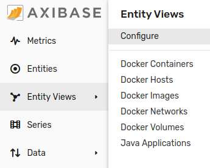
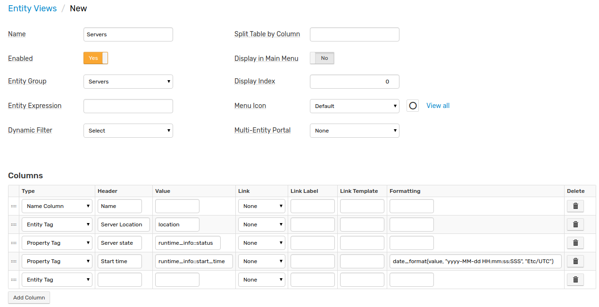
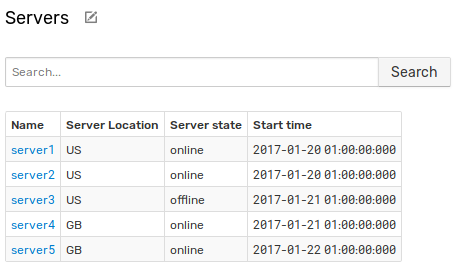
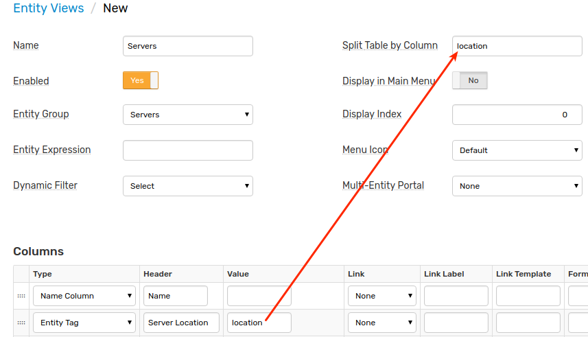
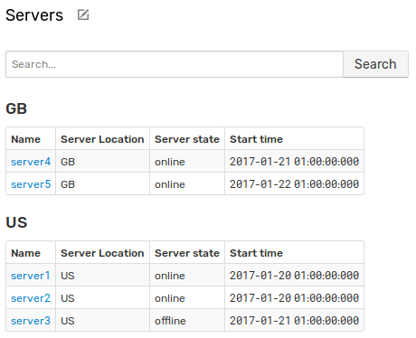
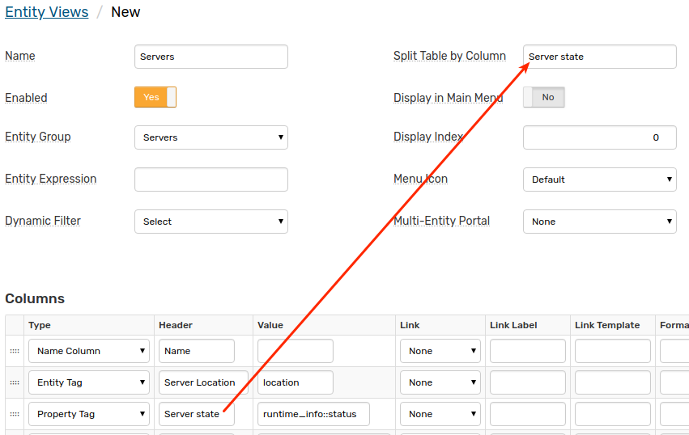
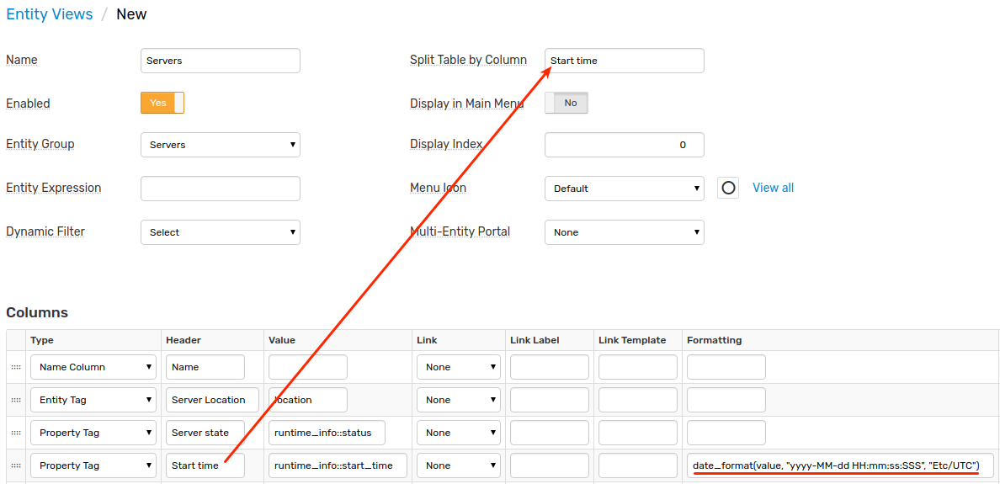
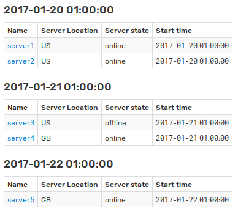
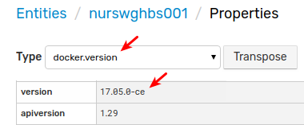
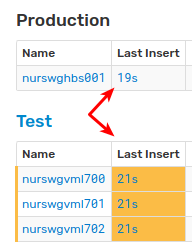

# Entity Views

## Overview

Entity Views provide a way to construct customized tables displaying key attributes for entities belonging to the same entity group. These views are listed under the **Entity Views** tab in the main menu on the left.



An entity view table consists several columns: icons, links, text, series values:


## Reference

* [Access Controls](#authorization)
* [Settings](#settings)
* [Filters](#filters)
* [Search](#search)
* [Table](#table)
* [Dynamic Filters](#dynamic-filters)
* [Split Table by Column](#split-table-by-column)
* [Portal](#portal)
* [Column Examples](#column-examples)

## Authorization

The view can be accessed by users with [`read`](../administration/user-authorization.md#entity-permissions) permission for the [entity group](entity_groups.md#members) to which the view is linked.

## Settings

**Name** | **Description**
---|---
Name | **[required]** View name displayed on the **Entity Views** page.
Enabled | Status: enabled or disabled. <br>Disabled views are not visible on the **Entity Views** tab in the main menu.
Entity Group | **[required]** [Entity group](entity_groups.md) which members are included in the view.
Entity Expression | Additional condition for group members to satisfy to be included in the view. The syntax is the same as in entity group [expressions](entity_groups.md#expression).
Dynamic Filter | [Filter](#dynamic-filters) applied to displayed entities on initial page load.
Split Table by Column | Enter column header or column value to group entities into separate tables.
Display in Main Menu | If enabled, the view is accessible under its own tab in the main menu on the left.
Display Index | Applies if entity view is displayed in the main menu. Specifies relative position of the tab. The tabs are sorted by index in ascending order.
Menu Icon | Icon assigned to the view in the main menu.
Multi-Entity Portal | [Portal](#portal) with time series charts for multiple entities displayed in the view. If no multi-entity portal is assigned, the default portal containing metrics in _Series Value_ [columns](#column-types) is displayed.

## Filters

The list of entities displayed in the table is determined as follows:

* The list is initially set to the current members of the selected entity group.
* If an [**Entity Expression**](#settings) is specified, the members are checked against this condition. Entities that fail to satisfy the condition are hidden.
* If a [**Dynamic Filter**](#dynamic-filters) is set by the user, the entities are additionally checked against this filter. Entities that fail to satisfy the filter condition are hidden.
* If a [**Search**](#search) text is specified, only entities with a column value containing the search keyword are displayed.

> While the Dynamic Filter can be toggled by the user, the Entity Group and Entity Expression (if specified) are applied at all times.

## Search

The search is performed based on column values displayed in the table. An entity satisfies the search condition if one of the column values for the entity row contains the specified search keyword.

## Table

The table consists of multiple columns, one row per entity. Each cell displays a particular attribute such as entity tag value or property tag value for a given entity.

### Table Header

**Name** | **Description**
---|---
Type | Column type.
Header | Column name.
Value | Applicable to _Entity Tag_, _Property Tag_, _Series Value_ and _Last Insert_ [column types](#column-types). Contains entity tag name, [property search expression](../rule-engine/property-search.md) or metric name respectively.
Link | Makes the cell value a clickable link. See [Links](#links) options.
Link Label | Text value displayed for the link. If `icon-` is specified, the text is replaced with an [icon](https://getbootstrap.com/2.3.2/base-css.html#icons), such as `icon-search`. If Link is set to `Entity Property`, the text is resolved to the property expression value.
Link Template | Path to a page in the web interface with support for placeholders: `${entity}` and `${value}` (current cell value).
Formatting | A [function](#formatting) or an expression to round numbers and convert units.

### Column Types

**Name** | **Description**
---|---
Enabled Column | Entity status.
Entity Tag | Name of the entity tag.
Property Tag | [Property search expression](../rule-engine/property-search.md) in the format of `type:[{key-name=key-value}]:tag-name`.
Series Value | Name of the metric for which the last value for this entity is displayed.<br>If multiple series match the specified metric and entity, the value for the latest series is displayed.
Name Column | Entity name with a link to the entity editor.
Label Column | Entity label with a link to the entity editor.
Portals Column | Link to the portals page for the entity.
Properties Column | Link to the entity properties page.
Last Insert | Last insert date for all or one metric collected by the entity with a link to the last insert table.<br>If the column value is not specified, the last insert date is calculated for all metrics. The column value accepts settings in the format of `metric:[lag]`, where the optional `lag` parameter denotes the maximum delay in seconds.<br> If the last insert date for the entity is before `now - lag`, the cell is highlighted with orange background. <br> See examples [below](#last-insert).

#### Last Insert

* Highlight entities if last insert date for **all** metrics is before `now - 900 seconds`

```javascript
  :900
```

* Highlight entities if last insert date for the metric `cpu_busy` is before `now - 900 seconds`

```javascript
  cpu_busy:900
```

* Display last insert date for the metric `cpu_busy` without highlighting. Note the terminating colon after the metric name.

```javascript
  cpu_busy:
```

### Links

**Name** | **Description**
---|---
Entity | Entity editor page.
Property | Portal with a property widget for the given entity and property type.
Chart | Portal with a time chart displaying the data for the specified metric and entity.
Entity Property | Portal with a property widget for another entity retrieved with the property expression.
Entity Tag | Displays the value of the specified entity tag for another entity, whose name is set in the tag of the current entity.

### Formatting

The following functions are available in the **Formatting** section:

#### Text Functions

* [`upper`](../rule-engine/functions-text.md#upper)
* [`lower`](../rule-engine/functions-text.md#lower)
* [`truncate`](../rule-engine/functions-text.md#truncate)
* [`coalesce`](../rule-engine/functions-text.md#coalesce)
* [`keepAfter`](../rule-engine/functions-text.md#keepafter)
* [`keepAfterLast`](../rule-engine/functions-text.md#keepafterlast)
* [`keepBefore`](../rule-engine/functions-text.md#keepbefore)
* [`keepBeforeLast`](../rule-engine/functions-text.md#keepbeforelast)
* [`replace`](../rule-engine/functions-text.md#replace)
* [`capFirst`](../rule-engine/functions-text.md#capfirst)
* [`capitalize`](../rule-engine/functions-text.md#capitalize)
* [`removeBeginning`](../rule-engine/functions-text.md#removebeginning)
* [`removeEnding`](../rule-engine/functions-text.md#removeending)
* [`urlencode`](../rule-engine/functions-text.md#urlencode)
* [`jsonencode`](../rule-engine/functions-text.md#jsonencode)
* [`htmlDecode`](../rule-engine/functions-text.md#htmldecode)
* [`unquote`](../rule-engine/functions-text.md#unquote)
* [`countMatches`](../rule-engine/functions-text.md#countmatches)
* [`abbreviate`](../rule-engine/functions-text.md#abbreviate)
* [`indexOf`](../rule-engine/functions-text.md#indexof)
* [`locate`](../rule-engine/functions-text.md#locate)
* [`trim`](../rule-engine/functions-text.md#trim)
* [`length`](../rule-engine/functions-text.md#length)

#### Formatting Functions

* [`convert`](../rule-engine/functions-format.md#convert)
* [`formatNumber`](../rule-engine/functions-format.md#formatnumber)
* [`formatBytes`](../rule-engine/functions-format.md#formatbytes)
* [`date_format`](../rule-engine/functions-format.md#date_format)
* [`formatInterval`](../rule-engine/functions-format.md#formatinterval)
* [`formatIntervalShort`](../rule-engine/functions-format.md#formatintervalshort)

#### Date Functions

* [`elapsedTime`](../rule-engine/functions-time.md#elapsedtime)

## Dynamic Filters

**Name** | **Description**
---|---
Name | Filter name displayed in the drop-down menu.
Expression | A condition that entities must satisfy when the filter is selected in the drop-down menu. The expression may refer to `name` and `tags.{name}` columns defined in the entity view.

Filter expression examples:

```javascript
// name column
name LIKE 'nur*'
```

```javascript
// entity tag column
upper(tags.name) LIKE '*SVL*'
```

```javascript
// entity tag column
lower(tags.app) LIKE '*hbase*'
```

```javascript
// property tag column
tags['configuration::codename'] = 'Santiago'
```

## Split Table by Column

If **Split Table by Column** is specified, the entities are grouped into multiple tables.

The **Split Table by Column** field accepts an existing column header or its value.

### Split Examples

Assuming there are five entities in the selected entity group:

* Entity name starts with `server*`.
* Each entity has entity tag `location`
* Each entity has properties `start_time` and `status` of type `runtime_info`.

Default entity view configuration:



The entity view without table splitting is displayed as follows, with all entities placed into one table:



To split the table by entity tag `location`, specify the tag name in the **Split Table by Column** field:





To group entities by column **header**, set the header name in the **Split Table by Column** field:




If splitting by column **header** is enabled, grouping is performed based on formatted values.





## Portal

If the **Multi-Entity Portal** is assigned manually or the entity view contains **Series Value** [columns](#column-types), the statistics for entities can be viewed on a portal accessible with the **View Portal** button.


If no portal is selected, the default portal displays metrics for [columns](#column-types) of type **Series Value**.

The multi-entity portal is any portal that displays a metric for [multiple entities](../portals/portals-overview.md#template-portals) using the `${entities}` placeholder.

```bash
[widget]
  type = chart
  [series]
    metric = docker.cpu.avg.usage.total.percent
    entities = ${entities}
```

## Column Examples

Examples by Column Types:

* [Entity Tag](#entity-tag-examples)
* [Property Tag](#property-tag-examples)
* [Series Value](#series-value-examples)
* [Name Column](#name-column-examples)
* [Label Column](#label-column-examples)
* [Portals Column](#portals-column-examples)
* [Properties Column](#properties-column-examples)
* [Last Insert](#last-insert-examples)

### Entity Tag Examples

#### Text Link to Entity Tag for a related Entity

The link displays the value of the entity tag of another entity, which name is set in the entity tag of the current entity.

1. Specify the entity tag which contains the name of related entity in the **Value** setting.

2. Set **Link** setting to **Entity Tag**.

3. Specify the entity tag of related entity in the **Link Label** setting.

* Configuration

    

* View

    

* On-click Target

    

#### Customized Entity Tag

Tag value can be formatted for convenient representation.

* Configuration

    

* View

    

### Property Tag Examples

#### Text Link to Specific Entity Property

Text displays property tag value with a link to property type.

1. Set **Type** setting to **Property Tag**.

2. Specify [property search expression](../rule-engine/property-search.md) in the **Value** setting, for example `docker.version::version`.

3. Set **Link** setting to **Property**.

* Configuration

  

* View

  

* On-click Target

  

#### Custom Icon Link to Message Search Page with Property Tag

The message search link template contains tag value.

1. Set **Type** setting to **Property** Tag.

2. Specify [property search expression](../rule-engine/property-search.md) in the **Value** setting, for example `docker.container.config::hostname`.

3. Set **Link Label** setting to [`icon`](https://getbootstrap.com/2.3.2/base-css.html#icons), for example `icon-search`.

4. Specify a portal link in the **Link Template** setting, for example `/messages?search&entity=${value}`.

* Configuration

  

* View

  

* On-click Target

  

### Series Value Examples

#### Text Link to Series Chart with formatted Series Value

The link displays the latest inserted value for the specific metric.

1. Specify the metric name in the **Value** setting.

2. Apply the **Link** setting to Chart.

3. Specify an expression in the **Formatting** setting to display one digit after dot:

```ls
    formatNumber(value, '0.0')
```

* Configuration

    

* View

    

* On-click Target

    

### Name Column Examples

#### Text Link to Entity Editor

The text displays entity name with a link to the entity editor.

The displayed entity name can be modified, for example shortened, by specifying an expression in the **Formatting** setting:

```javascript
  length(value)<16 ? value : truncate(value,12)
```

* Configuration

  

* View

  

* On-click Target

  

#### Custom Icon Link to Specific Entity Portal

Use the following configuration to specify the custom icon which opens a link to template portal assigned to the selected entity.

1. Set **Type** setting to **Name Column**.

2. Set **Link Label** setting to [icon](https://getbootstrap.com/2.3.2/base-css.html#icons), for example `icon-fire`.

3. Specify a portal link in the **Link Template** setting, for example `/portal/name/collectd?entity=${entity}`.

* Configuration

  

* View

  

* On-click Target

  

### Label Column Examples

#### Text with Entity Label

Entity labels can be defined for entities. Otherwise, entity name is displayed.

* Configuration

  

* View

  

#### Text Link to Entity Editor with Entity Label

The link displays entity label if the label is set. Otherwise, the link displays entity name.

Specify the following URL in the **Link Template** setting.

```ls
  /entities/${entity}
```

* Configuration

  

* View

  

* On-click Target

  

### Portals Column Examples

#### Icon Link to Entity Portals

The icon opens a link to all template portals assigned to the selected entity. The order of portals is determined based on the portal display index.

* Configuration

  

* View

  

* On-click Target

  

#### Icon Link to Specific Entity Portal

To display a particular portal by default, specify the portal name in the **Value** setting. Other portals assigned to the entity are accessible in tabs.

* Configuration

  

* Example

  

### Properties Column Examples

#### Icon Link to All Entity Properties

* Configuration

  

* View

  

* On-click Target

  

#### Icon Link to Specific Entity Property

Specify the default property type in the **Value** setting.

```ls
  docker.info
```

* Configuration

  

* Result

  

  The property viewer displays the selected type on initial load:

```elm
  /entities/123456.../properties?type=docker.info
```

### Last Insert Examples

#### Text Link to Last Insert Page

The text displays difference `now - lastInsertDate`. The entities are highlighted if the last insert date for the specified metric is before `now - {lag} seconds`.

1. Set **Type** setting to **Last Insert**.

2. Specify the metric name and the lag in the **Value** setting, for example `docker.activecontainers:20`.

3. Specify an expression in the **Formatting** setting to display difference `now - lastInsertDate`:

```ls
    formatIntervalShort(elapsedTime(value))
```

* Configuration

    

* View

    

* On-click Target

    
