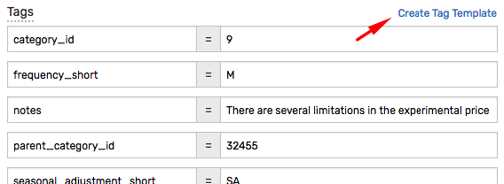
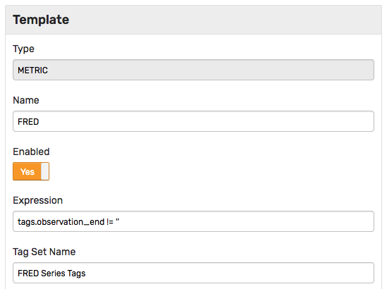
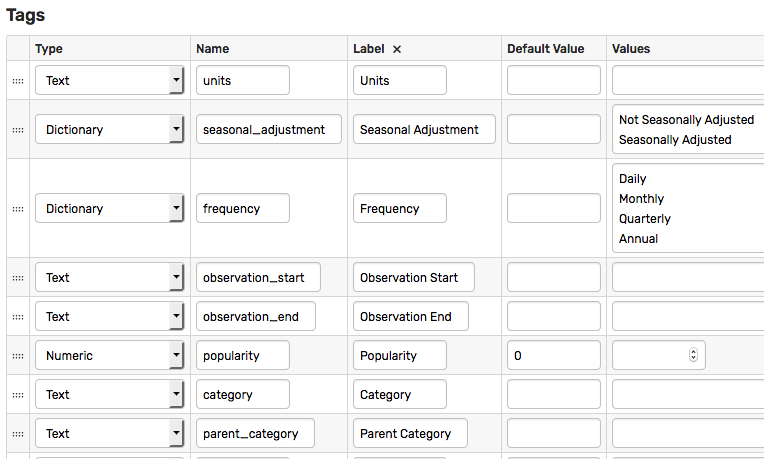
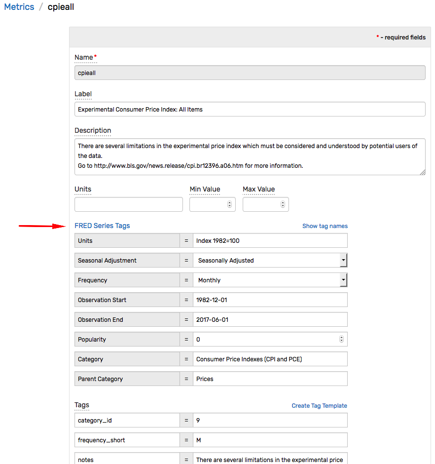
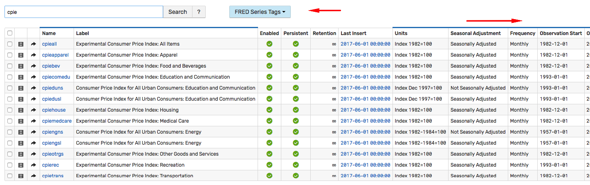

# Tag Templates

## Overview

Tag templates organize tags for similar entities or metrics into groups and apply custom formatting and validation rules to the grouped tags.


To view existing templates or create a new template, open the **Settings > Tag Templates** page.


To modify an existing tag template, click the link in the **Name** column. To create a new tag template, expand the split-button and click **Create**.

A template can also be created from existing tags by clicking the **Create Tag Template** link on a metric or **Entity Editor** page.



## Template Editor

The editor contains the following options which are applicable both to entity and metric tag templates.

| Name | Description |
---|---
Type | Defines whether the template applies to metrics or entities.
Name | User-defined template name.
Enabled | Determines if the tag template is visible in **Entity Editor** and displayed in the **Tag Set** drop-down list on the **Entities** page.
Expression | Boolean check against the entity name and tags. If the expression returns `true`, the tags managed by this template are displayed in the **Entity Editor** for the given entity.
Tag Set Name | Display name for the group of tags managed by this template.
Display Index | Controls the order in which tag templates are listed on the **Entities** page and in the entity editor.
Parent Template | Display tags from the parent template when this template is selected in the entity editor.

## Tags Table

The table consists of tag names and formatting rules applied to tags managed by this template.

Field | Description
---|---
Type | Tag value data type: `Text`, `Numeric`, `Boolean`, `Dictionary`, `Entity Link`. <br>The `Dictionary` type defines a fixed list of values allowed for this tag.<br>The `Entity Link` type converts the tag value to entity label and displays it as a link to the entity editor.
Name | Tag name.
Default Value | Default value, if applicable.
Value | Tag values. Not applicable to `Boolean` tag type.

## Example

The example template below, named `FRED`, applies to metrics with a non-empty `observation_end` tag as defined in the **Expression**.

```javascript
tags.observation_end != ''
```



The template defines formatting rules for eight tags with different data types.



When the user opens an editor for a metric with a non-empty `observation_end` tag, the expression returns `true` and the editor formats metric tags according to the rules specified in the **Tags Table**.

The tags organized by the `FRED` template are grouped together as `FRED Series Tags` defined in the **Tag Set Name** option.



The `FRED` template can be also selected on the **Metrics** page which adds additional columns for each tag defined in the table.



Without the template, no formatting rules are applied to the metric tags in the editor.


