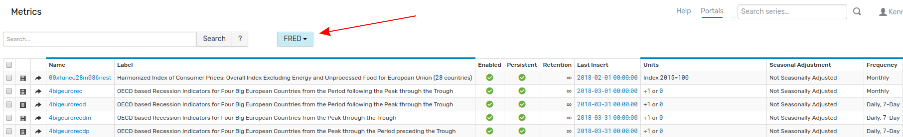

# Tag Templates

## Overview

Tag templates provide a way to organize similar tags into groups and apply the template to multiple entities or metrics.

To access existing tag templates or create a new template, open the **Settings** menu and select **Tag Templates**.

To modify an existing Tag Template click the link in the **Name** column. To create a new Tag Template, expand the split button and select **Create**.

## Tag Template Editor

Tag Template Editor contains the following options for managing tag templates:

| Property | Description |
--|--
Type | Define whether the tag template applies to metric or entity [tags](../README.md#glossary).
Name | User-defined applied to the tag template.
Enabled | Whether or not the tag template is enabled determines if the template is available for selection on the **Tag Set** drop-down list on the **Entities** page.
 Expression | Invoke tag template using user-defined expression or metrics, entities, or other tag templates.
 Tag Set Name | Filter name for tag template. Select **Tag Set** on the **Entities** page to include specific tags in Entity Table.
 Display Index | Controls the order that **Tag Set** appears in **Tag Set** drop-down list on **Entities** page.
 Parent Template | Import a set of tags for tag templates which are derived from existing templates.

## Tags Table

Field | Description
--|--
Type | Drop-down list contains several options which control a remaining fields for the given tag: `Text`: Define any text value. `Numeric`: Define any integer value. `Boolean`: Selectable values are `yes` and `no`. `Dictionary`: Define tag value based on pre-defined. `Entity Link`: Define tag value as an entity name. Tag value links to the appropriate entity.
Name | Tag name.
Default Value | Default value, if applicable.
Value | Tag values. Not applicable to `Boolean` tag type.

## Example

The **FRED** template tags table from [Trends](https://axibase.com/use-cases/trends/) is shown below.

This tag template applies to [Federal Reserve Economic Data](https://fred.stlouisfed.org/) stored in ATSD by including the **Expression** `tags.observation_end =! "`. The expression searches for metrics which include the tag `observation_end` and apples the tag template to those metrics. Metric page for `cpieall` is shown below:

Use the **Tag Set** drop-down list on the **Metrics** page to select this tag template and search metrics by the desired tag.

Without the **FRED** tag template, `cpieall` metric only includes manually applied tags.

