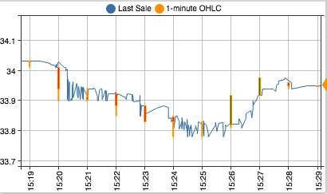
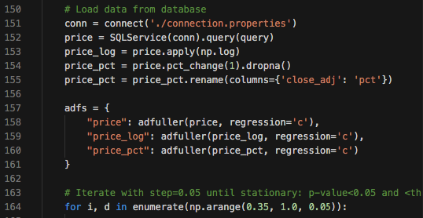
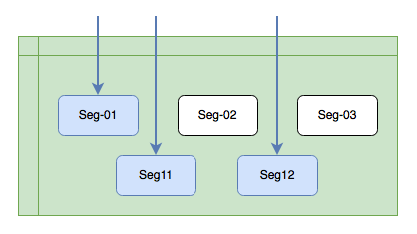

---
# /* yaspeller ignore:start */
landing: true
title: Fast and reliable datastore for financial market data
description: Fast and reliable datastore for financial market data
heroText: Fast and reliable datastore for financial market data
tagline: Treat your data as an asset
actionText: Install on Linux →
actionLink: ./install.md
features:
- title: Faster than files
  details: Parallel query engine with indexed data access
- title: Full-featured SQL
  details: Extended <a href="sql.html" style="color:orange">SQL</a> syntax with advanced filtering and aggregations
- title: Streaming and Batch Updates
  details: Consolidate quotes, trades, snapshots, and security details in one place
footer: Copyright © 2021 Axibase
footerActionText: Install ATSD on Linux Today
footerActionLink: ./install.md
# /* yaspeller ignore:end */
---
<!-- markdownlint-disable MD002 MD041 MD012 -->
<article class="feature-highlight">

## What you can do with ATSD

 <!-- yaspeller ignore -->

- Strategy backtesting on high-frequency data
- Quantitative and market microstructure research
- Granular transaction cost analysis and rollup reporting
- Market surveillance and anomaly detection
- Non-transparent ETF/ETN decomposition

</article>
<article class="feature-highlight">

## Streaming & Scheduled Market Data

 <!-- yaspeller ignore -->

- FAST, SBE, and proprietary protocols
- Plain text protocol
- Consolidated and direct feeds
- Built-in latency monitoring tools
- End-of-day archives
- ETL from institutional and retail financial data platforms

</article>
<article class="feature-highlight">

## SQL Engine

 <!-- yaspeller ignore -->

- Parallel [SQL](./sql.md) engine with syntax extensions
- Advanced filtering by trading session, auction stage, index composition
- Optimized aggregates for OHLCV and VWAP calculations
- Interactive SQL console with auto-completion
- API [endpoint](../sql/api.md) for programmatic integration
- Scheduled SQL [reporting](../sql/scheduled-sql.md) with email, file, and web delivery
- [JDBC](https://github.com/axibase/atsd-jdbc) and [ODBC](https://github.com/axibase/atsd-odbc) drivers

</article>
<article class="feature-highlight">

## REST API

 <!-- yaspeller ignore -->

- Trades: [write](./command-trade-insert.md), [read](./trades-export.md)
- OHLCV bars: [calculate](./ohlcv-export.md), [write](./session-summary-import-ohlcv.md), [read](./session-summary-export-ohlcv.md) <!-- yaspeller ignore -->
- Quotes: [write](./command-statistics-insert-quotes.md), [read](./session-summary-import-ohlcv.md)
- Snapshots: [write](./session-summary-import.md), [read](./session-summary-export.md)
- Reference data: [write](./command-instrument-entity.md), [read](./reference-export.md)
- API clients for [Python](https://github.com/axibase/atsd-api-python) and [Java](https://github.com/axibase/atsd-api-java)

</article>
<article class="feature-highlight">

## Storing Data in ATSD vs Files

 <!-- yaspeller ignore -->

- Searching records by index is faster than reading files sequentially
- Extra performance with caching and parallelized scans
- Non-blocking writes enable multiple concurrent reads
- Read visibility before transaction committed to disk with memory scans
- Records can be inserted out-of-order and modified without overwriting archive
- Filter, aggregate, sort, and create analytical windows close to data

</article>
<article class="feature-highlight">

## ATSD vs Relational Databases

 <!-- yaspeller ignore -->

- Reduced overhead on critical read and write paths
- Automated sharding of segmented tables
- Parallelized scans
- Optimal compression codecs to reduce the I/O and disk space usage
- Aggregate and analytical functions optimized for financial data

</article>