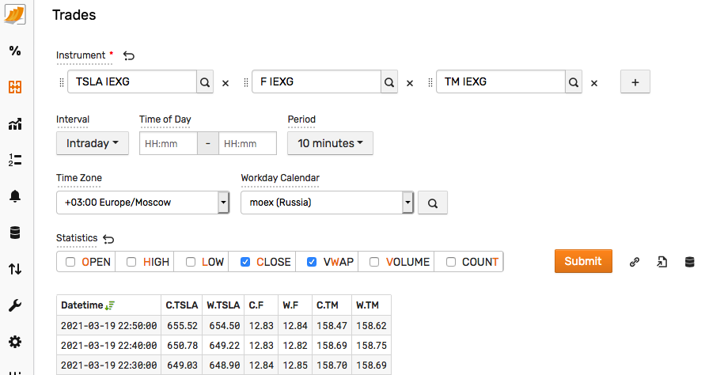
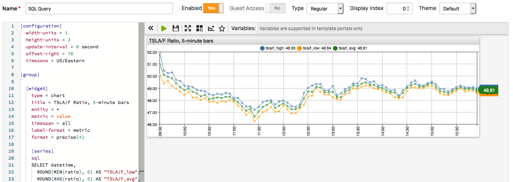
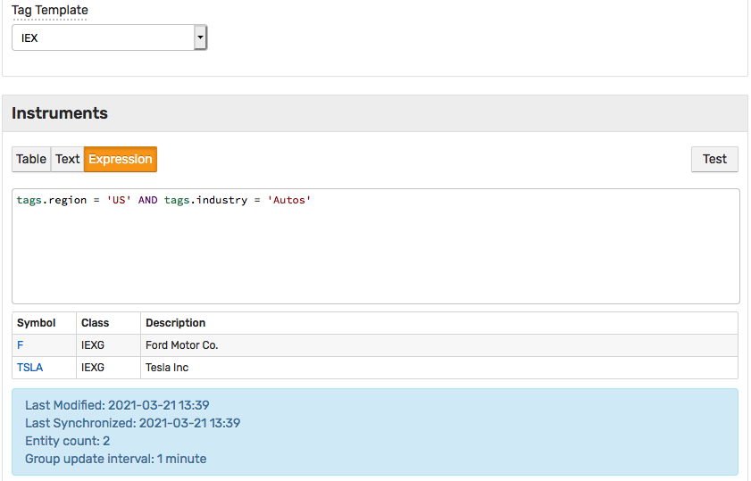
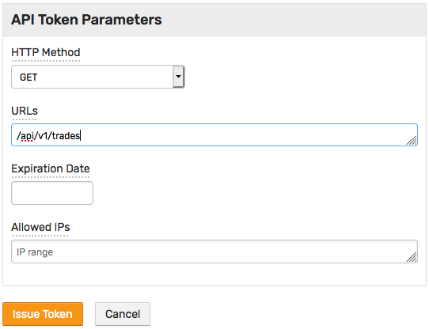

# Installation

## Install ATSD

Install the [database](install.md).

## Create Account

Log in to the database at `https://atsd_hostname:8443/`.

Replace `atsd_hostname` with the hostname of the ATSD server.

Enter credentials for an administrator account.

## Insert Sample Data

Download publicly available [IEX](https://iextrading.com/apiexhibita/) market data for four instruments: `TSLA`, `F`, `TM`, `ARKK` covering the period between January 1, 2021 and March 15, 2021.

Download files with instrument details, trades, and daily aggregates.

```bash
curl --remote-name-all https://axibase.com/files/{gs_reference.cmd,gs_eod_ohlcv.csv,gs_trades.csv.gz}
```

Insert reference data.

```bash
cat gs_reference.cmd | nc -q 0 atsd_hostname 8081
```

Insert trades.

```bash
gunzip -c gs_trades.csv.gz > | nc -q 0 atsd_hostname 8085
```

Insert end-of-day aggregates. Replace `<username>` and `<password>` with the account credentials specified above.

```bash
curl -k "https://atsd_hostname:8443/api/v1/trade-session-summary/import" \
  -F "data=@gs_eod_ohlcv.csv" \
  -u <username>:<password>
```

## SQL Console

Open **SQL > SQL Console** page.

View trades:

```sql
SELECT *
  FROM atsd_trade
WHERE class = 'IEXG' AND symbol IN ('TSLA', 'F')
  AND datetime BETWEEN '2021-03-05 14:00:00' AND '2021-03-05 14:05:00'
  WITH TIMEZONE = 'US/Eastern'
  ORDER BY datetime, trade_num
LIMIT 100
```

Calculate 1-minute OHLCV bars from trades:

```sql
SELECT datetime, symbol, open(), high(), low(), close(), volume(), vwap()
  FROM atsd_trade
WHERE class = 'IEXG' AND symbol IN ('TSLA', 'F')
  AND datetime BETWEEN '2021-03-05 14:00:00' AND '2021-03-05 14:05:00'
  GROUP BY exchange, class, symbol, PERIOD(1 MINUTE)
  WITH TIMEZONE = 'US/Eastern'
  ORDER BY datetime, symbol
```

View daily results:

```sql
SELECT datetime, symbol, open, close, voltoday AS "volume",
  numtrades, ROUND(valtoday/1000000, 0) AS "volume_$M"
  FROM atsd_session_summary
WHERE class = 'IEXG' AND symbol = 'TSLA'
  AND datetime BETWEEN '2021-03-01 00:00:00' AND '2021-03-15 00:00:00'
  WITH TIMEZONE = 'US/Eastern'
  ORDER BY symbol, datetime
```

View reference data:

```sql
SELECT tags.symbol, tags.class_code, tags.figi, tags.type, tags.region, tags.currency, tags.name
  FROM atsd_entity
WHERE tags.class_code = 'IEXG' --AND tags.symbol IN ('TSLA', 'F', 'TM', 'ARKK')
  ORDER BY tags.symbol
```

View daily results for US auto manufacturers:

```sql
SELECT datetime, symbol, open, close, voltoday AS "volume",
  numtrades, ROUND(valtoday/1000000, 0) AS "volume_$M"
  FROM atsd_session_summary
WHERE class = 'IEXG' AND entity.tags.region = 'US' AND entity.tags.industry = 'Autos'
  AND datetime BETWEEN '2021-03-12 00:00:00' AND '2021-03-15 00:00:00'
  WITH TIMEZONE = 'US/Eastern'
  ORDER BY symbol, datetime
```

Calculate the ratio between two instruments based on last trade price:

```sql
SELECT datetime,
  LAST(CASE symbol WHEN 'TSLA' THEN price ELSE null END) last_TSLA,
  LAST(CASE symbol WHEN 'F' THEN price ELSE null END) last_F,
  ROUND(last_TSLA/last_F, 6) AS "TSLA/F"
FROM atsd_trade
  WHERE class = 'IEXG' AND symbol IN ('TSLA', 'F')
  AND datetime BETWEEN '2021-03-05 14:00:00' AND '2021-03-05 14:05:00'
  WITH TIMEZONE = 'US/Eastern', ROW_NUMBER(1 ORDER BY time, trade_num) >= 0
  ORDER BY datetime, trade_num
```

Calculate 1-minute OHLCV bars of the above ratio:

```sql
SELECT datetime,
  ROUND(MIN(ratio), 6) AS "TSLA/F_low",
  ROUND(MAX(ratio), 6) AS "TSLA/F_high",
  ROUND(LAST(ratio), 6) AS "TSLA/F_close"
FROM (
  SELECT datetime,
    LAST(CASE symbol WHEN 'TSLA' THEN price ELSE null END) last_TSLA,
    LAST(CASE symbol WHEN 'F' THEN price ELSE null END) last_F,
    ROUND(last_TSLA/last_F, 6) AS "ratio"
  FROM atsd_trade
    WHERE class = 'IEXG' AND symbol IN ('TSLA', 'F')
    AND datetime BETWEEN '2021-03-05 14:00:00' AND '2021-03-05 14:05:00'
    WITH ROW_NUMBER(1 ORDER BY time, trade_num) >= 0
    ORDER BY datetime, trade_num
) GROUP BY PERIOD(1 MINUTE)
WITH TIMEZONE = 'US/Eastern'
```

Explore more examples on [SQL Overview](./sql.md) page including:

* [Scheduling](../sql/scheduled-sql.md) query results for delivery as a report or an alert
* Saving query results into [derived time series](../sql/scheduled-sql-store.md)

## Trade Viewer

Open **Trade Viewer** in the side menu.

Select one or multiple instruments to view and export raw trades or aggregates.



## Portals

Click **Portals > Add** in the top menu.

Create a graph for the above SQL query by copying the query text into the `sql...endsql` setting:

```ls
[configuration]
  width-units = 1
  height-units = 2
  update-interval = 0 second
  offset-right = 70
  timezone = US/Eastern

[group]

  [widget]
    type = chart
    title = TSLA/F Ratio, 5-minute bars
    entity = *
    metric = value
    timespan = all
    label-format = metric
    format = precise(4)

    [series]

    sql
    SELECT datetime,
      ROUND(MIN(ratio), 6) AS "TSLA/F_low",
      ROUND(AVG(ratio), 6) AS "TSLA/F_avg",
      ROUND(MAX(ratio), 6) AS "TSLA/F_high"
    FROM (
    SELECT datetime,
      LAST(CASE symbol WHEN 'TSLA' THEN price ELSE null END) last_TSLA,
      LAST(CASE symbol WHEN 'F' THEN price ELSE null END) last_F,
      ROUND(last_TSLA/last_F, 6) AS "ratio"
    FROM atsd_trade
    WHERE class = 'IEXG' AND symbol IN ('TSLA', 'F')
    AND datetime BETWEEN '2021-03-05 09:30:00' AND '2021-03-05 16:00:00'
    WITH ROW_NUMBER(1 ORDER BY time, trade_num) >= 0
    ORDER BY datetime, trade_num
    ) GROUP BY PERIOD(5 MINUTE)
    WITH TIMEZONE = 'US/Eastern'
    endsql
```



To view the chart based on real-time data, the interval condition can be modified as follows:

```sql
AND datetime BETWEEN current_working_day AND now
```

## Instrument Groups

Open **Instrument Groups > Create** page and create an expression-based watch list which is populated and stays updated based on reference data.

Click **Expression** tab and enter a filter expression.

```sql
tags.region = 'US' AND tags.industry = 'Autos'
```



```sql
SELECT datetime, symbol, open, close, voltoday AS "volume",
  numtrades, ROUND(valtoday/1000000, 0) AS "volume_$M"
  FROM atsd_session_summary
WHERE class = 'IEXG' AND is_entity_in_group(to_entity(symbol, class), 'us-auto')
  AND datetime BETWEEN '2021-03-12 00:00:00' AND '2021-03-15 00:00:00'
  WITH TIMEZONE = 'US/Eastern'
  ORDER BY symbol, datetime
```

## API

In the URL links below, replace `atsd_hostname` with the hostname where ATSD is installed.

Replace `<username>` and `<password>` with the correct credentials.

Alternatively, create [API tokens](../administration/user-authentication.md#token-authentication) on **Admin > API Tokens** page to access various endpoints.



Export [trades](./trades-export.md):

```bash
curl "https://atsd_hostname:8443/api/v1/trades?class=IEXG&symbol=TSLA&startDate=2021-03-05%2014%3A00%3A00-05%3A00&endDate=2021-03-05%2014%3A05%3A00-05%3A00" \
 -k -u <username>:<password>
```

Export [OHLCV bars](./ohlcv-export.md):

```bash
curl "https://atsd_hostname:8443/api/v1/ohlcv?class=IEXG&symbol=TSLA&startDate=2021-03-05%2014%3A00%3A00-05%3A00&endDate=2021-03-05%2014%3A05%3A00-05%3A00&period=1%20MINUTE" \
 -k -u <username>:<password>
```

## Summary

:::tip Congratulations!
You have **successfully** completed the **Getting Started** exercises.
:::