# Общая информация

**ATSD** является специализированной базой данных для структурированного хранения и анализа биржевой информации. ATSD предлагает клиентам удобные средства интерактивного анализа и экспорта исходных и производных данных для разработки торговых стратегий, анализа транзакционных издержек, а также надзорных исследований и контроля рисков. 

## Интеграция с Московской Биржей

ATSD оптимизирована для обработки биржевой информации Московской Биржи по высокопроизводительному протоколу [FAST Multicast](https://www.moex.com/s441) в режиме реального времени.

* Получение данных с Фондового, Денежного, Валютного и Срочного рынков
* Запись сделок, заявок, котировок, статистик по всем 250+ бордам (классам) инструментов

  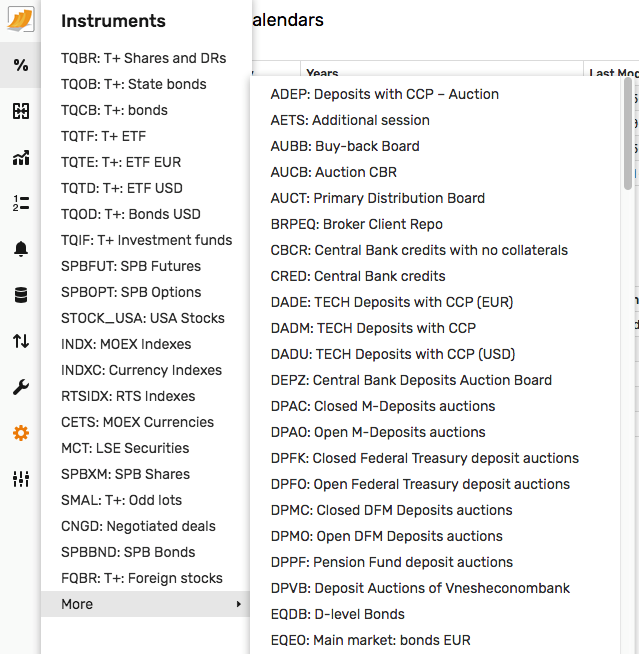

* Учет детального расписания торгов (сессии и аукционы) на основе торгового календаря биржи

  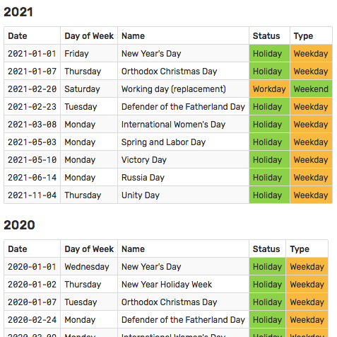

  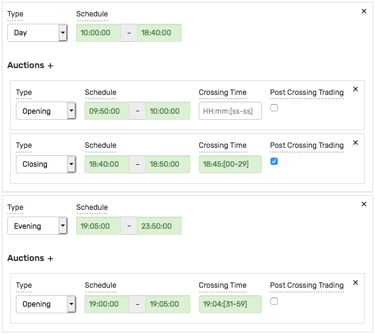

  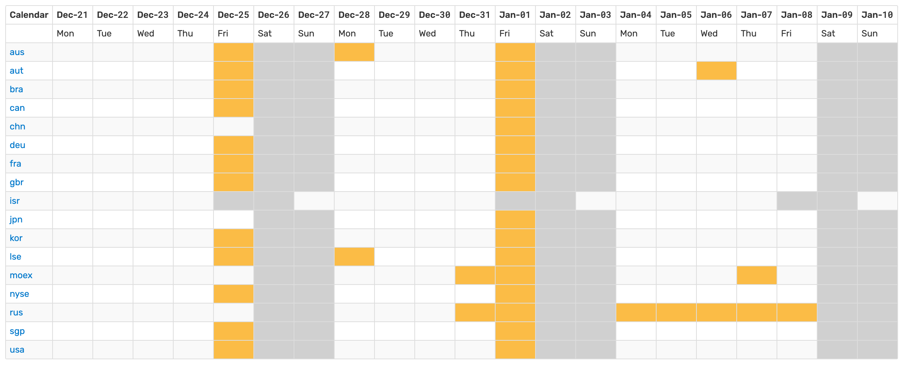

* Получение данных по двум инкрементальным потокам
* Получение данных из инкрементальных (MSR, OLR, TLR, ISF) и снэпшотных (IDF, MSS, OLS, TLS) потоков
* Восстановление через снэпшоты или инкрементальные обновления для предотвращения пробелов
* Верификация доставки и восстановление пробелов по окончании сессии или торгового дня

  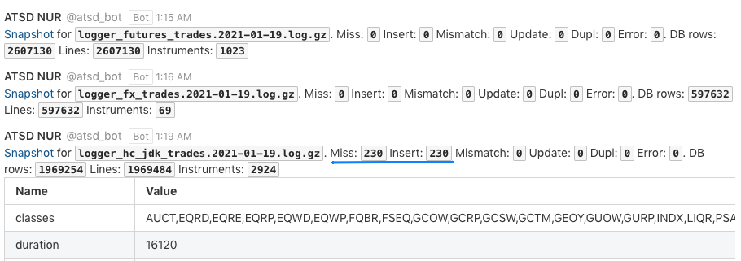

* Повторная верификация доставки с использованием Full Order Log (тип А)

  ```
  File: ordlogeq19.01.2021.exp.gz : 324701603
  Loaded securities in 8487
  Instruments: 374 in 3459 ms
  TRUR lot: 1 Database trades: 211817 : 211817
  SBER lot: 10 Database trades: 96559 : 105939
  GAZP lot: 10 Database trades: 80520 : 92097
  ...
  19.01.2021|1|AGRO|B|100000000000|1|1|850|77||| : 0
  ...
  Missing: 0
  ```

* Дополнительные утилиты для подгрузки референтных данных из ISS API
* Встроенные средства мониторинга задержки с разбивкой по классам и потокам

  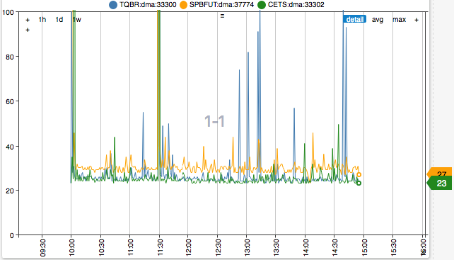

* С 2020 года ATSD также является сертифицированной [брокерской системой](https://www.moex.com/a1198) для подключения к ТКС ASTS.

## Интеграция с дополнительными источниками

Реализованные в ATSD программные интерфейсы и гибкая схема хранения позволяют настроить получение данных от распространителей консолидированных данных или нескольких торговых площадок, например LSE IOB, NYSE/NASDAQ, Санкт-Петербургская биржа, Bloomberg B-PIPE, Refinitiv, QUIK.

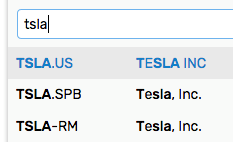

## SQL

* SQL движок с [расширенным синтаксисом](sql.md) для фильтрации данных по сессиям, аукционам, торговым календарям и принадлежности к индексам

  ```sql
  SELECT datetime, symbol, close(), vwap()
    FROM atsd_trade
  WHERE IS_INSTRUMENT_IN_INDEX('moexbc')
    AND in_session(DAY, OPENING)
    AND datetime BETWEEN '2021-01-01' AND '2021-01-15' EXCL
  GROUP BY exchange, class, symbol, PERIOD(1 DAY)
  ```

* Интерактивная SQL консоль с автодополнением и синтаксисными подсказками

  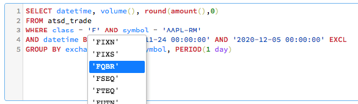

* Создание SQL отчетов по расписанию с распространением на email, файловую систему или выделенную страницу в ATSD

  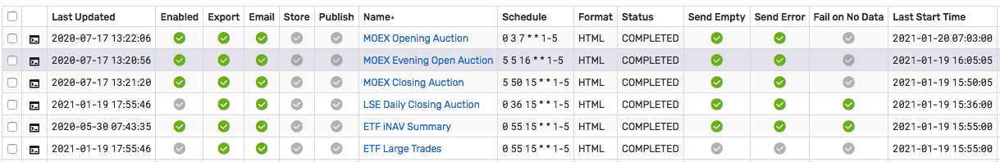

* Драйверы [JDBC](https://github.com/axibase/atsd-jdbc), [ODBC](https://github.com/axibase/atsd-odbc), ODBC-QUIK
* Финансовые функции с оптимальным вычислением на сервере: OHLCV, VWAP, Beta, COVAR, CORREL

## Версионирование референтных данных

* Механизм версионированного сохранения референтных данных позволяет производить корректные вычисления с использованием таких полей, как размер и дата выплаты купона, размер лота, количество выпущенных бумаг, а также своевременно реагировать на изменения для целей включения инструментов в черные/белые списки.

  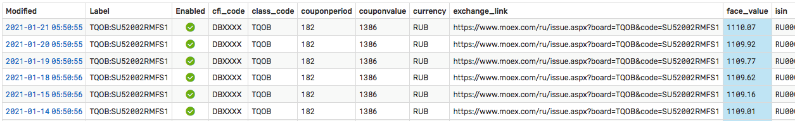

  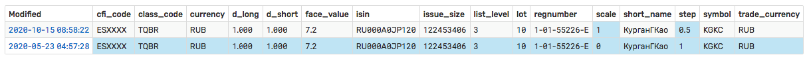

  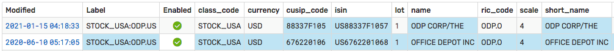

* Реализованный API endpoint позволяет осуществлять поиск последних изменений для создания отчетов

## Индексный Калькулятор

* Расчет индексов на основании исторических сделок и поступающих сделок в соответствии с методологией Московской Биржи, включая:

  - Подгрузка сделок исходя из истории ежеквартальных изменений компонентов и весов
  - Фильтр сделок по максимальному отклонению от скользящего VWAP
  - Фильтр сделок исходя из расписания сессии и аукционов, включая независимый расчет закрытия при отсутствии сделок во время аукциона закрытия

    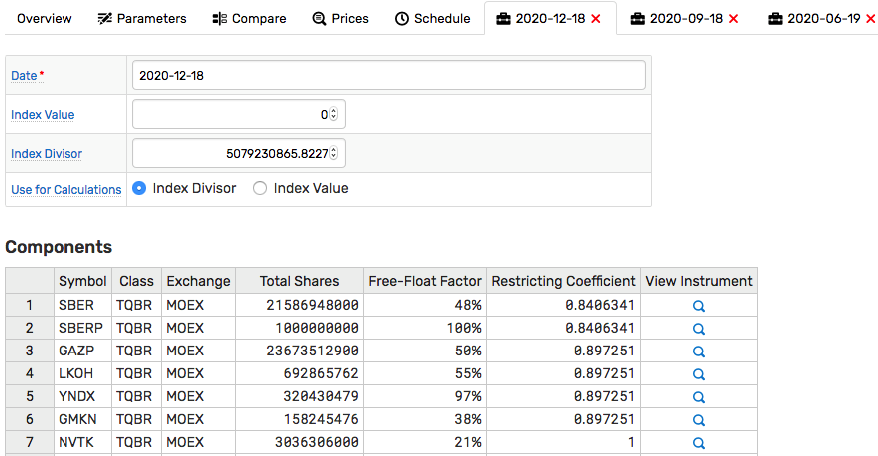

* Расчет индексов на основании поступающих сделок и статистик в соответствии с методологией Московской Биржи с дополнительными расширениями:
  - Расчет индекса на основании индикативных цен аукционов
  - Расчет индекса на подвыборке инструментов при задержке/отсутствии сделок по отдельным компонентам

    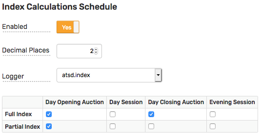

## Trade Viewer

* Удобный подбор инструментов из различных потоков с фильтрами по расписанию
* Выгрузка данных в CSV или переход в интерактивную SQL консоль

  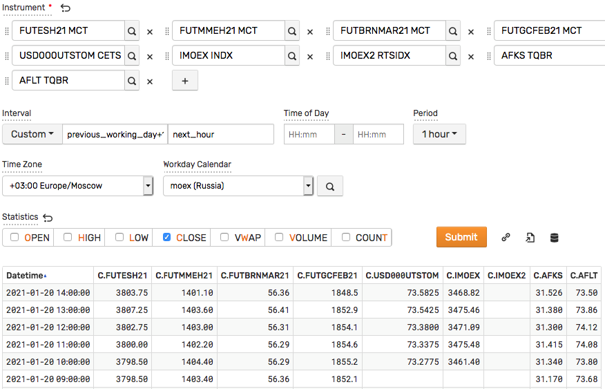

## REST API

* Экспорт [исходных сделок](./trades-export.md): CSV
* Экспорт [агрегированных сделок](./ohlcv-export.md) (OHLCV + VWAP): CSV
* Экспорт [статистик и котировок](./statistics-export.md): JSON
* Экспорт [итогов сессий](./session-summary-export.md): JSON
* Экспорт [изменений референтных данных](./version-export.md): JSON 

## Программные интеграции

* API клиенты на Java и Python

## Технология 

ATSD является нереляционной базой и поддерживается на операционной системе Linux в 64-ом режиме. В режиме кластера ATSD использует распределенную файловую систему Hadoop.

## Установка

### Установка FAST консьюмеров

```bash
curl -O https://www.axibase.com/public/moex-consumer.tar.gz
tar -xzf moex-consumer.tar.gz /opt/moex-consumer
/opt/moex-consumer/install.sh
```

Параметры `atsd.host`, `atsd.port.tcp`, `atsd.port.udp` позволяют указать ATSD, на которую будут отправлены команды. Данные параметры необходимы в случае распределенной инсталляции.

```bash
systemctl start moex-consumer-asts-fond
systemctl start moex-consumer-asts-fx
systemctl start moex-consumer-spectra
```

### Установка ATSD

```bash
curl -O https://www.axibase.com/public/atsd.moex.latest.tar.gz
tar -xzf atsd.moex.latest.tar.gz
./atsd/bin/atsd-tsd.sh start
```

## Лицензирование и поддержка

Подписка на ATSD позволяет использовать продукт бесплатно при установке ATSD и консьюмеров на одном хосте. Для эксплуатации кластера или при установке компонентов на несколько хостов необходимо приобретение технической поддержки.