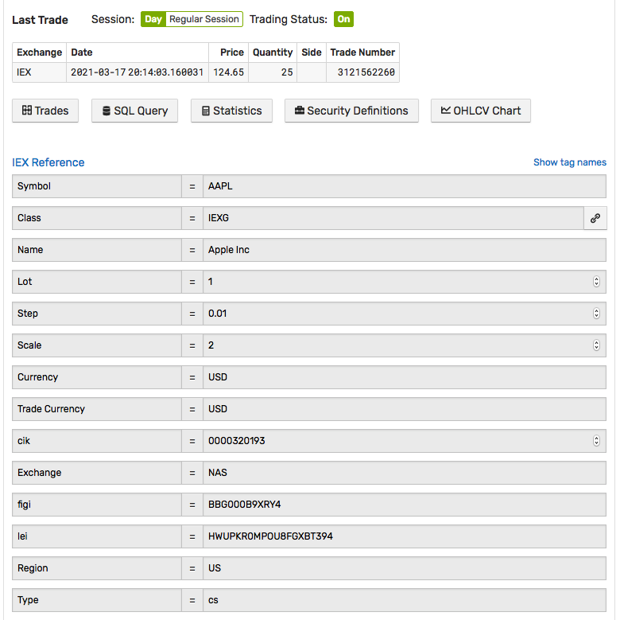

# Export Reference Data

The endpoint retrieves instrument reference data in JSON format using the [`entity: get`](../api/meta/entity/get.md) endpoint.

## Request

| **Method** | **Path** |
|:---|:---|
| `GET` | `/api/v1/entities/{entity}` |

## Response

### Payload

```json
{
  "name": "aapl_[iexg]",
  "enabled": true,
  "tags": {
    "class_code": "IEXG",
    "symbol": "AAPL",
    "name": "Apple Inc.",
    "lot": "100",
    "scale": "2",
    "step": "0.01",
    "currency": "USD",
    "trade_currency": "USD",
    "figi": "BBG000B9Y5X2",
    "industry": "Computer Hardware",
    "type": "cs",
    "lei": "HWUPKR0MPOU8FGXBT394",
    "sector": "Technology"
  },
  "createdDate": "2016-03-14T19:09:12.001Z",
  "versionDate": "2021-03-15T15:13:05.191Z"
}
```

* `class_code`
* `symbol`
* `name`
* `lot`
* `step`
* `scale`
* `currency`
* `trade_currency`

## SQL Alternative

```sql
SELECT *
  FROM atsd_entity
WHERE class = 'IEXG' AND symbol = 'AAPL'
```

## UI

