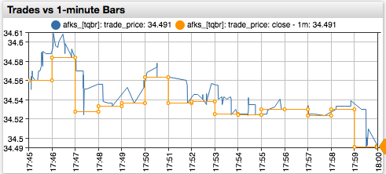
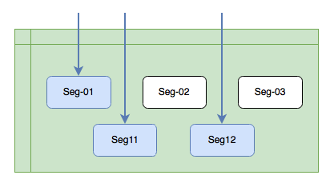

---
# /* yaspeller ignore:start */
home: true
heroText: Надежное и оптимальное хранение биржевых данных
tagline:
actionText: Установка в зоне колокации →
actionLink: ./install.md
features:
- title: Интеграция с Московской Биржей
  details: Запись сделок, заявок, котировок, и референтных данных во всех режимах
- title: Высокая скорость записи и чтения
  details: Параллельный <a href="#отличие-от-стандартных-баз-данных" style="color:orange">движок</a> обработки данных с различными критериями поиска.
- title: Продвинутый SQL и распределенные вычисления
  details: Расширенный <a href="sql.html" style="color:orange">SQL</a> синтаксис с оптимизированными вычислениями.
footer: Copyright © 2021 Axibase.
footerActionText: Установка
footerActionLink: ./install.md
# /* yaspeller ignore:end */
---
<!-- markdownlint-disable MD002 MD041 MD012 -->
<article class="feature-highlight">

## Какие задачи можно решить при помощи ATSD

<div class="feature-images">

 <!-- yaspeller ignore -->

</div>

- Повышение точности обратного тестирования стратегий проверкой на исходных данных вместо OHLCV агрегатов
- Разработка новых стратегий на преобразованных рядах, альтернативных агрегатах, и полноценных моделях книги заявок
- Расчет собственных индикаторов, отсутствующих в торговых платформах
- Контроль качества заявок и оптимизация торговых издержек
- Поиск аномалий, в том числе календарных и организационных, в рамках контроля рисков
- Проведение регуляторных исследований с элементами статистического анализа

</article>
<article class="feature-highlight">

## Интеграция с Московской Биржей

<div class="feature-images">

 <!-- yaspeller ignore -->

</div>

- Получение данных Фондового, Денежного, Валютного и Срочного рынков
- Запись сделок, заявок, котировок, статистик и справочников с исходной точностью
- Запись снэпшотов книги заявок в моменты открытия и окончания торговых и клиринговых сессий
- Запись снэпшотов при смене этапов аукционов
- Использование детальных календарей на основе торгового расписания биржи

</article>
<article class="feature-highlight">

## Высокоскоростная доставка данных

<div class="feature-images">

 <!-- yaspeller ignore -->

</div>

- Высокопроизводительные FAST консьюмеры, устанавливаемые в зоне колокации для сокращения задержки
- Получение данных по двум взаимозаменяемым потокам (A и B)
- Получение данных из инкрементальных (MSR, OLR, TLR, ISF) и снэпшотных (IDF, MSS, OLS, TLS) потоков
- Восстановление через снэпшоты и инкрементальные обновления для предотвращения пробелов

</article>
<article class="feature-highlight">

## Надежность и целостность информации

<div class="feature-images">


</div>

- Проверка целостности на основании логов по окончании торговых сессий
- Дополнительная проверка на основании полного лога заявок и сделок (тип А)
- Встроенные средства мониторинга задержки и прерываний с разбивкой по режимам и потокам

</article>
<article class="feature-highlight">

## Референтные данные

<div class="feature-images">

 <!-- yaspeller ignore -->

</div>

- Сохранение справочных параметров инструментов для последующего использования при анализе.
- Утилиты для подгрузки и проверки референтных данных из ISS и параметров риска из НКК
- Сохранение истории изменения референтных данных
- Динамическое обновление групп инструментов, включая белые/черные списки, исходя из актуальных параметров инструментов.
- Сервис Version Export для поиска изменений и создания отчетов.

</article>
<article class="feature-highlight">

## Движок SQL

<div class="feature-images">


</div>

- SQL движок со [специальным синтаксисом](../sql.md) для фильтрации данных по сессиям, аукционам, торговым календарям и принадлежности к индексам <!-- yaspeller ignore -->
- Интерактивная SQL консоль с автодополнением и синтаксисными подсказками
- Создание SQL отчетов по расписанию с доставкой по почте, публикацией на файловой системе или в интранет-портале
- Драйверы [JDBC](https://github.com/axibase/atsd-jdbc) и [ODBC](https://github.com/axibase/atsd-odbc)
- Финансовые функции с оптимальным вычислением на сервере: OHLCV, VWAP, Beta, COVAR, CORREL

</article>
<article class="feature-highlight">

## Индексный калькулятор

<div class="feature-images">

 <!-- yaspeller ignore -->

</div>

- Расчет индексов на основании исторических сделок в соответствии с методологией Московской Биржи, включая:

  - Подгрузка сделок исходя из истории ежеквартальных изменений компонентов и весов
  - Фильтр сделок по максимальному отклонению цены от скользящей средневзвешенной цены
  - Фильтр сделок исходя из расписания сессий и аукционов, включая расчет цены закрытия при отсутствии сделок во время аукциона закрытия

- Расчет индексов в режиме реального времени на основании поступающих сделок с дополнительными расширениями:

  - Расчет индекса на основании индикативных цен аукционов открытия и закрытия
  - Расчет индекса на подвыборке инструментов при задержке/отсутствии сделок по отдельным компонентам

- Сверка расчетов со значениями, транслируемыми биржей

</article>
<article class="feature-highlight">

## Экспорт данных

<div class="feature-images">

 <!-- yaspeller ignore -->

</div>

- Удобный подбор инструментов из различных режимов и источников данных
- Выгрузка данных в CSV или переход в интерактивную SQL консоль
- API клиенты с открытым кодом для [Python](https://github.com/axibase/atsd-api-python) и [Java](https://github.com/axibase/atsd-api-java)

</article>
<article class="feature-highlight">

## Дополнительные интеграции

<div class="feature-images">

 <!-- yaspeller ignore -->

</div>

- Получение данных от других торговых систем и распространителей консолидированной рыночной информации
- Запись эконометрической статистики и новостей, например из [US Fed FRED](https://fred.stlouisfed.org), WRDS

```sql
SELECT datetime, value AS "Net Lending"
  FROM "ad01rc1q027sbea"
GROUP BY period(1 year)
```

</article>
<article class="feature-highlight">

## Отличие от хранения данных в файлах

<div class="feature-images">

 <!-- yaspeller ignore -->

</div>

- Поиск по индексу значительно быстрее, чем последовательное чтение файлов
- Дополнительное ускорение благодаря кэшированию и параллельному чтению
- Отсутствие блокировок - чтение и запись происходят одновременно
- Мгновенная видимость сделки для чтения до записи в файл
- Возможность редактирования, удаления и добавления сделок без перезаписи
- Все преимущества SQL включая группировки, сортировки, и функции

</article>
<article class="feature-highlight">

## Отличие от стандартных баз данных

<div class="feature-images">

 <!-- yaspeller ignore -->

</div>

- В нереляционной СУБД ATSD устранены накладные расходы, присущие реляционной схеме
- При этом реализованы ключевые элементы SQL DML для гибкой фильтрации и обработки результатов
- Параллельное чтение из сегментированной таблицы позволяет достичь высокой производительности несмотря на большие массивы данных
- Сжатое хранение в оптимальной кодировке сокращает потребности в дисковом пространстве на 80%
- Реализованные функции подсчета агрегатов учитывают специфику данных

</article>