# Общая информация

**ATSD** является специализированной базой данных для структурированного хранения и анализа биржевой информации.

ATSD предлагает клиентам удобные средства экспорта, обработки и анализа данных для создания торговых стратегий, контроля рисков, аудита транзакционных издержек, а также надзорных исследований.

## Основные свойства

* Параллельный движок для быстрого чтения данных с различными критериями поиска
* Расширенный SQL синтаксис с оптимизированным вычислением OHLCV агрегатов и средневзвешенных цен
* Специализированные фильтры для поиска данных на основании параметров инструментов, торгового расписания и индексных компонентов

## Интеграция с Московской Биржей

ATSD оптимизирована для записи биржевой информации Московской Биржи по высокопроизводительному протоколу [FAST Multicast](https://www.moex.com/s441) в режиме реального времени с последующим долгосрочным хранением.

* Получение данных с Фондового, Денежного, Валютного и Срочного рынков
* Запись сделок, заявок, котировок, статистик и референтных данных по всем режимам торгов
* Сохранение сделок с исходной точностью времени, ценовых показателей и признаков
* Запись итогов сессий и аукционов, итогов дня в отдельные таблицы для быстрого доступа
* Учет детального расписания торгов на основе календаря биржи, включая расписание этапов аукционов открытия и закрытия

  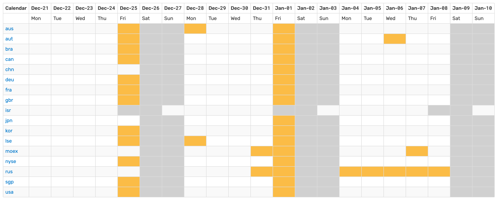

  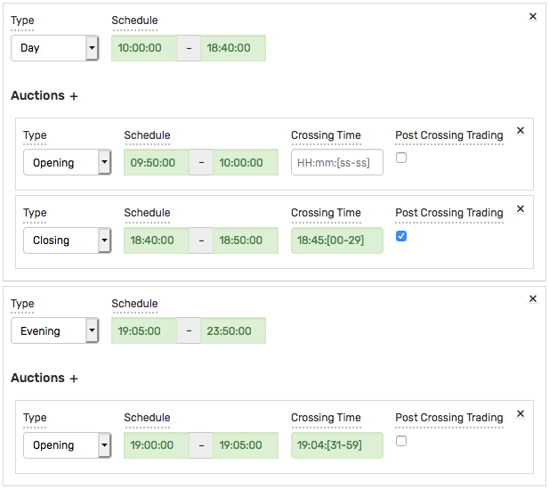

* Высокопроизводительные [консьюмеры](#консьюмеры) для FAST
* Утилиты для подгрузки и проверки референтных данных из ISS
* С 2020 года ATSD является сертифицированной [брокерской системой](https://www.moex.com/a1198) для подключения к ТКС ASTS.

## SQL

* SQL движок с [расширенным синтаксисом](../sql.md) для фильтрации данных по сессиям, аукционам, торговым календарям и принадлежности к индексам

  ```sql
  SELECT datetime, symbol, close(), vwap()
    FROM atsd_trade
  WHERE IS_INSTRUMENT_IN_INDEX('moexbc')
    AND in_session(DAY, OPENING)
    AND datetime BETWEEN '2021-01-01' AND '2021-01-15' EXCL
  GROUP BY exchange, class, symbol, PERIOD(1 DAY)
  ```

* Интерактивная SQL консоль с автодополнением и синтаксисными подсказками

  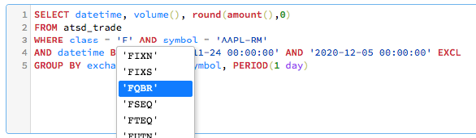

* Создание SQL отчетов по расписанию с распространением на email, файловую систему или HTML страницу

  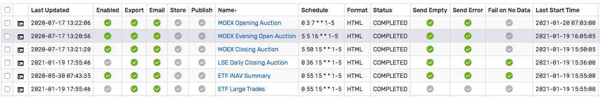

* Драйверы [JDBC](https://github.com/axibase/atsd-jdbc), [ODBC](https://github.com/axibase/atsd-odbc), ODBC-QUIK
* Финансовые функции с оптимальным вычислением на сервере: OHLCV, VWAP, Beta, COVAR, CORREL

Примеры использования SQL для анализа микроструктуры рынка:

* [Особенности расчета `waprice`](./notes/moex_waprice.md) на Московской бирже

## Референтные данные

* В дополнение к торговым данным осуществляется хранение всех параметров инструментов для последующего использования при анализе.
* Версионированное хранение референтных данных позволяет сохранять историю изменений параметров, таких как лот, шаг цены, уровень листнига, размер и дата выплаты купона, количество выпущенных бумаг и прочее.
* Доступ к истории параметров позволяет производить корректные вычисления объемов сделок и доходностей, а также автоматически обновлять черные/белые списки инструментов.

  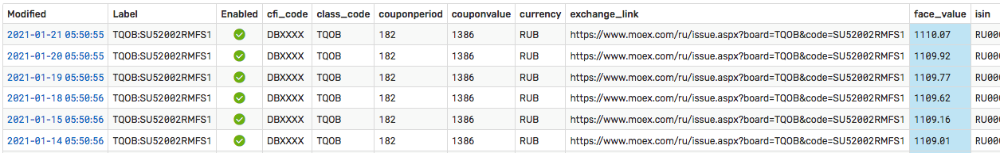

  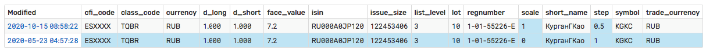

  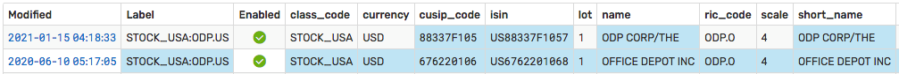

* Реализованный сервис Version Export предназначен для поиска последних изменений при создании отчетов.

## Индексный калькулятор

* Расчет индексов на основании исторических сделок и поступающих сделок в соответствии с методологией Московской Биржи, включая:

  * Подгрузка сделок исходя из истории ежеквартальных изменений компонентов и весов
  * Фильтр сделок по максимальному отклонению цены от скользящей средневзвешенной цены
  * Фильтр сделок исходя из расписания сессий и аукционов, включая независимый расчет цены закрытия при отсутствии сделок во время аукциона закрытия

    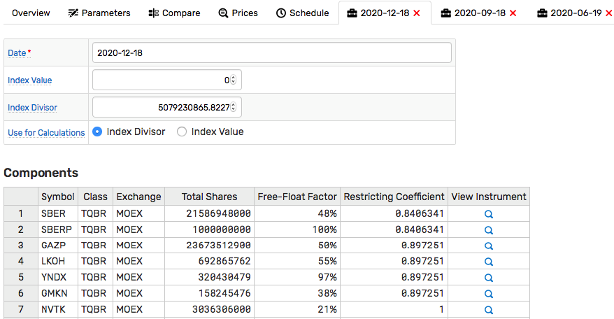

* Сверка вычисленных значений с биржевыми значениями, что позволило в 2020 году обнаружить пробелы данных и отклонения, в последствии исправленные со стороны биржи
* Расчет индексов в режиме реального времени на основании поступающих сделок и статистик в соответствии с методологией Московской Биржи с дополнительными расширениями:
  * Расчет индекса на основании индикативных цен аукционов открытия и закрытия
  * Расчет индекса на подвыборке инструментов при задержке/отсутствии сделок по отдельным компонентам

    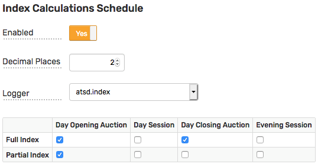

## Trade Viewer

* Удобный подбор инструментов из различных потоков с фильтрами по расписанию
* Выгрузка данных в CSV или переход в интерактивную SQL консоль

  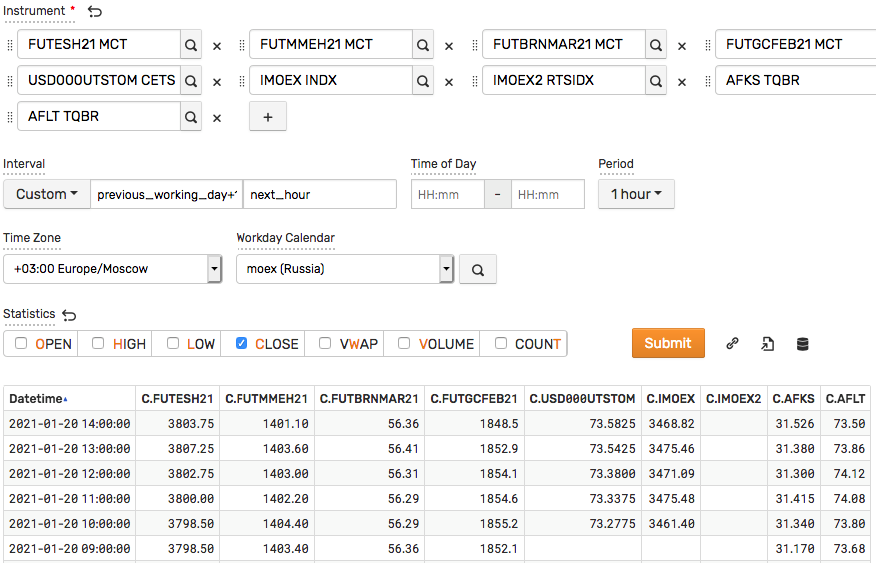

## Дополнительные интеграции

Реализованные в ATSD программные интерфейсы и гибкая схема хранения позволяют настроить получение данных от других торговых систем и распространителей консолидированных данных, например LSE IOB, NYSE/NASDAQ, Санкт-Петербургская биржа, Bloomberg B-PIPE, Refinitiv, QUIK, Transaq.

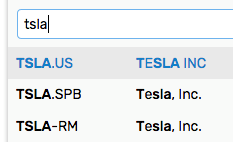

## Альтернативные данные

Встроенная схема позволяет отдельно сохранять числовые ряды с сопутствующими признаками (тэгами) для фактороного анализа на основании макроэкономических показателей или корпоративной и финансовой информации эмитентов. В качестве источника могут выступать внутренние датасеты или данные открытого типа, например [FRED](https://fred.stlouisfed.org) или WRDS.

```sql
SELECT date_format(time, 'yyyy') "Year", SUM(value/4) "Net Lending/Borrowing"
  FROM "ad01rc1q027sbea"
GROUP BY period(1 year)
  ORDER BY datetime DESC
```

## Программные интерфейсы

* Приведенные в разделах Reading / Writing Data сервисы предназначены для программной интеграции, например:
  * Экспорт [исходных сделок](../trades-export.md): CSV
  * Экспорт [агрегированных сделок](../ohlcv-export.md) (OHLCV, VWAP): CSV
  * Экспорт [итогов сессий](../session-summary-export.md): CSV
  * Экспорт [статистик и котировок](../statistics-export.md): JSON
  * Экспорт [изменений референтных данных](../version-export.md): JSON

* Реализованы API клиенты с открытым исходным кодом на [Python](https://github.com/axibase/atsd-api-python) и [Java](https://github.com/axibase/atsd-api-java)

## Технология

ATSD является нереляционной базой и поддерживается на операционной системе Linux в 64-битном режиме. В режиме кластера ATSD использует распределенную файловую систему Hadoop.

## Консьюмеры

MOEX консьюмеры устанавливаются отдельно в зоне колокации биржи и предназначены для получения биржевых данных по протоколу FAST с последующей записью в АТСД с минимальной задержкой

* Получение данных по двум инкрементальным потокам
* Получение данных из инкрементальных (MSR, OLR, TLR, ISF) и снэпшотных (IDF, MSS, OLS, TLS) потоков
* Восстановление через снэпшоты или инкрементальные обновления для предотвращения пробелов
* Верификация доставки и восстановление пробелов по окончании сессии или торгового дня

  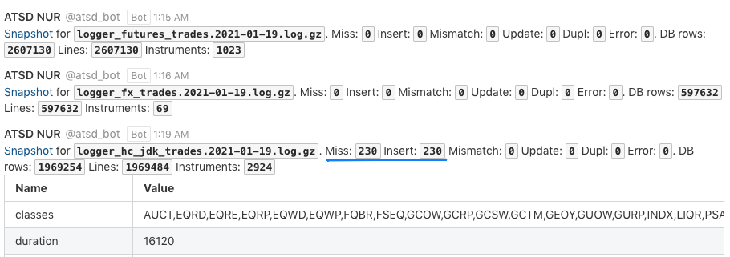

* Повторная верификация доставки с использованием Full Order Log (тип А)

  ```txt
  File: ordlogeq19.01.2021.exp.gz : 324701603 Instruments: 374
  Comparing TRUR lot: 1 database trades: 211817 file trades: 211817
  19.01.2021|1|AGRO|B|100000000000|1|1|850|77||| : 0
  ...
  Missing: 0 Mismatched: 0
  ```

* Встроенные средства мониторинга задержки с разбивкой по классам и потокам

  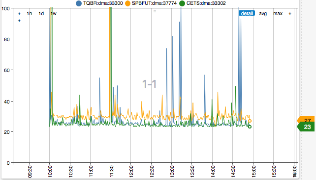

## Установка

### Установка MOEX консьюмеров

```bash
curl -O https://www.axibase.com/public/moex-consumer.tar.gz
tar -xzf moex-consumer.tar.gz /opt/moex-consumer
/opt/moex-consumer/install.sh
```

Параметры `atsd.host`, `atsd.port.tcp`, `atsd.port.udp` позволяют указать ATSD, на которую будут отправлены команды. Данные параметры необходимы в случае распределенной инсталляции.

```bash
systemctl start moex-consumer-asts-fond
systemctl start moex-consumer-asts-fx
systemctl start moex-consumer-spectra
```

### Установка ATSD

```bash
curl -O https://www.axibase.com/public/atsd.moex.latest.tar.gz
tar -xzf atsd.moex.latest.tar.gz
./atsd/bin/atsd-tsd.sh start
```

## Лицензирование и поддержка

Подписка на ATSD позволяет использовать продукт бесплатно при установке ATSD и консьюмеров на одном хосте. Для эксплуатации кластера или при установке компонентов на несколько хостов необходимо приобретение технической поддержки.