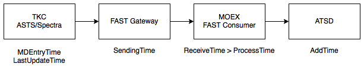
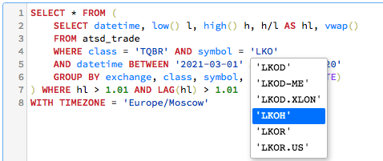
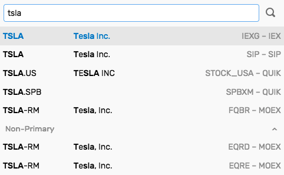

---
# /* yaspeller ignore:start */
landing: true
title: Надежное и оптимальное хранение биржевых данных
description: Надежное и оптимальное хранение биржевых данных
heroText: Надежное и оптимальное хранение биржевых данных
tagline:
actionText: Установка в DMA/co-location →
actionLink: ./install.md
features:
- title: Интеграция с <a href="#интеграция-с-московской-биржей" style="color:orange">Московской Биржей</a>
  details: Запись сделок, заявок, котировок, и референтных данных во всех режимах
- title: Высокая скорость записи и чтения
  details: <a href="#отличие-от-стандартных-баз-данных" style="color:orange">Параллельная обработка</a> запросов с кэшированием и поиском по индексу.
- title: Продвинутый SQL и распределенные вычисления
  details: Расширенный <a href="sql.html" style="color:orange">SQL</a> синтаксис с оптимизированными вычислениями.
footer: Copyright © 2021 Axibase
resetStripes: true # If last feature stripe in content is white (even number of highlighted features), set it to true
contactUs:
  title: Запросить демо-доступ
  linkTitle: Демо-доступ
  content: Trial request for financial version
  submitText: Отправить
  firstNameText: Имя
  lastNameText: Фамилия
  emailText: Email
  companyText: Организация
  # messageText: Message
  errorText: Ошибка при отправке запроса
  successText: Запрос отправлен
    
# /* yaspeller ignore:end */
---
<!-- markdownlint-disable MD002 MD041 MD012 -->
<article class="feature-highlight">

<div class="feature-images">

 <!-- yaspeller ignore -->

</div>
<div class="feature-content">

## Какие задачи можно решить при помощи ATSD

- Повышение точности обратного тестирования стратегий за счет проверки на высокочастотных данных
- Разработка новых стратегий на преобразованных рядах и альтернативных агрегатах
- Расчет собственных индикаторов, отсутствующих в торговых платформах
- Контроль качества заявок и оптимизация торговых издержек
- Поиск аномалий, в том числе календарных и организационных, в рамках контроля рисков
- Проведение регуляторных исследований с элементами статистического анализа

</div>
</article>
<article class="feature-highlight">

<div class="feature-images">

 <!-- yaspeller ignore -->

</div>
<div class="feature-content">

## Интеграция с Московской Биржей

- Получение данных Фондового, Денежного, Валютного и Срочного рынков
- Запись сделок, заявок, котировок, статистик и справочников с исходной точностью
- Запись снэпшотов книги заявок в моменты открытия и окончания сессий
- Запись снэпшотов при смене этапов аукционов
- Использование детальных календарей на основе торгового расписания режимов

</div>
</article>
<article class="feature-highlight">

<div class="feature-images">

 <!-- yaspeller ignore -->

</div>
<div class="feature-content">

## Высокоскоростная доставка данных

- Высокопроизводительные FAST консьюмеры, устанавливаемые в зоне колокации
- Прямой доступ (DMA) к биржевым системам распространения данных
- Получение данных по двум взаимозаменяемым потокам (A и B)
- Восстановление пробелов из инкрементальных (MSR, OLR, TLR, ISF) и снэпшотных (IDF, MSS, OLS, TLS) потоков

</div>
</article>
<article class="feature-highlight">

<div class="feature-images">


</div>
<div class="feature-content">

## Надежность и целостность информации

- Проверка целостности на основании логов консьюмеров по окончании торговых сессий
- Дополнительная проверка на основании полного лога заявок и сделок (тип А)
- Встроенные средства мониторинга задержки и прерываний с разбивкой по режимам и потокам

</div>
</article>
<article class="feature-highlight">

<div class="feature-images">

 <!-- yaspeller ignore -->
 <!-- yaspeller ignore -->

</div>
<div class="feature-content">

## Референтные данные

- Сохранение справочных параметров инструментов для последующего использования при анализе.
- Утилиты для подгрузки и проверки референтных данных из ISS и параметров риска из НКК
- Сохранение истории изменения референтных данных
- Динамическое обновление групп инструментов, включая черные/белые списки, исходя из актуальных параметров инструментов.
- Сервис Version Export для поиска изменений и создания отчетов.

</div>
</article>
<article class="feature-highlight">

<div class="feature-images">

 <!-- yaspeller ignore -->

</div>
<div class="feature-content">

## Движок SQL

- SQL движок со [расширенным синтаксисом](../sql.md) для фильтрации данных по сессиям, аукционам, торговым календарям и принадлежности к индексам <!-- yaspeller ignore -->
- Интерактивная SQL консоль с авто-дополнением и синтаксисными подсказками
- Создание SQL отчетов по расписанию с доставкой по почте, публикацией на файловой системе или в интранет-портале
- Драйверы [JDBC](https://github.com/axibase/atsd-jdbc) и [ODBC](https://github.com/axibase/atsd-odbc)
- Финансовые функции с оптимальным вычислением на сервере: OHLCV, VWAP, Beta, COVAR, CORREL

</div>
</article>
<article class="feature-highlight">

<div class="feature-images">

 <!-- yaspeller ignore -->

</div>
<div class="feature-content">

## Индексный калькулятор

- Расчет индексов на основании исторических сделок в соответствии с методологией Московской Биржи, включая:

  - Подгрузка инструментов исходя из истории баз расчета
  - Фильтр сделок по отклонению цены от скользящей VWAP цены
  - Фильтр сделок исходя из расписания сессий и аукционов
  - Сверка расчетов со значениями, транслируемыми биржей

- Расчет индексов в режиме реального времени на основании поступающих сделок:

  - Расчет индекса на основании индикативных цен аукционов
  - Расчет индекса на подвыборке инструментов при задержке/отсутствии сделок

</div>
</article>
<article class="feature-highlight">

<div class="feature-images">

 <!-- yaspeller ignore -->

</div>
<div class="feature-content">

## Экспорт данных

- Удобный подбор инструментов из различных режимов и источников данных
- Выгрузка данных в CSV или переход в интерактивную SQL консоль
- API клиенты с открытым кодом для [Python](https://github.com/axibase/atsd-api-python) и [Java](https://github.com/axibase/atsd-api-java)

</div>
</article>
<article class="feature-highlight">

<div class="feature-images">

 <!-- yaspeller ignore -->

</div>
<div class="feature-content">

## Дополнительные интеграции

- Получение данных от других торговых систем и распространителей консолидированной рыночной информации
- Запись эконометрической статистики и новостей, например из [US Fed FRED](https://fred.stlouisfed.org), WRDS

```sql
SELECT datetime, value AS "Net Lending"
  FROM "ad01rc1q027sbea"
GROUP BY period(1 year)
```

</div>
</article>
<article class="feature-highlight">

<div class="feature-images">

 <!-- yaspeller ignore -->

</div>
<div class="feature-content">

## Отличие от хранения данных в файлах

- Поиск по индексу значительно быстрее, чем последовательное чтение файлов
- Дополнительное ускорение благодаря кэшированию и параллельному чтению
- Отсутствие блокировок - чтение и запись происходят одновременно
- Мгновенная видимость сделки для чтения до записи в файл
- Возможность редактирования, удаления и добавления сделок без перезаписи
- Все преимущества SQL включая группировки, сортировки, и функции

</div>
</article>
<article class="feature-highlight">

<div class="feature-images">

 <!-- yaspeller ignore -->

</div>
<div class="feature-content">

## Отличие от реляционных баз данных

- Устранены накладные расходы, присущие реляционной схеме хранения
- Отдельные блоки SQL DML усовершенствованы для обработки временных рядов
- Параллельное чтение из сегментированной таблицы позволяет достичь высокой производительности несмотря на большие массивы данных
- Сжатое хранение в оптимальной кодировке сокращает потребности в дисковом пространстве на 80%
- Реализованные функции подсчета агрегатов учитывают специфику данных

</div>
</article>
<article class="feature-highlight">

<div class="feature-images">

 <!-- yaspeller ignore -->

</div>
<div class="feature-content">

## Data Ops

- Встроенные средства мониторинга
- ETL коллектор для подгрузки и обработки файлов по FTP/SCP/HTTP
- Движок правил и проверки по расписанию перед началом торгов
- Уведомления в мессенджеры, webhooks и на почту

</div>
</article>