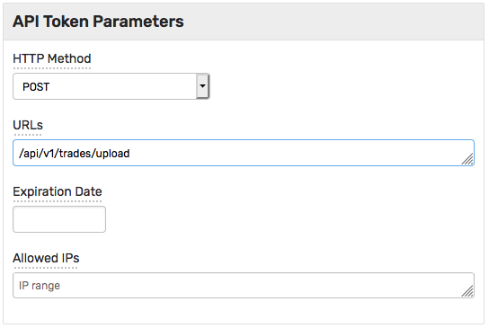

# Установка

## Установка ATSD

Установите ATSD согласно [инструкции](install.md), но **без установки** MOEX FAST консьюмеров.

## Создайте директорию

Создайте рабочую директорию для скриптов и архивов, далее `EXPORT_DIR`.

Скопируйте в `EXPORT_DIR` скрипт Lua, а также скрипты Powershell для архивации файлов и отправки архивов в базу данных.

* [`export_alltrades.lua`](https://raw.githubusercontent.com/axibase/atsd/master/finance/ru/export_alltrades.lua)
* [`psf.ps1`](https://raw.githubusercontent.com/axibase/atsd/master/finance/ru/psf.ps1)
* [`zipf.ps1`](https://raw.githubusercontent.com/axibase/atsd/master/finance/ru/zipf.ps1)

## Настройте Lua скрипт

Укажите корректное значение для переменной `EXPORT_DIR`. Проверьте, что Powershell 7 расположен в `C:\Program Files\PowerShell\7\pwsh.exe`

Временно отключите проверку времени.

```lua
if true or utc_date.hour >= 21 then
```

Временно отключите отправку архива в базу данных.

```lua
if false and (cres == true or eq(cres, 0)) and zip_size > 10000 then
```

## Запустите Lua скрипт

Добавьте `export_alltrades.lua` в загруженные скрипты в терминале Quik.

Запустите скрипт и убедитесь что в целевой директории `EXPORT_DIR` появился `zip` архив.

## Получение API токена

Для отправки архива скрипту `psf.ps1` потребуются права.

Зайдите в интерфейс ATSD по ссылке `https://atsd_hostname:8443` и на странице **Admin > API Tokens** создайте токен для POST метода с URL `/api/v1/trades/upload`.



В Powershell скрипте `psf.ps1` укажите значение токена вместо `<API_TOKEN>`.

```powershell
$Headers = @{Authorization = "Bearer <API_TOKEN>"}
```

## Повторная проверка

Удалите csv,zip,log файлы из директории `EXPORT_DIR`.

Включите обратно отправку архива в скрипте `export_alltrades.lua`.

```lua
if (cres == true or eq(cres, 0)) and zip_size > 10000 then
```

Запустите скрипт и проверьте директорию `EXPORT_DIR`. В директории должен остаться zip архив `all_trades_{date}.zip` и `upload_{date}.log` файлы, в последнем будет приведен номер задачи, полученный от ATSD, например:

```
file                           size   jobId
----                           ----   -----
all_trades_20210318.zip   392104756   f4574887-b549-40de-93c4-5ccb1e6ed23b
```

## Проверка данных

Зайдите в интерфейс АТСД и проверьте наличие данных.

Включите проверку времени и перезапустите скрипт `export_alltrades.lua`.

```lua
if true or utc_date.hour >= 21 then
```

:::tip Поздравляем!
Настройка успешно завершена.
:::

