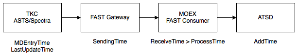
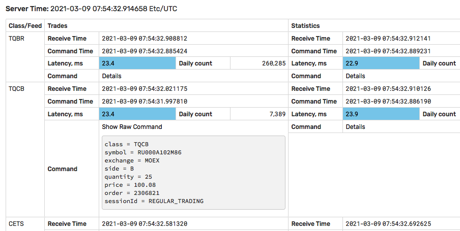
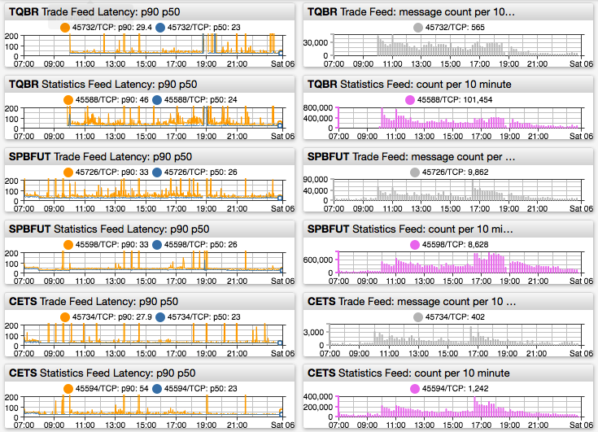
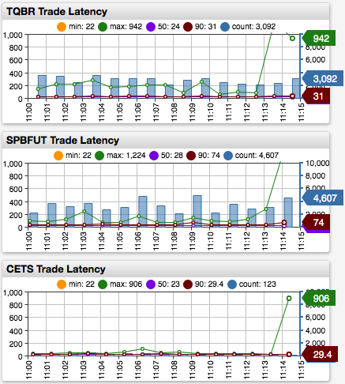
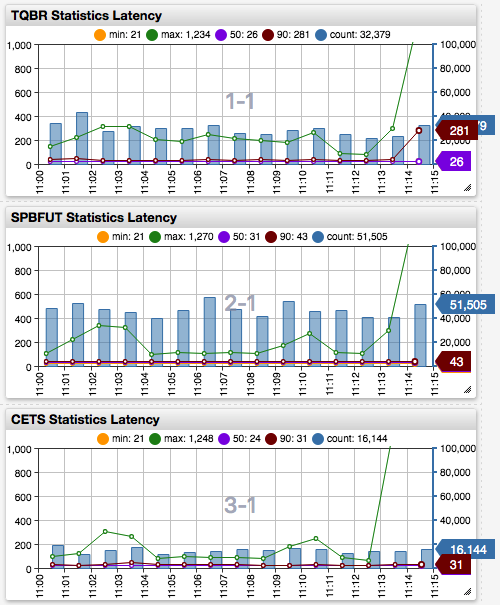
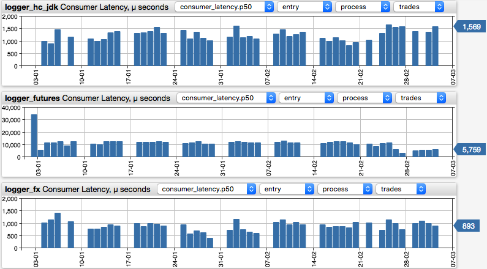
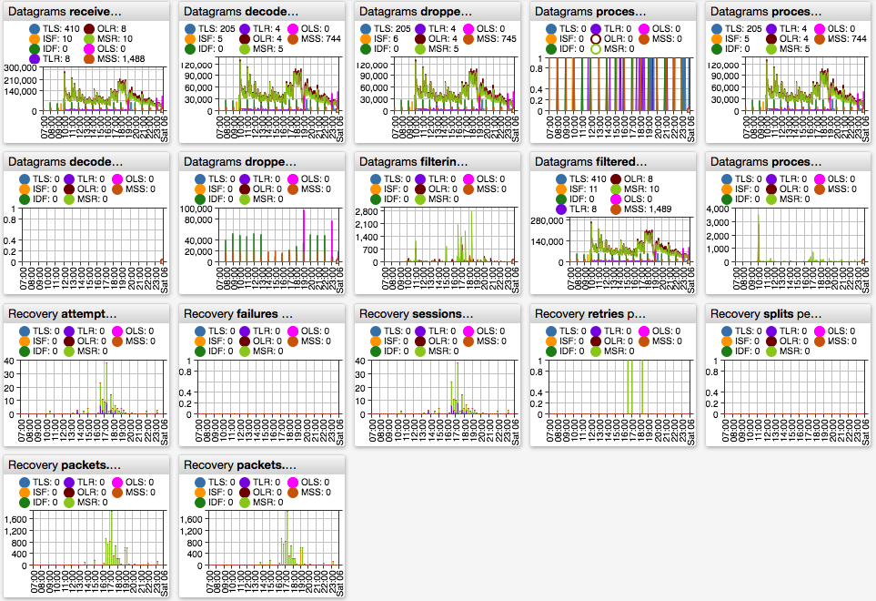
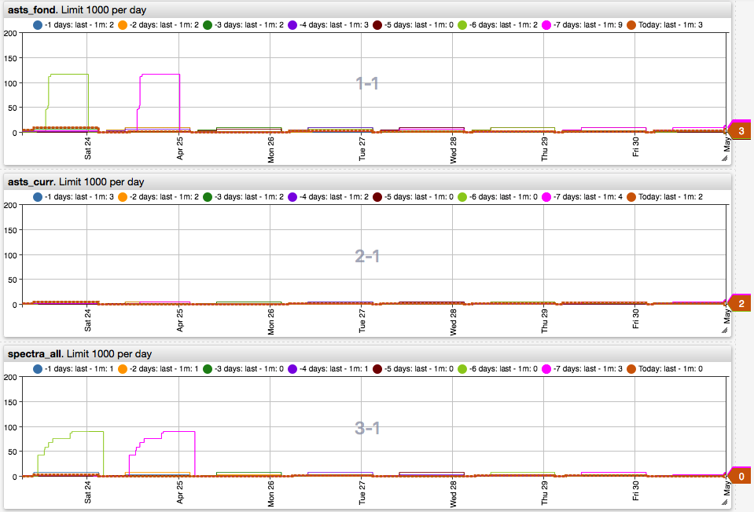

# Мониторинг задержек



ATSD предоставляет набор метрик, правил реагирования, и утилит, позволяющих наблюдать за задержками в поступлении рыночных данных, а также проводить исследования скорости данных в зависимости от нагрузки и типов сообщений для оптимизации торговых стратегий.

Состояние и задержки в режиме реального времени **Admin > Diagnostics > MOEX Consumer Monitoring**.

  

Встроенный портал **Latency: Key Classes**.



Абсолютный уровень задержки в значительной степени определяется выбором расположения АТСД - в зоне колокации или в удаленном ЦОДе. В примерах ниже АТСД расположена в ЦОДе на расстоянии приблизительно 22 миллисекунды от зоны колокации, где установлены консьюмеры.

## Мониторинг задержек обезличенных сделок в ATSD

Получаемые консьюмерами сообщения об обезличенных сделках в потоках TLR/FO-TRADES отправляются в ATSD. Задержка в поступлении сообщений вычисляется ATSD ежеминутно по каждому режиму торгов (классу) отдельно на основании всех сделок, поступивших в течение данного интервала времени. Задержка сделки равна разнице между временем сервера ATSD `AddTime` и временем ТКС биржи (поле `MDEntryTime` FAST) с округлением до миллисекунды.

Вычисляемые метрики:

* `trade_latency_count` - Количество сделок в интервале
* `trade_latency_min` - Минимальная задержка
* `trade_latency_max` - Максимальная задержка
* `trade_latency_avg` - Среднеарифметическая задержка
* `trade_latency_percentile_50` - 50% перцентиль задержки (также 75, 90, 95, 99)

В примере ниже в интервале с `11:00:33.535` до `11:01:33.560` (чуть больше минуты) было получено 3501 сделок с максимальной задержкой в 148 миллисекунд и медианой в 24 миллисекунды.

```json
| time_msk     | count | min | p50 | p90 | max |
|--------------|------:|----:|----:|----:|----:|
| 11:00:33.535 |  3577 |  22 |  24 |  30 | 148 |
| 11:01:33.560 |  3501 |  22 |  24 |  30 | 224 |
| 11:02:33.593 |  2485 |  22 |  23 |  28 | 224 |
```

<details style="margin-left:20px"><summary>Посмотреть SQL запрос</summary>

```sql
SELECT date_format(time, 'HH:mm:ss.SSS') AS time_msk,
  tcount.value AS "count", tmin.value AS "min", tp50.value AS "p50", tp90.value AS "p90", tmax.value AS "max"
  FROM trade_latency_count tcount
  JOIN trade_latency_min tmin
  JOIN trade_latency_percentile_50 tp50
  JOIN trade_latency_percentile_90 tp90
  JOIN trade_latency_max tmax
WHERE tcount.tags.class = 'TQBR'
  --AND datetime >= current_working_day
  AND datetime BETWEEN '2021-03-02 11:00:00' AND '2021-03-02 12:00:00'
ORDER BY datetime
  LIMIT 10
```

</details>



[Пример портала на ChartLab](https://apps.axibase.com/chartlab/e7fd2e3e/2)

## Мониторинг задержек рыночных статистик в ATSD

Получаемые консьюмерами сообщения статистик, такие как лучшая покупка или продажа, отправляются в ATSD. Задержка в поступлении сообщений вычисляется ATSD ежеминутно по каждому режиму торгов отдельно на основании всех сообщений, поступивших в течение данного интервала времени. Задержка сообщения равна разнице между временем сервера ATSD `AddTime` и временем ТКС биржи (как правило поле `LastUpdateTime` в FAST) с округлением до миллисекунды.

Вычисляемые метрики:

* `instrument_statistic_count` - Количество сообщений в интервале
* `instrument_statistic_min` - Минимальная задержка
* `instrument_statistic_max` - Максимальная задержка
* `instrument_statistic_avg` - Среднеарифметическая задержка
* `instrument_statistic_percentile_50` - 50% перцентиль задержки (также 75, 90, 95, 99)

В примере ниже в интервале с `11:00:26.731` до `11:01:26.731` (1 минута) было получено 43042 сообщений с максимальной задержкой в 225 миллисекунд и медианой в 26 миллисекунд.

```json
| time_msk     | count | min | p50 | p90 | max |
|--------------|------:|----:|----:|----:|----:|
| 11:00:26.731 | 34533 |  21 |  24 |  39 | 148 |
| 11:01:26.731 | 43042 |  21 |  26 |  48 | 225 |
| 11:02:26.731 | 27783 |  21 |  24 |  36 | 317 |
```

<details style="margin-left:20px"><summary>Посмотреть SQL запрос</summary>

```sql
SELECT date_format(time, 'HH:mm:ss.SSS') AS time_msk,
  tcount.value AS "count", tmin.value AS "min", tp50.value AS "p50", tp90.value AS "p90", tmax.value AS "max"
  FROM instrument_statistic_latency_count tcount
  JOIN instrument_statistic_latency_min tmin
  JOIN instrument_statistic_latency_percentile_50 tp50
  JOIN instrument_statistic_latency_percentile_90 tp90
  JOIN instrument_statistic_latency_max tmax
WHERE tcount.tags.class = 'TQBR'
  --AND datetime >= current_working_day
  AND datetime BETWEEN '2021-03-02 11:00:00' AND '2021-03-02 12:00:00'
ORDER BY datetime
  LIMIT 10
```

</details>



[Пример портала на ChartLab](https://apps.axibase.com/chartlab/e7fd2e3e/3/)

## Метрики задержки консьюмера

Поэтапное время обработки сообщений консьюмером вычисляется утилитой [`ConsumerLatencyParser`](./latency_parser.md) ежедневно на основании архивов логов консьюмера, которые содержат временные метки поступления сообщения на каждом этапе:

* `entry` - Время регистрации транзакции ТКС биржи (`lastupdate` для отдельных потоков без `MDEntryTime`).
* `sending` - Время отправки сообщения шлюзом рыночных данных
* `receive` - Время получения сообщения консьюмером
* `process` - Время окончания обработки сообщения консьюмером, включая парсинг и логирование.

Расчет производится отдельно по каждому типу файлов:

* `trades.*.log.gz`
* `statistics.*.log.gz`
* `orders.*.log.gz`
* `index.*.log.gz` (для Spectra)

Дополнительно детализируется время обработки по уникальным комбинациям значений полей `MDEntryType` и `MDUpdateAction` FAST.

В качестве начального времени (`from`) принимается время одного из этапов, например `entry`. В качестве конечного времени - время одного из последующих этапов.

| `from` | `to` | Описание интервала
|---|---|---|
| `entry` | `sending` | Время с момента регистрации сообщения в ТКС до отправки шлюзом FAST (задержка биржи)
| `sending` | `receive` | Время с момента отправки сообщения шлюзом FAST до получения консьюмером (задержка сети)
| `receive` | `process` | Время с момента получения сообщения консьюмером и окончания обработки (задержка консьюмера)
| `entry` | `process` | Время с момента регистрации сообщения в ТКС до окончания обработки консьюмером (совокупная задержка)

> Дополнительно рассчитывается `lastupdate -> sending` и `lastupdate -> process` для потоков без `MDEntryTime`

Единица измерения - **микро**секунды.

* `consumer_latency.count` - Количество сообщений данного типа в течение дня
* `consumer_latency.max` - Максимальная задержка в течение дня
* `consumer_latency.min` - Минимальная задержка в течение дня
* `consumer_latency.p50` - 50% перцентиль задержки в течение дня (также 0.1, 1, 5, 10, 25, 75, 90, 95, 99, 99.9)

Пример расчета (время в UTC):

```json
| MsgSeqNum |        ReceiveTime |        ProcessTime |        SendingTime | MDUpdateAction | MDEntryType |  MDEntryID | Symbol |        MDEntryTime |
|----------:|-------------------:|-------------------:|-------------------:|---------------:|-------------|-----------:|--------|-------------------:|
|     29953 | 210305070243014585 | 210305070243015769 | 210305070243014443 |              0 | z           | 3687232746 | GAZP   | 210305070243013931 |
|     29954 | 210305070243014875 | 210305070243015810 | 210305070243014793 |              0 | z           | 3687232747 | GAZP   | 210305070243013957 |
```

| Колонка | Этап | Время | Разница, мкс |
|---|---|---|---|
| `MDEntryTime` | `entry`   | `2021-03-05 07:02:43.013957` | `-` |
| `SendingTime` | `sending` | `2021-03-05 07:02:43.014793` | `836` |
| `ReceiveTime` | `receive` | `2021-03-05 07:02:43.014875` | `82` |
| `ProcessTime` | `process` | `2021-03-05 07:02:43.015810` | `935` |

Результаты обработки архивов `ConsumerLatencyParser` отправляются в ATSD и доступны для мониторинга с помощью правил реагирования и просмотра на портале **Consumer Log Latency by Stage**. Портал позволяет выбрать метрику, этапы и тип данных для каждого консьюмера.



```json
| dt         | directory     | file   | from  | to      |   count | median |  p90 |  p95 |   p99 | p99.9 |      max |
|------------|---------------|--------|-------|---------|--------:|-------:|-----:|-----:|------:|------:|---------:|
| 15-02-2021 | logger_hc_jdk | trades | entry | sending | 1897651 |    348 |  854 | 1562 |  5899 | 27914 | 12534612 |
| 16-02-2021 | logger_hc_jdk | trades | entry | sending | 1820326 |    360 |  923 | 1726 |  7532 | 32661 |   361499 |
| 17-02-2021 | logger_hc_jdk | trades | entry | sending | 2051517 |    369 | 1099 | 2211 | 11732 | 45858 | 12774733 |
```

<details style="margin-left:20px"><summary>Посмотреть SQL запрос</summary>

```sql
SELECT date_format(tcount.time, 'dd-MM-yyyy') AS dt,
  tcount.tags."directory" AS "directory", tcount.tags."file" AS "file",
  tcount.tags."from" AS "from", tcount.tags."to" AS "to",
  tcount.value AS "count", tp50.value AS "median",
  tp90.value AS "p90", tp95.value AS "p95", tp99.value AS "p99",
  tp999.value AS "p99.9", tmax.value AS "max"
FROM "consumer_latency.count" AS tcount
  JOIN "consumer_latency.p50" AS tp50
  JOIN "consumer_latency.p90" AS tp90
  JOIN "consumer_latency.p95" AS tp95
  JOIN "consumer_latency.p99" AS tp99
  JOIN "consumer_latency.p99.9" AS tp999
  JOIN "consumer_latency.max" AS tmax
WHERE tcount.datetime BETWEEN '2021-02-15' AND '2021-02-20' EXCL
  AND tcount.tags.directory = 'logger_hc_jdk' AND tcount.tags.file = 'trades'
  AND (tcount.tags."from" = 'entry' AND tcount.tags."to" = 'sending')
  AND tcount.tags.action IS NULL AND tcount.tags.type IS NULL
ORDER BY tcount.datetime,
CASE concat(tcount.tags."from", tcount.tags."to")
  WHEN 'entrysending' THEN 0 WHEN 'lastupdatesending' THEN 1
  WHEN 'sendingreceive' THEN 2 WHEN 'receiveprocess' THEN 3
  WHEN 'entryprocess' THEN 4 WHEN 'lastupdateprocess' THEN 5
  ELSE 10 END, tcount.tags.action, tcount.tags.type
```

</details>

Просмотр результатов с разбивкой по отдельным комбинациям `MDEntryType` и `MDUpdateAction` позволяет обнаружить типы сообщений, приходящих с аномальной задержкой, например статистика `1:p` (`update:lcurrentprice`) в потоке MSR консьюмера фондового рынка.

```json
| dt         | directory     | file       | from       | to      | action | type |  count |   p25 | median |   p75 |    max |
|------------|---------------|------------|------------|---------|-------:|------|-------:|------:|-------:|------:|-------:|
| 2021-03-03 | logger_hc_jdk | statistics | lastupdate | sending |      1 | p    |  72510 | 11913 |  14323 | 19160 | 203539 |
| 2021-03-03 | logger_hc_jdk | statistics | lastupdate | sending |      1 | u    |    746 |   613 |    715 |   832 | 185383 |
| 2021-03-03 | logger_hc_jdk | statistics | lastupdate | sending |      1 | 9    | 103001 |   437 |    512 |   634 | 185086 |
```

<details style="margin-left:20px"><summary>Посмотреть SQL запрос</summary>

```sql
SELECT date_format(tcount.time, 'yyyy-MM-dd') AS dt, tcount.tags."directory" AS "directory", tcount.tags."file" AS "file",
  tcount.tags."from" AS "from", tcount.tags."to" AS "to",
  tcount.tags."action" AS "action", tcount.tags."type" AS "type",
  tcount.value AS "count",
  tp25.value AS "p25", tp50.value AS "median", tp75.value AS "p75", tmax.value AS "max"
FROM "consumer_latency.count" AS tcount
  JOIN "consumer_latency.min" AS tmin
  JOIN "consumer_latency.p25" AS tp25
  JOIN "consumer_latency.p50" AS tp50
  JOIN "consumer_latency.p75" AS tp75
  JOIN "consumer_latency.max" AS tmax
WHERE tcount.datetime = '2021-03-03'
AND tcount.tags.directory = 'logger_hc_jdk' AND tcount.tags.file = 'statistics'
AND tcount.tags.action = '1'
AND tcount.tags.type IS NOT NULL
AND  (tcount.tags."from" = 'lastupdate' AND tcount.tags."to" = 'sending')
--AND "count" > 1000
ORDER BY "median" DESC
```

</details>

## Служебные метрики консьюмеров

Служебные метрики представлены на порталах **Consumer Metrics: Fond**, **Consumer Metrics: FX**, **Consumer Metrics: Spectra**.



Портал **Consumer TCP Recovery Sessions** содержит информацию о количестве восстановительных сессий по сравнению с предыдущими днями.



### Получение сообщений

* `moex-consumer.datagrams.received` - Количество полученных сообщений. Должен быть ненулевым.
* `moex-consumer.datagrams.decode_errors` - Количество сообщений при обработке которых произошла ошибка. Должен быть нулевым.
* `moex-consumer.datagrams.decoded` - Количество декодированных сообщений
* `moex-consumer.datagrams.dropped` - Количество отброшенных сообщений
* `moex-consumer.datagrams.dropped_old_snapshot` - Количество отброшенных устаревших снэпшотов
* `moex-consumer.datagrams.filtering` - Количество сообщений на стадии фильтрации
* `moex-consumer.datagrams.filtered` - Количество отфильтрованных сообщений
* `moex-consumer.datagrams.processing` - Количество сообщений в процессе обработки
* `moex-consumer.datagrams.process_queue` - Количество сообщений в очереди на обработку. Должен быть нулевым практически всегда.
* `moex-consumer.datagrams.processed` - Количество обработанных сообщений

### Восстановление данных

* `moex-consumer.recovery.attempts` - Количество попыток восстановлений пробелов данных.
* `moex-consumer.recovery.failures` - Количество попыток восстановлений пробелов данных, закончившихся ошибкой. Должен быть нулевым.
* `moex-consumer.recovery.packets.requested` - Количество сообщений, запрошенных для восстановления.
* `moex-consumer.recovery.packets.received` - Количество сообщений, полученных при восстановлении.
* `moex-consumer.recovery.retries` - Количество повторных попыток восстановлений. Должен быть нулевым.
* `moex-consumer.recovery.sessions` - Количество восстановлений. Должен быть в пределах 1000 для каждого консьюмера в течение дня.

## Встроенные правила реагирования

Правила доступны в разделе Rule Engine и осуществляют уведомление в мессенджеры Telegram/Slack/Rocket Chat или по электронной почте при наступлении критического события.

* MOEX Consumer Processing Stopped
* MOEX Consumer Trade Availability
* MOEX Consumer UDP package loss
* MOEX Consumers Alive: asts_curr spectra_all
* MOEX Consumers Alive: asts_fond
* MOEX Latency Spike
* MOEX Latency Spike Per Class
* Consumer Latency File Empty
* Consumer file latency