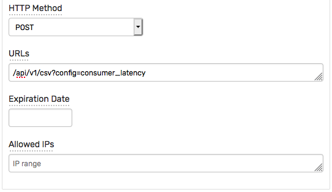

# Consumer Latency Parser

Данный документ содержит инструкции по установке и настройке утилиты `ConsumerLatencyParser`, общая функциональность которой описана в [Метриках задержки консьюмера](./latency_monitoring.md#метрики-задержки-консьюмера).

## Требования

Утилита `ConsumerLatencyParser` производит считывание всех архивов консьюмера с последующим вычислением точных перцентилей в памяти. Для работы программы необходимо выделение 16Гб памяти. Среднее время выполнения анализа дневных архивов от всех консьюмеров составляет 45 минут.

## Установка и компиляция утилиты

Загрузите [`ConsumerLatencyParser.java`](./ConsumerLatencyParser.java) на сервер с доступом к архивам лог файлов консьюмеров.

```bash
curl -O https://raw.githubusercontent.com/axibase/atsd/master/finance/ru/ConsumerLatencyParser.java
```

Загрузите библиотеку [commons-math3-3.6.1.jar](https://mvnrepository.com/artifact/org.apache.commons/commons-math3/3.6.1).

```bash
curl -O https://repo1.maven.org/maven2/org/apache/commons/commons-math3/3.6.1/commons-math3-3.6.1.jar
```

Скомпилируйте программу.

```bash
javac -cp commons-math3-3.6.1.jar:. ConsumerLatencyParser.java
```

## Тестовый запуск

Убедитесь, что в исходной директории находятся архивы консьюмера за выбранную дату.

```bash
ls -lh /path/to/logger_futures/logs/trades.15-02-2021.*
```

```txt
-rw-rw-r-- 1 axibase axibase 48M Mar  5 21:00 /path/to/logger_futures/logs/trades.15-02-2021.1.log.gz
-rw-rw-r-- 1 axibase axibase 18M Mar  5 21:00 /path/to/logger_futures/logs/trades.15-02-2021.2.log.gz
```

Запустите программу с параметром `mode=2` для проверки скорости чтения файлов.

```bash
java -cp commons-math3-3.6.1.jar:. ConsumerLatencyParser /path/to/logger_futures/logs/ trades 15-02-2021 /tmp/logger_futures_15-02-2021.csv 2
```

```txt
Start
mode: read
Files found: 1 in /path/to/logger_futures/logs/ for 15-02-2021
consumer/logger name: logger_futures
== processing file /path/to/logger_futures/logs/trades.15-02-2021.1.log.gz : 70315199 ==
processed file. lines: 2232986 in 2206
Skip writing to file
Completed
```

Запустите программу с параметром `mode=2` для расчета процентилей и записью в файл. В данном случае необходимо выделение памяти.

```bash
java -Xmx16G -cp commons-math3-3.6.1.jar:. ConsumerLatencyParser /path/to/logger_futures/logs/ trades 15-02-2021 /tmp/logger_futures_15-02-2021.csv
```

Проверьте результирующий файл на наличие данных в формате CSV.

```bash
head /tmp/logger_futures_15-02-2021.csv
```

```csv
date,directory,file,from,to,action,type,count,min,p0.1,p1,p5,p10,p25,p50,p75,p90,p95,p99,p99.9,max
15-02-2021,logger_futures,trades,entry,sending,,,2139592,-516,-309,-70,416,845,2084,3808,6209,13188,20324,59189,207505,932111
15-02-2021,logger_futures,trades,entry,sending,0,,2139592,-516,-309,-70,416,845,2084,3808,6209,13188,20324,59189,207505,932111
15-02-2021,logger_futures,trades,entry,sending,,2,2139592,-516,-309,-70,416,845,2084,3808,6209,13188,20324,59189,207505,932111
15-02-2021,logger_futures,trades,entry,sending,0,2,2139592,-516,-309,-70,416,845,2084,3808,6209,13188,20324,59189,207505,932111
15-02-2021,logger_futures,trades,sending,receive,,,2139592,-460,-184,112,388,559,869,1294,1940,3128,4698,10370,36274,2392041
15-02-2021,logger_futures,trades,sending,receive,0,,2139592,-460,-184,112,388,559,869,1294,1940,3128,4698,10370,36274,2392041
```

## Импорт парсера

Для обработки поступающих от утилиты файлов необходимо установить соответствующий CSV парсер.

* Откройте страницу **Tools > CSV Parsers**.
* Нажмите **Import** и загрузите [`consumer_latency_parser.xml`](./consumer_latency_parser.xml).

## Создание токена аутентификации

* Откройте страницу **Admin > API Tokens > Issue Token**.
* Выберите метод POST и укажите `/api/v1/csv?config=consumer_latency` в поле URLs.

  

* Скопируйте значение поля **Token** для использования на следующем этапе вместо `<TOKEN>`.
* Проверьте отправку созданного ранее CSV файла заменив `atsd_hostname` и `<TOKEN>` на актуальные значения.

```bash
curl "https://atsd_hostname:8443/api/v1/csv?config=consumer_latency" \
  --insecure --header "Authorization: Bearer <TOKEN>" \
  --form filedata="/tmp/logger_futures_15-02-2021.csv"
```

## Скрипт для обработки архивов

Скрипт предполагает следующую схему хранения архивов в базовой директории `/path/to/consumer_archive_base`:

```txt
/path/to/consumer_archive_base/logger_fx:
                                                logs/
/path/to/consumer_archive_base/logger_hc_jdk:
                                                logs/
/path/to/consumer_archive_base/logger_futures:
                                                logs/
```

Создайте файл `run_cl_parser.sh`. Замените `atsd_hostname`, `<TOKEN>`, `work_dir`, `base_dir` на актуальные значения.

```bash
#!/bin/bash

dt=$1

# dt format is dd-MM-yyyy

if [ -z "$dt" ]; then
  dt=`date -d '-1 day' '+%d-%m-%Y'`
fi

work_dir=/path/to/consumer_latency_parser_directory
base_dir=/path/to/consumer_archive_base
echo "Check files for $dt at $(date)"

cd $work_dir

java -Xmx16G -cp commons-math3-3.6.1.jar:. ConsumerLatencyParser $base_dir/logger_hc_jdk/logs/ trades $dt $work_dir/logger_hc_jdk_trades_$dt.csv
java -Xmx16G -cp commons-math3-3.6.1.jar:. ConsumerLatencyParser $base_dir/logger_hc_jdk/logs/ orders $dt $work_dir/logger_hc_jdk_orders_$dt.csv
java -Xmx16G -cp commons-math3-3.6.1.jar:. ConsumerLatencyParser $base_dir/logger_hc_jdk/logs/ statistics $dt $work_dir/logger_hc_jdk_statistics_$dt.csv

java -Xmx16G -cp commons-math3-3.6.1.jar:. ConsumerLatencyParser $base_dir/logger_futures/logs/ trades $dt $work_dir/logger_futures_trades_$dt.csv
java -Xmx16G -cp commons-math3-3.6.1.jar:. ConsumerLatencyParser $base_dir/logger_futures/logs/ orders $dt $work_dir/logger_futures_orders_$dt.csv
java -Xmx16G -cp commons-math3-3.6.1.jar:. ConsumerLatencyParser $base_dir/logger_futures/logs/ statistics $dt $work_dir/logger_futures_statistics_$dt.csv
java -Xmx16G -cp commons-math3-3.6.1.jar:. ConsumerLatencyParser $base_dir/logger_futures/logs/ index $dt $work_dir/logger_futures_index_$dt.csv

java -Xmx16G -cp commons-math3-3.6.1.jar:. ConsumerLatencyParser $base_dir/logger_fx/logs/ trades $dt $work_dir/logger_fx_trades_$dt.csv
java -Xmx16G -cp commons-math3-3.6.1.jar:. ConsumerLatencyParser $base_dir/logger_fx/logs/ orders $dt $work_dir/logger_fx_orders_$dt.csv
java -Xmx16G -cp commons-math3-3.6.1.jar:. ConsumerLatencyParser $base_dir/logger_fx/logs/ statistics $dt $work_dir/logger_fx_statistics_$dt.csv

for file in logger_hc_jdk_trades_$dt.csv logger_hc_jdk_orders_$dt.csv logger_hc_jdk_statistics_$dt.csv logger_futures_trades_$dt.csv logger_futures_orders_$dt.csv logger_futures_index_$dt.csv logger_futures_statistics_$dt.csv logger_fx_trades_$dt.csv logger_fx_orders_$dt.csv logger_fx_statistics_$dt.csv
do
 curl "https://atsd_hostname:8443/api/v1/csv?config=consumer_latency" \
  --insecure --header "Authorization: Bearer <TOKEN>" \
  --form filedata="@$file"
done
echo "Done parsing files for $dt at $(date)"
```

Добавьте право на исполнение `chmod +x run_cl_parser.sh`.

Запустите скрипт вручную для выбранной даты с целью проверки.

```bash
/path/to/consumer_latency_parser_directory/run_cl_parser.sh 15-02-2021
```

Добавьте запуск скрипта в планировщик `cron` после окончания ежедневной процедуры архивации и копирования архивов.

```bash
30 0 * * * /path/to/consumer_latency_parser_directory/run_cl_parser.sh &> /path/to/consumer_latency_parser_directory/cl_parser.log
```