# Кросс-сделки на Московской Бирже

## Введение

Участникам фондового рынка необходимо обладать умением обнаруживать признаки манипулирования в инструментах, с которыми они производят операции. Одним из таких признаков являются кросс-сделки, применяемые недобросовестными участниками торгов как механизм создания фиктивной ликвидности.

Кросс-сделка - это транзакция, в которой одно и то же лицо выступает одновременно покупателем и продавцом ценных бумаг. В рамках кросс-сделки не происходит фактического перехода прав собственности, что в условиях анонимной торговли с центральным контрагентом позволяет манипуляторам искажать оценку справедливой цены другими участниками.

Экономический смысл кросс-сделок сомнителен, и в случае существенного влияния на стоимость акций данные сделки и заявки классифицируются российским законодательством как [манипулирование рынком](https://www.cbr.ru/inside/inside_practices/article_1/).

В данном документе описываются механизмы обнаружения кросс-сделок на основании микроструктуры книги заявок на Московской Бирже.

## Защита от кросс-сделок на зарубежных биржах

На большинстве зарубежных фондовых бирж запрещены не только кросс-сделки (_wash trades_) но и заявки, которые потенциально могут привести к кросс-сделкам (_кросс-заявки_). В отличие от статьи 5 ФЗ №224 запрет действует независимо от того, насколько существенным является влияние действий клиента на цену или объем биржевых операций.

Обязанности по предотвращению кросс-сделок возлагаются на брокеров, которые осуществляют проверку выставляемых заявок и совершаемых сделок клиентов. Брокер применяет собственные критерии данных операций и может устанавливать запреты не только на кросс-сделки, но и на одновременное выставление встречных заявок противоположной направленности от одного клиента. Также применяется временная задержка между заявками противоположной направленности. При предоставлении прямого доступа к рынку (DMA) брокер производит проверку соблюдения критериев по окончанию торговой сессии.

> Обратите внимание на разницу в переводе. **Wash trades** - это сделки манипулирования, которые мы называем кросс-сделками. **Cross trades** - это допустимые сделки между разными клиентами одного брокера, которые мы называем интернализированными сделками.

## Защита от кросс-сделок на Московской Бирже

В отличие от зарубежных площадок, на Московкой Бирже реализована централизованная проверка на допустимость кросс-сделки путем сравнения кодов клиентов второго уровня (клиентов брокерской компании). При наличии в торговой системе встречной заявки с идентичным кодом клиента, неисполненный остаток кросс-заявки снимается, и кросс-сделка не регистрируется.

Один брокер | Несколько брокеров
--- | ---
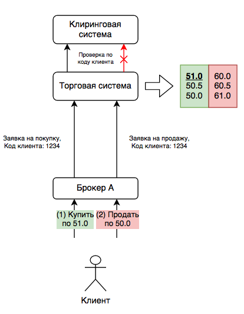 | 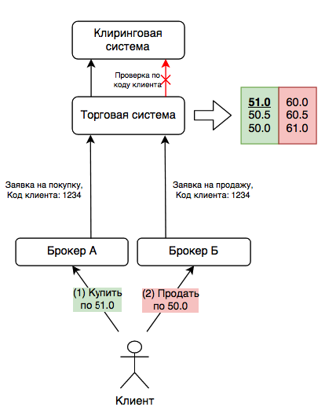

Вышеприведенная диаграмма описывает сценарий, при котором клиент подает заявку на покупку по цене 51 рубль за акцию. После этого клиент отправляет вторую заявку на продажу по 50 рублей. Исполнение второй заявки (кросс-заявки) будет отменено ввиду наличия в торговой системе пересекающейся по цене заявки на покупку от данного клиента.

Проверка производится клиринговой системой биржи (то есть не сервером брокера и не терминалом QUIK) с использованием единого кода (предположительно хэш ИНН), присвоенного всем брокерским счетам клиента. Это обеспечивает обнаружение кросс-сделки при поступлении заявок, отправленных с разных брокерских счетов, открытых у одного или нескольких брокеров.

Данный механизм обеспечивает защиту от тривиального варианта социальной инженерии, препятствуя созданию фиктивных объемов торгов отдельно взятым недобросовестным участником торгов.

## Hello World

Начнем с того, что воспроизведем ошибку "Заявка на покупку зарегистрирована. Удовлетворение остатка приводит к заключению кросс-сделки. Остаток снят."

Для этого выберем инструмент с низкой ликвидностью, например `GAZAP`, чтобы у первой заявки был шанс повисеть в книге заявок на верхнем уровне.

Шаг 1. Выставляем заявку на покупку по цене выше текущей цены покупки. | Шаг 2. Отправляем заявку на продажу по рыночной цене.
--- | ---
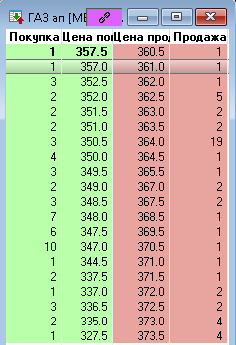 | 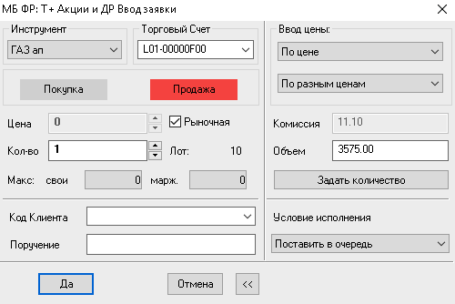

Получаем сообщение об ошибке.


Производим отправку еще одной заявки на продажу, указав цену ниже лучшей покупки. Увеличиваем количество, чтобы проверить, будет ли исполнена какая-либо заявка кроме нашей.

Получаем аналогичные сообщения об ошибках. Ни одна из заявок, в том числе других участников, расположенных за нашей первой заявкой, не исполняется. В данном случае наша первая заявка на покупку выступает как своего рода "барьер", от которого отскакивают кросс-заявки на продажу.

## Видимость кросс-заявок

Для проверки видимости наших заявок другим участникам, проведем выгрузку наших заявок из QUIK терминала. В данном случае мы имеем одну барьерную и три отклоненные кросс-заявки.

```txt
| Номер заявки   | Время выставлен            | Инструмент | Операция |  Цена | Кол-во |
|----------------|----------------------------|------------|----------|------:|-------:|
| 23,639,666,066 | 2021-04-20 12:58:10.263279 | GAZAP      | Купля    | 357.5 |      1 |
| 23,639,687,919 | 2021-04-20 12:58:49.422683 | GAZAP      | Продажа  |   0.0 |      1 | ошибка
| 23,639,703,585 | 2021-04-20 12:59:31.578949 | GAZAP      | Продажа  |   0.0 |      2 | ошибка
| 23,639,722,960 | 2021-04-20 13:00:23.891127 | GAZAP      | Продажа  | 350.0 |      2 | ошибка
```

### FAST

 FAST является основным протоколом распространения анонимизированных рыночных данных. Несколько лет назад в протоколе FAST были сделаны изменения, согласно которым  потоки не содержат сообщений о цене и количестве акций в заявках, которые приводят к немедленному исполнению. Как следствие, в потоке Orders отсутствуют кросс-заявки, а также обычные рыночные и лимитные заявки, которые исполняются без остатка.

В логе потока Orders для `GAZAP` 20 апреля 2021 года присутствует только "барьерная" заявка на покупку, и отсутствуют кросс-заявки:

```python
| Tx | Напр. |   Номер | Символ | Seq |           Время |  Цена |
|----|-------|--------:|--------|----:|----------------:|------:|
| -  | B     | 5280970 | GAZAP  | 284 | 12:58:01.668282 | 353.0 |
| -  | B     | 5300299 | GAZAP  | 285 | 12:58:01.682868 | 357.5 |
| +  | B     | 5389628 | GAZAP  | 286 | 12:58:10.263279 | 357.5 | <- Заявка 23,639,666,066
| -  | B     | 5389628 | GAZAP  | 287 | 13:00:32.974039 | 357.5 |
| -  | B     | 5269540 | GAZAP  | 288 | 13:02:17.216632 | 352.5 |
```

`+` Новая заявка, `-` Снятие заявки.

Из лога также заметно отсутствие пробелов в последовательности сообщений (Seq), что подтверждает отсутствие снятых кросс-заявок в потоках FAST.

Отметим, что отсутствие видимости другим участникам является важным свойством кросс-заявок. В этом аспекте кросс-заявки идентичны IOC и FOK заявкам.

### Архивные данные

Архивные данные типа А публикуются на следующий после окончания торговой сессии и содержат анонимизированные параметры всех заявок, включая заявки с моментальным исполнением и снятым остатком. Тем не менее, архивы не содержат информацию о типе заявки, причинах снятия остатка.

Ниже приводится список тех же заявок `GAZAP` в архивном формате: символ, направленность, время, номер заявки, операция, цена, количество.

Барьерная заявка:

```python
GAZAP|B|12:58:01.668282|4680391|-|353.0|1
GAZAP|B|12:58:01.682868|4698090|-|357.5|1
GAZAP|B|12:58:10.263279|4778766|+|357.5|1 <- Заявка 23,639,666,066
```

Кросс-заявки с моментальной отменой.

```python
GAZAP|S|12:58:49.422683|4798895|+|0.0|1 <- Заявка 23,639,687,919
GAZAP|S|12:58:49.422683|4798895|-|0.0|1

GAZAP|S|12:59:31.578949|4812681|+|0.0|2 <- Заявка 23,639,703,585
GAZAP|S|12:59:31.578949|4812681|-|0.0|2

GAZAP|S|13:00:23.891127|4829805|+|350.0|2 <- Заявка 23,639,722,960
GAZAP|S|13:00:23.891127|4829805|-|350.0|2
```

Поскольку заявка может быть отменена по нескольким причинам, в АТСД применяется статистический анализ для вычисления типа заявки исходя из состояния книги заявок на момент ее поступления.

## Классификация кросс-заявок

Для обнаружения кросс-заявок, а также предшествующих им "барьерных" заявок, в АТСД производится построение полной книги заявок, вычисление лучших котировок и других параметров в контексте каждой заявки. После этого возможно применение одного из следующих критериев.

### A. Рыночные кросс-заявки

Признаком рыночной заявки в архиве является цена 0.0 рублей.

```python
GAZAP|S|12:59:31.578949|4812681|+|0.0|2
GAZAP|S|12:59:31.578949|4812681|-|0.0|2
```

Снятие рыночной заявки является весьма редким событием. Это может произойти по трем причинам:

* Отсутствие встречных котировок
* Исполнение заявки приводит к существенному изменению котировки (агрессивная заявка)
* Исполнение заявки приводит к кросс-сделке

Например, данная рыночная заявка на покупку `KZOSP` была исполнена частично в связи отсутствием котировок на продажу в результате ее исполнения.

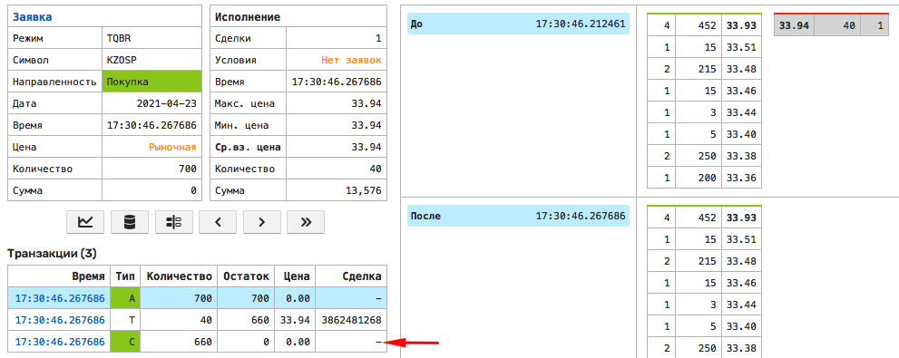

Если встречного объема достаточно, то необходимо сравнить встречные котировки до и после исполнения рыночной заявки. Если котировка изменится более чем на 1% для акций в индексе IMOEX и иностранных акций и 3% - для остальных акций, то рыночная заявка отменяется полностью или частично по признаку [агрессивности](https://www.moex.com/n30641/). Если изменение котировки происходит в пределах данных границ, то факт отмены рыночной заявки можно считать признаком кросс-заявки.

В примере ниже продажа 2 лотов `GAZAP` отклонена несмотря на наличие заявок на покупку (лучшая по 357.5 рублей), при этом лучшая котировка на покупку поменяется незначительно - с 357.5 до 357.0 рублей. Соответственно, АТСД классифицирует данную заявку как кросс-заявку.

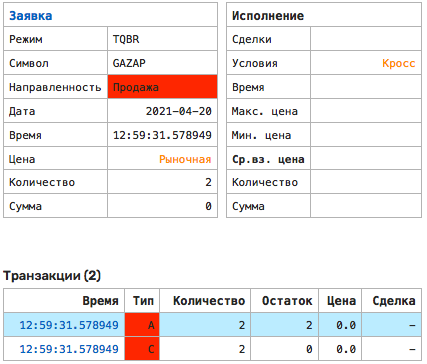

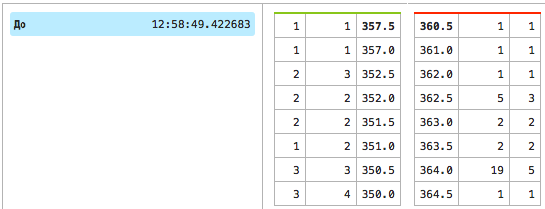

В следующем примере заявка на продажу 245 акций по рыночной цене исполнена в количестве 17 штук со снятием остатка в количестве 228 акций.

```python
LKOH|S|17:34:48.990230|10852214|+|0|245
LKOH|S|17:34:48.990230|10852214|t|0|  2|3838728477|6041.5
LKOH|S|17:34:48.990230|10852214|t|0| 15|3838728478|6041.5
LKOH|S|17:34:48.990230|10852214|-|0|228
```

На основании статистического анализа котировок на момент поступления заявки мы видим, что отклонение не превысило 1% и поэтому заявка не отменена как агрессивная. Система также классифицирует данную заявку как кросс.

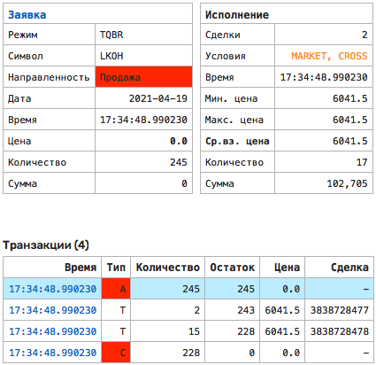

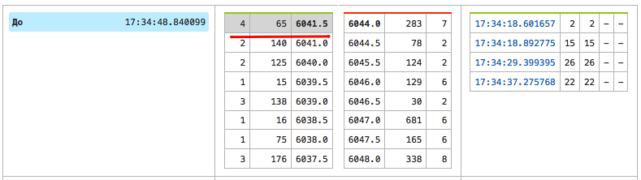

В качестве примера отмены агрессивной рыночной заявки можно привести покупку акций  YNDX, в которой дальнейшее исполнение заявки привело бы к сделке по цене 4729, что более чем на 1% превышает котировку на продажу 4682 (4729/4682 = 1.0038%) на момент поступления заявки. Соответственно остаток данной рыночной заявки снят из-за ее агрессивности, а не ввиду кросс-сделки.

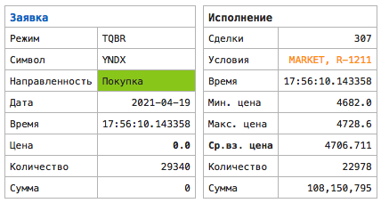

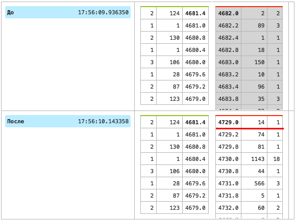

### B. Лимитные заявки

При исполнении лимитных заявок контроль агрессивности не производится, соответственно для классификации кросс-заявок достаточно проверить, что частичное снятие остатка произошло при наличии встречной котировки по равной или лучшей цене.

В примере ниже, заявка на продажу по 53.65 рубля исполняется частично несмотря на наличие в книге заявок покупок по цене 54.115 рублей.

```python
RUAL|S|11:02:07.727062|2206346|+|53.615|830
RUAL|S|11:02:07.727062|2206346|t|53.615|100|3837244295|54.115
RUAL|S|11:02:07.727062|2206346|-|53.615|730
```

В данном случае "спотыкание" произошло на барьерной заявке на покупку, датированной 11:02:07.700008. Таким образом данная заявка классифицируется как кросс.

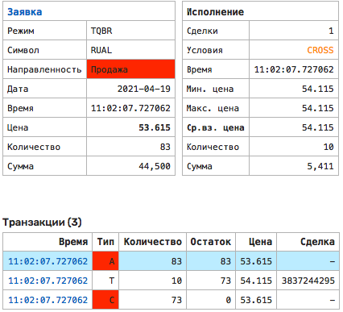

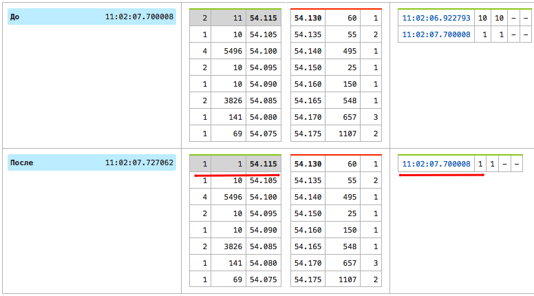

## Масштаб явления

23 апреля 2021 в течение основной сессии ежедневно зарегистрировано **145,8 тысяч** кросс-заявок, однако практически все заявки в количестве 144,7 тысяч относятся к акциям [`SWN-RM`](https://www.moex.com/ru/issue.aspx?board=FQBR&code=SWN-RM).

> Высокий объем кросс-заявок в акциях `SWN-RM` является следствием завышенного размера минимального шага цены. Для  `SWN-RM` установлен шаг цены в размере 1 рубль при цене акции в 300 рублей, что приводит к минимальному спрэду между лучшей ценой покупки и продажи в размере 0.3% и стремлению маркет-мейкеров монополизировать лучшие котировки.

Таким образом, за вычетом `SWN-RM`, зарегистрирована **1,1 тысяча** кросс-заявок и **0,6 тысяч** предшествующих им барьерных заявок. Объем исполненных сделок с заявками других участников составил **36 млн** и **46 млн** рублей соответственно, что является незначительной суммой относительно общего объема торгов в размере 100 млрд. рублей.

Для создания условий кросс-сделки необходимо две заявки в виде первой барьерной заявки и одной или нескольких кросс-заявок, которые будут отменяться после соприкосновении с барьером. В большинстве случаев барьер помещается за несколько долей секунды до прибытия первой кросс-заявки.

Список всех кросс-заявок приводится в сканере на странице `type-cross`. Список барьерных заявок приводится на странице `type-cross-pair`.

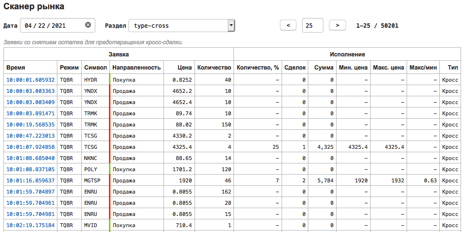

В качестве критерия, создается ли заявка оператором или программой можно использовать задержку между барьерной заявкой и первой кросс-заявкой. Если использовать 10 секунд как критерий для алгоритмического выставления, то **74,5** процентов всех заявок выставляется программно.

Задержка после барьера | % заявок
---:|---:
< 1 миллисекунд |      15.3
< 10 миллисекунд |      23.0
< 100 миллисекунд |      38.5
< 1 секунды |      53.3
< 10 секунд |      74.5
< 60 секунд |      87.0

## Стратегии

### Маркет-мейкер

Кросс-заявки с барьером могут использоваться для получения искусственного приоритета в книге заявок инструмента с неоптимальным шагом цены, как в случае с `SWN-RM`.

### Маскировка основной заявки

Кросс-заявки с барьером могут использоваться для маскировки основной заявки, противоположной по направленности барьеру. Барьер в данном случае помещается в нескольких ценовых шагах от основной заявки для искуственного сужения спрэда. Обнаружить основную заявку можно с высокой степенью вероятности на основании просмотра хронологии заявок, поступивших в течение такого же интервала времени, как между барьером и первой кросс-заявкой.

### Информационная разведка

Стратегии данного типа используются для вычисления настроек конкурирующих алгоритмов и задержек в потоках данных, и как правило присутствуют в начале торговой сессии.

```python
S|10:03:21.733616|+|4.907|1 - барьер на продажу
B|10:03:21.860822|+|4.999|1 - кросс-заявки на покупку
...
S|10:03:29.327588|t|4.907|1 - снятие барьера
```

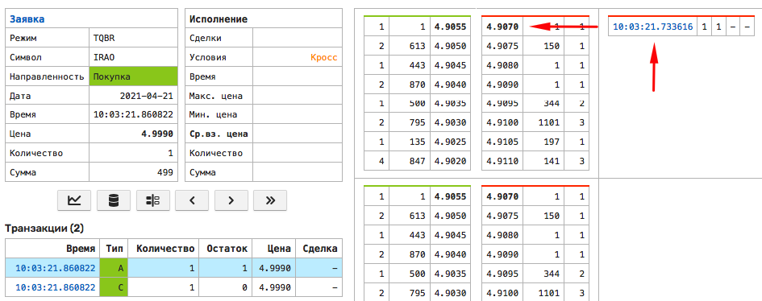

Цепочка кросс-заявок при активном барьере пошагово модифицирует цену, на которой произойдет срабатывание чужих заявок.

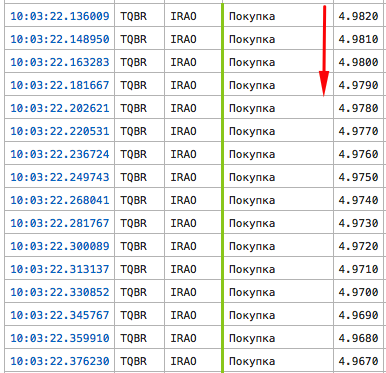

## Наблюдения

### Допустимые кросс-сделки

6 апреля 2021 биржа [внесла](https://www.moex.com/n33478) изменения в процедуру установки настроек, разрешающих выполнение кросс-сделок. Из этого следует, что функциональность разрешенных кроссов востребована у определенных клиентов второго уровня.

Допущенные биржей кросс-сделки, исполняются как обычные сделки без снятия остатка, и поэтому не могут быть определены на основании вышеприведенных критериев. Количество таких разрешенных кросс-сделок на настоящий момент неизвестно.

В контексте квалифицированных инвесторов и доверительного управления, вполне возможно, что речь идет о вариантах стратегий, когда кросс-сделка проводится без воздействия на рынок, например в целях сглаживания финансового результата путем псевдо-фиксации убытков по отдельным позициям в портфеле в конце налогового периода. На настоящий момент налоговое законодательство не запрещает данный тип сделок, но следует учитывать риск отнесения сделки к необоснованной налоговой оптимизации.

### Мониторинг манипулирования

Основной уязвимостью использования кросс-сделок для целей обнаружения недобросовестных практик является тот факт, что такие манипуляции как правило производятся группой лиц. Пользуясь случаем вспомним, что "манипула" на латыни означала роту солдат в древнеримской армии. Наврядли группы недобросовестных участников задействуют такие "коллективы", однако даже двух клиентов второго уровня достаточно для обхода запретов на кросс-сделки. На настоящий момент, запрет на кросс-сделки лишает регулятора ранних индикаторов противоправной деятельности, и при этом не защищает рынок от профессиональных манипуляторов.

### Влияние на торговую систему

Дополнительная проверка на допустимость кросс-сделки в клиринговой системе добавляет несколько десятков или даже сотен микросекунд времени на pre-trade обработку и замедляет процессинг. Это косвенно подтверждается тем фактом, что иногда сообщения о статусе собственных заявок поступают быстрее чем обновления в каналах рыночных данных (так называемый private fill). С учетом того, что кросс-заявки составляют ничтожную долю от всех заявок, накладные расходы на проверку всех сделок представляются избыточной и непроизводительной нагрузкой. Массированная атака кросс-заявками может также использоваться для замедления торговой системы в отдельные моменты времени. Возможные альтернативы включают проверки сделок в режиме post-trade или полную отмену запрета на кросс-сделки с переносом ответственности на брокеров по аналогии с зарубежными биржами.

### Практические выводы

Используя счетчики кросс-сделок в отдельных инструментах участники торгов могут лучше планировать свои инвестиционные решения для избежания потерь при покупке или продаже ценных бумаг с существенным отклонением от справедливого уровня цен.

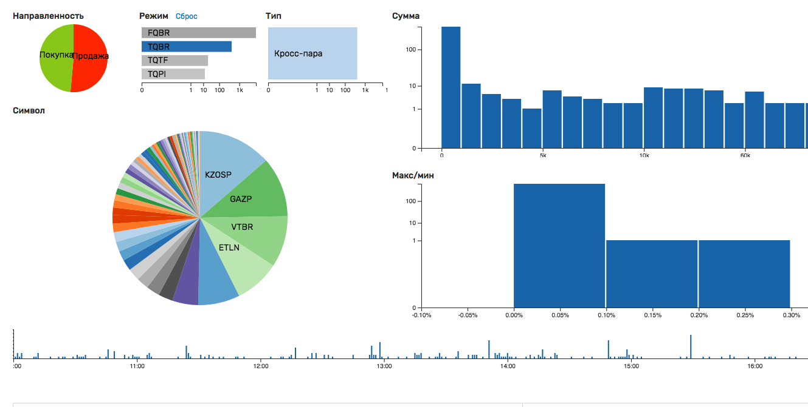