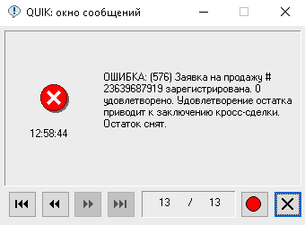

# Кросс-сделки на Московской бирже

## Введение

Кросс-сделка - это сделка, в которой одно и то же лицо выступает одновременно покупателем и продавцом ценных бумаг. Экономический смысл данной операции сомнителен, и поэтому кросс-сделки, особенно в случае их существенного влияния на стоимость акций, классифицируются регулятором как [манипулирование рынком](https://www.cbr.ru/inside/inside_practices/article_1/).

Для предотвращения таких практик на Московской Бирже производится проверка на допустимость кросс-сделки путем сравнения кода конечного участника торгов (клиента брокерской компании). При наличии в торговой системе встречной заявки с идентичным кодом клиента, неисполненный остаток поступившей заявки снимается, и кросс-сделка не регистрируется.


На диаграмме выше, клиент с кодом 1234 подал лимитную заявку на покупку по цене 51 рубль за акцию. Заявка на покупку добавляется в книгу заявок и становится в очередь ожидания. После этого клиент отправляет заявку на продажу по 50.0 рублей. Исполнение данной заявки будет отменено ввиду наличия в торговой системе встречной заявки на покупку от клиента с кодом 1234, при этом цены этих заявок пересекаются либо вторая заявка на продажу является рыночной.

Проверка производится на уровне клиринговой системы с использованием универсального короткого кода (предположительно хэш ИНН), единого для всех брокерских счетов клиента на Московской бирже. Это означает, что подача заявок от разных брокерских счетов у одного брокера или даже от разных брокеров будет приводить к одинаковым результатам - обнаружении кросс-сделки.


## Hello World

Как получить ошибку "Заявка на покупку зарегистрирована. Удовлетворение остатка приводит к заключению кросс-сделки. Остаток снят."

**Шаг 1.** Выбираем инструмент с низкой ликвидностью и большим спредом, чтобы у первичной заявки был шанс повисеть в книге заявок на верхнем уровне, например `GAZAP`. 

**Шаг 2.** Выставляем заявку на покупку по лучшей цене.


**Шаг 3.** Отправляем заявку на продажу по рыночной цене. 


Получаем сообщение об ошибке.



**Шаг 4.** Призводим отправку еще одной заявки на продажу, указав достаточно низкую цену, чтобы обеспечить ее исполнение. Увеличиваем количество, чтобы проверить, будет ли исполнена какая-либо заявка кроме нашей. 

Получаем аналогичные сообщения об ошибках. Ни одна из заявок, в том числе заявки других участников, расположенные за нашей заявкой, не исполняется.

План тестирования:

```
| Номер          | Выставлена                 | Инструмент | Операция |  Цена | Кол-во |
|----------------|----------------------------|------------|----------|------:|-------:|
| 23,639,666,066 | 2021-04-20 12:58:10.263279 | GAZAP      | Купля    | 357.5 |      1 |
| 23,639,687,919 | 2021-04-20 12:58:49.422683 | GAZAP      | Продажа  |   0.0 |      1 | ошибка
| 23,639,703,585 | 2021-04-20 12:59:31.578949 | GAZAP      | Продажа  |   0.0 |      2 | ошибка
| 23,639,722,960 | 2021-04-20 13:00:23.891127 | GAZAP      | Продажа  | 350.0 |      2 | ошибка
```

## Регистрация заявок в потоках рыночных данных

Сообщения FAST не содержат сообщений о цене и количестве акций в заявках, которые приводят к моментальному исполнению. Как следствие, в потоке Orders (OLS) отсутствуют заявки, которые могут привести к кросс-сделкам.

Выдержка из потока orders для `GAZAP` 20 апреля 2021 года, в которой присутствует только первичная заявка на покупку, и отсутствуют отклоненные заявки: 

```python
| Tx | Напр. |   Номер | Символ | Seq |        Время |  Цена |
|----|-------|--------:|--------|----:|-------------:|------:|
| -  | B     | 5280970 | GAZAP  | 284 | 125801668282 | 353.0 |
| +  | B     | 5300299 | GAZAP  | 285 | 125801682868 | 357.5 |
| +  | B     | 5389628 | GAZAP  | 286 | 125810263279 | 357.5 | <- Заявка 23,639,666,066
| -  | B     | 5389628 | GAZAP  | 287 | 130032974039 | 357.5 |
| -  | B     | 5269540 | GAZAP  | 288 | 130217216632 | 352.5 |
```

`+` - Новая заявка, `-` - Снятие заявки.

## Регистрация заявок в архивных данных

Архивные данные типа А содержат информацию о всех заявках, включая заявки со снятым остатком. Однако архивы не содержат информацию о типе заявки и причинах снятия неисполненного остатка. 

Пример кросс-заявки:

```python
19.04.2021|15934284|SELG|B|15:19:08.415282|7579788|+|0|900|||
19.04.2021|15934285|SELG|B|15:19:08.415282|7579788|-|0|900|||
```

## Классификация кросс-заявок

Для обнаружения кросс-заявок на основании архивных данных необходимо применение статистического анализа с построением полной книги заявок в течение сессии. В качестве основного фильтра используется список заявок с частичной или полной отменой остатка. Следует отметить, что кросс-сделки, разрешенные биржей, исполняются как обычные сделки, то есть без снятия остатка, и поэтому не могут быть определены на основании нижеприведенных критериев.

### A. Снятые рыночные заявки.

Наиболее простым случаем является снятие заявки с рыночной ценой без единой сделки.

```python
19.04.2021|15934284|SELG|B|15:19:08.415282|7579788|+|0|900|||
19.04.2021|15934285|SELG|B|15:19:08.415282|7579788|-|0|900|||
```

Данное событие может произвойти по двум причинам: 

 * Отсутствие встречных предложений
 * Исполнение приведет к кросс-сделке
 
Иногда рыночное заявки поступают в начале торгов, когда книга заявок по низколиквидным инструментом еще не инициализирована. Полная отмена рыночной заявки в данном случае происходит по причине отсутствия котировок. Соответственно, если при подаче рыночной заявки встречные котировки имеются и вместе с тем происходит полное снятие - это и есть недопустимая кросс-заявка.

В примере выше покупка 900 акций SELG в 15:19:08.415282 отклонена несмотря на наличие заявок на продажу (лучшая по 45.49 рублей) на момент поступления заявки. Данную сделку можно классифицировать как кросс.


### B. Частично исполненные рыночные заявки.

При классификации снятия частично исполненной рыночной заявки необходимо отличать снятие в силу контроля ее [агрессивности](https://www.moex.com/n30641/?nt=106) (1% для IMOEX и FQBR и 3% - для остальных акций) и снятие заявки из-за кросс-сделки.

В примере ниже заявка на продажу 245 акций по рыночной цене исполнена на 17 штук со снятием остатка в размере 228 акций.

```python
19.04.2021|22764295|LKOH|S|17:34:48.990230|10852214|+|0|245|||
19.04.2021|22764297|LKOH|S|17:34:48.990230|10852214|t|0|2|3838728477|6041.5|
19.04.2021|22764299|LKOH|S|17:34:48.990230|10852214|t|0|15|3838728478|6041.5|
19.04.2021|22764300|LKOH|S|17:34:48.990230|10852214|-|0|228|||
```

На основании статистического анализа минимальной цены сделки и котировки на момент поступления заявки мы видим, что отклонение не превысило 1% и поэтому заявка _не отменена_ как агрессивная. Можно классифицировать данную заявку как кросс.


В качестве примера отмены агресивной рыночной заявки можно привести заявку на покупку акций  YNDX, в которой ее дальнейшее исполнение привело бы к сделке по цене 4729, что более чем на 1% превышает котировку на продажу 4682 (4729/4682 = 1.0038%) на момент поступления заявки. Соответственно остаток даннй рыночной заявки снят по причине Правила 1211, а не ввиду кросс-сделки.


### С. Частично исполненные лимитные заявки.

При испонлнении лимитных заявок контроль агресивности не производится, соответственно для классификации кросс-заявок можно использовать факт снятия остатов при наличии встречной котировки по равной или лучшей цене.

В примере ниже, заявка на продажу по 53.65 рубля исполняется частично несмотря на наличие в книге заявок нескольких покупок по цене выше 53.65 рублей.

```python
19.04.2021|4514227|RUAL|S|11:02:07.727062|2206346|+|53.615|830|||
19.04.2021|4514229|RUAL|S|11:02:07.727062|2206346|t|53.615|100|3837244295|54.115|
19.04.2021|4514230|RUAL|S|11:02:07.727062|2206346|-|53.615|730|||
```

В данном случае "спотыкание" произошло на встречной заявке на покупку, датированной 11:02:07.700008. Таким образом данная заяка классифицируется как лимитная кросс-заявка.


## Наблюдения

### Масштаб использования

Ежедневно регистрируется 100-200 кросс заявок (по сравнению с 130000 IOC), которые в АТСД приводятся на странице crosses, поэтому говорить об их широком использовании не приходится.


Тем не менее хорошая маскировка (отсутствие в FAST потоках) возможно полезна в отдельных случаях. Также нельзя исключать, что все случаи автоматизированных сделок являются следствием сбоев в программировании, или нерегулярным конфликтом конкурирующих стратегий, когда одна стратегия принимает решение купить, а вторая продать один и тот же инструмент. В связи с чем cтоит отметить замечание регулятора возлагающее ответственность за сбои, приведшие к движению рынка, на участников торговли.

> Банк России рекомендует участникам рынка при разработке алгоритмических торговых систем учитывать риски, возникающие вследствие заключения кросс-сделок на организованных торгах.

### Ручные кроссы и кроссы алгоритмов

Для создания кросс-сделки необходимо две заявки. Интересно отметить, что в большинстве случаев первичная заявка (для "спотыкания") помещается в противоположную часть книги заявок на несколько секунд до прибытия кросс-заявки. 

В определенном количестве случаев, как в примере ниже, первичная заявка помещается менее чем за 100 миллисекунд, что предполагает реализацию данной стратегии в автоматическом режиме.

```python
10:03:05.529727 - первичная заявка
10:03:05.618587 - кросс-заявка
10:03:05.619193 - отмена первичной заявки
```


### Новые удобства для кросс-сделок

Несмотря на сомнительную репутацию, 6 апреля 2021 биржа [внесла](https://www.moex.com/n33478) изменения в процедуру установки настроек, разрешающих выполнение кросс-сделок. Из этого следует, что данная функциональность все-таки востребована у определенных клиентов. 

Вполне возможно, что речь идет о вариантах стратегий, когда кросс-сделка проводится без воздействия на рынок, например в целях сглаживания финансового результата путем продажи с одновременной покупкой убыточных инструментов в конце налогового периода. На настоящий момент налоговое законодательство не запрещает данный тип сделок (т.н. _wash sale_), но следует учитывать, что сделка может быть отнесена к необоснованной налоговой оптимизации, что запрещено законом.

### Использование кросс сделок для контроля манипуляций

Основной уязвимостью использования кросс-сделок для целей обнаружения недобросовестных практик является тот факт, что такие манипуляции как правило производятся группой лиц. Используя несколько участников с разными кодами клиента, манипуляторы могут создать видимость справедливого уровня цены и эмулировать высокие объемы торгов обходя запрет на кросс-сделки посредством цепочки сделок между отдельными клиентами. Данный обходной вариант требует минимум синхронизации и может управляться через системы обмена сообщениями. В данном случае запрет на кросс-сделки представляется контр-продуктивным поскольку лишает регулятора ранних индикаторов противоправной деятельности. Сложно представить процессиональных манипуляторов, которые решились бы на использование сегодняшних кросс-сделок в силу их видимости для регулятора.

### Стоимость проверки

Можно предположить, что дополнительная проверка в клиринговой системе добавляет несколько сотен микросекунд времени на pre-trade обработку и замедляет процессинг. С учетом того, что на бирже ежедневно регистрируется не более 200 заявок со снятием остатка по причиние недопустимой кросс-сделки, накладные расходы на проверку оставшихся 2 млн. сделок представляются избыточной нагрузкой на большинство. Более оптимальной являлось бы сторнирование сделки в режиме post-trade или отмена запрета на кросс-сделки.

### Гипотезы

У вас есть гипотеза касательно рыночных условий, при которых кросс-сделки полезны или используются? Поделитесь в комментариях. Мы проверим на основе анализа данных и добавим к обсуждению.
