# Мифы про рыночные заявки

В данном обзоре представлены примеры, демонстрирующие поведение рыночных заявок 23 апреля 2021 года во время основной сессии на фондовой секции Московской Биржи. Большинство из приведенных фактов будут полезны начинающим трейдерам, однако агрегатные показатели и аналитические материалы могут заинтересовать и экспертов.

## Миф 1. Рыночная заявка исполняется по рыночной цене

Причина этого весьма распространенного заблуждения кроется в неудачных формулировках, используемых в брокерских системах и мобильных приложениях.

В определениях часто используется ссылка на конкретный уровень цены, например на "рыночную цену" или "лучшую цену". Вот примеры описания, которые можно встретить сегодня:

* > Рыночная заявка — это заявка купить/продать определенное количество лотов по лучшей доступной цене.

* > Рыночная заявка — это заявка на покупку или продажу активов по той цене, что есть на бирже в данный момент.

* > Рыночная заявка — это заявка на покупку или продажу, которая должна быть выполнена брокером немедленно по текущей рыночной цене.

Не каждый участник дочитает мелкий текст и осознает то, что "лучшая" цена может не только поменяться к моменту ее поступления, но и сама заявка может исполниться по средней цене, которая значительно хуже цены, ожидаемой инвестором.

Рассмотрим пример неудачной рыночной заявки.
За 15 секунд пока условный пользователь готовил заявку, лучшая котировка на продажу сдвинулась с 4499 до 4520, а средняя цена исполненной заявки составила 4544 рубля, что превышает референтную цену более чем на 1%.

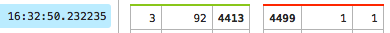

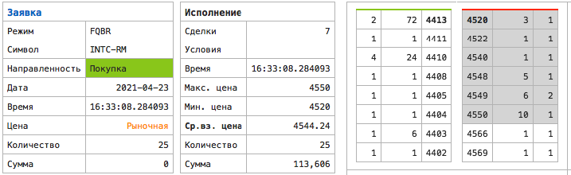

Обратите внимание, что речь идет об акциях Intel Corp в 16:33, то есть после открытия торгов на основной площадке ликвидности данного инструмента. Ниже приведена цена на NASDAQ и СПб Бирже в рублях по курсу USDRUB_TOM в качестве подтверждения отсутствия существенных ценовых колебаний.

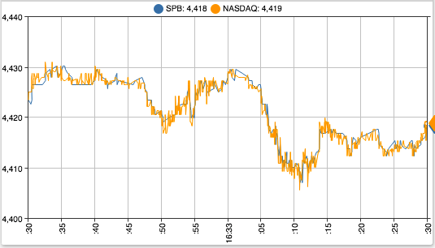

Вернемся к распространенному определению рыночной заявки, где указывается конкретный уровень цены. Я бы интерпретировал данное описание как Market IOC (рыночная заявка со снятием). Отправив такую заявку на покупку, я приобретаю акции по лучшей цене продажи на момент поступления заявки на биржу, но не выше чем лучшая котировка на продажу. Если желающих продать на данной цене меньше, чем объем заявки, то остаток снимается. В примере выше участник приобрел бы 3 акции по 4520 рубля.

Я предлагаю следующее определение, которое (а) акцентирует срочность исполнения и (б) не обещает конкретный уровень цены.

> Рыночная заявка на покупку — это **моментально** исполняемая заявка по **наименьшей средней** цене для указанного количества ценных бумаг.

Дальнейшие пояснения должны быть похожи на предупреждения на сигаретных пачках, чтобы клиент был морально готов купить инструмент по верхнему диапазону, установленному [НКК](https://www.nationalclearingcentre.ru/iss/fondPriceRanges/?pageNumber=1&xls=false&type=2&secId=INTC-RM&date=23.04.2021&date1=27.04.2021&date2=27.04.2021), то есть по 5087 рублей в случае INTC-RM.

> Если у вас есть альтернативное определение рыночной заявки, прошу поделиться в комментариях.

## Миф 2. Рыночная заявка исполняется всегда

Снятие или неполное исполнение рыночной заявки явление редкое. В фондовой секции оно регистрируется не более 100 раз каждый день.

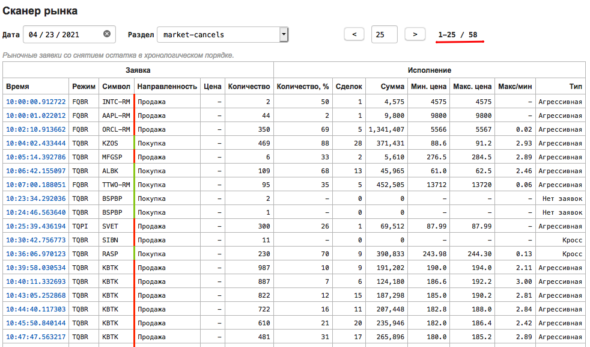

Причин для отмены в ходе регулярных торгов всего три, при этом с отменой могут столкнуться как заявки отправленные клиентом, так и заявки инициализированные сервером брокера в результате активации стоп-заявок.

1) Отсутствие встречных котировок, зачастую в неликвидных инструментах в начале торгов или в моменты резкого роста цены. Заявка на покупку 700 акций KZOSP удовлетворена на 40 штук со снятием остатка по причине отсутствия предложений. Вспомним, что рыночная заявка исполняется моментально и не может быть помещена в книгу заявок для ожидания встречных предложений.

    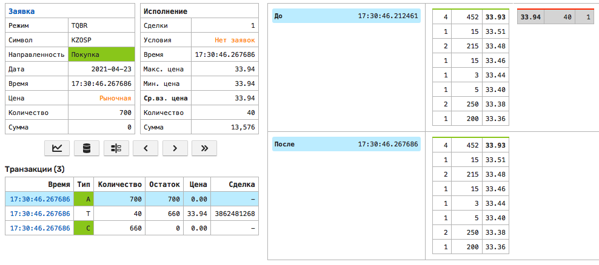

2) Исполнение заявки приводит к существенному изменению котировки

    Ограничения [агрессивности](https://www.moex.com/n30641/?nt=106) для рыночных заявок являются новацией Московской Бирже, реализованные по рекомендации Центрального Банка, и введенные в эксплуатацию 2 ноября 2020 г.

    Согласно этим ограничениям, предельное изменение лучшей котировки противоположной направленности ограничено 1% для акций входящих в индекс IMOEX и инстранных акций, и 3% для остальных акций, депозитарных расписок и паев.

    В первом примере рыночная заявка на покупку исполнена частично с максимальной (последней) ценой сделки в 425.4, так как дальнейшее ее исполнение по более высокой цене привело бы к изменению котировки на продажу более чем на 3% от лучшей цены продажи на момент заявки (238.3 * 3% = 245.449).

    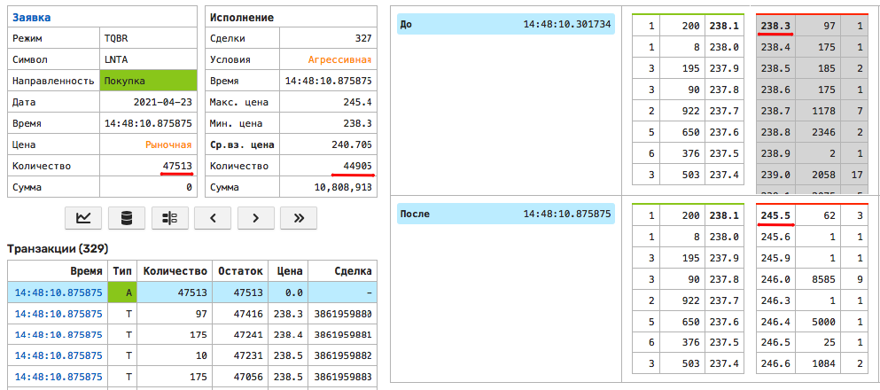

    Второй пример с AAPL-RM примечателен поведением в стиле Market IOC. Остаток рыночной заявки на продажу снят после исчерпания объема на уровне лучшей цены на покупку.

    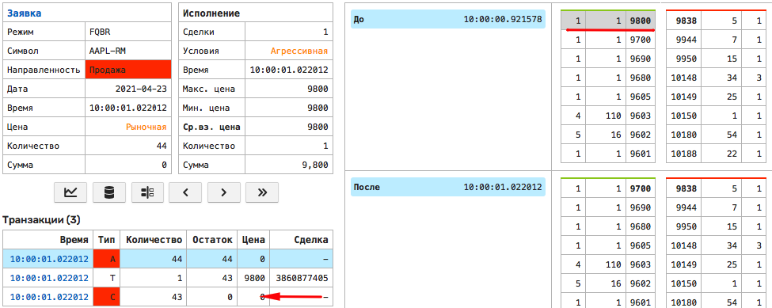

3) Исполнение заявки приводит к кросс-сделке

    Этот сценарий подробно описан в статье  ["Кросс-сделки"](cross-trade.md) и добросовестный участник торгов навряд ли будет его свидетелем среди собственных транзакций.

## Миф 3. Рыночная заявка редко используется

Ежедневно регистрируется более 100 тысяч рыночных заявок. Рыночные заявки составляют менее 1 процента от общего количества заявок, но более 15% от общего оборота. Это подтверждает их существенную роль в общем объеме торгов.

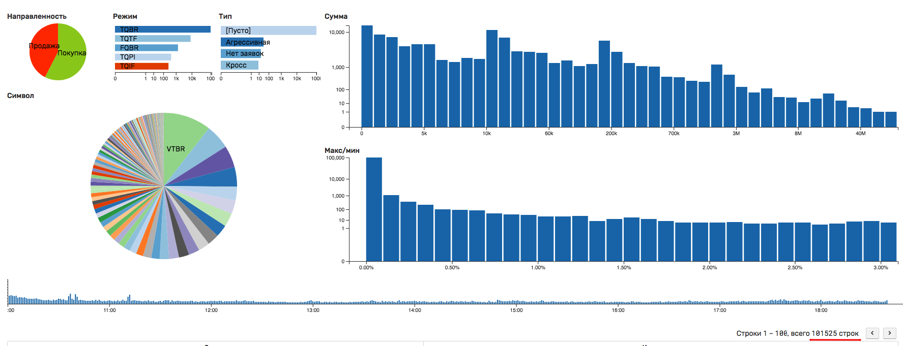

## Миф 4. Рыночную заявку используют только трейдеры с небольшим оборотом

15% рыночных заявок приходится на сумму 100 тысяч рублей и выше. Ежедневно на рынок поступает около 100 рыночных заявок объемом 10 млн рублей и более.

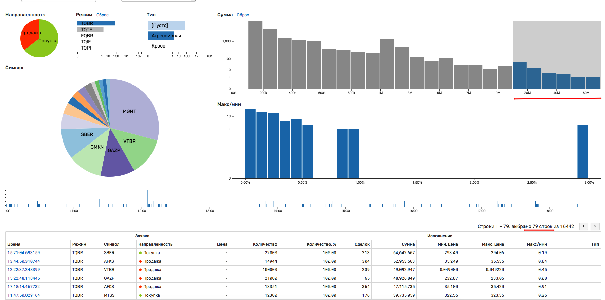

Приведем пример двух наиболее крупных рыночных заявок в апреле 2021 года, на 140 и 137 млн рублей соответственно. Этот уровень уже приближается к IEX, где наиболее крупные сделки находятся в диапазоне 5-10 млн. долларов.

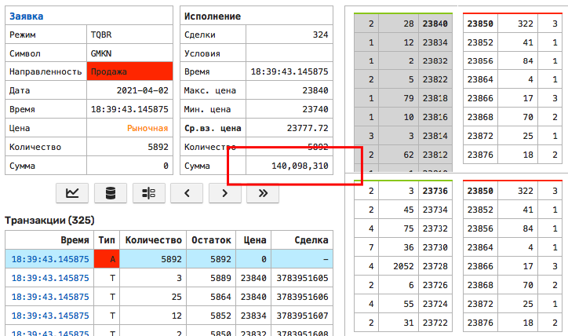

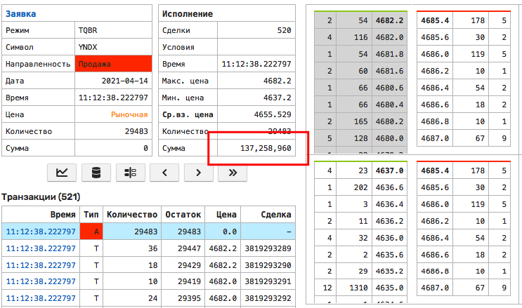

## Миф 5. Небольшая рыночная заявка не влияет на рынок

Из числа небольших заявок на сумму 100 тысяч рублей, около 10% приводит к сдвигу котировок и расширению спрэда. На диаграмме ниже показатель "Макс/мин" является отношением процентным максимальной и минимальной ценой сделок при исполнении заявки. Ненулевое значение свидетельствует о сдвиге лучшей котировки.

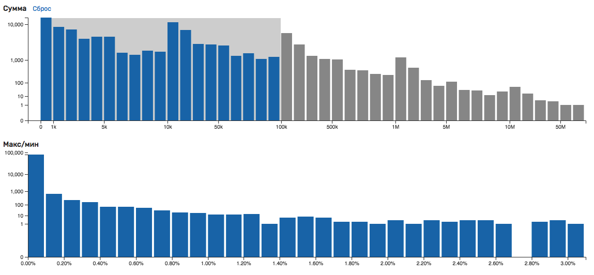

## Миф 6. Крупные рыночные заявки являются признаком инсайда

Сначала изложим гипотезу. Инсайдерская торговля имеет разные формы, здесь мы говорим о действиях инсайдеров на коротком горизонте, за несколько минут или часов до проникновения информации на рынок. В данном случае инсайдер вынужден действовать быстро, конкурируя не только с дедлайном, но и другими инсайдерами. В отсутствие механизмов маскировки своих намерений, или по незнанию, инсайдер выбирает моментально исполняемые сделки по "лучшей" цене. Как следствие большие рыночные заявки являются признаком лучшей информированности. Цена их исполнения должна быть лучше, чем аналогичные объемы после опубликования новости. Для проверки такой гипотезы в первом приближении можно взять подвыборку из наиболее крупных рыночных заявок и применить к ним Transaction Cost Analysis (TCA), реализованный в АТСД. TCA производит оценку качества операций трейдера или алгоритма путем сравнения цены исполнения выбранной заявки со сделками других участников, а также статического анализа параметров заявки на основании экспертных правил.

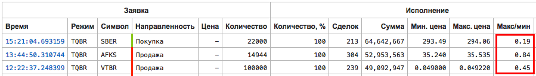

TCA для данных заявок показывает их убыточность как относительно средневзвешенной цены конкурентного объема (сделок других участников), так и средней котировки через 10 минут:

* SBER 15:21:04:

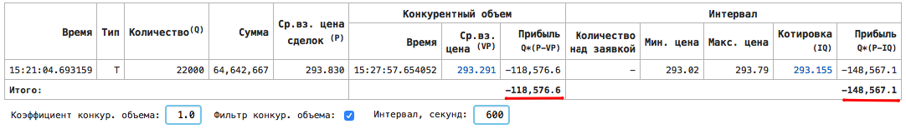

* AFKS 13:44:50:

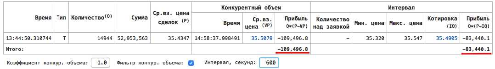

* VTBR 12:22:37:

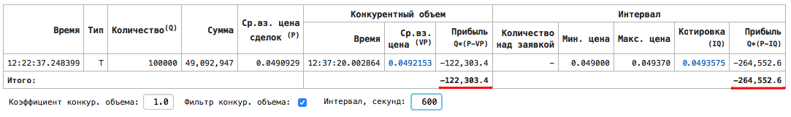

Представленные результаты не подтверждают и не опровергают первоначальную гипотезу, для полной проверки которой необходимо рассчитать относительную прибыль/убыток всех рыночных заявок и их корреляцию с корпоративными событиями. Интересными днями в апреле 2021 года являются дни, в которые были зарегистрированы значительные падения цен акций в результате действий анти-монопольных органов по отношению к YNDX (8 апреля) и CHMF, MAGN, NLMK (27 апреля). В данном случае задача упрощается наличием факта существенного события, остается обнаружить повторяемые свойства микроструктуры рынка с высокой корреляцией с выбранным событием.

## Миф 7. Рыночные заявки выгодны для брокера и биржи

Для рассмотрения данного вопроса будет полезно классифицировать все поступающие заявки как создающие ликвидность и изымающие ликвидность. Под изъятием ликвидности имеется виду сокращение количества уровней в книге заявок, а также сокращение количества бумаг на каждом уровне. Также следует отметить, что ликвидность принято разделять на видимую и скрытую. Видимая ликвидность представлена публично доступной книгой заявок, в которой находятся лимитные заявки, ожидающие исполнения. К скрытой ликвидности, которая присутствует внутри спрэда видимых котировок, можно отнести заявки типа IOC, FOK, скрытую часть айсбергов, а также заявки высокочастотных алгоритмов, которые могут быть быстро сгенерированы.

Для биржи отсутствие видимой ликвидности в виде разряженных стаканов является сценарием, который она старается всячески избежать. Оборот на бирже является следствием справедливого механизма ценообразования, низких транзакционных издержек, и гарантированных расчетов. Плохая ликвидность отрицательно влияет на обороты, и с этой точки зрения превалирование рыночных заявок, а также лимитных заявок с моментальным исполнением, которые опустошают стакан, является нежелательным состоянием. На настоящий момент на Московской Бирже создание ликвидности и ее изъятие тарифицируются симметрично (исключение - маскировка видимой части айсбергов), однако логика событий подсказывает, что со временем будет внедрено более гибкое ценообразование, как например на NYSE, где биржа по сути "доплачивает" брокеру за лимитные заявки, сокращающие спрэд.

С точки зрения брокера, однозначных приоритетов разным типам заявок нет при условии, что все заявки отправляются на биржу. Как только будет введена интернализация заявок, можно предположить, что рыночные заявки станут более выгодными для брокера в связи с возможностью их продать как order flow операторам, работающим в пространстве скрытой ликвидности.

## Заключение

Удобство моментальной обработки рыночной заявки сопряжено с непредсказуемой ценой ее исполнения в отдельных случаях. Эта специфика учитывается не всеми участниками торгов. Одним из вариантов решения данной проблемы является снижение приоритета рыночных заявок в интерфейсах брокерских программ и  мобильных приложений, с одной стороны. С другой стороны, в части институционального трейдинга, факт отправки крупных рыночных заявок трейдером требует особого внимания со стороны риск-менеджмента на предмет предотвращения избегаемых убытков.

В отсутствие изменений, можно предположить дальнейшее сужение параметров агрессивности Центральным Банком. Конечной точкой такого регулирования может стать снижение порога агрессивности вплоть до 0%, что по сути и является заявкой типа Market IOC.