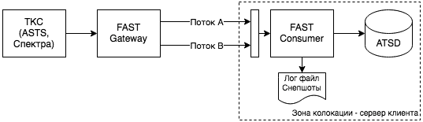

# Прямой доступ к бирже

## Введение

Высокая степень конкуренции на международных рынках капитала и доминирование алгоритмической торговли в обороте фондовых бирж побуждают участников торгов к автоматизации торговых операций с максимальным ускорением основных этапов: от получения данных, их анализа, до выставления и управления заявками. Если раньше на высокочастотной торговле специализировались маркет-мейкеры и систематические фонды, то сегодня скорость реакции и качественные рыночные данные важны для любого участника, проводящего активные торговые операции.

Одним из способов сократить конкурентное отставание является прямой доступ к бирже (Direct Market Access - DMA), который может быть реализован в нескольких вариантах в зависимости от целей клиента - участника торгов. В данном документе мы описываем механизм подключения к инфраструктуре Московской Биржи с целью получения рыночных данных с записью в структурированном виде в базу данных АТСД для последующего использования в тестировании и оптимизации торговых алгоритмов. Доступ к биржевым интерфейсам для скоростной отправки заявок, в том числе в режиме спонсируемого доступа, является отдельной темой.

## Рыночные данные

Основу рыночных данных, предоставляемых биржей, составляют упорядоченные по времени данные о сделках и заявках всех участников торгов в обезличенном виде. Обезличивание производится биржей путем удаления полей, содержащих информацию о типах заявок и участниках, а также заменой фактических номеров заявок на анонимизированные. В дополнение производится трансляция производных показателей, таких как лучшие котировки на покупку и продажу в книге заявок, объем торгов в течение сессии, индикативные цены аукционов, значения индексов, расчетные курсы валют (фиксинги), и т.д. Отдельно предоставляются референтные данные о ключевых параметрах торгуемых инструментов.

К категории расширенных рыночных данных можно отнести обновления, получаемые по собственным заявкам при их опережающей доставке, равно как и технические показатели микроструктуры рынка в виде задержек сообщений и пробелов в последовательностях обезличенных счетчиков.

## Протокол передачи рыночных данных

FAST является основным протоколом трансляции рыночных данных на Московской бирже. Являясь протоколом передачи FIX сообщений, FAST специально оптимизирован для поточной отправки. Экономичность протокола в плане размера сообщений достигается благодаря кодированию имен полей через шаблоны, а также за счет дельта-кодирования, при котором повторное значение поля в последующем сообщении не отправляется.

В качестве транспортного протокола используется UDP Multicast. Протокол UDP не гарантирует доставку и в силу отсутствия сессионности не предоставляет встроенных механизмов восстановления пробелов. Для минимизации пробелов используется трансляция данных одновременно в двух равноправных дублирующих потоках. Клиент одновременно обрабатывает оба потока, отбрасывая уже полученные сообщения. Тем не менее при высокой нагрузке пробелы возможны и биржа предоставляет отдельные сервисы для их восстановления. Использование протокола UDP с присущим ему ограничением на размер пакета приводит к тому, что большие обновления разбиваются шлюзами на отдельные фрагменты.

Более подробно протокол описан в [Руководстве пользователя](http://ftp.moex.com/pub/FAST/ASTS/docs/RUS_Market_Data_Multicast_User_Guide_Ver_4_6.pdf).

По типу биржевой информации, рыночные данные разбиты на несколько независимых каналов:

- Поток заявок
- Поток сделок
- Поток статистики
- Поток референтных данных
- Поток служебных статусов

В потоке статистики транслируются лучшие котировки, нарастающие итоги торгов в течение торговой сессии, а также параметры аукционов открытия и закрытия.

Следует отметить, что из потока обезличенных заявок на Московской Бирже исключены заявки с моментальным исполнением.

> В потоке OLR (orders, incremental) не публикуются заявки, время жизни которых равно нулю: IOC, Market, FOK, и полностью удовлетворенные при регистрации. В потоке OLR также могут быть не опубликованы обновления с добавлением и удалением заявки, если время ее активного состояния не превышает приблизительно 100 микросекунд.

Несмотря на то, что FAST является отраслевым стандартом, большинство зарубежных фондовых бирж по прежнему использует собственные бинарные протоколы, а также дополнительные оптимизации для равномерного распределения сетевой нагрузки, в частности масштабирование кластера шлюзов по алфавиту символов. В случае с FAST на Московской Биржи, данные по всем инструментам отправляются в едином потоке. Это обусловлено относительно небольшим количеством инструментов.

## Поставщики услуг DMA

Услуги DMA предоставляются как правило крупными брокерами. На момент углубленного изучения данного вопроса и выбора поставщика услуг в 2019 г мы рассматривали несколько брокеров, входящих в лидеры по обороту на фондовой секции. Присутствующие в данной статье ценовые и технические характеристики отражают характеристики АТСД у данного конкретного брокера.

## Схема интеграции

Схема доставки данных выглядит следующим образом:



Шлюз FAST отправляет данные на сервер клиента в так называемой зоне [колокации](https://www.moex.com/s154#cs-tab3). Это выделенный сегмент сети, физически приближенный к зоне, в которой расположено аппаратное обеспечение торговых систем самой биржи. В зоне колокации допустимо размещение вычислительных ресурсов клиентов, и при этом сетевая задержка в данном сегменте сети минимальна.

Установка в зоне колокации оптимальна для стратегий, работающих только с данными самой биржи (например маркет-мейкинг), однако увеличивает задержку в доставке данных в зону колокации из других площадок при географическом арбитраже.

IP адреса сервера клиента отправляются через брокера на биржу для включения в multicast-группы для соответствующего рынка.

Для получения данных с одного рынка достаточно следующих ресурсов:

- 64-битная версия Ubuntu 18.04
- Память 6 ГБ
- Дисковое пространство SSD 50 ГБ
- 4 vCPU

Дополнительно необходимо произвести увеличение сетевых буферов, и настроить синхронизацию системного времени с сервисами точного времени биржи.

Стоимость виртуальной машины в данной конфигурации составляет 8300 рублей в месяц.

При этом консьюмер и АТСД устанавливаются на одном сервере для минимизации задержек.

Дальнейшее увеличение количества подключенных рынков при одновременной работе АТСД на том же виртуальном сервере может привести к увеличению количества пробелов и восстановительных сессий, после чего логично рассмотреть вопрос о переносе базы на отдельный сервер. В примере ниже сервер АТСД имеет 64 GB памяти, 8 CPU ядер, и 2ТБ локальных дисков с доступом к сетевым файловым ресурсам для архивации.


Находясь в удаленном ЦОДе база может получать поточные данные с нескольких биржевых площадок. При переносе базы в удаленный ЦОД задержка увеличивается до 2-20 миллисекунд в зависимости от расстояния.

Для получения данных с нескольких рынков мощность виртуального сервера в зоне колокации необходимо увеличить до 8 ГБ памяти и 80 ГБ дискового пространства. Стоимость виртуальной машины в данной конфигурации составляет 9350 рублей в месяц. При подключении сервера ко всем рынкам в итоге задействовано несколько сетевых интерфейсов:

```css
1: lo: loopback
2: eth0: внутренняя сеть
3: eth1: внешняя сеть
4: eth2: фондовый рынок
5: eth3: фондовый рынок
6: eth4: валютный рынок
7: eth5: валютный рынок
8: eth6: срочный рынок
9: eth7: срочный рынок
```

Внешняя сеть является точкой входа для управления сервером с доступом по SSH протоколу. Этот же интерфейс используется для отправки данных в зону колокации, либо из зоны колокации в виде потока данных от FAST консьюмеров и резервного копирования логов и снепшотов в неторговое время.

## Подписка на данные

Подписка на рыночные данные предоставляется для каждого рынка по отдельности:

- Фондовый рынок
- Валютный рынок
- Срочный рынок

Значения индексов, а также СЧА фондов, рассчитываемых биржей через сервис iNav, транслируются в общем потоке каждого рынка, дополнительно к торгуемым инструментам.

Подписка для срочного рынка предлагается в двух версиях: базовый и расширенный. На базовом уровне данные приходят с задержкой. Это происходит в связи с применением так называемой "нарезки", когда данные отправляются не поточно, а пачками. Расширенный уровень позволяет получать данные без задержки  в формате "полный лог заявок", однако требует в 5 раз больше пропускной способности сети и оформления дополнительной подписки.

> В конце 2021 года планируется ввод в эксплуатацию нового шлюза для отправки полного лога заявок Срочного рынка по протоколу [SBE](https://www.fixtrading.org/standards/sbe-online).

## Стоимость данных

Ежемесячная плата за каждый рынок составляет 2000 рублей, и дополнительно 14000 рублей в месяц для полного лога заявок Срочного рынка. Также уплачивается стоимость подключения к каждому рынку в размере 2000 рублей.


Дополнительно необходимо оплатить 7500 рублей за каждый рынок в месяц за Non-display использование, однако при подключении к FAST от лица зарегистрированного на бирже участника торгов через брокера, имеющего соответствующий договор с биржей, данная плата не взимается. Выбранный нами брокер такое соглашение имеет. При этом необходимо соблюдать условие - полученные данные могут быть использованы только для внутренних задач клиента без распространения третьим лицам.

## Стоимость вычислительных ресурсов

Стоимость виртуального сервера в зоне колокации. Для получения данных со всех рынков рекомендуется 4 vCPU и 8 Гб памяти.


## Скорость передачи данных

Для оценки скорости передачи данных можно использовать несколько метрик, одной из которых является разница между временем обработки сообщения ПО клиента и временем регистрации транзакции в ТКС биржи. За счет проставления меток времени на каждом из этапов можно отслеживать компоненты задержки.


### Задержка публикации

 Благодаря наличию в FAST сообщениях поля `SendingTime` становится возможным расчет задержки от ТКС биржи до шлюзов FAST как разницы между `SendingTime` и `MDEntryTime`. Это позволяет  получить объективную оценку задержки в публикации обновлений на стороне биржи, до отправки сообщения клиентам.

Средняя задержка первого этапа для фондового и валютного рынков, которая упоминается в [описании](https://www.moex.com/s441) самой биржи, составляет **300 микросекунд**.

По результатам нашего [мониторинга](../latency_monitoring.md), медиана задержки публикации для потока заявок составляет 275 микросекунд, 95% перцентиль - 800 микросекунд.

Для потока сделок эти показатели составляют 350 и 850 микросекунд соответственно, при этом рассчитанная на основе линейной регрессии задержка увеличивается на 75 микросекунд на каждую дополнительную сделку в обновлении. Начиная с уровня 19 сделок в сообщении наблюдается нелинейное замедление, а при 22 сообщениях происходит фрагментация тика с отправкой оставшихся сделок отдельной UDP датаграммой. Данное поведение характерно для исполняемых заявок, повлекших большое количество транзакций. Обработка обновлений, разбитых на несколько датаграмм, создает определенные сложности, поскольку окончательное состояние книги заявок не может быть рассчитано до применения последней транзакции в каждом тике.


Также наблюдается значимая разница в задержке по типам сообщений (`MDUpdateAction`, `MDEntryType`) и потокам. Например, отмена заявки происходит гораздо быстрее, чем ее обновление или исполнение.

В целом среднедневная задержка весьма стабильна:


### Сетевая задержка

При использовании виртуального сервера медиана задержки между временем получения сообщения и `SendingTime` составляет 300 микросекунд, а 95% перцентиль - 2000 микросекунд. Задержка не зависит от типа сообщения и канала. Данная задержка зависит от вычислительных и сетевых ресурсов провайдера DMA услуг.

## Опыт эксплуатации

В последнее время частота обновлений FAST шаблонов, а также изменения в расписании торгов и отдельных сервисов, увеличили наши операционные издержки на поддержание программной интеграции. В данном контексте отсутствие версионности на уровне FAST протокола и шлюзов представляется нам весьма ограничивающим фактором, вынуждающих нас обновлять консьюмеров чаще, чем это требуется.

Виртуальный сервер в зоне колокации делит аппаратную часть с другими клиентами провайдера, и одновременные скачки в потреблении ресурсов при старте торгов, а также в 16:30 при старте торгов на других площадках весьма существенны. Задержка в получении данных в начале основной сессии исчезает только к концу первой секунды.

Переход на раннее начало торгов в 07:00 вынудил нас оптимизировать фоновые задачи в ночное время и реализовать полную автоматизацию СI/CD процессов (Continuous Integration/Delivery) с гарантированным стартом систем до начала торгов.

Проблемы со связью у провайдера связи Relline в виде недоступности систем нами зафиксированы не были, однако скачки задержек возникают 2-3 раза в неделю и продолжаются 5-10 минут.

Для получения оперативной информации от службы поддержки DMA провайдера мы пользуемся Telegram-каналом, в котором брокер публикует сообщения о сбоях в системах по факту их обнаружения:


При обнаружении аномальных задержек, дубликатов статистики, неверных значений и пропусков в индексах, нам было проще обращаться напрямую в службу поддержки биржи, поскольку опыт обращения через брокера не выявил преимуществ в плане скорости исправлении дефектов или приоритетов.

## Юридические и налоговые аспекты

Юридический статус клиента, подключающегося к бирже, накладывает определенные ограничения на выбор торговых интерфейсов. В частности для физического лица получение FIX-логина на фондовой секции сопряжено с административными сложностями и дополнительными издержками для самостоятельного управления позициями.

Оплата услуг DMA осуществляется путем списания ежемесячной абонентской платы с брокерского счета. Это позволяет учесть расходы на услуги DMA при расчете налогооблагаемой базы от операций с ценными бумагами.