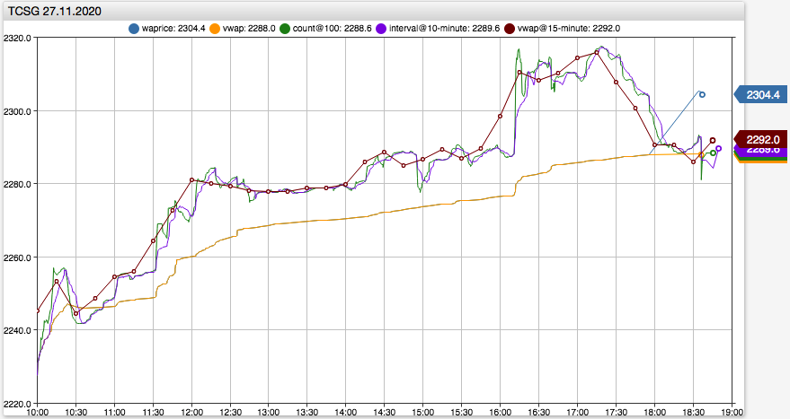

# Расчет средневзвешенной цены на Московской бирже

## Введение

Средневзвешенная цена является одним из ключевых показателей, используемым участниками торгов при принятии инвестиционных решений, алго-торговле, проверке качества брокерских услуг. Также применяется при оценке СЧА паевыми фондами и определении налоговой базы по операциям с ценными бумагами.

Средневзвешенная цена одной ценной бумаги за выбранный период времени определяется путем деления суммы произведений цен каждой из сделок, заключенных в данном периоде, на количество ценных бумаг в соответствующей сделке, на сумму количества ценных бумаг.

```sql
SUM(price*quantity) / SUM(quantity)
```

Данная формула снижает зависимость ценового показателя от сделок с небольшим количеством ценных бумаг и существенным отклонением по цене сделки, в частности от цены закрытия (цены последней сделки).

Московская биржа в соответствии с Правилами проведения торгов производит расчет нескольких юридически-значимых [ценовых показателей](https://www.moex.com/s1194), включая [`waprice`](https://fs.moex.com/files/21269). Расчет `waprice` производится нарастающим итогом с начала сессии в течение торгового дня.

Особенность расчета заключается в том, что несмотря на трансляцию `waprice` для каждого режима по отдельности, значение средневзвешенной цены основывается на сделках из **всех режимов торгов**. В частности, в расчет `waprice` включен режим **РПС с ЦК**, в котором регистрируются крупные сделки с существенным отклонением от текущей цены основного режима (в среднем на `0.59%`).

Приводимый ниже анализ обосновает рекомендацию не использовать `waprice` в качестве ценового показателя основного режима торгов. В качестве замены предлагается самостоятельно вычислять значение `valtoday/voltoday` с округлением до шага цены.

Данное ограничение также затрагивает показатели, вычисляемые на основе `waprice`:

- `marketprice2`: Рыночная цена (2) по методике ФСФР от 26 декабря 2006 г.
- `marketpricetoday`: Рыночная цена (3) по методике ФСФР от 09 ноября 2010 г.
- `prevwaprice`: Средневзвешенная цена предыдущего дня
- `priceminusprevwa`: Цена последней сделки к средневзвешенной цене предыдущего дня

## Особенности расчета

Поле `waprice` доступно под одноименной колонкой в [ASTS шлюзе](http://ftp.moex.com/pub/ClientsAPI/ASTS/Bridge_Interfaces/Equities/Equities37_Broker_Russian.htm) и передается 269-м тэгом с признаком 9 в [FAST](http://ftp.moex.com/pub/FAST/ASTS/docs/RUS_Market_Data_Multicast_User_Guide_Ver_4_6.pdf).

При расчете `waprice` биржа руководствуется Пунктом 2 Приложения 2 к Положению 437-П Банка России и исходя из критерия "рыночных сделок" применяет фильтр режимов торгов, которые включаются для расчета средневзвешенной цены. Список режимов обновляется в [Уведомлениях](https://fs.moex.com/files/10215/), [Изменениях](https://fs.moex.com/files/9957/) и по состоянию на 14.12.2021, выражение для фильтра режимов выглядит следующим образом:

```sql
   market = 'FOND' AND class NOT IN('AUCT','AUBB','EQDP')
OR market = 'FNDT' AND class NOT IN('TQDB')
OR market = 'RPS'  AND class     IN('PSDB','PSDE','PSEO','PSEQ','PSEU','PSGO','PSIF','PSOB','PSQI','PSSD','PSTC','PSTD','PSTF','PSYO','IRK2')
OR market = 'RPST' AND class NOT IN('SPEQ')
```

Например, для наиболее ликвидных акций список включенных режимов, за вычетом устаревших режимов [отчетности](https://www.moex.com/n32174), состоит из основного режима TQBR и пяти дополнительных режимов:

```json
| market | symbol | class | currency | trade_currency | step | lot |
|--------|--------|-------|----------|----------------|-----:|----:|
| FNDT   | GAZP   | LIQB  | RUB      | RUB            | 0.01 |   1 |
| FNDT   | GAZP   | SMAL  | RUB      | RUB            | 0.01 |   1 |
| FNDT   | GAZP   | TQBR  | RUB      | RUB            | 0.01 |  10 |
| FNDT   | GAZP   | TQDP  | RUB      | RUB            | 0.01 |  10 |
| RPS    | GAZP   | PSEQ  | RUB      | RUB            | 0.01 |   1 |
| RPST   | GAZP   | PTEQ  | RUB      | RUB            | 0.01 |   1 |
```

<details style="margin-left:20px"><summary>Посмотреть SQL запрос</summary>

```sql
SELECT SEC_DEF.marketcode AS market, tags.symbol AS symbol, tags.class_code AS class, tags.currency AS currency, tags.trade_currency AS trade_currency, tags."step" AS "step", tags.lot AS lot
FROM atsd_entity
WHERE tags.symbol = 'GAZP'
    AND (
       SEC_DEF.marketcode = 'FOND' AND entity.tags.class_code NOT IN('AUCT','AUBB','EQDP')
    OR SEC_DEF.marketcode = 'FNDT' AND entity.tags.class_code NOT IN('TQDB')
    OR SEC_DEF.marketcode = 'RPS'  AND entity.tags.class_code     IN('PSDB','PSDE','PSEO','PSEQ','PSEU','PSGO','PSIF','PSOB','PSQI','PSSD','PSTC','PSTD','PSTF','PSYO','IRK2')
    OR SEC_DEF.marketcode = 'RPST' AND entity.tags.class_code NOT IN('SPEQ')
    )
    AND tags.class_code NOT IN('MQBR', 'MSML', 'MSEQ', 'MTEQ') -- устаревшие технологические классы
ORDER BY 1, 3
```

</details>

Проиллюстрируем особенность расчета `waprice` на примере акций TCSG от 2020-11-27, в котором можно наблюдать как заключенная в режиме PTEQ сделка по цене 2444.2 рубля приводит к одновременному скачку `waprice` в режиме TQBR c 2288 до 2305.6 рублей.

Поток trades:

```json
2020-11-27 18:32:07.806370,3386941381,TCSG,B,2293.0,   35,   80255,TQBR
2020-11-27 18:32:09.260915,3386941534,TCSG,B,2293.0,    1,    2293,TQBR
2020-11-27 18:32:19.728784,3386942323,TCSG,B,2293.0,    1,    2293,TQBR
2020-11-27 18:32:21.038690,3386942407,TCSG,S,2444.2,23910,58440822,PTEQ <-- Сделка PTEQ по цене на 6.6% выше основного режима
2020-11-27 18:32:21.739391,3386942491,TCSG,B,2293.0,   35,   80255,TQBR
2020-11-27 18:32:30.668838,3386943118,TCSG,S,2292.2,   50,  114610,TQBR
2020-11-27 18:32:30.808663,3386943122,TCSG,S,2292.2,   13,   29798,TQBR
```

Поток statistics (MSS):

```json
2020-11-27 17:55:33.034276,1,9,,TCSG,2288.0,TQBR
2020-11-27 17:55:33.034276,1,9,,TCSG,2288.0,PTEQ
2020-11-27 17:55:33.034276,1,9,,TCSG,2288.0,PSEQ
2020-11-27 18:32:21.038690,1,9,,TCSG,2305.6,TQBR <-- Сделка PTEQ 3386942407 привела к скачку waprice для TQBR, PTEQ, PSEQ
2020-11-27 18:32:21.038690,1,9,,TCSG,2305.6,PTEQ
2020-11-27 18:32:21.038690,1,9,,TCSG,2305.6,PSEQ
```

Как в данном, так и в подавляющем большинстве аналогичных случаев отсутствует влияние сделок PTEQ на цену последующих сделок в основном режиме.

## Влияние сделок в РПС на основной режим

По окончании основной сессии отклонения `waprice` от фактического значения средневзвешенной цены `valtoday/voltoday` могут быть весьма существенными.

Таблица: Отклонение ожидаемых и полученных значений waprice во время дневной сессии 10.02.2021

```json
| symbol | voltoday |    valtoday | waprice | vwap_calc |
|--------|---------:|------------:|--------:|----------:|
| SBER   | 56936860 | 15280486924 |  268.38 |    268.38 |
| GAZP   | 37058810 |  8338934566 |  225.03 |    225.02 | <-
| GMKN   |   286914 |  7269180456 |   25336 |     25336 |
| YNDX   |  1279740 |  6690337926 |  5228.4 |    5227.8 | <-
| LKOH   |  1190434 |  6686005626 |  5616.5 |    5616.5 |
| TCSG   |  1640935 |  5876321268 |    3583 |      3581 | <---
| ROSN   |  5169140 |  2551369039 |  493.75 |     493.6 | <--
| MGNT   |   488429 |  2536223638 |  5194.5 |    5192.5 | <--
| AFKS   | 67672500 |  2403561087 |  35.518 |    35.518 |
| OZON   |   483270 |  2338023976 |    4838 |      4838 |
```

<details style="margin-left:20px"><summary>Посмотреть SQL запрос</summary>

```sql
SELECT symbol, voltoday, valtoday, waprice,
  -- округление до шага цены согласно методологии биржи
  ROUND(valtoday/voltoday/entity.tags."step", 0)*entity.tags."step" AS vwap_calc
FROM atsd_session_summary
  WHERE class = 'TQBR' AND type = 'Day' AND stage = 'N'
  AND datetime BETWEEN '2021-02-10' AND '2021-02-11'
ORDER BY valtoday DESC
```

</details>

Возможны случаи, когда `waprice` будет находиться за пределами минимальной и максимальной цены основной сессии.

Таблица: Выход `waprice` за пределы диапазона `low` / `high` с 01.01.2021 по 13.02.2021

```json
| dt         | symbol |   low |   high |  last | waprice | vwap_calc |
|------------|--------|------:|-------:|------:|--------:|----------:|
| 2021-01-06 | GLTR   |   460 | 466.05 | 463.3 |     459 |     462.1 | <-- 459 < 460 (low)
| 2021-01-18 | ARSA   |  3.79 |   3.84 |  3.84 |    3.78 |      3.81 |
| 2021-01-27 | RTSB   | 0.535 |   0.55 | 0.535 |   0.525 |      0.54 |
| 2021-02-02 | VRSBP  |  44.5 |   44.5 |  44.5 |      44 |      44.5 |
| 2021-02-05 | KCHEP  | 0.358 |  0.358 | 0.358 |   0.355 |     0.358 |
| 2021-02-05 | KCHEP  | 0.358 |  0.358 | 0.358 |   0.355 |     0.358 |
| 2021-01-12 | KTSBP  | 0.282 |  0.282 | 0.282 |  0.2815 |     0.282 |
```

<details style="margin-left:20px"><summary>Посмотреть SQL запрос</summary>

```sql
SELECT date_format(time, 'yyyy-MM-dd') AS dt, symbol, low, high, last, waprice,
  ROUND(valtoday/voltoday/entity.tags."step",0)*entity.tags."step" AS vwap_calc
FROM atsd_session_summary
WHERE class = 'TQBR'
  AND datetime BETWEEN '2021-01-01' AND '2021-02-13'
  AND type = 'Day'
  AND (waprice > high OR waprice < low)
ORDER BY valtoday DESC
```

</details>

Для анализа отклонений цены торгов в основном режиме достаточно построить аналитическое скользящее окно и сравнить цены сделок непосредственно до и после сделки в дополнительном режиме. Например, сделке с CHMF в режиме PTEQ в 2021-02-04 18:15:28.269289 по цене 1310.6 предшестовала сделка в TQBR по 1291.6 и последовала сделка в TQBR по 1292 рубля.

```json
| symbol | p_class | p_dt                       | p_price | p_qty | class | dt                         |  price |   qty |   amount | a_class | a_dt                       | a_price | a_qty | price_to_pre | after_to_pre |
|--------|---------|----------------------------|--------:|------:|-------|----------------------------|-------:|------:|---------:|---------|----------------------------|--------:|------:|-------------:|-------------:|
| CHMF   | TQBR    | 2021-02-04 18:15:20.288538 |  1291.6 |   102 | PTEQ  | 2021-02-04 18:15:25.757491 | 1310.6 | 20000 | 26212000 | TQBR    | 2021-02-04 18:15:28.269289 |    1292 |     3 |        1.471 |        0.031 |
| CHMF   | PTEQ    | 2021-02-04 18:15:25.757491 |  1310.6 | 20000 | TQBR  | 2021-02-04 18:15:28.269289 |   1292 |     3 |     3876 | TQBR    | 2021-02-04 18:15:30.970797 |    1292 |     1 |       -1.419 |       -1.419 |
| CHMF   | TQBR    | 2021-02-04 18:15:28.269289 |    1292 |     3 | TQBR  | 2021-02-04 18:15:30.970797 |   1292 |     1 |     1292 | TQBR    | 2021-02-04 18:15:34.572359 |  1291.6 |     1 |        0.000 |       -0.031 |
```

Отфильтровав избыточные строки в запросе ниже получаем список сделок, для каждой их которых приводится:

- `p_price` - Цена предшествующей сделки в основном режиме
- `price`   - Цена сделки в дополнительном режиме
- `a_price` - Цена последующей сделки в основном режиме
- `price_to_pre` - Отклонение цены сделки в дополнительном режиме от цены сделки в основном режиме в процентом отношении (`price/p_price`)
- `after_to_pre` - Изменение цены соседних сделок в основном режиме в процентом отношении (`a_price/p_price`)

```json
| symbol | p_dt     | p_price | p_qty | dt       |  price |     qty |    amount | a_dt     | a_price | a_qty | price_to_pre | after_to_pre |
|--------|----------|--------:|------:|----------|-------:|--------:|----------:|----------|--------:|------:|-------------:|-------------:|
| LKOH   | 17:35:05 |  5718.5 |    52 | 17:35:10 | 5963.5 |    9000 |  53671500 | 17:35:10 |    5717 |    10 |        4.284 |       -0.026 |
| SMLT   | 17:59:52 |   975.2 |     1 | 17:59:53 |    950 |  130000 | 123500000 | 17:59:56 |   976.6 |     3 |       -2.584 |        0.144 |
| CHMF   | 18:15:20 |  1291.6 |   102 | 18:15:25 | 1310.6 |   20000 |  26212000 | 18:15:28 |    1292 |     3 |        1.471 |        0.031 |
| TCSG   | 14:53:04 |    3179 |     1 | 14:53:18 | 3223.2 |    8568 |  27616378 | 14:53:28 |  3180.2 |     1 |        1.390 |        0.038 |
| CHMF   | 18:16:54 |  1291.2 |     1 | 18:16:55 | 1307.2 |  150000 | 196080000 | 18:17:09 |  1291.4 |    38 |        1.239 |        0.015 |
| POLY   | 14:51:38 |  1666.4 |     2 | 14:51:40 | 1683.5 |   28122 |  47343387 | 14:51:42 |  1666.7 |    10 |        1.026 |        0.018 |
| SBER   | 11:41:08 |   266.7 |     1 | 11:41:08 | 264.02 | 1000000 | 264020000 | 11:41:09 |  266.75 |    82 |       -1.005 |        0.019 |
| ALRS   | 14:52:11 |  102.68 |    60 | 14:52:12 | 103.63 |  333950 |  34607239 | 14:52:16 |  102.65 |     1 |        0.925 |       -0.029 |
| ROSN   | 14:10:21 |  490.85 |     1 | 14:10:24 | 495.35 |  171490 |  84947572 | 14:10:25 |  490.85 |     2 |        0.917 |        0.000 |
| MAGN   | 14:48:28 |   53.14 |   102 | 14:48:30 | 53.575 |  309470 |  16579855 | 14:48:30 |  53.145 |     1 |        0.819 |        0.009 |
```

Рассчитав средневзвешенное отклонение `price_to_pre` по объему сделки получаем `0.59%` по модулю. При этом средневзвешенное значение `after_to_pre` составляет `0.07%`, что демонстрирует отсутствие существенного влияния на сделки в основном режиме.

<details style="margin-left:20px"><summary>Посмотреть SQL запрос</summary>

```sql
SELECT symbol, pre_class_2 AS p_class, pre_dt_2 AS p_dt, pre_price_2 AS p_price, pre_qty_2 AS p_qty,
pre_class AS class, pre_dt AS dt, pre_price AS price, pre_qty AS qty, ROUND(pre_amount,0) AS amount,
class AS a_class, datetime AS a_dt, price AS a_price, quantity AS a_qty,
ROUND(100*(pre_price/pre_price_2-1), 3) AS price_to_pre, ROUND(100*(price/pre_price_2-1), 3) AS after_to_pre
--,trade_num, pre_tn, pre_tn_2 AS tn_tqbr,
FROM (
SELECT datetime, trade_num, class, symbol, price, quantity, price*quantity*entity.tags.lot AS amount,
  LAG(class) AS pre_class, LAG(class, 2) AS pre_class_2,
  LAG(price) AS pre_price, LAG(price, 2) AS pre_price_2,
  LAG(datetime) AS pre_dt, LAG(datetime, 2) AS pre_dt_2,
  LAG(trade_num) AS pre_tn, LAG(trade_num, 2) AS pre_tn_2,
  LAG(quantity) AS pre_qty, LAG(quantity, 2) AS pre_qty_2,
  LAG(amount) AS pre_amount, LAG(amount, 2) AS pre_amount_2
FROM atsd_trade
WHERE symbol LIKE '%'
 AND class IN ('TQBR', 'PTEQ', 'PSEQ')
 AND datetime BETWEEN '2021-02-04 10:00:00' AND '2021-02-04 18:40:00'
WITH TIMEZONE = 'Europe/Moscow', ROW_NUMBER(symbol ORDER BY datetime, trade_num) BETWEEN 2 PRECEDING AND CURRENT ROW
) WHERE (pre_class != 'TQBR' AND class = 'TQBR')
ORDER BY ABS(price_to_pre) DESC
```

</details>

## Дополнительные режимы торгов

В данном вопросе нас интересует более подробная информация о дополнительных режимах, которые оказывают влияние на `waprice`.

Наибольший объем сделок приходится на режимы PTEQ и PSEQ, то есть Режимы Переговорных Сделок. Наиболее крупные сделки совершаются в режиме PTEQ - РПС с ЦК.

Таблица: Ежедневный объем торгов в рублях (`valtoday`) и количество сделок (`numtrades`) в дополнительных режимах с 01.01.2021 по 13.02.2021

```json
| class | avg_valtoday | med_valtoday | max_valtoday | max_valtoday_date | avg_numtrades | avg_trade_val |
|-------|-------------:|-------------:|-------------:|-------------------|--------------:|--------------:|
| PTEQ  |   1718003912 |   1478109138 |   3961032642 | 2021-02-04        |           441 |      10025247 |
| PSEQ  |    119923205 |     56622278 |    684805157 | 2021-01-15        |            21 |       7847410 |
| FSEQ  |      6386290 |      6386290 |      6386290 | 2021-01-19        |             6 |       1064382 |
| FTEQ  |      2471000 |      2471000 |      2471000 | 2021-01-25        |             1 |       2471000 |
| SMAL  |       190533 |       171341 |       556615 | 2021-01-04        |           667 |           278 |
```

<details style="margin-left:20px"><summary>Посмотреть SQL запрос с использованием таблицы atsd_session_summary</summary>

```sql
SELECT class,
  avg(svaltoday) AS avg_valtoday, median(svaltoday) med_valtoday, max(svaltoday) max_valtoday, avg(snumtrades) AS avg_numtrades,
  avg(svaltoday/snumtrades) AS avg_trade_val
FROM (
    SELECT date_format(datetime, 'yyyy-MM-dd') AS dt, class, SUM(valtoday) AS svaltoday, SUM(numtrades) AS snumtrades
    FROM atsd_session_summary
    WHERE class IN ('SMAL','PSEQ','PTEQ','FTEQ','FSEQ')
      AND datetime BETWEEN '2021-01-01' AND '2021-02-13' EXCL
      AND stage = 'N' AND type = 'Day'
    GROUP BY class, date_format(datetime, 'yyyy-MM-dd')
) GROUP BY class
WITH TIMEZONE = 'Europe/Moscow', WORKDAY_CALENDAR = 'moex'
ORDER BY avg(svaltoday) DESC
```

</details>

<details style="margin-left:20px"><summary>Посмотреть SQL запрос с использованием таблицы atsd_trade</summary>

```sql
SELECT class,
  avg(svaltoday) AS avg_valtoday, median(svaltoday) med_valtoday, max(svaltoday) max_valtoday,
  date_format(MAX_VALUE_TIME(svaltoday), 'yyyy-MM-dd') AS max_valtoday_date,
  avg(snumtrades) AS avg_numtrades, avg(svaltoday/snumtrades) AS avg_trade_val
FROM (
    SELECT datetime, class, round(SUM(price*quantity*entity.tags.lot), 0) AS svaltoday, count(*) AS snumtrades
      FROM atsd_trade
    WHERE class IN ('SMAL','PSEQ','PTEQ','FTEQ','FSEQ')
      AND datetime BETWEEN '2021-01-01' AND '2021-02-13' EXCL
      --AND IN_SESSION(Day)
      AND DATE_FORMAT(time, 'HH:mm') BETWEEN '09:00' AND '19:00' EXCL
    GROUP BY class, PERIOD(1 DAY)
) GROUP BY class
WITH TIMEZONE = 'Europe/Moscow', WORKDAY_CALENDAR = 'moex'
ORDER BY avg(svaltoday) DESC
```

</details>

Таблица: 10 наиболее крупных сделок в режиме PTEQ с 01.01.2021 по 13.02.2021

```json
| datetime            |  trade_num | symbol |  price | trade_val |
|---------------------|-----------:|--------|-------:|----------:|
| 2021-01-11 18:02:59 | 3468531711 | LKOH   | 5578.5 | 557850000 |
| 2021-02-02 16:15:32 | 3555295198 | PHOR   |   3621 | 467109000 |
| 2021-01-14 17:38:24 | 3486130375 | SBER   | 283.76 | 425640000 |
| 2021-01-12 18:03:41 | 3474100969 | MAGN   |     58 | 406000000 |
| 2021-01-27 18:44:20 | 3531897054 | SBER   | 270.15 | 405225000 |
| 2021-01-28 12:27:15 | 3536708360 | GMKN   |  24864 | 372960000 |
| 2021-02-04 13:05:17 | 3566682227 | LKOH   | 5635.5 | 351091650 |
| 2021-02-04 14:11:00 | 3566886940 | GAZP   | 220.76 | 351030476 |
| 2021-01-20 12:30:23 | 3504878193 | POLY   | 1680.6 | 336120000 |
| 2021-01-18 12:18:22 | 3496965665 | LKOH   |   5820 | 325227420 |
```

<details style="margin-left:20px"><summary>Посмотреть SQL запрос</summary>

```sql
SELECT datetime, trade_num, symbol, price, round(price*quantity*entity.tags.lot, 0) AS trade_val
  FROM atsd_trade
WHERE class = 'PTEQ'
  AND datetime BETWEEN '2021-01-01' AND '2021-02-13' EXCL
  WITH TIMEZONE = 'Europe/Moscow', WORKDAY_CALENDAR = 'moex'
  ORDER BY trade_val DESC
  LIMIT 10
```

</details>

Таблица: Объем сделок в режиме PTEQ с 01.01.2021 по 13.02.2021 по часам торговой сессии. 60% всех следок заключается в интервале с 17:00 до 19:00.

```json
| hour_of_day |   svaltoday | snumtrades |
|------------:|------------:|-----------:|
|          18 | 23763429832 |       5998 |
|          17 |  6626671062 |       2166 |
|          14 |  3781800136 |        220 |
|          12 |  3708166551 |        137 |
|          16 |  3648353094 |       2348 |
|          13 |  3389163440 |        569 |
|          15 |  2417499182 |        759 |
|          11 |  1872371630 |        222 |
|          10 |   614658518 |        363 |
```

<details style="margin-left:20px"><summary>Посмотреть SQL запрос</summary>

```sql
SELECT DATE_FORMAT(time, 'HH') AS hour_of_day, round(SUM(price*quantity*entity.tags.lot), 0) AS svaltoday, count(*) AS snumtrades
    FROM atsd_trade
WHERE class = 'PTEQ'
    AND datetime BETWEEN '2021-01-01' AND '2021-02-13' EXCL
    AND IN_SESSION(Day)
GROUP BY class, DATE_FORMAT(time, 'HH')
  WITH TIMEZONE = 'Europe/Moscow', WORKDAY_CALENDAR = 'moex'
ORDER BY svaltoday DESC
```

</details>

Таблица: Top 10 акций по объему сделок в режиме PTEQ с 01.01.2021 по 13.02.2021.

```json
| symbol |   amount() | med_trade_val | avg_trade_val | numtrades |
|--------|-----------:|--------------:|--------------:|----------:|
| LKOH   | 5363502025 |        329260 |       8636879 |       621 |
| GAZP   | 4436987473 |        198484 |       4185837 |      1060 |
| SBER   | 4381315690 |        168634 |       4554382 |       962 |
| ROSN   | 3559351014 |        472209 |      12849643 |       277 |
| TATN   | 3404447068 |        274641 |       3445797 |       988 |
| GMKN   | 2777211978 |        207744 |       4501154 |       617 |
| POLY   | 2645920086 |        128888 |       8732410 |       303 |
| CHMF   | 2043205306 |        213444 |       3668232 |       557 |
| TCSG   | 1988237848 |      32260800 |      73638439 |        27 |
| MAGN   | 1833622282 |        101221 |       3852148 |       476 |
```

<details style="margin-left:20px"><summary>Посмотреть SQL запрос</summary>

```sql
SELECT symbol, amount(), median(price*quantity)*entity.tags.lot AS med_trade_val, avg(price*quantity)*entity.tags.lot AS avg_trade_val, count(*) AS numtrades
  FROM atsd_trade
WHERE class = 'PTEQ'
  AND datetime BETWEEN '2021-01-01' AND '2021-02-13' EXCL
  GROUP BY exchange, class, symbol
  WITH TIMEZONE = 'Europe/Moscow', WORKDAY_CALENDAR = 'moex'
  ORDER BY amount() DESC
  LIMIT 10
```

</details>

## Примеры расчета средневзвешенной цены

Средневзвешенная цена может рассчитываться в следующих вариантах:

- Средневзвешенная цена за торговый день
- Средневзвешенная цена за торговую сессию
- Средневзвешенная цена с момента начала торгов по текущий момент
- Средневзвешенная цена последних сделок
- Средневзвешенная цена сделок за интервал
- Средневзвешенная цена сделок за скользящий интервал
- Средневзвешенная цена сделок за календарный период



[Открыть график в ChartLab](https://apps.axibase.com/chartlab/1cd4a0b9/3/)

* Средневзвешенная цена по методологии биржи (для нескольких режимов) за основую сессию:

```json
| symbol | waprice |
|--------|--------:|
| GAZP   |  224.96 |
```

<details style="margin-left:20px"><summary>Посмотреть SQL запрос</summary>

```sql
SELECT symbol,
  ROUND((SUM(price*quantity*entity.tags.lot)/SUM(quantity*entity.tags.lot))/entity_tag(CONCAT(symbol, '_[tqbr]'), 'step'))*entity_tag(CONCAT(symbol, '_[tqbr]'), 'step') AS waprice
FROM atsd_trade
WHERE symbol = 'GAZP'
    AND (
       SEC_DEF.marketcode = 'FOND' AND class NOT IN('AUCT','AUBB','EQDP')
    OR SEC_DEF.marketcode = 'FNDT' AND class NOT IN('TQDB')
    OR SEC_DEF.marketcode = 'RPS'  AND class     IN('PSDB','PSDE','PSEO','PSEQ','PSEU','PSGO','PSIF','PSOB','PSQI','PSSD','PSTC','PSTD','PSTF','PSYO','IRK2')
    OR SEC_DEF.marketcode = 'RPST' AND class NOT IN('SPEQ')
    )
AND datetime BETWEEN '2021-02-10' AND '2021-02-11' EXCL
  AND IN_SESSION(Day)
  -- AND datetime BETWEEN '2021-02-10 09:00:00' AND '2021-02-10 19:00:00' EXCL
GROUP BY symbol
WITH TIMEZONE = 'Europe/Moscow', WORKDAY_CALENDAR = 'moex'
```

</details>

* Средневзвешенная цена отдельно по режимам используя итоги, за основую сессию:

```json
| class | symbol | voltoday |    valtoday | waprice |      vwap |
|-------|--------|---------:|------------:|--------:|----------:|
| PSEQ  | GAZP   |     3030 |      680084 |  224.96 |    224.45 |
| PTEQ  | GAZP   |   349089 |    78898443 |  224.96 |    226.01 |
| SMAL  | GAZP   |       63 |       14127 |  224.96 |    224.24 |
| TQBR  | GAZP   | 38340730 |  8624636076 |  224.96 |    224.95 |
```

<details style="margin-left:20px"><summary>Посмотреть SQL запрос</summary>

```sql
SELECT class, symbol, voltoday, valtoday, waprice,
    ROUND(valtoday/voltoday/entity.tags."step", 0)*entity.tags."step" AS vwap
FROM atsd_session_summary
  WHERE symbol = 'GAZP'
    AND (
       SEC_DEF.marketcode = 'FOND' AND class NOT IN('AUCT','AUBB','EQDP')
    OR SEC_DEF.marketcode = 'FNDT' AND class NOT IN('TQDB')
    OR SEC_DEF.marketcode = 'RPS'  AND class     IN('PSDB','PSDE','PSEO','PSEQ','PSEU','PSGO','PSIF','PSOB','PSQI','PSSD','PSTC','PSTD','PSTF','PSYO','IRK2')
    OR SEC_DEF.marketcode = 'RPST' AND class NOT IN('SPEQ')
    )
  AND type = 'Day'
  AND datetime BETWEEN '2021-02-10' AND '2021-02-11' EXCL
WITH ROW_NUMBER(class, symbol ORDER BY datetime DESC) <= 1
  ORDER BY valtoday DESC
```

</details>

* Средневзвешенная цена отдельно по режимам используя таблицу сделок, за основую сессию:

```json
| class | symbol | voltoday |    valtoday |     vwap |
|-------|--------|---------:|------------:|---------:|
| PSEQ  | GAZP   |     3030 |      680084 |   224.45 |
| PTEQ  | GAZP   |   349089 |    78898443 |   226.01 |
| SMAL  | GAZP   |       63 |       14127 |   224.24 |
| TQBR  | GAZP   | 38340730 |  8624636076 |   224.95 |
```

<details style="margin-left:20px"><summary>Посмотреть SQL запрос</summary>

```sql
SELECT class, symbol, volume() AS voltoday, round(amount(),0) AS valtoday,
  ROUND(vwap()/entity.tags."step")*entity.tags."step" AS vwap
  FROM atsd_trade
WHERE symbol = 'GAZP' AND class IN ('SMAL','PSEQ','PTEQ','TQBR')
  AND datetime BETWEEN '2021-02-10' AND '2021-02-11' EXCL
  AND IN_SESSION(Day)
  -- AND session IN ('O', 'N', 'L', 'E')
  -- AND datetime BETWEEN '2021-02-10 09:00:00' AND '2021-02-10 19:00:00' EXCL
GROUP BY exchange, class, symbol
  WITH TIMEZONE = 'Europe/Moscow', WORKDAY_CALENDAR = 'moex'
  ORDER BY class
```

</details>

* Средневзвешенная цена с момента начала торгов по текущий момент. Данный расчет производит значения в моменты времени эквивалентно `waprice` в потоке MSS в FAST.

```json
| datetime                | class |  trade_num | quantity |  price | trade_value | waprice |
|-------------------------|-------|-----------:|---------:|-------:|------------:|--------:|
| 2021-02-10T09:59:40.000 | TQBR  | 3590016595 |        3 | 227.98 |        6839 |  227.98 |
| 2021-02-10T10:00:02.030 | TQBR  | 3590018668 |      197 | 228.00 |      449160 |  227.99 |
| 2021-02-10T10:00:02.503 | TQBR  | 3590018816 |       25 | 228.22 |       57055 |  228.00 |
| 2021-02-10T10:00:03.944 | TQBR  | 3590019324 |       50 | 228.22 |      114110 |  228.01 |
| 2021-02-10T10:00:04.169 | TQBR  | 3590019403 |      318 | 228.23 |      725771 |  228.02 |
| ...                     |       |            |          |        |             |         |
| 2021-02-10T14:55:33.701 | TQBR  | 3591155788 |      110 | 224.80 |      247280 |  225.73 |
| 2021-02-10T14:59:01.649 | TQBR  | 3591163199 |      210 | 224.66 |      471786 |  225.72 |
| 2021-02-10T15:02:11.850 | PTEQ  | 3591169831 |      820 | 227.65 |      186673 |  225.73 |
| 2021-02-10T15:03:47.779 | TQBR  | 3591174026 |       74 | 224.72 |      166293 |  225.72 |
| 2021-02-10T15:06:20.916 | TQBR  | 3591180971 |      144 | 224.75 |      323640 |  225.71 |
```

<details style="margin-left:20px"><summary>Посмотреть SQL запрос</summary>

```sql
SELECT datetime, class, trade_num, quantity, price, trade_value, waprice FROM (
SELECT datetime, class, trade_num, quantity, price,
    ROUND((SUM(price*quantity*entity.tags.lot)/SUM(quantity*entity.tags.lot))/entity.tags."step")*entity.tags."step" AS waprice,
    LAG(waprice) AS waprice_lag, ROUND(price*quantity*entity.tags.lot,0) AS trade_value
 FROM atsd_trade
WHERE symbol = 'GAZP'
    AND (
       SEC_DEF.marketcode = 'FOND' AND class NOT IN('AUCT','AUBB','EQDP')
    OR SEC_DEF.marketcode = 'FNDT' AND class NOT IN('TQDB')
    OR SEC_DEF.marketcode = 'RPS'  AND class     IN('PSDB','PSDE','PSEO','PSEQ','PSEU','PSGO','PSIF','PSOB','PSQI','PSSD','PSTC','PSTD','PSTF','PSYO','IRK2')
    OR SEC_DEF.marketcode = 'RPST' AND class NOT IN('SPEQ')
    )
  AND datetime BETWEEN '2021-02-10' AND '2021-02-11' EXCL
  WITH ROW_NUMBER(symbol ORDER BY datetime, trade_num) >= 0
) WHERE (waprice != waprice_lag OR waprice_lag IS NULL)
WITH TIMEZONE = 'Europe/Moscow'
```

</details>

* Средневзвешенная цена последних N сделок

```json
| datetime                |  trade_num |  price | quantity |   vwap |
|-------------------------|-----------:|-------:|---------:|-------:|
| 2021-02-10 09:59:40.000 | 3590016595 | 227.98 |        3 | 227.98 |
| 2021-02-10 10:00:02.030 | 3590018668 | 228.00 |      197 | 227.99 |
| 2021-02-10 10:00:02.503 | 3590018816 | 228.22 |       25 |    228 |
| 2021-02-10 10:00:02.953 | 3590018972 | 228.21 |      100 | 228.01 |
| 2021-02-10 10:00:04.169 | 3590019403 | 228.23 |      318 | 228.03 |
| 2021-02-10 10:00:05.023 | 3590019596 | 228.27 |       17 | 228.04 |
| 2021-02-10 10:00:05.052 | 3590019609 | 228.12 |       16 | 228.05 |
| 2021-02-10 10:00:07.317 | 3590020095 | 228.23 |       64 | 228.06 |
| 2021-02-10 10:00:08.241 | 3590020187 | 228.11 |      300 | 228.07 |
| 2021-02-10 10:00:11.276 | 3590020671 | 228.05 |        1 | 228.08 |
```

<details style="margin-left:20px"><summary>Посмотреть SQL запрос</summary>

```sql
SELECT datetime, trade_num, price, quantity, vwap
FROM (
SELECT datetime, class, symbol, trade_num, price, quantity,
    ROUND(ROUND(SUM(price*quantity)/SUM(quantity)/entity.tags."step", 0)*entity.tags."step", entity.tags.scale) AS vwap,
    LAG(vwap) AS vwap_lag
 FROM atsd_trade
WHERE symbol = 'GAZP' AND class = 'TQBR'
  AND datetime BETWEEN '2021-02-10' AND '2021-02-11' EXCL
  WITH ROW_NUMBER(symbol ORDER BY datetime, trade_num) BETWEEN 100 PRECEDING AND CURRENT ROW
) WHERE (vwap != vwap_lag OR vwap_lag IS NULL)
WITH TIMEZONE = 'Europe/Moscow'
```

</details>

* Средневзвешенная цена сделок за последний интервал

```json
| last_trade_dt              |   vwap |
|----------------------------|-------:|
| 2021-02-10T10:00:14.537144 | 228.07 |
```

<details style="margin-left:20px"><summary>Посмотреть SQL запрос</summary>

```sql
SELECT max(datetime) AS last_trade_dt, ROUND(vwap(), entity.tags.scale) AS vwap
 FROM atsd_trade
WHERE symbol = 'GAZP' AND class = 'TQBR'
  AND datetime BETWEEN '2021-02-10 10:00:00' AND '2021-02-10 10:00:15' EXCL
WITH TIMEZONE = 'Europe/Moscow'
  GROUP BY exchange, class, symbol
```

</details>

* Средневзвешенная цена сделок за скользящий интервал

```json
| datetime                |  trade_num |  price | quantity |   vwap |
|-------------------------|-----------:|-------:|---------:|-------:|
| 2021-02-10 09:59:40.000 | 3590016595 | 227.98 |        3 | 227.98 |
| 2021-02-10 10:00:02.030 | 3590018668 | 228.00 |      197 | 227.99 |
| 2021-02-10 10:00:02.503 | 3590018816 | 228.22 |       25 |    228 |
| 2021-02-10 10:00:03.944 | 3590019324 | 228.22 |       50 | 228.01 |
| 2021-02-10 10:00:04.169 | 3590019403 | 228.23 |      318 | 228.02 |
| 2021-02-10 10:00:05.028 | 3590019598 | 228.28 |       50 | 228.03 |
| 2021-02-10 10:00:07.317 | 3590020095 | 228.23 |       64 | 228.04 |
| 2021-02-10 10:00:11.413 | 3590020681 | 228.21 |       20 | 228.05 |
| 2021-02-10 10:00:17.660 | 3590021549 | 228.17 |       47 | 228.06 |
| 2021-02-10 10:00:19.556 | 3590021980 | 228.01 |      337 | 228.05 |
```

<details style="margin-left:20px"><summary>Посмотреть SQL запрос</summary>

```sql
SELECT datetime, trade_num, price, quantity, vwap
FROM (
SELECT datetime, class, symbol, trade_num, price, quantity,
    ROUND(ROUND(SUM(price*quantity)/SUM(quantity)/entity.tags."step", 0)*entity.tags."step", entity.tags.scale) AS vwap,
    LAG(vwap) AS vwap_lag
 FROM atsd_trade
WHERE symbol = 'GAZP' AND class = 'TQBR'
  AND datetime BETWEEN '2021-02-10' AND '2021-02-11' EXCL
  WITH ROW_NUMBER(symbol ORDER BY datetime, trade_num) BETWEEN 10 MINUTE PRECEDING AND CURRENT ROW
) WHERE (vwap != vwap_lag OR vwap_lag IS NULL)
WITH TIMEZONE = 'Europe/Moscow'
```

</details>

* Средневзвешенная цена сделок за календарные периоды

```json
| datetime            |   vwap |
|---------------------|-------:|
| 2021-02-10T10:00:00 | 227.85 |
| 2021-02-10T10:01:00 | 227.80 |
| 2021-02-10T10:02:00 | 227.92 |
| 2021-02-10T10:03:00 | 227.58 |
| 2021-02-10T10:04:00 | 227.60 |
```

<details style="margin-left:20px"><summary>Посмотреть SQL запрос</summary>

```sql
SELECT datetime, ROUND(vwap(), entity.tags.scale) AS vwap
 FROM atsd_trade
WHERE symbol = 'GAZP' AND class = 'TQBR'
  AND datetime BETWEEN '2021-02-10 10:00:00' AND '2021-02-10 10:05:00' EXCL
WITH TIMEZONE = 'Europe/Moscow'
  GROUP BY exchange, class, symbol, PERIOD(1 MINUTE)
```

</details>