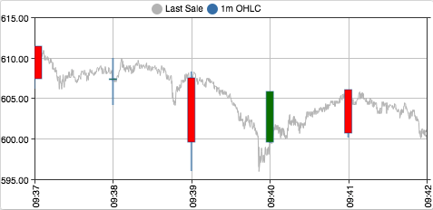
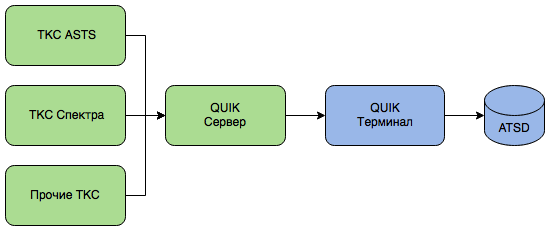
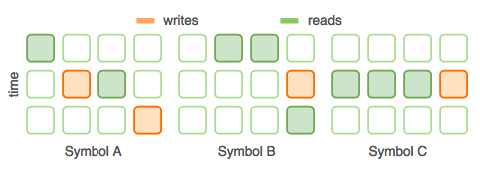
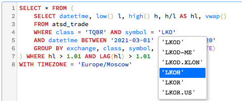
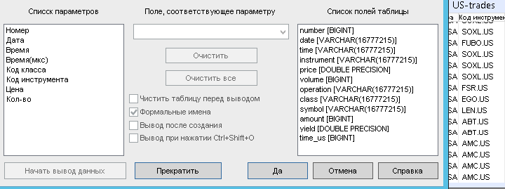
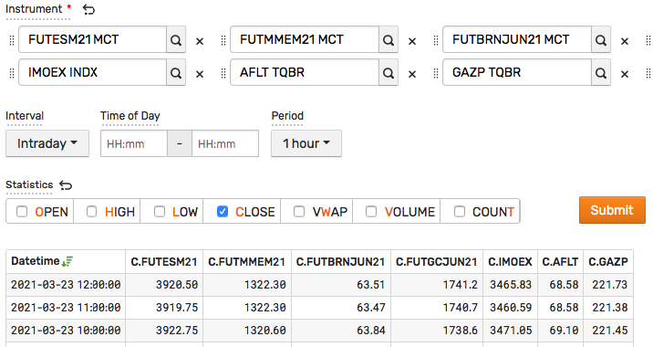

---
# /* yaspeller ignore:start */
landing: true
title: Оптимальное хранение биржевых данных.
description: Оптимальное хранение биржевых данных.
heroText: Оптимальное хранение биржевых данных.
tagline:
actionText: Установка →
actionLink: ./install-quik.md
features:
- title: История всех сделок
  details: Периодическое и <a href="#поточное-копирование" style="color:orange">поточное</a> сохранение обезличенных сделок из терминала QUIK.
- title: Высокая скорость чтения
  details: Параллельный <a href="#отличие-от-стандартных-баз-данных" style="color:orange">движок</a> экспорта данных с различными критериями поиска.
- title: Удобство SQL
  details: Расширенный <a href="sql.html" style="color:orange">SQL</a> синтаксис с оптимизированными вычислениями.
footer: Copyright © 2021 Axibase. QUIK® by ARQA Technologies
#footerActionText: Установка
#footerActionLink: ./install-quik.md
resetStripes: false # If last feature stripe in content is white (even number of highlighted features), set it to true
contactUs:
  title: Запросить демо-доступ
  linkTitle: Демо-доступ
  content: Trial request for financial version
  submitText: Отправить
  firstNameText: Имя
  lastNameText: Фамилия
  emailText: Email
  companyText: Организация
  # messageText: Message
  errorText: Ошибка при отправке запроса
  successText: Запрос отправлен

# /* yaspeller ignore:end */
---
<!-- markdownlint-disable MD002 MD041 MD012 -->
<article class="feature-highlight">

 <!-- yaspeller ignore -->

## Для чего нужна история обезличенных сделок

- Повышение точности обратного тестирования за счет проверки на сделках вместо OHLCV агрегатов
- Разработка новых стратегий на альтернативных агрегатах (volume bars) и преобразованных рядах
- Расчет собственных индикаторов, отсутствующих у торговых платформ
- Аудит качества торговых операций по сравнению с рыночной ценой
- Поиск редких аномалий, в том числе календарных

</article>
<article class="feature-highlight">

 <!-- yaspeller ignore -->

## Интеграция с QUIK

Терминал QUIK может быть настроен для получения обезличенных сделок. Сделки в таблице `all_trades` накапливаются в течение торгового дня и очищаются при подключении терминала на следующий день.

ATSD позволяет сохранять ежедневные данные таблицы обезличенных сделок в структурированном виде для целей долгосрочного хранения и статистического анализа.

</article>
<article class="feature-highlight">

 <!-- yaspeller ignore -->

## Отличие от файлов

- Поиск по индексу значительно быстрее, чем последовательное чтение файлов
- Дополнительное ускорение благодаря кэшированию и параллельному чтению
- Отсутствие блокировок - чтение и запись происходят одновременно
- Мгновенная видимость сделки для чтения до записи в файл
- Возможность редактирования, удаления и добавления сделок без перезаписи
- Все преимущества SQL включая группировки, сортировки, и функции

</article>
<article class="feature-highlight">

 <!-- yaspeller ignore -->

## Отличие от реляционных баз данных

- Устранены накладные расходы, присущие реляционной схеме хранения
- Отдельные блоки SQL DML усовершенствованы для обработки временных рядов
- Параллельное чтение из сегментированной таблицы позволяет достичь высокой производительности несмотря на большие массивы данных
- Сжатое хранение в оптимальной кодировке сокращает потребности в дисковом пространстве на 80%
- Реализованные функции подсчета агрегатов учитывают специфику данных

</article>
<article class="feature-highlight">

 <!-- yaspeller ignore -->

## Ежедневное копирование

- Производится в интервале с момента окончания торгов до подключения терминала QUIK в последующий торговый день
- Выгрузка из таблицы `all_trades` производится скриптом Lua, который постоянно запущен, и активируется в определенный момент
- Скрипт Lua сохраняет данные в файл на локальной файловой системе, производит архивацию файла и отправляет архив в ATSD
- Обработка на стороне ATSD производится асинхронно с созданием отчета по результатам обработки файла
- Ежедневный файл может достигать нескольких гигабайтов при количестве сделок до 100 млн.

</article>
<article class="feature-highlight">

 <!-- yaspeller ignore -->

## Поточное копирование

- Производится путем установки [ODBC](https://github.com/axibase/atsd-quik/releases/tag/v1.0.0) драйвера
- Активируется при включении режима экспорта для таблицы обезличенных сделок
- Отправка данных производится через websocket по протоколу HTTP/HTTPS
- Данные доступны для чтения в ATSD без задержки
- При сбое отправка восстанавливается с последней переданной записи
- Повторная отправка сделок не приводит к созданию дубликатов
- Сочетание поточного и ежедневного копирования исключает пробелы в данных

</article>
<article class="feature-highlight">

 <!-- yaspeller ignore -->

## Дополнительные источники

- ATSD MOEX консьюмеры позволяют подключиться к FAST Multicast Московской Биржи в зоне колокации
- Подключение дополнительных торговых систем, предоставляющих API для подписки на рыночные данные, например [Transaq](https://www.finam.ru/howtotrade/tconnector/)
- Загрузка данных из внешних источников: следки IEX, данных из Polygon, Alpha Vantage, Yahoo Finance и пр.

</article>