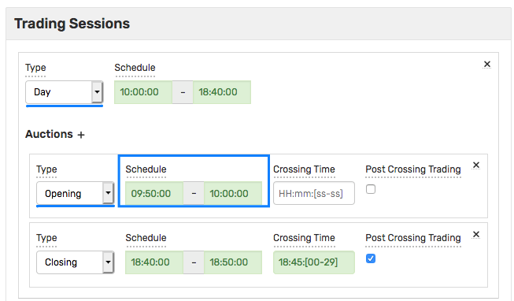

# SQL

ATSD supports SQL for retrieving trades, statistics, session summaries, and reference data.

SQL statements can be executed via the web-based console, on schedule, using the [JDBC](https://github.com/axibase/atsd-jdbc) and [ODBC](https://github.com/axibase/atsd-odbc) drivers, or by submitting the query to the [API endpoint](../sql/api.md).

* [Syntax](#syntax)
  * [SELECT Expression](#select-expression)
  * [WHERE Clause](#where-clause)
  * [Other Clauses](#other-clauses)
  * [Columns](#columns)
  * [Aliases](#aliases)
  * [Literals](#literals)
  * [Interval Condition](#interval-condition)
  * [Functions](#functions)
  * [Arithmetic Operators](#arithmetic-operators)
  * [Match Expressions](#match-expressions)
  * [CASE Expression](#case-expression)
  * [Keywords](#reserved-words)
* [Processing Sequence](#select-processing-sequence)
* [Grouping](#grouping)
* [Date Aggregation](#date-aggregation)
* [Ordering](#ordering)
* [Limiting](#limiting)
* [Options](#options)

## Overview

Each instrument in the database is uniquely identified by a composite key consisting of `exchange`, `class`, and `symbol` columns.

* `exchange` - Exchange or trading venue name such as `NASDAQ`, `NYSE`, `IEX`.
* `class` - Market identifier [code](https://www.iso20022.org/market-identifier-codes) such as `XNGS`, `XNYS`, `IEXG`.
* `symbol` - Instrument ticker such as `TSLA`.

For example, Tesla Inc. common shares traded on the IEX (Investor Exchange) are identified as `IEX` (exchange), `IEXG` (class), `TSLA` (symbol).

> Examples are based on publicly available market data provided by [IEX](https://iextrading.com/apiexhibita/).

### Trades

```sql
SELECT datetime, trade_num, price, quantity
  FROM atsd_trade
WHERE class = 'IEXG' AND symbol = 'TSLA'
  AND datetime BETWEEN '2021-01-13 14:00:00' AND '2021-01-13 14:05:00'
ORDER BY datetime, trade_num
```

```ls
| datetime                   |  trade_num |  price | quantity |
|----------------------------|-----------:|-------:|---------:|
| 2021-01-13 14:00:06.859843 | 1367042482 | 843.67 |      100 |
| 2021-01-13 14:00:11.573151 | 1367352219 | 843.63 |      100 |
| 2021-01-13 14:00:18.013559 | 1368945732 | 844.20 |       16 |
```

### OHLCV Aggregates (Bars)

```sql
SELECT datetime, open(), high(), low(), close(), volume(), vwap()
  FROM atsd_trade
WHERE class = 'IEXG' AND symbol = 'TSLA'
  AND datetime BETWEEN '2021-01-13 14:00:00' AND '2021-01-13 14:05:00'
GROUP BY exchange, class, symbol, PERIOD(1 MINUTE)
ORDER BY datetime
```

```ls
| datetime            | open() | high() |  low() | close() | volume() | vwap() |
|---------------------|-------:|-------:|-------:|--------:|---------:|-------:|
| 2021-01-13 14:00:00 | 843.67 | 844.38 | 843.02 |  843.88 |      910 | 843.71 |
| 2021-01-13 14:01:00 | 843.95 | 845.36 | 843.95 |  844.56 |      895 | 844.69 |
| 2021-01-13 14:02:00 | 845.48 | 845.48 | 844.83 |  844.97 |      503 | 845.10 |
| 2021-01-13 14:03:00 | 845.25 | 845.35 | 844.21 |  844.65 |      996 | 845.01 |
| 2021-01-13 14:04:00 | 844.85 | 846.97 | 844.85 |  846.96 |     1178 | 846.31 |
```

### Instruments

```sql
SELECT tags.class_code AS "class", tags.symbol AS "symbol", tags.cfi_code AS "CFI", tags.isin AS "ISIN",
  COALESCE(tags.stock_code, REPLACE(tags.symbol, '-RM', '')) AS "code", tags.short_name AS "name"
  FROM atsd_entity
WHERE tags.symbol LIKE 'TSLA%'
  ORDER BY "symbol"
```

```ls
| class     | symbol  | CFI    | ISIN         | code | name        |
|-----------|---------|--------|--------------|------|-------------|
| IEXG      | TSLA    |        | US88160R1014 | TSLA | TESLA INC   |
| FQBR      | TSLA-RM | ESXXXX | US88160R1014 | TSLA | Tesla       |
| PBXM      | TSLA.S  | ESVUFR | US88160R1014 | TSLA | Tesla, Inc. |
| STOCK_USA | TSLA.US |        | US88160R1014 | TSLA | TESLA INC   |
```

### Session Summary

```sql
SELECT datetime, type, stage, auctprice, auctvolume, bid, offer, last
  FROM atsd_session_summary
WHERE class = 'IEXG' AND symbol = 'TSLA'
  AND datetime BETWEEN '2021-01-11' AND '2021-01-13'
```

```ls
| datetime            | type | stage |   open |  close | voltoday |
|---------------------|------|-------|-------:|-------:|---------:|
| 2021-01-11T00:00:00 | Day  | NA    | 849.40 | 811.19 | 59554100 |
| 2021-01-12T00:00:00 | Day  | NA    | 831.00 | 849.44 | 46270700 |
```

## Syntax

The SQL statement begins with `SELECT` keyword and can end with a semi-colon character.

### `SELECT` Syntax

The `SELECT` statement consists of a `SELECT` expression, a `FROM` query, a `WHERE` clause, and other clauses for filtering, grouping, and ordering the results.

```sql
SELECT { * | { expr [ .* | [ AS ] alias ] } }
  FROM <table> [[ AS ] alias ]
WHERE booleanExpr
  [ WITH withExpr ]
[ GROUP BY expr [, ...] ]
  [ HAVING booleanExpr ]
  [ WITH withExpr ]
[ ORDER BY expr [{ ASC | DESC }] [, ...] ]
[ LIMIT count [ OFFSET skip ]]
  [ OPTION(expr) [...]]
```

Example:

```sql
SELECT datetime, trade_num, price, quantity   -- SELECT expression
  FROM atsd_trade                             -- table name
WHERE class = 'IEXG' AND symbol = 'TSLA'      -- WHERE clause
  AND datetime BETWEEN '2021-01-13 14:00:00' AND '2021-01-13 14:05:00'
ORDER BY datetime, trade_num                  -- other clauses
  LIMIT 100
```

### `SELECT` Processing Sequence

* **FROM** retrieves rows from the specified table.
* **WHERE** filters rows.
* **GROUP BY** assigns rows to groups.
* **HAVING** filters groups.
* **SELECT** chooses columns or creates new columns.
* **ORDER BY** sorts rows by value of its columns.
* **LIMIT** selects a subset of rows.

### SELECT Expression

The `SELECT` expression contains one or multiple columns and expressions applied to the query results.

```sql
SELECT column1, UPPER(column2), 100 * column3
  FROM ...
```

### Tables

The `FROM` query can reference the built-in `atsd_trade`, `atsd_session_summary`, and `atsd_entity` tables.

#### `atsd_trade` Table

The `atsd_entity` contains trade records.

```sql
SELECT *
  FROM atsd_trade
WHERE class = 'IEXG' AND symbol = 'TSLA'
  AND datetime BETWEEN '2021-01-13 14:00:00' AND '2021-01-13 14:05:00'
LIMIT 10
```

```ls
| datetime                   |  trade_num |  price | quantity | symbol | class | exchange | side | session | order_num |
|----------------------------|-----------:|-------:|---------:|--------|-------|----------|-----:|---------|----------:|
| 2021-01-13 14:00:06.859843 | 1367042482 | 843.67 |      100 | TSLA   | IEXG  | IEX      |      | N       |           |
| 2021-01-13 14:00:11.573151 | 1367352219 | 843.63 |      100 | TSLA   | IEXG  | IEX      |      | N       |           |
| 2021-01-13 14:00:18.013559 | 1368945732 | 844.20 |       16 | TSLA   | IEXG  | IEX      |      | N       |           |
```

#### `atsd_session_summary` Table

The `atsd_entity` contains instrument statistics at the end of each session and auction stage during the trading day.

```sql
SELECT *
  FROM atsd_session_summary
WHERE class = 'IEXG' AND symbol IN ('TSLA', 'AAPL')
  AND datetime BETWEEN '2021-01-11' AND '2021-01-13'
```

```ls
| datetime            | exchange | class     | symbol  | type | stage |  close | close_adj | closeprice |   high |    low |   open |  voltoday |
|---------------------|----------|-----------|---------|------|-------|-------:|----------:|-----------:|-------:|-------:|-------:|----------:|
| 2021-01-11T00:00:00 | QUIK     | STOCK_USA | AAPL.US | Day  | NA    | 128.98 |    128.78 |     128.98 | 130.17 | 128.50 | 129.19 | 100620900 |
| 2021-01-12T00:00:00 | QUIK     | STOCK_USA | AAPL.US | Day  | NA    | 128.80 |    128.60 |     128.80 | 129.69 | 126.86 |  128.5 |  91951100 |
```

#### `atsd_entity` Table

The `atsd_entity` contains instruments and their [fields](../api/meta/entity/list.md#fields).

The instruments have two required tags: `class_code` and `symbol`.

```sql
SELECT name, date_format(creationTime) AS created, tags.isin
  FROM atsd_entity
WHERE tags.class_code != '' AND tags.symbol LIKE 'AA%'
```

```ls
| name                | created                 | tags.isin    |
|---------------------|-------------------------|--------------|
| tsla_[iexg]         | 2020-03-29T12:19:14.048 | US88160R1014 |
| tsla.us_[stock_usa] | 2020-01-06T19:05:00.071 | US88160R1014 |
```

### WHERE Clause

The `WHERE` clause is a condition which must be satisfied by the row to be included in results.

Columns referenced in the `WHERE` clause are replaced by their value for the given row. The condition is then evaluated for each row, and if the result is `true`, the row is included in the result set.

Typically, the `WHERE` clause includes an [interval condition](#interval-condition) to retrieve trades for the specified time range.

The clause can be built from multiple conditions, each comparing values using operators:

* Numeric operators: `<, >, <=, >=, =, <>, !=`.
* String operators: `<, >, <=, >=, =, <>, !=, LIKE, REGEX, IS`.

> The operators `!=` and `<>` cannot be applied to columns `time` and `datetime`.
> The operators `<, >, <=, >=` perform lexicographical comparison when applied to string values.

The result of evaluating a condition is a boolean value. Multiple conditions can be combined using the logical operators `AND`, `OR`, and `NOT`.

```sql
WHERE (class = 'IEXG' AND symbol = 'TSLA' OR class = 'STOCK_USA' AND symbol LIKE 'TSLA%')
  AND datetime BETWEEN '2021-01-13 14:00:00' AND '2021-01-13 14:05:00'
  AND amount > 100000
```

#### Operator Precedence

* `-` (unary minus)
* `*`, `/`, `%` (modulo)
* `+`, `-` (binary minus)
* `=`, `<>`, `>=`, `>`, `<=`, `<`, `!=`, `IS`, `LIKE`, `REGEX`, `IN`
* `BETWEEN`, `CASE`, `WHEN`, `THEN`, `ELSE`
* `NOT`
* `AND`
* `OR`

Operators with the same precedence level within an expression are processed from left to right.

#### Truth Tables for Logical Operators

| **X** | **NOT X** |
|:---|:---|
| `true` | `false` |
| `false` | `true` |
| `NULL` | `NULL` |

| **X** | **Y** | **X AND Y** | **X OR Y** |
|:---|:---|:---|:---|
| `true` | `true` | `true` | `true` |
| `true` | `false` | `false` | `true` |
| `false` | `false` | `false` | `false` |
| `true` | `NULL` | `NULL` | `true` |
| `false` | `NULL` | `false` | `NULL` |
| `NULL` | `NULL` | `NULL` | `NULL` |

### Other Clauses

* **GROUP BY**
* **HAVING**
* **ORDER BY**
* **LIMIT**, **OFFSET**

### Data Types

| **Type Name** | **Type Alias** |
|---------|--------|
| BOOLEAN | - |
| DECIMAL | - |
| DOUBLE | - |
| FLOAT | - |
| INTEGER | INT |
| BIGINT | LONG |
| SMALLINT | SHORT |
| VARCHAR | STRING |
| TIMESTAMP | - |
| JAVA_OBJECT | - |

The `NUMBER` (parent type for all numeric data types) and `STRING` type can be used to convert data types with the [`CAST`](#cast) function.

The `BOOLEAN` type is produced by including boolean comparisons in the `SELECT` expression.

```sql
SELECT datetime, price, quantity, quantity>10 FROM atsd_trade
```

```ls
| datetime                   | price | quantity | quantity > 10 |
|----------------------------|------:|---------:|---------------|
| 2020-12-23 10:00:44.299713 |  9909 |        1 | false         |
| 2020-12-23 10:01:54.397582 | 10007 |        3 | false         |
| 2020-12-23 10:01:54.397582 | 10210 |       31 | true          |
```

### Comments

Comments can be inserted into SQL statements with `--` (two hyphens) and `/* */` (multi-line) to provide descriptive information about the query and its expected results.

```sql
-- comment single-line text

/*
  comment text on
  multiple lines
*/
```

Comments are not allowed after the statement termination character `;`.

## Columns

### Trade Columns

|**Name**|**Type**|**Required**|**Description**|
|:---|:---|---|:---|
|`datetime`         |timestamp   | Yes | Datetime of the trade with microsecond precision.|
|`trade_num`         |varchar   | Yes | Trade number assigned by the exchange.|
|`price`          |number   | Yes | Trade price (can be negative).|
|`quantity`           |bigint   | Yes | Quantity of securities (or lots) in the trade.|
|`symbol`    |varchar   | Yes | Instrument symbol (ticker).|
|`class`           |varchar   | Yes | Instrument board, class, or section on the exchange.|
|`exchange`         |varchar   | Yes | Exchange where the trade is processed.|
|`side`       |varchar | No | Direction of the trade: `B` (buy), `S` (sell), or `NULL`.|
|`session`           |varchar     | No | Trading [session code](sessions.md). `O` - opening auction, `N` - normal trading, `L` - closing auction crossing, `E` - closing auction post-crossing.|
|`order_num`           |varchar   | No | Order number which initiated the trade.|

The above columns can be requested with the `SELECT *` syntax, except for queries with the `GROUP BY` aggregation clause.

```sql
SELECT *, CAST(ISNULL(entity.tags.lot, 1) AS number)*price AS amt
  FROM atsd_trade
WHERE class = 'IEXG' AND symbol = 'TSLA'
  AND datetime BETWEEN '2021-01-13 14:00:00' AND '2021-01-13 14:05:00'
ORDER BY datetime
```

```ls
| datetime                   |  trade_num |  price | quantity | symbol | class | exchange | session |    amt |
|----------------------------|-----------:|-------:|---------:|--------|-------|----------|---------|-------:|
| 2021-01-13 14:00:06.859843 | 1367042482 | 843.67 |      100 | TSLA   | IEXG  | IEX      | N       | 843.67 |
| 2021-01-13 14:00:11.573151 | 1367352219 | 843.63 |      100 | TSLA   | IEXG  | IEX      | N       | 843.63 |
| 2021-01-13 14:00:18.013559 | 1368945732 | 844.20 |       16 | TSLA   | IEXG  | IEX      | N       | 844.20 |
```

### Entity Columns

|**Name**|**Type**|**Description**|
|:---|:---|:---|
|`entity`   |varchar   | Instrument name, always `<symbol>_[<class_code>]`.|
|`entity.label`   |varchar   | Instrument label.|
|`entity.tags.{name}` |varchar| Entity tag value. Returns `NULL` if the specified tag does not exist for this entity.|
|`entity.tags`    |varchar   | All entity tags, concatenated to `name1=value;name2=value` format.|
|`entity.creationTime`| bigint | Creation time as Unix time with millisecond precision.|
|`entity.versionTime`| bigint | Change time as Unix time with millisecond precision. Last time when entity tags or fields are modified.|
|`entity.groups`| varchar | List of groups to which the instrument belongs.|

Specific tags can be accessed by name such as `entity.tags.{name}`. If the field is not present, the `tags.{tag-name}` expression returns `NULL`. To filter records with or without specified series tags, use the `IS NOT NULL` or `IS NULL` operators.

Commonly used instrument tags:

* `class_code`
* `symbol`
* `name`
* `short_name`
* `lot`
* `step`
* `scale`
* `face_value`
* `currency`
* `trade_currency`
* `isin`
* `cfi_code`
* `cusip_code`
* `regnumber`
* `issue_size`
* `exchange_link`
* `list_level`
* `mat_date`
* `couponperiod`
* `couponvalue`
* `nextcoupon`

The `entity.groups` column can be referenced in the `WHERE` clause to filter results based on group membership.

Supported syntax:

```sql
entity.groups IN ('group-1', 'group-2') -- instrument belongs to one of the groups listed in the IN clause
entity.groups NOT IN ('group-1', 'group-1') -- instrument does NOT belong to any of the groups listed in the IN clause
'group-1' IN entity.groups -- instrument belongs to the specified group
'group-1' NOT IN entity.groups -- instrument does NOT belong to the specified group
```

### Computed Columns

New columns can be created by applying functions and arithmetic expressions to existing columns. The computed columns can be included both in the `SELECT` expression, as well as in the `WHERE`, `HAVING`, and `ORDER BY` clauses.

```sql
SELECT datetime, price, quantity, price*quantity AS amt
  FROM atsd_trade
WHERE class = 'IEXG' AND symbol = 'TSLA'
  AND datetime BETWEEN '2021-01-13 14:00:00' AND '2021-01-13 14:05:00'
ORDER BY datetime
```

```ls
| datetime                   |  price | quantity |      amt |
|----------------------------|-------:|---------:|---------:|
| 2021-01-13 14:00:06.859843 | 843.67 |      100 | 84367.00 |
| 2021-01-13 14:00:11.573151 | 843.63 |      100 | 84363.00 |
| 2021-01-13 14:00:18.013559 | 844.20 |       16 | 13507.20 |
```

## Identifiers

Use **double quotation marks** to enquote a table name, column name, tag name or an alias if it contains a reserved column name, a [keyword](#reserved-words), a function name, or a special character including space, `.`, `+`, `-`, `*`, `/`, `,`, `"`, `'`.

```sql
-- Special character
SELECT *, entity.tags."coupon-value"

-- Reserved column name
SELECT price/10 AS "price"

-- SQL identifier
SELECT side AS "select"

-- Function name: avg
SELECT "avg"
```

Double quotes in identifiers can be escaped by doubling the quote symbol.

```sql
-- column alias: The "main" entity
SELECT entity AS "The ""main"" entity"

-- series tag: hello"world
SELECT entity.tags."hello""world"
```

### Aliases

Table and column aliases can be unquoted or enclosed in double quotation marks.

Unquoted alias must begin with letter `[a-zA-Z]`, followed by a letter, digit or **underscore**.

The `AS` keyword is optional.

```sql
SELECT quantity*price*entity.tags.lot AS "amt", datetime "d-t"
  FROM atsd_trade
WHERE class = 'IEXG' AND symbol = 'TSLA'
  AND datetime BETWEEN '2021-01-13 14:00:00' AND '2021-01-13 14:05:00'
  ORDER BY "d-t"
```

### Reserved Words

```ls
AND AS ASC AUTO BETWEEN BY CALENDAR CASE CAST CURRENT DAYOFMONTH
DAYOFWEEK DAYOFYEAR DBTIMEZONE DELETE DENSE_RANK DESC DETAIL
DISTINCT ELSE END ENDTIME END_TIME ENTITY ESCAPE EXCL EXTEND
FALSE FIRST_VALUE_TIME FLOAT FROM FULL GROUP GROUPS HAVING IN
INCL INNER INTEGER INTERPOLATE IS ISNULL JOIN LAG LAST_TIME
LEAD LIKE LIMIT LINEAR LOOKUP MAPDB METRIC NAN NEXT NO NONE
NOT NULL NUMBER OFFSET ON OPTION OR ORDER OUTER PERIOD POPULATION
PRECEDING PREVIOUS RANK REGEX ROW ROW_MEMORY_THRESHOLD ROW_NUMBER
SAMPLE SELECT START_TIME STEP STRING THEN TIME TIMESTAMP TIMEZONE
TRUE USING VALUE WEEKOFYEAR WHEN WHERE WITH WORKDAY_CALENDAR YES
```

 The reserved words also include [calendar keywords](../shared/calendar.md#keywords) such as `NOW`, `PREVIOUS_HOUR` and [interval units](../shared/calendar.md#interval-units) such as `MINUTE`, `HOUR`.

## Literals

The literal is a constant value specified in the query, such as `'TSLA'`, `112`, or `'2020-08-15T00:00:00Z'`. The database supports literals for `string`, `timestamp`, and `number` data types, as well as the `NULL` literal.

```sql
-- string literal
WHERE symbol = 'TSLA'

-- timestamp literal
WHERE datetime >= '2021-01-13 14:00:00'

-- number literal
WHERE quantity < 75
```

The string and timestamp literals must be enclosed in **single** quotation marks.

A literal value containing single quotes can be escaped by doubling the single quote symbol.

```sql
-- literal = a'b
WHERE entity.tags.name LIKE '%a''b%'
```

### NULL

The `NULL` literal represents `null`, or unknown value. Scalar expressions with arithmetic operators such as `number + NULL` produce `NULL` if any operand is `NULL`.

Likewise, numeric and string operators, except `IS NULL` and `IS NOT NULL`, return `NULL` if any operand is `NULL`.

The `IS NULL expr` operator returns `true` if the expression is `NULL` or `NaN`.

The `IS NOT NULL expr` operator returns `true` if the expression is neither `NULL` nor `NaN`.

Assuming the `tags.status` column is `NULL`, or has no value:

| **Result** | **Expression** |
|:---|:---|
| `NULL` | `tags.status > 'a'` |
| `NULL` | `tags.status <= 'a'` |
| `NULL` | `tags.status <> 'a'` |
| `NULL` | `tags.status = NULL` |
| `NULL` | `tags.status = NULL` |
| `NULL` | `tags.status <> NULL` |
| `NULL` | `tags.status = tags.status` |
| `true` | `tags.status IS NULL` |
| `false` | `tags.status IS NOT NULL` |
| `NULL` | `tags.status IS NULL AND tags.status = NULL` |

Since the `WHERE` clause selects only rows that evaluate to `true`, conditions such as `tags.{name} = 'a' OR tags.{name} != 'a'` ignore rows with undefined `{name}` tag because both expressions evaluate to `NULL` and (`NULL` OR `NULL`) still returns `NULL`.

`NULL` and `NaN` values are ignored by [aggregate](#aggregate-functions) and [analytical](#analytical-functions) functions.

Logical expressions treat `NaN` as `NULL`. Refer to the truth tables above for more details on how `NULL` is evaluated by logical operators.

### Not a Number (`NaN`)

The database returns special values if the computation result cannot be represented with a real number, for example in case of division by zero or √ of a negative number.

The returned values follow [IEEE 754-2008](https://standards.ieee.org/findstds/standard/754-2008.html) standard.

* `NaN` for indeterminate results such as `0/0` (zero divided by zero).
* `NaN` for illegal values.
* Signed Infinity for `x/0` where x != 0.

Because the `BIGINT` data type does not support `Infinity` constant, the returned Double `Infinity` constant, when cast to `BIGINT`, is replaced with `9,223,372,036,854,775,807` or `-9,223,372,036,854,775,808` depending on sign.

```sql
SELECT price, SQRT(-1*price), price/0, 1/0, -1/0, 1/0-1/0
  FROM atsd_trade
WHERE class = 'IEXG' AND symbol = 'TSLA'
  AND datetime BETWEEN '2021-01-13 14:00:00' AND '2021-01-13 14:05:00'
LIMIT 1
```

```ls
|  price | sqrt(-1 * price) | price / 0 |    1 / 0 |    -1 / 0 | 1 / 0 - 1 / 0 |
|-------:|-----------------:|----------:|---------:|----------:|--------------:|
| 843.67 |              NaN |  Infinity | Infinity | -Infinity |           NaN |
```

The result of comparing `NaN` with another number is indeterminate (`NULL`).

The `NaN` can be compared similar to `NULL` using `IS` operator:

```sql
AND sqrt(price-100) IS NOT NULL
```

### Case Sensitivity

* SQL reserved words are case-insensitive.
* Trade columns `exchange`, `class`, `symbol`, and `side` are case-**insensitive**.
* Entity column values and tag names are case-**insensitive**, except in `LIKE` and `REGEX` operators.
* In all other cases, operations on string literals are case-**sensitive**.

```sql
SELECT * FROM atsd_trade
WHERE class = 'IEXG' AND symbol = 'TSLA' AND side = 's' AND entity.tags.name LIKE 'Ga%'
  AND datetime BETWEEN '2021-01-13 14:00:00' AND '2021-01-13 14:05:00'
LIMIT 1
```

## Arithmetic Operators

Arithmetic operators, including `+`, `-`, `*`, `/`, and `%` (modulo) can be applied to numeric columns or literal number.

> The modulo operator `%` returns the remainder of one number divided by another, for instance `14 % 3` (= 2).

:::tip Note
Arithmetic calculations are performed with `double` precision.
:::

```sql
SELECT datetime, SUM(quantity), SUM(price*quantity*entity.tags.lot) AS amount
  FROM atsd_trade
WHERE class = 'IEXG' AND session = 'X' AND symbol LIKE 'TS%'
  AND datetime BETWEEN '2021-01-13 14:00:00' AND '2021-01-13 14:05:00'
  GROUP BY period(5 MINUTE)
```

## Match Expressions

### IN Expression

The `IN` expression returns `true` if the value on the left is equal to one of the comma-separated values enumerated in parentheses after the `IN` operator.

```sql
valueLeft [NOT] IN (valueRight [, valueRight])
```

The `IN` operator provides an alternative to multiple `OR` conditions.

```sql
SELECT * FROM atsd_trade
WHERE class = 'IEXG' AND symbol IN('TSLA', 'AAPL')
  AND datetime BETWEEN '2021-01-13 14:00:00' AND '2021-01-13 14:05:00'
```

### LIKE Expression

The `LIKE` expression returns `true` if the value matches the specified string pattern which supports `%` and `_` wildcards.

* Percent sign `%` matches zero or more characters in the value.

* Underscore `_` matches exactly one character in the value.

The comparison is case-**sensitive**, including **entity and metric** names which are converted to lower case when stored in the database.

```sql
SELECT * FROM atsd_trade
WHERE class = 'IEXG' AND symbol LIKE 'AA%'
  AND datetime BETWEEN '2021-01-13 14:00:00' AND '2021-01-13 14:05:00'
```

Wildcard symbols present in the pattern can be escaped with a backslash `\` which serves as the default escape character.

```sql
-- Default escape character
WHERE class = 'IEXG' AND entity.tags.name LIKE '%a\_b%'
```

The escape character can be customized by adding an `ESCAPE` clause after the `LIKE` expression.

```sql
-- Custom escape character
WHERE class = 'IEXG' AND entity.tags.name LIKE '%a~_b%' ESCAPE '~'
```

In the example above, the underscore is evaluated as a regular character (not as a wildcard) because the underscore preceded by an `~` escape character.

### Regular Expressions

The `REGEX` expression matches column value against a [regular expression](https://docs.oracle.com/javase/8/docs/api/java/util/regex/Pattern.html) and returns `true` if the text is matched.

```sql
SELECT * FROM atsd_trade
WHERE class = 'IEXG' AND symbol REGEX 'AA.*|.*GOO.*'
  AND datetime BETWEEN '2021-01-13 14:00:00' AND '2021-01-13 14:05:00'
```

`REGEX` can be used to match one of multiple conditions as an alternative to multiple `LIKE` expressions.

```sql
WHERE exchange = 'IEX'
  AND (symbol LIKE 'AA%'
    OR symbol LIKE '%GOO%')
```

Special instructions such as `(?i)` for [case-**insensitive** match](https://docs.oracle.com/javase/8/docs/api/java/util/regex/Pattern.html#CASE_INSENSITIVE) can be added to customize the matching rules.

```sql
entity.tags.name REGEX '(?i)Auto.*'
```

## BETWEEN Expression

The `BETWEEN` operator is inclusive by default and returns `true` if the test expression satisfies the lower range, the upper range, or is between the ranges.

The optional `INCL` and `EXCL` instructions override the default inclusion rules.

```sql
test_expr BETWEEN lower_range [ INCL | EXCL ] AND lower_range [ INCL | EXCL ]
```

```sql
-- returns TRUE
10 BETWEEN 1 AND 10

-- returns FALSE
10 BETWEEN 1 AND 10 EXCL
```

The `EXCL` instruction can be used to exclude the end of the date selection interval.

```sql
-- Excludes trades recorded exactly at 14:00 and 14:05
SELECT * FROM atsd_trade ...
  WHERE datetime BETWEEN '2021-01-13 14:00:00' EXCL
                     AND '2021-01-13 14:05:00' EXCL
```

```sql
-- Includes trades recorded exactly at 14:00 and 14:05
SELECT * FROM atsd_trade ...
  WHERE datetime BETWEEN '2021-01-13 14:00:00'
                     AND '2021-01-13 14:05:00'
```

## CASE Expression

The `CASE` expression provides a way to use `IF THEN` logic in various parts of the query. Both simple and searched syntax options are supported.

### Searched `CASE` Expression

The searched `CASE` expression evaluates a sequence of boolean expressions and returns a matching result expression.

```sql
CASE
     WHEN search_expression THEN result_expression
     [ WHEN search_expression THEN result_expression ]
     [ ELSE result_expression ]
END
```

Each `search_expression` must return a boolean (`true`/`false`) value.

The `result_expression` can be a literal value (number, text) or an expression. Result expressions in the same `CASE` construct are allowed to return values of different data types.

>If the data types are different (such as a number and a varchar), the database classifies the column with `JAVA_OBJECT` to the [JDBC](https://github.com/axibase/atsd-jdbc) driver.

If no `search_expression` is matched and the `ELSE` condition is not specified, the `CASE` expression returns `NULL`.

```sql
SELECT *, CASE
    WHEN symbol = 'TSLA' THEN 1 ELSE 0 END AS sign
  FROM atsd_trade
WHERE (class = 'IEXG' AND symbol = 'TSLA' OR class = 'IEXG' AND symbol LIKE 'AAP%')
  AND datetime BETWEEN '2021-01-13 14:00:00' AND '2021-01-13 14:05:00'
ORDER BY datetime
```

```ls
| datetime                   |  trade_num |  price | quantity | symbol | class | exchange | session | sign |
|----------------------------|-----------:|-------:|---------:|--------|-------|----------|---------|-----:|
| 2021-01-13 14:00:00.743616 | 1366704097 | 130.86 |       93 | AAPL   | IEXG  | IEX      | N       |    0 |
| 2021-01-13 14:00:02.372185 | 1366805446 | 130.86 |      100 | AAPL   | IEXG  | IEX      | N       |    0 |
| 2021-01-13 14:00:06.859843 | 1367042482 | 843.67 |      100 | TSLA   | IEXG  | IEX      | N       |    1 |
```

### Simple `CASE` Expression

The simple `CASE` expression compares the `input_expression` with `compare_expression`s and returns the `result_expression` when the comparison is `true`.

```sql
CASE input_expression
     WHEN compare_expression THEN result_expression
     [ WHEN compare_expression THEN result_expression ]
     [ ELSE result_expression ]
END
```

```sql
SELECT datetime, class, symbol, price, quantity, CASE
    WHEN symbol = 'TSLA' THEN 1
    ELSE 0
  END AS sign,
  CASE symbol
    WHEN 'TSLA' THEN 1
    WHEN 'AAPL' THEN 0
    ELSE -1
  END AS sign_2
  FROM atsd_trade
WHERE (class = 'IEXG' AND symbol = 'TSLA' OR class = 'SPBFUT' AND symbol LIKE 'AAP%')
  AND datetime BETWEEN '2021-01-13 14:00:00' AND '2021-01-13 14:05:00'
ORDER BY datetime
```

```ls
| datetime                   | class | symbol |  price | quantity | sign | sign_2 |
|----------------------------|-------|--------|-------:|---------:|-----:|-------:|
| 2021-01-13 14:00:00.743616 | IEXG  | AAPL   | 130.86 |       93 |    0 |      0 |
| 2021-01-13 14:00:02.372185 | IEXG  | AAPL   | 130.86 |      100 |    0 |      0 |
| 2021-01-13 14:00:06.859843 | IEXG  | TSLA   | 843.67 |      100 |    1 |      1 |
```

The `CASE` expressions can be nested by using `CASE` within the `result_expression`:

```sql
CASE date_format(time, 'yyyy')
    WHEN '2016' THEN
      CASE
        WHEN IS_WEEKDAY(time, 'USA') THEN '16'
        ELSE '17'
      END
    WHEN '2017' THEN '18'
    WHEN '2018' THEN '17'
    ELSE '15'
END AS "Tax Day"
```

## Interval Condition

An interval condition determines the date range for the retrieved samples and is specified in the `WHERE` clause using the `datetime` column.

The `datetime` column accepts literal dates and supports [calendar expressions](../shared/calendar.md#keywords).

```sql
SELECT * FROM atsd_trade
WHERE class = 'IEXG' AND symbol = 'TSLA'
  datetime BETWEEN '2021-01-13 14:00:00' AND '2021-01-13 14:05:00'
   -- datetime >= NOW - 15*MINUTE
```

The above query selects samples recorded between `13:00` and `14:00` on `2020-12-23` in the UTC time zone. This includes trades recorded exactly at `13:00` and `14:00` because the `BETWEEN` operator is inclusive by default.

:::tip `BETWEEN` is inclusive

`column BETWEEN a AND b` is equivalent to `column >= a AND column <= b`.

:::

To exclude the end of the selection interval, add the `EXCL` instruction to override the default `BETWEEN` behavior.

```sql
AND datetime BETWEEN '2021-01-13 14:00:00' AND '2021-01-13 14:05:00' EXCL
```

The `datetime` column accepts literal dates in one of the following formats:

| **Format** | **Time Zone or UTC Offset** | **Examples** |
|---|---|---|
| `yyyy-MM-ddTHH:mm:ss[.S](Z\|±hh[:]mm)` | As specified | `2021-01-13T15:30:00.077Z`<br>`2021-01-13T15:30:00Z`<br>`2021-01-13T15:30:00-05:00`<br>`2021-01-13T15:30:00-0500` |
| `yyyy-MM-dd HH:mm:ss[.S]`| Database or [query](#with-timezone)  | `2021-01-13 15:30:00.077`<br>`2021-01-13 15:30:00` |
| `yyyy[-MM[-dd]]`| Database or [query](#with-timezone)  | `2020`<br>`2020-12`<br>`2020-12-15` |

The UTC time zone is specified as the `Z` letter or as the zero UTC offset `+00:00` (`+0000`).

```sql
WHERE datetime BETWEEN '2021-01-13T14:00:15Z'
                   AND '2021-01-13T14:30:00.077Z'
  -- WHERE datetime BETWEEN '2021-01-13 14:00:15' AND '2021-01-13 14:30:00.077'
  -- WHERE datetime = '2021'
```

If the time zone is not specified, and not set in the SQL console, the literal date value is interpreted using the **database** time zone.

```sql
WHERE datetime BETWEEN '2021-01-13 14:00:15'
                   AND '2021-01-13 14:30:00.077'
```

The default time zone applied to literal dates in the query can be set explicitly using the [`WITH TIMEZONE`](#with-timezone) clause.

```sql
WHERE datetime BETWEEN '2021-01-13 14:00:15'
                   AND '2021-01-13 14:30:00.077'
  WITH TIMEZONE = 'US/Eastern'
```

Literal date values specified using short formats are expanded to the complete date by setting missing units to the first value in the allowed range.

* `'2021-02-13' == '2021-02-13 00:00:00'`
* `'2021-02'    == '2021-02-01 00:00:00'`
* `'2021'       == '2021-01-01 00:00:00'`

To round the dates to the nearest calendar period, use the [`date_round`](#date_round) function.

```sql
WHERE datetime >= date_round(now, 5 MINUTE)
  AND datetime  < date_round(now + 5*minute, 5 MINUTE)
```

### Optimizing Interval Queries

Using the [`date_format`](#date_format) and [`EXTRACT`](#extract) functions in the `WHERE` condition and the `GROUP BY` clause can be inefficient as it causes the database to perform a full scan while comparing literal strings or numbers. Instead, filter dates using the indexed `datetime` column and apply the `PERIOD` function to aggregate trades by interval.

* `WHERE` Clause

```sql
WHERE date_format(time, 'yyyy') > '2021'   -- Slow: full scan with string comparison.
WHERE YEAR(time) > 2021                    -- Slow: full scan with number comparison.
WHERE datetime >= '2021'                   -- Fast: date range scan using an indexed column.
WHERE datetime BETWEEN '2021' AND '2022'   -- Fast: date range scan using an indexed column.
WHERE datetime >= '2021-01-01T00:00:00Z'   -- Fast: date range scan using an indexed column.
```

* `GROUP BY` Clause

```sql
GROUP BY date_format(time, 'yyyy')         -- Slow.
GROUP BY YEAR(time)                        -- Slow.
GROUP BY PERIOD(1 YEAR)                    -- Fast: built-in date aggregation
```

### Calendar Expressions

The `datetime` columns supports [calendar](../shared/calendar.md) keywords and expressions.

```sql
WHERE datetime >= NOW - 15 * MINUTE
  AND datetime < CURRENT_MINUTE
```

The calendar expressions are evaluated according to the database [time zone](../shared/timezone-list.md) which can be customized using the [`ENDTIME`](#endtime) function.

```sql
WHERE datetime BETWEEN ENDTIME(YESTERDAY, 'US/Pacific') AND ENDTIME(CURRENT_DAY, 'US/Pacific')
```

### Multiple Intervals

Multiple intervals can be selected using the `OR` operator.

```sql
AND (datetime BETWEEN '2021-01-13 14:00:00' AND '2021-01-13 14:05:00'
  OR datetime BETWEEN '2021-01-13 16:00:00' AND '2021-01-13 16:05:00')
```

## Grouping

The `GROUP BY` clause groups records into rows that have matching values for the specified grouping columns.

```sql
SELECT exchange, class, symbol, max(price), high()
  FROM atsd_trade
WHERE class = 'IEXG' AND symbol = 'TSLA'
  AND datetime BETWEEN '2021-01-13 14:00:00' AND '2021-01-13 14:05:00'
GROUP BY exchange, class, symbol
```

```ls
| exchange | class | symbol | max(price) | high() |
|----------|-------|--------|-----------:|-------:|
| IEX      | IEXG  | TSLA   |     846.97 | 846.97 |
```

## Date Aggregation

Date aggregation is a special type of `GROUP BY` operation that involves grouping the values into intervals of equal duration, or periods.

### Period

Period is a repeating time interval used to group values occurred within each interval into sets to apply [aggregate](#aggregate-functions) functions to each set separately.

Period syntax:

```sql
GROUP BY PERIOD(time_interval [, timezone])
```

* `timezone` = [Time Zone ID](../shared/timezone-list.md) as literal string, or `entity.timeZone`/`metric.timeZone` column.

```sql
PERIOD(5 MINUTE)
PERIOD(1 DAY, 'US/Eastern')
```

| **Name** | **Description** |
|:---|:---|
| `count` | [**Required**] Number of time units contained in the period. |
| `unit` | [**Required**] [Time unit](../api/data/series/time-unit.md) such as `HOUR`, `DAY`, `WEEK`, `MONTH`, `QUARTER`, `YEAR`. |
| `timezone` | Time zone for aligning periods in `CALENDAR` mode, such as `'US/Eastern'`, `'UTC'`, or `entity.timeZone`.<br>Default: current database time zone.|

```sql
SELECT datetime, exchange, class, symbol, max(price)
  FROM atsd_trade
WHERE class = 'IEXG' AND symbol = 'TSLA'
  AND datetime BETWEEN '2021-01-13 14:00:00' AND '2021-01-13 15:00:00'
GROUP BY exchange, class, symbol, PERIOD(15 MINUTE)
```

```ls
| datetime            | exchange | class | symbol | max(price) |
|---------------------|----------|-------|--------|-----------:|
| 2021-01-13 14:00:00 | IEX      | IEXG  | TSLA   |     852.17 |
| 2021-01-13 14:15:00 | IEX      | IEXG  | TSLA   |     855.45 |
| 2021-01-13 14:30:00 | IEX      | IEXG  | TSLA   |     854.98 |
| 2021-01-13 14:45:00 | IEX      | IEXG  | TSLA   |     855.20 |
```

In grouping queries, the `datetime` returns the same value as `date_format(PERIOD())`.

### HAVING filter

The `HAVING` clause filters grouped rows. It eliminates grouped rows that do not match the specified condition which can contain one or multiple [aggregate](#aggregate-functions) functions.

```sql
HAVING aggregate_function operator value
```

```sql
SELECT datetime, exchange, class, symbol, high(), volume()
  FROM atsd_trade
WHERE class = 'IEXG' AND symbol = 'TSLA'
  AND datetime BETWEEN '2021-01-13 14:00:00' AND '2021-01-13 15:00:00'
GROUP BY exchange, class, symbol, PERIOD(15 MINUTE)
  HAVING volume() > 20000
```

```ls
| datetime            | exchange | class | symbol | high() | volume() |
|---------------------|----------|-------|--------|-------:|---------:|
| 2021-01-13 14:15:00 | IEX      | IEXG  | TSLA   | 855.45 |    22607 |
```

```sql
HAVING AVG(value) > 10 OR MAX(value) > 90
```

## Partitioning

Partitioning is implemented with the `ROW_NUMBER` function, which returns the sequential number of a row within a partition, starting with `1` for the first row in each partition.

A partition is a subset of all rows within the result set, grouped by the specified column. Each row in the result set can belong to only one partition. The partition includes only rows that satisfy the `WITH ROW_NUMBER` condition.

Sample result set, partitioned by symbol and ordered by time:

```sql
SELECT datetime, symbol, price, quantity, trade_num, ROW_NUMBER()
  FROM atsd_trade
WHERE class = 'IEXG' AND symbol IN ('TSLA', 'AAPL')
  AND datetime BETWEEN '2021-01-13 14:00:00' AND '2021-01-13 14:05:00'
WITH ROW_NUMBER(symbol ORDER BY time) <= 3
```

```ls
| datetime                   | symbol |  price | quantity |  trade_num | row_number() |
|----------------------------|--------|-------:|---------:|-----------:|-------------:|
| 2021-01-13 14:00:00.743616 | AAPL   | 130.86 |       93 | 1366704097 |            1 |
| 2021-01-13 14:00:02.372185 | AAPL   | 130.86 |      100 | 1366805446 |            2 |
| 2021-01-13 14:00:08.738940 | AAPL   | 130.85 |      300 | 1367123702 |            3 |
| 2021-01-13 14:00:06.859843 | TSLA   | 843.67 |      100 | 1367042482 |            1 |
| 2021-01-13 14:00:11.573151 | TSLA   | 843.63 |      100 | 1367352219 |            2 |
| 2021-01-13 14:00:18.013559 | TSLA   | 844.20 |       16 | 1368945732 |            3 |
```

::: Difference between Partitioning and Grouping
Unlike the `GROUP BY` clause, partitioning does not reduce the row count. Roll-up functions applied in the `GROUP BY` clause are called _aggregate_ functions, whereas the functions applied to partitions are called _windowing_ or _analytical_ functions.
:::

### ROW_NUMBER

```sql
ROW_NUMBER({partitioning columns} ORDER BY {ordering columns [direction]})
```

The `{partitioning columns}` clause must contain one or multiple columns for splitting the rows, for example `symbol`, `class`, `entity.tags.<tag-name>`, or multiple columns such as `class, symbol`.

The `{ordering columns [direction]}` can refer to any column of the `FROM` clause with an optional `ASC/DESC` sorting direction.

### Analytical Functions

| **Name** | **Description** | **Example** |
|:---|:---|:---|
| `COUNT` | Count of values. | `COUNT(price)` |
| `SUM` | Sum of values. | `SUM(price)` |
| `MIN` | Minimum of values. | `MIN(price)` |
| `MAX` | Maximum of values. | `MAX(price)` |
| `AVG` | Average of values. | `AVG(price)` |
| `PRODUCT` | Product of values. | `PRODUCT(price)` |
| `WAVG` | [Weighted average](../api/data/series/smooth.md#weighted-average) of values. | `WAVG(price)` |
| `WTAVG` | [Time-weighted average](../api/data/series/smooth.md#weighted-time-average) of values. | `WTAVG(price)` |
| `EMA` | [Exponential moving average](../api/data/series/smooth.md#exponential-moving-average) of values.<br>The function requires smoothing factor as the first argument. | `EMA(0.1, price)` |
| `REGR_INTERCEPT` | Slope of the linear regression line. | `REGR_INTERCEPT(price, time)` |
| `REGR_SLOPE` | Intercept of the linear regression line. | `REGR_SLOPE(price, time)*(time+3*60000)` |

For an unbound window `ROW_NUMBER(...) > 0`, an analytical function is applied to **all** rows in the partition. For a sliding window, the function is applied to a subset of rows matching the row number condition.

### Partition Condition

The partition includes rows that satisfy the `WITH ROW_NUMBER` condition which compares the row number with a constant value or the current row number.

* Top-N rows. Includes rows `1` to `5` with largest values.

```sql
WITH ROW_NUMBER(symbol ORDER BY value DESC) <= 5
```

* **Unbound** window. Includes all rows. Applies analytical functions to all rows from first to current.

```sql
WITH ROW_NUMBER(symbol ORDER BY time) > 0
```

* **Sliding** count-based window. Includes all rows. Applies analytical functions to the `10` preceding rows.

```sql
WITH ROW_NUMBER(symbol ORDER BY time) BETWEEN 10 PRECEDING AND CURRENT ROW
```

* **Sliding** time-based window. Includes all rows. Applies analytical functions to the preceding rows in the 5-minute interval.

```sql
WITH ROW_NUMBER(symbol ORDER BY time) BETWEEN 5 MINUTE PRECEDING AND CURRENT ROW
```

### Partition Ordering

Each row in the partition is assigned an ordinal row number, starting with `1`, which can be used to filter sorted rows within each partition.

```sql
WITH ROW_NUMBER(symbol ORDER BY value) <= 10
```

The row numbers can be accessed in the `SELECT` expression using the `row_number()`, `rank()` and `dense_rank()` functions which return an ordinal integer number for each row, starting with `1`. The numbers are assigned **separately** within each partition, **after** the rows in each partition are sorted according to the `{ordering columns [direction]}` clause.

Function | Description
---|---
`row_number()` | Continuously incrementing, unique row number assigned to each row in the partition.<br>Row numbers are unique within each partition.
`rank()` | Incrementing rank number assigned to each row in the partition.<br>Rows with the same values in the sorted columns are assigned the same rank.<br>The rank is incremented by the number of rows with the same values, in which case the sequence of `rank()` numbers has gaps and is not consecutive.
`dense_rank()` | Same as `rank()` function except `dense_rank()` numbers are continuously incremented and thus are consecutive.

```sql
WITH ROW_NUMBER(symbol ORDER BY price DESC) > 0
```

```txt
| value  | row_number()  | rank()  | dense_rank() |
|--------|---------------|---------|--------------|
| 80     | 1             | 1       | 1            |
| 80     | 2             | 1       | 1            |
| 79     | 3             | 3       | 2            |
| 79     | 4             | 3       | 2            |
| 78     | 5             | 5       | 3            |
| 77     | 6             | 6       | 4            |
| 76     | 7             | 7       | 5            |
```

## WITH Clauses

The `withExpr` starts with `WITH` keyword and can contain the following expressions:

```sql
withExpr = ROW_NUMBER expr | TIMEZONE expr
```

```sql
WITH ROW_NUMBER(symbol ORDER BY datetime) < 2
```

```sql
WITH TIMEZONE = 'Europe/Vienna'
```

Multiple `WITH` clauses in the same query can be combined using comma.

```sql
withExpr [, withExpr]
```

```sql
WITH ROW_NUMBER(symbol ORDER BY datetime) < 2, TIMEZONE = 'Europe/Vienna'
```

```sql
WITH TIMEZONE = 'Europe/Vienna', WORKDAY_CALENDAR = 'aus_viex'
```

## Ordering

The default sort order is undefined. Row ordering can be performed by adding the `ORDER BY` clause consisting of column name, column number (starting with 1), or an expression followed by direction (ASC or DESC).

```sql
ORDER BY MAX(price) DESC, symbol
```

Column numbers can be used instead of column names. The number must be a positive integer representing the position of the column in the `SELECT` expression.

```sql
ORDER BY 2 DESC, 1
```

In combination with `LIMIT`, ordering can be used to execute the **top-N** queries.

```sql
ORDER BY MAX(price) DESC
  LIMIT 2
```

### Collation

Strings are ordered lexicographically based on Unicode values. `NULL` has the lowest possible value and is listed first when sorted in ascending order.

| **ATSD** | **MySQL** | **PostgreSQL** | **Oracle** |
| ---- | ---- | ---- | ---- |
| 0 U+0030 | 0 | 0 | 0 |
| 1 U+0031 | 1 | 1 | 1 |
| A U+0041 | A | a | A |
| B U+0042 | a | A | B |
| C U+0043 | B | b | C |
| T U+0054 | b | B | T |
| U U+0055 | C | C | U |
| a U+0061 | t | t | a |
| b U+0062 | T | T | b |
| t U+0074 | U | U | t |
| z U+007A | z | z | z |

### Limiting

To reduce the number of rows returned by the database for a given query, add the `LIMIT` clause at the end of the query.

The `LIMIT` clause provides two syntax alternatives:

| **Syntax** | **Example** | **Description** |
|:---|:---|:---|
| `LIMIT` `[offset,] count` | `LIMIT 3, 5` | Select 5 rows starting with 4th row |
| `LIMIT` `[offset,] count` | `LIMIT 0, 5` | Select 5 rows starting with 1st row |
| `LIMIT` count `OFFSET` offset| `LIMIT 5 OFFSET 3` | Select 5 rows starting with 4th row |
| `LIMIT` count `OFFSET` offset| `LIMIT 5 OFFSET 0` | Select 5 rows starting with 1st row |

Note that row numbering starts at 0, hence `LIMIT 0, 5` is equivalent to `LIMIT 5`.

The limit applies to the number of rows returned by the database, not the number of records found.

```sql
ORDER BY price
LIMIT 1
```

The above query retrieves all trades, even though it returns only 1 record as instructed by the `LIMIT` clause.

## Inline Views

Inline view is a subquery specified in the `FROM` clause instead of a table.

```sql
-- parent (or outer) query
SELECT expr FROM (
  -- subquery (or inner / nested query)
  SELECT expr ...
)
```

The subquery defines a virtual table processed by the parent query. The virtual table can be assigned an alias.

```sql
SELECT tbl.symbol AS sym,
    AVG(tbl.daily_volume) AS avg_daily_volume,
    MAX(tbl.daily_volume) AS max_daily_volume,
  COUNT(tbl.daily_volume) AS trading_days
FROM (
  SELECT CURRENT_TIMESTAMP AS time, symbol, volume() AS daily_volume
    FROM atsd_trade
    WHERE datetime >= NOW-7*DAY
      AND class = 'IEXG' AND symbol IN('TSLA', 'AAPL')
  GROUP BY symbol, class, exchange, PERIOD(1 DAY)
) tbl
GROUP BY tbl.symbol
```

```ls
| sym  | avg_daily_volume | max_daily_volume | trading_days |
|------|-----------------:|-----------------:|-------------:|
| AAPL |       2316148.25 |       3008728.00 |            4 |
| TSLA |        870421.25 |       1107682.00 |            4 |
```

## Functions

### Aggregate Functions

The following functions aggregate values in a column by producing a single value from a list of values appearing in a column.

```ls
|----------------|----------------|----------------|----------------|
| AVG            | CLOSE          | CORREL         | COUNT          |
| COUNTER        | COVAR          | DELTA          | FIRST          |
| HIGH           | LAST           | LOW            | MAX            |
| MAX_VALUE_TIME | MEDIAN         | MIN            | AMOUNT         |
| MIN_VALUE_TIME | OPEN           | PERCENTILE     | SUM            |
| STDDEV         | VOLUME         | VWAP           | WAVG           |
| WTAVG          | BETA           | PRODUCT        |                |
|----------------|----------------|----------------|----------------|
```

#### Supported Arguments

* All functions accept a numeric expression or a numeric column as an argument, for example `AVG(value)` or `AVG(t1.value + t2.value)`.
* `COUNT` function accepts any expression, including `*`, for example `COUNT(*)` or `COUNT(datetime)`.
* In addition to numbers, the `MIN`, `MAX`, `FIRST`, and `LAST` aggregate functions accept the `TIMESTAMP` data type, for example `MAX(datetime)`.

#### Returned Data Types

* Functions `COUNT`, `MIN_VALUE_TIME` and `MAX_VALUE_TIME` return `BIGINT` datatype.
* The remaining functions return a value with data type depending on the argument data type:
  * DECIMAL if the argument is of DECIMAL datatype.
  * TIMESTAMP if the argument is of TIMESTAMP data type.
  * DOUBLE if the argument data type is not DECIMAL or TIMESTAMP.

### Implementation Notes

* `NULL` and `NaN` values are ignored by aggregate functions.
* If the aggregate function of `DOUBLE` datatype cannot find a single value other than `NULL` or `NaN`, it returns `NaN`.
* If the aggregate function of `BIGINT` datatype cannot find a single value other than `NULL` or `NaN`, it returns `NULL`.
* Nested aggregate functions such as `AVG(MAX(value))` are not supported.

```sql
SELECT datetime, symbol, open(), high(), low(), close(), volume(), ROUND(vwap(), entity.tags.scale) AS "vwap", count()
  FROM atsd_trade
WHERE class = 'IEXG' AND symbol IN ('TSLA', 'AAPL')
  AND datetime BETWEEN '2021-01-13 14:00:00' AND '2021-01-13 15:00:00'
GROUP BY exchange, class, symbol, PERIOD(30 minute)
```

```ls
| datetime                   | symbol | open() | high() |  low() | close() | volume() |   vwap | count(*) |
|----------------------------|--------|-------:|-------:|-------:|--------:|---------:|-------:|---------:|
| 2021-01-13 14:00:00.000000 | AAPL   | 130.86 | 131.15 | 130.75 |  130.93 |    69484 | 131.00 |      539 |
| 2021-01-13 14:30:00.000000 | AAPL   | 130.93 | 131.14 | 130.85 |  131.01 |    79941 | 131.00 |      654 |
| 2021-01-13 14:00:00.000000 | TSLA   | 843.67 | 855.45 | 843.02 |  853.88 |    41161 | 851.00 |      614 |
| 2021-01-13 14:30:00.000000 | TSLA   | 854.06 | 855.20 | 849.95 |  855.20 |    31446 | 853.00 |      490 |
```

#### COUNT

The `COUNT(*)` function returns the number of rows in the result set, whereas the `COUNT(expr)` returns the number of rows where the expression `expr` is not `NULL` or `NaN`.

#### PERCENTILE

The `PERCENTILE` function calculates the number which is greater than the specified _percentage_ of values in the given period.

The function accepts `percentile` parameter within the `[0, 100]` range as the first argument and a numeric expression as the second argument, for example `PERCENTILE(99.9, value)`.

* `PERCENTILE(100, price)` equals `MAX(price)`
* `PERCENTILE(0, price)` equals `MIN(price)`.

The function implements the `R6` method as described in the NIST Engineering Handbook, Section 2.6.2, which uses `N+1` as the array size (`N` is the number of values in the period) and performs linear interpolation between consecutive values.

#### FIRST

`FIRST` is an aggregate function that returns the price of the first trade (or the value of expression `expr` for the first row) in the set which is ordered by time in ascending order.

> Note that `FIRST_VALUE` is an **analytical** function.

#### PRODUCT

`PRODUCT` is an aggregate function that multiplies the values of numeric expression `expr` and returns the product.

#### LAST

`LAST` is an aggregate function that returns the price of the last trade (or the value of expression `expr` for the last row) in the set which is ordered by time in ascending order.

#### OHLCV

* `OPEN()` = `FIRST(price)`
* `HIGH()` = `MAX(price)`
* `LOW()` = `MIN(price)`
* `CLOSE()` = `LAST(price)`
* `VOLUME()` = `SUM(quantity)`
* `VWAP()` = quantity- (volume-) weighed average price.
* `AMOUNT()` = `SUM(quantity*price*entity.tags.lot)` or `volume() * vwap() * entity.tags.lot` = value of all trades, taking lot size into account.

#### MIN_VALUE_TIME

The `MIN_VALUE_TIME` function returns Unix time in milliseconds (`BIGINT` datatype) of the first occurrence of the **minimum** value.

#### MAX_VALUE_TIME

The `MAX_VALUE_TIME` function returns Unix time in milliseconds (`BIGINT` datatype) of the first occurrence of the **maximum** value.

#### STDDEV

The `STDDEV` function calculates standard deviation as the square `root` of sum of squared deviations divided by `n - 1` (sample size).


An optional second argument controls whether the variance is divided by `n - 1` (sample) or `n` (population).

```javascript
STDDEV(expr [, SAMPLE | POPULATION])
```

#### BETA

The function calculates beta of two instruments using the closing prices for the specified period.

```javascript
COVAR(instrument_1, instrument_2) / COVAR(instrument_2, instrument_2)
```

```javascript
BETA(varchar exchange, varchar class, varchar symbol, period)
```

```sql
SELECT symbol, beta('IEX', 'IEXG', 'TSLA', 60 MINUTE) AS bt
  FROM atsd_trade
WHERE exchange = 'IEX' AND class = 'IEXG' AND symbol = 'SPY'
  AND datetime BETWEEN '2021-01-11 00:00:00' AND '2021-01-14 00:00:00'
GROUP BY exchange, class, symbol, PERIOD(1 day)
```

```ls
| datetime                   |      bt |
|----------------------------|--------:|
| 2021-01-11 00:00:00.000000 | 1.20144 |
| 2021-01-12 00:00:00.000000 | 1.03975 |
| 2021-01-13 00:00:00.000000 | 1.59111 |
```

### Date Functions

#### DATE_FORMAT

The `date_format` function converts Unix time in milliseconds to a string according to the specified [time format](../shared/time-pattern.md) in the optional time zone.

```javascript
date_format(bigint milliseconds[, varchar time_format[, varchar time_zone]])
```

If the `time_format` argument is not provided, [ISO format](../shared/date-format.md) is applied.

The `time_zone` parameter accepts GMT offset in the format of `GMT-hh:mm` or a [time zone name](../shared/timezone-abnf.md) to format dates in a time zone other than the database time zone.

Examples:

* `date_format(time)`
* `date_format(max_value_time(value))`
* `date_format(time, 'yyyy-MM-dd HH:mm:ss')`
* `date_format(time, 'yyyy-MM-dd HH:mm:ss', 'PST')`
* `date_format(time, 'yyyy-MM-dd HH:mm:ss', 'GMT-08:00')`
* `date_format(time, 'yyyy-MM-dd HH:mm:ss ZZ', 'PDT')`

In addition to formatting, the `date_format` function can be used in the `WHERE`, `GROUP BY`, and `HAVING` clauses to filter and group dates by month, day, or hour.

```sql
GROUP BY date_format(time, 'eee')
  ORDER BY 2 DESC
```

```ls
| date_format(time,'eee') | OPEN()     |
|-------------------------|------------|
| Mon                     | 31.9       |
| Wed                     | 31.8       |
| Sun                     | 31.4       |
| Tue                     | 31.2       |
| Thu                     | 29.6       |
| Sat                     | 29.6       |
| Fri                     | 29.3       |
```

#### DATE_PARSE

The function parses the date and time string into Unix time with millisecond precision.

```javascript
date_parse(varchar datetime [, varchar time_format [, varchar time_zone]])
```

* The default `time_format` is [ISO format](../shared/date-format.md): `yyyy-MM-ddTHH:mm:ss.SSSZZ`. See supported pattern letters on [Date and Time Letter Patterns](../shared/time-pattern.md).
* The default `time_zone` is the database time zone.

```sql
/* Parse date using the default ISO format.*/
date_parse('2020-03-31T12:36:03.283Z')

/* Parse date using the ISO format, without milliseconds */
date_parse('2020-03-31T12:36:03Z', 'yyyy-MM-ddTHH:mm:ssZZ')

/* Parse date using the database time zone. */
date_parse('31.03.2017 12:36:03.283', 'dd.MM.yyyy HH:mm:ss.SSS')

/* Parse date using the offset specified in the timestamp string. */
date_parse('31.03.2017 12:36:03.283 -08:00', 'dd.MM.yyyy HH:mm:ss.SSS ZZ')

/* Parse date using the time zone specified in the timestamp string. */
date_parse('31.03.2017 12:36:03.283 Europe/Berlin', 'dd.MM.yyyy HH:mm:ss.SSS ZZZ')

/* Parse date using the time zone provided as the third argument. */
date_parse('31.01.2017 12:36:03.283', 'dd.MM.yyyy HH:mm:ss.SSS', 'US/Eastern')

/* Parse date using the UTC offset provided as the third argument. */
date_parse('31.01.2017 12:36:03.283', 'dd.MM.yyyy HH:mm:ss.SSS', '+01:00')

/* Time zone (offset) specified in the timestamp must be the same as provided in the third argument. */
date_parse('31.01.2017 12:36:03.283 Europe/Berlin', 'dd.MM.yyyy HH:mm:ss.SSS ZZZ', 'US/Eastern')
```

#### DATE_ROUND

The function rounds the input date to the start of the containing calendar period. The date can be specified as literal date, Unix time in milliseconds or a [calendar expression](../shared/calendar.md#keywords).

```javascript
date_round(varchar date | bigint time | calendar_expression, time_interval)
```

```sql
-- assuming current time is 15:39, the interval is [15:35, 15:40)
WHERE datetime >= date_round(now, 5 MINUTE) AND datetime < date_round(now + 5*minute, 5 MINUTE)
```

#### DATEADD

The `DATEADD` function performs calendar arithmetic by adding or subtracting an interval to the specified time column and returns the modified value in the same datatype as the input column.

* The interval is specified as a product of `datePart` and `dateCount`. For example, an interval of 3 days is set with arguments `DAY` and `3`.
* The `datePart` argument can be `YEAR`, `QUARTER`, `MONTH`, `WEEK`, `DAY`, `HOUR`, `MINUTE`, or `SECOND`.
* To subtract an interval, set `dateCount` to a negative integer.
* The column name or expression to which the interval is added is specified as the third argument. It can refer to a column name, such as  `datetime` or `time`, or an expression returning Unix time measured in milliseconds, or a date string in [ISO format](../shared/date-format.md).
* An optional [time zone name](../shared/timezone-abnf.md) can be specified as the last argument to perform calendar calculations in a user-defined time zone. By the default, the database time zone is used.

```javascript
DATEADD(varchar datePart, integer dateCount, bigint time | varchar datetime [, varchar timeZone])
```

```sql
SELECT datetime, DATEADD(DAY, -6, datetime) AS "week_ago"
```

#### `ENDTIME`

The `ENDTIME` function evaluates the specified [calendar](../shared/calendar.md) keywords as well as literal dates in the user-defined [time zone](../shared/timezone-list.md), which can be different from the database time zone.

```javascript
ENDTIME(calendarExpression, varchar timeZone)
```

```sql
datetime BETWEEN ENDTIME(YESTERDAY, 'US/Pacific') AND ENDTIME(CURRENT_DAY, 'US/Pacific')
```

The literal dates can be specified in one of the following formats: `yyyy-MM-dd HH:mm:ss`, `yyyy-MM-dd HH:mm`, and `yyyy-MM-dd`.

#### INTERVAL_NUMBER

The `INTERVAL_NUMBER` function can be referenced in the `SELECT` expression.

It returns an index, starting with `1`, of the current time interval in queries selecting [multiple intervals](#interval-condition) using a `datetime` `OR` condition or `datetime` subquery.

```sql
SELECT datetime, trade_num, INTERVAL_NUMBER()
  FROM atsd_trade
WHERE class = 'IEXG' AND symbol LIKE 'TS%'
  AND (datetime BETWEEN '2021-01-13 14:00:00' AND '2021-01-13 14:05:00' OR datetime BETWEEN '2021-01-13 15:00:00' AND '2021-01-13 15:05:00')
ORDER BY datetime, trade_num
```

```ls
| datetime                   |  trade_num | interval_number() |
|----------------------------|-----------:|------------------:|
| 2021-01-13 14:00:00.173062 | 1366653354 |                 1 |
| 2021-01-13 14:00:02.514746 | 1366810091 |                 1 |
| 2021-01-13 14:00:02.536401 | 1366810795 |                 1 |
| 2021-01-13 15:00:00.307262 | 1609612535 |                 2 |
| 2021-01-13 15:00:00.666739 | 1609677774 |                 2 |
| 2021-01-13 15:00:03.474033 | 1609887099 |                 2 |
```

#### EXTRACT

The function returns an integer value corresponding to the specified calendar part (component) of the provided date.

```javascript
EXTRACT(datepart FROM datetime | time | datetime expression [, timezone])
```

The `datepart` argument can be `YEAR`, `QUARTER`, `MONTH`, `DAY`, `HOUR`, `MINUTE`, or `SECOND`.

The evaluation is based on the **database** time zone unless a custom [time zone](../shared/timezone-list.md) is specified. The date argument can refer to the `time` or `datetime` columns and [calendar](../shared/calendar.md) keywords and expressions..

```sql
SELECT now, date_format(now),
  EXTRACT(year FROM now) AS "year",
  EXTRACT(quarter FROM now) AS "quarter",
  EXTRACT(month FROM now) AS "month",
  EXTRACT(day FROM now) AS "day",
  EXTRACT(hour FROM now) AS "hour",
  EXTRACT(minute FROM now) AS "minute",
  EXTRACT(second FROM now) AS "second",
  EXTRACT(day FROM now - 1*DAY) AS "prev_day",
  EXTRACT(month FROM now + 1*MONTH) AS "next_month",
  date_format(now, 'yyyy-MM-dd HH:mm:ss', 'Asia/Seoul') AS "date_local",
  EXTRACT(day FROM now, 'Asia/Seoul') AS "day_local"
...
```

```ls
|           now | date_format(now)              | year | quarter | month | day | hour | minute | second | prev_day | next_month | date_local          | day_local |
|--------------:|-------------------------------|-----:|--------:|------:|----:|-----:|-------:|-------:|---------:|-----------:|---------------------|----------:|
| 1615153064146 | 2021-03-07T16:37:44.146-05:00 | 2021 |       1 |     3 |   7 |   16 |     37 |     44 |        6 |          4 | 2021-03-08 06:37:44 |         8 |
```

#### SECOND

The `second` function returns the current seconds in the provided date.

```javascript
SECOND (datetime | time | datetime expression)
```

#### MINUTE

The `minute` function returns the current minutes in the provided date.

```javascript
MINUTE (datetime | time | datetime expression [, timezone])
```

#### HOUR

The `hour` function returns the current hour of the day (0 - 23) in the provided date.

```javascript
HOUR (datetime | time | datetime expression [, timezone])
```

#### DAY

The `day` function returns the current day of month in the provided date.

```javascript
DAY (datetime | time | datetime expression [, timezone])
```

#### DAYOFWEEK

The `dayofweek` function returns the current day of week (1-7, starting with Monday) in the provided date.

```javascript
DAYOFWEEK (datetime | time | datetime expression [, timezone])
```

#### MONTH

The `month` function returns the current month (1-12) in the provided date.

```javascript
MONTH (datetime | time | datetime expression [, timezone])
```

#### QUARTER

The `quarter` function returns the current quarter of the year in the provided date.

```javascript
QUARTER (datetime | time | datetime expression [, timezone])
```

#### YEAR

The `year` function returns the current year in the provided date.

```javascript
YEAR (datetime | time | datetime expression [, timezone])
```

#### CURRENT_TIMESTAMP

The `CURRENT_TIMESTAMP` function returns current database time in [ISO format](../shared/date-format.md). The function is analogous to the `NOW` functions which returns current database time (Unix time, millisecond precision).

```sql
SELECT CURRENT_TIMESTAMP
```

#### DBTIMEZONE

The `DBTIMEZONE` function returns the current database time zone name or offset.

```sql
SELECT DBTIMEZONE
```

#### IS_WORKDAY

The `IS_WORKDAY` function returns `true` if the given date is a working day (trading day) based on holiday exceptions in the specified [Workday Calendar](../administration/workday-calendar.md), which is typically the trading venue name or the three-letter country code such as `usa`.

```javascript
IS_WORKDAY(datetime | time | datetime expression [, calendar_key [, timezone]])
```

Notes:

* To determine if the date argument is a working day, the function converts the date to `yyyy-MM-dd` format in the **database** or user-defined `timezone` and checks if the date is present in the specified [Workday Calendar](../administration/workday-calendar.md) listed on the **Data > Workday Calendars** page. For example, if the date argument is `2018-07-04` and the calendar key is `nyse`, the function checks the file `/opt/atsd/atsd/conf/calendars/nyse.json` for the list of observed holidays. The date `2018-07-04` matches the Fourth of July holiday. Thus, the function returns `false`, though the date is a Wednesday.
* The function raises an error if the calendar is not found or no exceptions are found for the given year (`2018` in the above case).

```sql
SELECT date_format(datetime, 'yyyy-MM-dd') AS "Date",
  date_format(datetime, 'eee') AS "Day of Week",
  date_format(datetime, 'u') AS "DoW Number",
  is_workday(datetime, 'nyse') AS "NYSE Trading Day",
  is_workday(datetime, 'isr') AS "Israel Work Day"
...
  WHERE datetime BETWEEN '2018-07-02' AND '2018-07-09'
```

```ls
| Date       | Day of Week | DoW Number | NYSE Work Day | Israel Work Day |
|------------|-------------|------------|---------------|-----------------|
| 2018-07-02 | Mon         | 1          | true          | true            |
| 2018-07-03 | Tue         | 2          | true          | true            |
| 2018-07-04 | Wed         | 3          | false (!)     | true            | <-- 4th of July holiday observed in the USA
| 2018-07-05 | Thu         | 4          | true          | true            |
| 2018-07-06 | Fri         | 5          | true          | false           |
| 2018-07-07 | Sat         | 6          | false         | false           |
| 2018-07-08 | Sun         | 7          | false         | true            |
```

To check if the date argument is a working day in the **local** time zone, call the function with the custom time zone.

```sql
is_workday(time, 'nyse', 'US/Pacific')
```

Alternatively, specify the workday calendar in the `WITH` clause.

```sql
is_workday(datetime, 'nyse')
...
WITH WORKDAY_CALENDAR = 'nyse'
```

#### IS_WEEKDAY

The `IS_WEEKDAY` function returns `true` if the given date is a regular work day in the specified [Workday Calendar](../administration/workday-calendar.md), which is typically the stock exchange name or the three-letter country code such as `usa`.

Unlike the `IS_WORKDAY`, the `IS_WEEKDAY` function **ignores** observed holidays.

```javascript
IS_WEEKDAY(datetime | time | datetime expression [, calendar_key [, timezone]])
```

```sql
SELECT date_format(datetime, 'yyyy-MM-dd') AS "Date",
  date_format(datetime, 'eee') AS "Day of Week",
  date_format(datetime, 'u') AS "DoW Number",
  is_workday(datetime, 'USA') AS "USA Work Day",
  is_weekday(datetime, 'USA') AS "USA Week Day",
  is_workday(datetime, 'ISR') AS "Israel Work Day",
...
  WHERE datetime BETWEEN '2018-05-18' AND '2018-05-30'
```

```ls
| Date        | Day of Week  | DoW Number  | USA Work Day  | USA Week Day  | Israel Work Day  | Israel Week Day |
|-------------|--------------|-------------|---------------|---------------|------------------|-----------------|
| 2018-05-18  | Fri          | 5           | true          | true          | false            | false           |
| 2018-05-19  | Sat          | 6           | false         | false         | false            | false           |
| 2018-05-20  | Sun          | 7           | false         | false         | false (!)        | true            | <-- Pentecost
| 2018-05-21  | Mon          | 1           | true          | true          | true             | true            |
| 2018-05-22  | Tue          | 2           | true          | true          | true             | true            |
| 2018-05-23  | Wed          | 3           | true          | true          | true             | true            |
| 2018-05-24  | Thu          | 4           | true          | true          | true             | true            |
| 2018-05-25  | Fri          | 5           | true          | true          | false            | false           |
| 2018-05-26  | Sat          | 6           | false         | false         | false            | false           |
| 2018-05-27  | Sun          | 7           | false         | false         | true             | true            |
| 2018-05-28  | Mon          | 1           | false (!)     | true          | true             | true            | <-- Memorial Day
| 2018-05-29  | Tue          | 2           | true          | true          | true             | true            |
```

#### `WORKDAY`

The `WORKDAY` function shifts the input date by the specified number of working days. The shift is backward if the `days` parameter is negative. Refer to [`IS_WORKDAY`](#is_workday) function for working day definitions.

```javascript
WORKDAY(datetime | time | datetime expression, days [, calendar_key[, timezone]])
```

The time part of the day remains unchanged. If the `days` argument is `0` and the input date is **not** a working day, the function returns `NULL`.

Example: two working days (`T-2`) before current day.

```sql
--> July 09 (Tuesday) returns July 5th (Friday)
--> July 08 (Monday) returns July 3rd (Wednesay, because July 4th is not a working day)
WORKDAY(datetime, -2, 'usa')
```

```sql
SELECT date_format(time, 'EEE yyyy-MMM-dd HH:mm:ss') AS base,
  date_format(WORKDAY(datetime, -1, 'usa'), 'EEE yyyy-MMM-dd HH:mm:ss') as "base-1",
  date_format(WORKDAY(datetime, -2, 'usa'), 'EEE yyyy-MMM-dd HH:mm:ss') as "base-2"
...
WHERE datetime BETWEEN '2019-07-08 15:00:00' and '2019-07-08 15:01:00'
```

```txt
| base                     | base-1                   | base-2                   |
|--------------------------|--------------------------|--------------------------|
| Mon 2019-Jul-08 15:00:10 | Fri 2019-Jul-05 15:00:10 | Wed 2019-Jul-03 15:00:10 |
```

#### `WEEKDAY`

The function shifts the input date by the specified number of regular work days. The implementation is comparable to `WORKDAY` function.

#### `WORKDAY_COUNT`

The `WORKDAY_COUNT` function returns the number of working days between the two input dates according to the specified calendar.

```javascript
WORKDAY_COUNT(datetime | time | datetime fromDate, datetime | time | datetime toDate [, calendar_key[, timezone]])
```

If the `toDate` precedes the `fromDate`, the difference is negative.

#### `WITH TIMEZONE`

The `TIMEZONE` clause overrides the default **database** time zone applied in period aggregation, interpolation, and date functions. The custom [time zone](../shared/timezone-list.md) applies to **all** date transformations performed by the query.

```javascript
WITH TIMEZONE varchar timezone
```

```sql
SELECT DBTIMEZONE,
  date_format(time, 'yyyy-MM-dd HH:mm z') AS "period_start_default",
  date_format(time, 'yyyy-MM-dd HH:mm z', 'UTC') AS "period_start_utc",
  date_format(time, 'yyyy-MM-dd HH:mm z', 'US/Pacific') AS "period_start_local"
...
  WHERE datetime >= '2018-08-01' AND datetime < '2018-08-03'
  -- change the default database time zone from UTC to US/Pacific
  WITH TIMEZONE = 'US/Pacific'
```

```ls
| DBTIMEZONE  | period_start_default  | period_start_utc      | period_start_local    |
|-------------|-----------------------|-----------------------|-----------------------|
| Etc/UTC     | 2018-08-01 00:00 PDT  | 2018-08-01 07:00 UTC  | 2018-08-01 00:00 PDT  |
| Etc/UTC     | 2018-08-02 00:00 PDT  | 2018-08-02 07:00 UTC  | 2018-08-02 00:00 PDT  |
```

The same query in the default **database** time zone (UTC) produces the following results:

```ls
| DBTIMEZONE  | period_start_default  | period_start_utc      | period_start_local    |
|-------------|-----------------------|-----------------------|-----------------------|
| Etc/UTC     | 2018-08-01 00:00 UTC  | 2018-08-01 00:00 UTC  | 2018-07-31 17:00 PDT  |
| Etc/UTC     | 2018-08-02 00:00 UTC  | 2018-08-02 00:00 UTC  | 2018-08-01 17:00 PDT  |
```

In case of nested queries, the `TIMEZONE` specified in the outer query is inherited by inner queries.

Absent the `WITH TIMEZONE` clause, each function must be individually programmed to account for the custom time zone. In the below example, the time zone adjustments are necessary in the `date_format` function, the `GROUP BY PERIOD` clause, and the selection interval.

#### `WITH WORKDAY_CALENDAR`

The `WORKDAY_CALENDAR` clause overrides the default **workday calendar** applied in date functions and [calendar keywords](../shared/calendar.md#keywords). The installed calendars are listed on the **Data > Workday Calendars** page.

```javascript
WITH WORKDAY_CALENDAR = 'nyse'
```

```sql
SELECT date_format(time, 'yyyy-MM-dd EEEE') AS dt,
  IS_WORKDAY(datetime), high()
FROM atsd_trade
  WHERE class = 'IEXG' AND symbol = 'TSLA'
    AND datetime BETWEEN '2021-02-20 00:00:00' AND '2021-03-03 00:00:00'
    GROUP BY exchange, class, symbol, PERIOD(1 day)
  WITH WORKDAY_CALENDAR = 'nyse', TIMEZONE = 'US/Eastern'
```

```ls
| dt                   | is_workday(datetime) | high() |
|----------------------|----------------------|-------:|
| 2021-02-22 Monday    | true                 | 768.33 |
| 2021-02-23 Tuesday   | true                 | 713.16 |
| 2021-02-24 Wednesday | true                 | 744.97 |
| 2021-02-25 Thursday  | true                 | 737.19 |
| 2021-02-26 Friday    | true                 | 706.70 |
| 2021-03-01 Monday    | true                 | 718.94 |
| 2021-03-02 Tuesday   | true                 | 720.84 |
```

In case of nested queries, the `WORKDAY_CALENDAR` specified in the outer query is inherited by inner queries.

### Mathematical Functions

<!-- markdownlint-disable MD101 -->

| **Function** | **Description** |
|:---|:---|
| `ABS(num)` | Absolute value of the specified number. |
| `CEIL(num)` | Smallest integer that is greater than or equal to the specified number. |
| `EXP(num)` | Mathematical constant `e` (2.718281828459045) raised to the power of the specified number. |
| `FLOOR(num)` | Largest integer that is less than or equal to the specified number. |
| `LN(num)` | Natural logarithm of the specified number. |
| `LOG(num, m)`  | Base-`num` logarithm of the numerical argument `m`. |
| `MOD(num, m)` | Remainder of the first numerical argument divided by `m`.|
| `PI()` | The value of &pi; (3.141592653589793). No arguments accepted. |
| `POWER(num, m)`  | Number raised to the power `m`. |
| `RANDOM()` | Uniformly distributed random number between 0 and 1. |
| `ROUND(num [,m])` | Number rounded to `m` decimal places. |
| `SQRT(num)` | Square `root` of the specified number. |

<!-- markdownlint-enable MD101 -->

### Trigonometric Functions

Function | Description
:--|:--
`DEGREES(num)` | Convert specified radian value to degrees.<br>1 <small>rad</small> = 180&deg;/&pi; = 57.2958&deg;
`RADIANS(num)` | Convert specified degree value to radians.<br>1&deg; * &pi;/180&deg; = 0.0174533 <small>rad</small>
`SIN(num)` | Sine of the specified angle.<br>`num` is the angle in **radians**.
`COS(num)` | Cosine of the specified angle.<br>`num` is the angle in **radians**.
`TAN(num)` | Tangent of the specified angle.<br>`num` is the angle in **radians**.
`ASIN(num)` | Arcsine <small>sin<sup>-1</sup></small> of the specified sine value.<br>Argument `num` must be on the interval `[-1,1]`.<br>Out of range arguments return [`NaN`](#not-a-number-nan).
`ACOS(num)` | Arccosine <small>cos<sup>-1</sup></small> of the specified cosine value.<br>Argument `num` must be on the interval `[-1,1]`.<br>Out of range arguments return [`NaN`](#not-a-number-nan).
`ATAN(num)` | Arctangent <small>tan<sup>-1</sup></small> of the specified tangent value.

### String Functions

| **Function** | **Description** |
|:---|:---|
| `UPPER(s)` | Converts characters in a specified string to upper case.<br>Example: if `entity` is `abc` ⇒ `UPPER(entity)`=`ABC`.|
| `LOWER(s)` | Converts characters in a specified string to lower case.<br>Example: if value of tag `t1` is `ABc` ⇒ `LOWER(tags.t1)`=`abc`.|
| `REPLACE(s-1, s-2, s-3)` | Replaces all occurrences of `s-2` with `s-3` in a specified string `s-1`.<br>If `s-2` is not found, the function returns the original string `s-1`.<br>Example: if `entity` is `abca` ⇒ `REPLACE(entity,'a','R')`=`RbcR`.|
| `LENGTH(s)` | Number of characters in a specified string.<br>Example: if `entity` is `abc` ⇒ `LENGTH(entity)`=`3`.|
| `CONCAT(s-1, s-2 [, s-N] )` | Concatenates multiple strings into one string. <br>`NULL` and `NaN` values are concatenated as empty strings.<br>Also accepts numeric values which are converted to strings using `#.##` pattern.<br>Example: if `entity` is `abc` ⇒ `CONCAT(entity,'-f-',3.1517)`=`abc-f-3.15`.|
| `LOCATE(s-1, s-2 [, start])` | Searches for the **first** string `s-1` in the second string `s-2`.<br>Returns the position at which `s-1` is found in `s-2`, after the optional `start` position. <br>The first character has a position of `1`. The function returns `0` if string `s-1` is not found.<br>Example: if `entity` is `abc` ⇒ `LOCATE('b', entity)` is `2`.|
| `SUBSTR(str, start[, length])` | Substring of `str` starting at `start` position with maximum length of `length`. <br>The first character has a position of `1`. <br>`start` position of `0` is processed similarly to position `1`.<br>If `length` is not specified or is `0`, the function returns the substring beginning with `start` position.<br>Example: if `entity` is `abc` ⇒ `SUBSTR(entity,2)`=`bc`.|

### Window Functions

#### LAG

The `LAG` function provides access to a preceding row at a specified offset from the current position.

```javascript
LAG(scalar_expression [, integer offset [, defaultValue]])
```

Example:

```sql
LAG(value)
```

* The default `offset` is `1`.
* If the requested row does not exist, the function returns `NULL`, or the `defaultValue` if specified.
* The returned data type is determined similar to the [`ISNULL`](#isnull) function.
* If the result set is partitioned with the [`ROW_NUMBER`](#row_number) clause, the function can access rows only within the **same** partition as the current row.

```sql
SELECT datetime, close(), LAG(close())
    FROM atsd_trade
  WHERE class = 'IEXG' AND symbol = 'TSLA'
    AND datetime BETWEEN '2021-01-13 14:00:00' AND '2021-01-13 14:05:00'
  GROUP BY exchange, class, symbol, PERIOD(1 minute)
```

```ls
| datetime            | close() | lag(close()) |
|---------------------|--------:|-------------:|
| 2021-01-13 14:00:00 |  843.88 |              |
| 2021-01-13 14:01:00 |  844.56 |       843.88 |
| 2021-01-13 14:02:00 |  844.97 |       844.56 |
| 2021-01-13 14:03:00 |  844.65 |       844.97 |
| 2021-01-13 14:04:00 |  846.96 |       844.65 |
```

The function can be referenced in the `WHERE` clause to filter rows based on previous row values.

The `LAG` function in the `SELECT` expression is applied to the filtered result set, after some rows have been excluded by the `LAG` function as part of the `WHERE` clause. Therefore, `LAG()` in `SELECT` and `LAG()` in `WHERE` clauses can return different values.

#### LEAD

The `LEAD` function provides access to a following row at a specified offset from the current position.

```javascript
LEAD(scalar_expression [, integer offset [, defaultValue]])
```

Example:

```sql
LEAD(value)
```

* The default `offset` is `1`.
* If the requested row does not exist, the function returns `NULL`, or `defaultValue` if specified.
* The returned data type is determined similar to the [`ISNULL`](#isnull) function.
* If the result set is partitioned with the [`ROW_NUMBER`](#row_number) clause, the function can access rows only within the **same** partition as the current row.

The `LEAD` function operates similarly to the [`LAG`](#lag) function except that it searches for subsequent rows as opposed to previous rows.

#### FIRST_VALUE

The `FIRST_VALUE` is an analytical function that returns the first row within the partition.

```javascript
FIRST_VALUE(scalar_expression)
```

Example:

```sql
FIRST_VALUE(value)
```

The function operates similar to `LAG(expr, offset)` where `offset` is the number of rows minus `1`.

### Other Functions

#### COLLECTION

The function retrieves the list of strings for the specified **Named Collection**. The list can be checked for matching using `IN` and `NOT IN` operators.

```sql
WHERE class = 'IEXG' AND symbol IN collection('fs_watch')
```

#### IS_ENTITY_IN_GROUP

The function returns `true` if `arg1` matches one of the entity names in the specified entity group.

```javascript
IS_ENTITY_IN_GROUP(expr, varchar groupName)
```

```sql
WHERE is_entity_in_group(CONCAT(symbol, '_[', class, ']'), 'watch_list_1')
```

#### ENTITY_TAG

The function returns tag value for the specified entity name and tag name.

```sql
ENTITY_TAG(varchar entity, varchar tagName)
```

```sql
SELECT price, entity_tag(to_entity('TSLA', 'IEXG'), 'base_instrument')
```

#### TO_ENTITY

This utility function returns an entity name for the specified `symbol` and `class`. Same as `CONCAT(symbol, '_[', class, ']')`.

```javascript
TO_ENTITY(varchar symbol, varchar class)
```

```sql
WHERE is_entity_in_group(TO_ENTITY(symbol, class), 'watch_list_1')
```

#### IS_INSTRUMENT_IN_INDEX

The function returns `true` if the instrument belongs to the specified entity group at **the time of the query**.

```javascript
IS_INSTRUMENT_IN_INDEX(varchar indexName)
```

```sql
SELECT datetime, symbol, close()
    FROM atsd_trade
  WHERE IS_INSTRUMENT_IN_INDEX('SPSICM')
    AND datetime BETWEEN '2021-01-13 14:00:00' AND '2021-01-13 14:05:00'
  GROUP BY exchange, class, symbol, period(1 DAY)
```

#### IN_SESSION

The function checks if the trade belongs to the specified session and auction stage as defined in the class schedule. The schedules are listed on the **Settings > Instrument Classes** page.

```javascript
IN_SESSION([varchar session_type][, varchar auction_stage])
```

* `session_type`: `MORNING`, `DAY`, `EVENING`
* `auction_stage`: `OPENING`, `CLOSING`

```sql
SELECT datetime, trade_num, price, quantity, side, session
  FROM atsd_trade
WHERE class = 'IEXG' AND symbol = 'TSLA'
  AND datetime between '2021-01-13 00:00:00' and '2021-01-16 00:00:00'
  AND in_session(MORNING)
WITH ROW_NUMBER(PERIOD(1 DAY) ORDER BY datetime) <= 3
```

In the example above, `in_session(MORNING)` evaluates to `[08:00 - 09:30)` interval in local time.

```ls
| datetime                   | trade_num |  price | quantity | session |
|----------------------------|----------:|-------:|---------:|---------|
| 2021-01-13 08:00:17.160711 |   1998356 | 846.55 |       34 | X       |
| 2021-01-13 08:00:17.364592 |   2004062 | 846.71 |        2 | X       |
| 2021-01-13 08:00:20.528352 |   2014315 | 846.77 |       34 | X       |
```



#### STAT

The function returns the **current** value of the specified instrument market [statistic](./statistics-fields.md). The function can be invoked when querying data from `atsd_trade`, `atsd_entity`, or `atsd_session_summary` table.

```javascript
STAT.<statistic-name> or STAT('<statistic-name>')
```

```sql
SELECT datetime, trade_num, price, quantity, stat.bid, stat.offer
  FROM atsd_trade
WHERE class = 'IEXG' AND symbol IN ('TSLA', 'AAPL')
  AND datetime BETWEEN '2021-01-13 14:00:00' AND '2021-01-13 14:05:00'
WITH ROW_NUMBER(symbol ORDER BY datetime) <= 1
```

```sql
SELECT tags.symbol, stat.last AS last_price, ROUND(stat.last*tags.issue_size/1000000000, 0) AS mkt_cap_mln
  FROM atsd_entity
WHERE tags.class_code = 'IEXG' AND IS_INSTRUMENT_IN_INDEX('SPSICM')
  ORDER BY mkt_cap_bln DESC
```

#### SEC_DEF

The function returns the **current** value of the specified instrument [security definitions](./security_definitions-fields.md).

```javascript
SEC_DEF.<stat-name>
```

```sql
SELECT datetime, trade_num, price, quantity, side, session, sec_def.roundlot
  FROM atsd_trade
WHERE class = 'IEXG' AND symbol IN ('TSLA', 'AAPL')
  AND datetime BETWEEN NOW-1*MINUTE AND NOW
WITH ROW_NUMBER(symbol ORDER BY datetime) <= 1
```

#### PROPERTY

The function retrieves the first matching property value for the specified entity and property [search](../rule-engine/property-search.md) expression. The function operates similar to the [`property()`](../rule-engine/functions-property.md#property) function in the rule engine.

```javascript
property(string entity, string expression [, long time | string datetime [, boolean merge]]) string
```

```sql
SELECT symbol, CONCAT(symbol, '_[', class, ']') AS ent,
  property(CONCAT(symbol, '_[', class, ']'), 'security_definitions::currency') AS curr
```

#### ISNULL

The `ISNULL` function returns `arg2` if `arg1` is `NULL` or `NaN` (Not-A-Number) in the case of numeric expressions.

```sql
ISNULL(arg1, arg2)
```

The function accepts arguments with different data types, for example numbers and strings `ISNULL(value, text)`.

>If the data types are different, the database classifies the column as `JAVA_OBJECT` to the [JDBC](https://github.com/axibase/atsd-jdbc) driver.

#### COALESCE

The `COALESCE` function returns the first argument that is not `NULL` and not `NaN` (Not-A-Number) in case of numeric expressions.

```sql
COALESCE(arg1, arg2, ..., argN)
```

At least two arguments must be specified. If all arguments evaluate to `NULL` or `NaN`, the function returns `NULL`.

The function accepts arguments with different data types, for example numbers and strings `COALESCE(value, text, 'Unknown')`.

>If the data types are different, the database classifies the column as `JAVA_OBJECT` to the [JDBC](https://github.com/axibase/atsd-jdbc) driver.

### CAST

The `CAST` function transforms a string into a number, or a number into a string or timestamp.

```sql
CAST(inputString AS NUMBER)
CAST(inputNumber AS STRING)
CAST(inputNumber AS TIMESTAMP)
```

The returned number can be used in arithmetic expressions, whereas the returned string can be passed as an argument into string functions.

```sql
SELECT price * CAST(entity.tags.lot AS number)
```

The result of `CAST(inputNumber AS string)` is formatted with the `#.##` pattern to remove the fractional part from integer values stored as decimals. The numbers are rounded to the nearest `0.01`.

`CAST` of `NaN` to string returns `NULL`.

## Options

The `OPTION` clause provides hints to the database optimizer on how to execute the given query most efficiently. Unlike the `WITH` clause, the option does not change the results of the query.

The query can contain multiple `OPTION` clauses specified at the end of the statement.

### ROW_MEMORY_THRESHOLD Option

The database can choose to process rows using the local file system as opposed to memory if the query includes one of the following clauses:

* `ORDER BY`
* `GROUP BY`
* `WITH ROW_NUMBER`

The `OPTION (ROW_MEMORY_THRESHOLD {n})` forces the database to perform processing in memory if the number of rows is within the specified threshold `{n}`.

Example:

```sql
...
ORDER BY price DESC, quantity
  OPTION (ROW_MEMORY_THRESHOLD 1000000)
```

If `{n}` is zero or negative, the results are processed using the local file system.

This clause overrides the conditional allocation of shared memory set in [**Settings > Server Properties**](../administration/server-properties.md):`sql.tmp.storage.max_rows_in_memory` setting which is `50*1024` rows by default.

The `sql.tmp.storage.max_rows_in_memory` limit is shared by concurrently executing queries. If a query selects more rows than remain in the shared memory, the query results are processed using the local file system which can increase response time during heavy read activity.

> The row count threshold is applied to the number of rows selected from the underlying table, and not the number of rows returned to the client.

### `trade.max.instruments.per.scan`

The query is limited to retrieve data for up 100 instruments by default. To modify the limit, change `trade.max.instruments.per.scan` setting in **Admin > Configuration > Server Properties**.