# Data Forecasting

## Overview

ATSD includes built-in forecasting algorithms that predict future series values based on historical data. The accuracy of these predictions depends on the frequency of data collection, the selection interval, and the algorithm used.

Supported algorithms for auto-regressive time series extrapolation are **Holt-Winters** and **ARIMA**.

**Forecasting Example with Abnormal Deviation**:


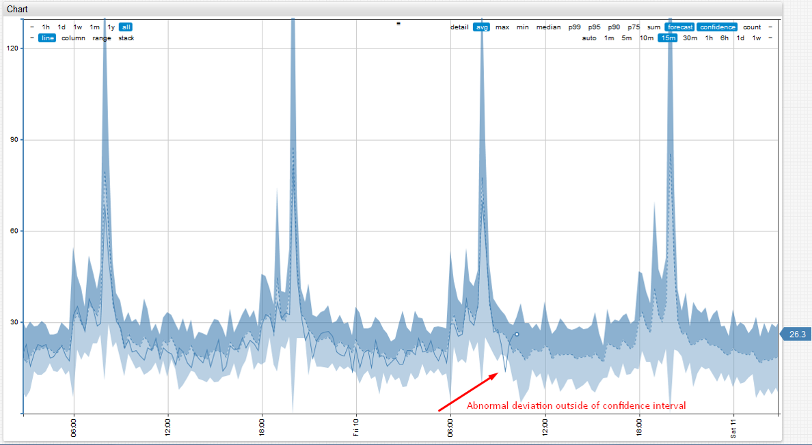

## Reference

* [Editor Settings](#editor-settings)
* [Editor Tools](#editor-tools)
* [Using Forecasts](#using-forecasts)

## Editor Settings

Enable data forecasting on the **Data > Forecasts** page.

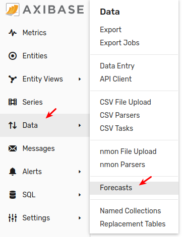

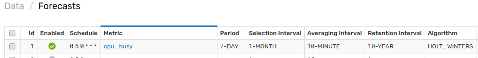

### General Settings

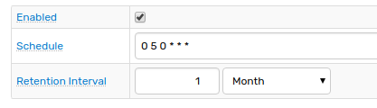

Enabled forecasts are prepared by background jobs on schedule according to `cron` [expressions](../shared/scheduling.md). Forecasting jobs are typically executed during off-peak hours.

|Setting|Description|
|-|-|
|Retention Interval|Specifies how long a forecast is stored in the database. Forecasts that are older than `current time`, or [**End Time**](#data-selection-settings), if specified, minus **Retention Interval** are deleted.|

### Data Selection Settings

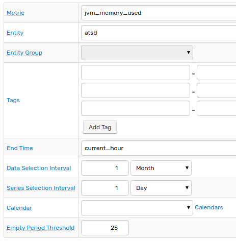

| Setting | Description |
| --- | --- |
|Metric |Metric name for which forecasts are calculated.|
|Entity  |If selected, forecasts are calculated for the specified entity.<br>Supersedes **Entity Group** drop-down list.<br>If neither entity nor entity group is specified, forecasts are prepared for **all** entities.|
|Entity Group |If selected, forecasts are calculated for entities contained in the specified entity group.|
|Tags |Prepare forecasts only for series containing the specified series tags.|
|End Time |End time of the **Data Selection Interval** and **Series Selection Interval**.<br>This field supports [calendar](../shared/calendar.md) expressions, for example `current_day`.<br>If not defined, the field is set to the time the job is run.|
|Data Selection Interval |Time frame for selecting detailed data used as forecast input.<br>Specify the end of the interval in the **End Time** field, otherwise the end of the selection interval is set to current time.|
|Series Selection Interval |Ignore any series with `Last Insert Time` before **End Time** by more than the specified interval.<br>Use this option to ignore series which have not been updated for a long time.|
|Calendar |Ignore detailed values within the time intervals listed in the calendar.|
|Empty Period Threshold |Ignore a series with a percentage of empty periods greater than the specified threshold.<br>Calculated as `100 * (number of empty periods before interpolation)/(total number of aggregation periods in Data Selection Interval)`.|

For data exclusion options, see [Calendar Exception Settings](calendar_exceptions_testing.md).

### Aggregation Settings

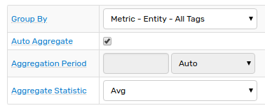

| Setting | Description |
| --- | --- |
|Group By |Grouping key for merging multiple series into one. Detailed data for multiple series sharing the same grouping key are merged into one array prior to computing aggregate statistics.|
|Auto Aggregate|The server automatically calculates an aggregation period that produces the most accurate forecast, defined as having the lowest variance from observed historical data.|
|Aggregation Period |Period of time over which the detailed samples are aggregated.|
|Aggregate Statistic |Aggregation function applied to raw data to regularize the series. Aggregate values for empty periods without detailed data are interpolated as values of aggregate functions for previous periods.|

### Algorithm Parameters

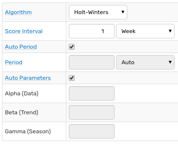

| Setting | Description |
| --- | --- |
|Algorithm |Holt-Winters or ARIMA forecasting algorithms.|
|Score Interval |Part of **Data Selection Interval** that is used to compute variance between observed values and forecast to rank forecasts by variance.<br>The shorter the **Score Interval**, the more weight is assigned to recently observed values.|
|Auto Period |The server automatically calculates seasonality of the underlying series that produces the most accurate forecast, defined as having the lowest variance from observed historical data.|
|Period |Specify seasonality of the underlying series.|
|Auto Parameters |The server automatically calculates algorithm parameters that produce the most accurate forecast, defined as having the lowest variance from observed historical data.|

### Persistence Settings

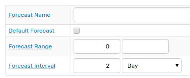

| Setting | Description |
| --- | --- |
|Forecast Name |Optional name used to differentiate between several forecasts for one underlying series.<br>Use cases:<br>[`forecastName`](../api/data/series/query.md#forecast-filter) field in Data API<br>[`forecast(name)`](../rule-engine/functions-forecast.md#forecaststring-n) Rule Engine function<br>[`forecast-name`](#charts) Chart setting |
|Default Forecast |Enable these settings instead of default settings when calculating on-demand forecast.<br>On-demand forecast is calculated at request time if a pre-stored forecast is not available.|
|Forecast Range |Minimum and Maximum constraints applied to the stored forecast values to ensure that such values are within the specified range.<br>Constraints are applied to the winning forecast after scoring stage.|
|Forecast Interval |The length of time into the future for which forecasts are prepared and stored in the database.<br>Can be rounded upwards to the nearest forecast period.|

## Editor Tools

**Editor Tools** are located at the bottom of the Forecast Configuration page.

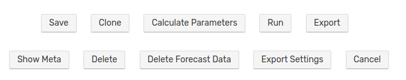

Tool | Description | Example
--|--|--
Calculate Parameters | Click **Calculate Parameters** to calculate algorithm constants. | 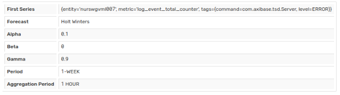
Run | Execute the forecast job.<br>Use this tool to test a forecast.<br>ATSD returns the number of calculated forecasts. | 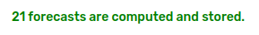
Export | Export forecast data in CSV format.| 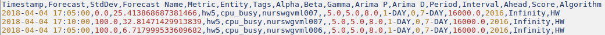
Show Meta| Display parameters used to calculate the forecast.<br>Metadata is stored with the forecast.<br>Collection interval is an interval within the real data extracted to build the forecast. | 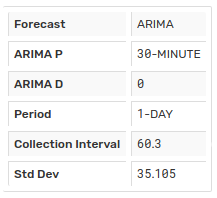

> Use the split-button on the **Data > Forecasts** page to specify [Exceptions](calendar_exceptions_testing.md#exceptions) and perform [Testing](calendar_exceptions_testing.md#testing):

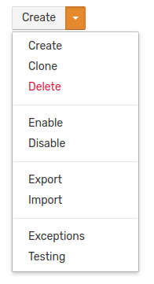

## Using Forecasts

### Rule Engine

* Access pre-computed forecasts using [forecast](../rule-engine/functions-forecast.md) functions.
* Use forecast values as [thresholds](../rule-engine/README.md#forecast-thresholds) to trigger response actions if observed values deviate from forecast values by some amount.
* Compare forecast values to [statistical function](../rule-engine/functions.md#statistical) values such as moving averages or weighted averages.

```javascript
abs(avg() - forecast()) > 25
```

This expression compares the actual [average value](../rule-engine/functions-statistical.md#avg) of some metric to the forecast metric value and alerts if the [absolute value](../rule-engine/functions-math.md#abs) of the difference exceeds 25.

```javascript
thresholdTime(null, 90, '1 DAY') != null
```

* `thresholdTime` function returns time in Unix milliseconds when the forecast is expected to exceed `90` for the first time.
* The condition becomes `true` if the expected violation is to occur in less than 1 day.

### Ad hoc Export

Set **Data Type** setting to **Forecast**, optionally specify a forecast name:

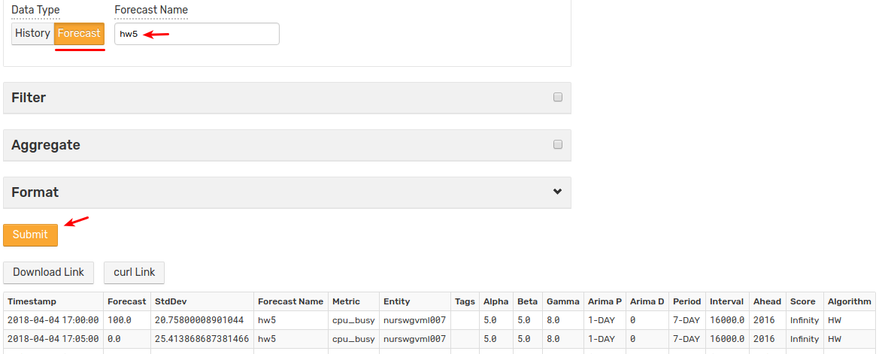

### Data API

[Query](../api/data/series/query.md#forecast-filter) and [insert](../api/data/series/insert.md#fields) forecast values with Data API. The `insert` capability can be used to populate the database with custom forecast values calculated externally.

A sample forecast [JSON query](../api/data/series/examples/query-named-forecast.md):

```json
[
    {
        "entity": "nurswgvml007",
        "metric": "cpu_busy",
        "type": "FORECAST",
        "endDate": "now + 2 * hour",
        "startDate": "now "
    }
]
```

<details><summary>Open collapsed menu to view response.</summary>

```json
[
  {
    "entity": "nurswgvml007",
    "metric": "cpu_busy",
    "tags": {},
    "type": "FORECAST",
    "aggregate": {
      "type": "DETAIL"
    },
    "meta": {
      "timestamp": "2018-05-15T08:20:00.000Z",
      "averagingInterval": 600000,
      "alpha": 0,
      "beta": 0.4,
      "gamma": 0.4,
      "period": {
        "count": 1,
        "unit": "DAY"
      },
      "stdDev": 7.224603272075089
    },
    "data": [
      {"d":"2018-05-15T08:20:00.000Z","v":11.604692968987015},
      {"d":"2018-05-15T08:30:00.000Z","v":14.052095586152106},
      {"d":"2018-05-15T08:40:00.000Z","v":15.715682104344845},
      {"d":"2018-05-15T08:50:00.000Z","v":11.604018743609409},
      {"d":"2018-05-15T09:00:00.000Z","v":12.507966355503251},
      {"d":"2018-05-15T09:10:00.000Z","v":12.59619153186056},
      {"d":"2018-05-15T09:20:00.000Z","v":11.092825413101579},
      {"d":"2018-05-15T09:30:00.000Z","v":11.747112803805937},
      {"d":"2018-05-15T09:40:00.000Z","v":11.137962830355074},
      {"d":"2018-05-15T09:50:00.000Z","v":11.40358025413789},
      {"d":"2018-05-15T10:00:00.000Z","v":16.728103701429056},
      {"d":"2018-05-15T10:10:00.000Z","v":12.75646043607565}
    ]
  }
]
```

</details>

[Insert a forecast](../api/data/series/examples/insert-forecast.md) into ATSD using `POST` method:

```elm
POST /api/v1/series/insert
```

Payload:

```json
[
    {
        "entity": "nurswgvml007",
        "metric": "mpstat.cpu_busy",
        "type": "FORECAST",
        "data": [
            {
                "t": 1462427358127,
                "v": 52
            }
        ]
    }
]
```

Additional examples:

* [Insert Named Forecast](../api/data/series/examples/insert-named-forecast.md)
* [Insert Forecast Deviation](../api/data/series/examples/insert-forecast-deviation.md)

### Charts

Load forecasts into charts by setting `data-type = forecast` in the `[series]` section.

```ls
[series]
    entity = nurswgvml007
    metric = cpu_busy
    data-type = forecast
```

List of widget and series settings applicable to forecast data:

|Name|Description|Example|
|---|---|---|---|
|`data-type`|Data type for the current series.<br>Possible values: `history`, `forecast`, `forecast_deviation`, `lower_confidence`, `upper_confidence`.<br><br>Example: `data-type = forecast`|[](https://apps.axibase.com/chartlab/f80b8e53)|
|`forecast-name`|Unique forecast identifier.<br>Useful when creating multiple forecasts for the same series.<br>Usually used to view imported forecasts generated with external tools.<br>If no forecast name is set, the default forecast is loaded.<br><br>Example: `forecast-name = hw5`|[](https://apps.axibase.com/chartlab/92b7e471/3/)|
|`forecast-style`|CSS styles applied to forecasts in `column` and `column-stack` modes.<br><br>Example: `forecast-style = stroke: magenta;`|[](https://apps.axibase.com/chartlab/37c39d18/3/)|
|`style`|Render forecast as a solid line instead of dashed line.<br><br>Example: `style = stroke-dasharray: none;`|[](https://apps.axibase.com/chartlab/92b7e471/4/)|