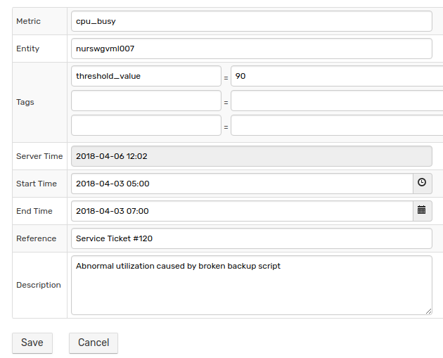
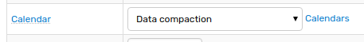
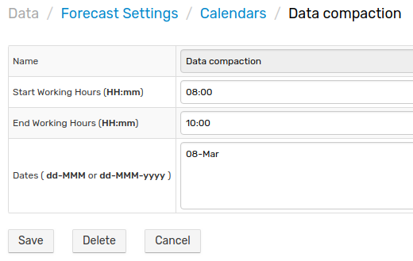
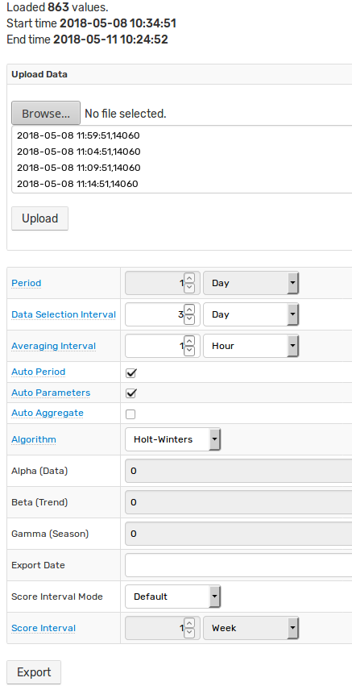

# Forecast Tools

* [Exceptions](#exceptions)
* [Calendar](#calendar)
* [Testing](#testing)

## Exceptions

The purpose of exceptions is to exclude specific intervals from the data selection interval. This is necessary when unusual data is recorded for the time series and this unusual data distorts the forecast.

For example, a 12-hour 100% cpu_busy interval caused by a broken script. Even after the problem is fixed (script stopped), the abnormal data remains and causes the forecast to be inaccurate. Another example is a data gap, where collection stopped for a while, and this can impact the forecast accuracy. ATSD algorithms cannot automatically identify and discard abnormal records, and Exception is a manual solution for it.

### Settings

| Setting | Description |
|---|---|
|Metric|Metric to which the exception applies.|
|Entity|Entity to which the exception applies.|
|Tags|Series tags.|
|Server Time|Current server time.|
|Start Time|Start time of the excluded interval.|
|End Time|End time of the excluded interval.|
|Reference|The short field to add meta-data about the excluded interval.|
|Description|The short field to add meta-data about the excluded interval.|

The reason Exceptions are stored separately from Forecast Settings is to have one Exception apply to multiple matching forecasts at the same time.

## Calendar

Calendars in comparison with Exceptions allow to exclude data related to Forecast to which them applied in Forecast Settings Editor. In addition, Calendars provide a more flexible date configuration.

### Settings

| Setting | Description |
|---|---|
|Start Working Hours|Start hour of the excluded interval: `HH:mm`.|
|End Working Hours|End hour of the excluded interval: `HH:mm`.|
|Dates|Day, month and year of the excluded interval: `dd-MMM` or `dd-MMM-yyyy`.|

## Testing

Testing allows the calculation of forecasts based on data in a CSV file or the text area. The database is not involved and the forecast is not saved. The first row in the CSV is ignored because the server expects it to contain column headers. If column headers are not present, the first row of test data is ignored.

### Settings

| Setting | Description |
|---|---|
|Period|Specify seasonality of the underlying series.|
|Data Selection Interval|Time frame for selecting detailed data that is used as forecast input. End of the Selection Interval is set to current time.|
|Averaging Interval|Period of time over which the detailed samples are aggregated.|
|Auto Period|The server automatically calculates seasonality of the underlying series that produces the most accurate forecast with minimum variance from observed historical data.|
|Auto Parameters|The server automatically calculates algorithm parameters that produce the most accurate forecast with minimum variance from observed historical data.|
|Auto Aggregate|The server automatically calculates an aggregation period that produces the most accurate forecast with minimal variance from observed historical data.|
|Algorithm|Select Holt-Winters or ARIMA forecasting algorithms.|
|Score Interval|Part of Selection Interval that is used to compute variance between observed values and forecast to rank forecasts by variance. The shorter the **Score Interval**: the more weight is assigned to the recently observed values.|
