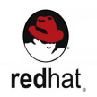

# ATSD Installation

## Download Options

### [Docker Images](./images.md)

* [Docker Hub](https://hub.docker.com/r/axibase/atsd/), [RedHat Container Catalog](https://access.redhat.com/containers/?tab=overview#/registry.connect.redhat.com/axibase/atsd), [Kubernetes](https://axibase.com/docs/axibase-collector/installation-on-kubernetes.html)
* Mode: Non-Distributed
* Edition: Standard
* Separate [images](https://github.com/axibase/dockers/blob/master/README.md#axibase-time-series-database) and [sandbox](https://github.com/axibase/dockers/tree/atsd-sandbox#atsd-sandbox-docker-image).

### [Linux Packages](./packages.md)

    

* RPM/DEB Packages
* Supported Distributions: RedHat, CentOS, Ubuntu, Debian, SLES
* `apt` / `yum` Repository option
* Mode: Non-distributed
* File System: `ext4` (local)
* Edition: Standard

### [AWS EMRFS](./aws-emr-s3.md)

* Mode: Distributed
* File System: AWS S3
* Edition: Enterprise

### [Cloudera Distribution Hadoop](./cloudera.md) (CDH)

* Mode: Distributed
* File System: HDFS
* Edition: Enterprise

## Hardware Requirements

Review [Requirements Specifications](./requirements.md) to ensure optimal functionality.

> By installing ATSD you agree to the following **[License](../axibase_tsd_se_license.pdf)** terms.

After installation, review the [Getting Started Guide](../tutorials/getting-started.md) to begin exploring with ATSD.

## Technical Support

Email Axibase at **support-atsd@axibase.com** with any installation questions.
