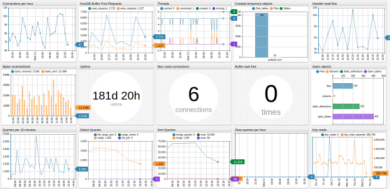

# ATSD Installation

Axibase Time Series Database (ATSD) is a non-relational database optimized for collecting, storing, and analyzing temporal data from IT infrastructure, industrial equipment, smart meters, and IoT devices.

## Download Options

Deploy ATSD as part of an already established workflow using flexible installation options: [Software](./packages.md) for various package managers, [Images](./images.md) for Docker and Kubernetes, via [AWS S3](./aws-emr-s3.md), or on a [Cloudera Distribution Hadoop](./cloudera.md) cluster.

### Hardware Requirements

Review [Requirements Documentation](../administration/requirements.md) to ensure optimal functionality.

### Supported Linux Distributions

Distribution | Version | Support |
--|--|--
Ubuntu | `16.04` | 
Debian | `8.x` | 
Debian | `9.x` | 
RHEL/CentOS | `7.x`| 
SLES | `12.x` | 

> By installing ATSD you agree to the following **[License](../axibase_tsd_se_license.pdf)** terms.

### Technical Support

Email us at **support-atsd@axibase.com** with any installation questions.

## Tutorials

After installation, review the [Getting Started Guide](../tutorials/getting-started.md) to begin exploring with ATSD.
