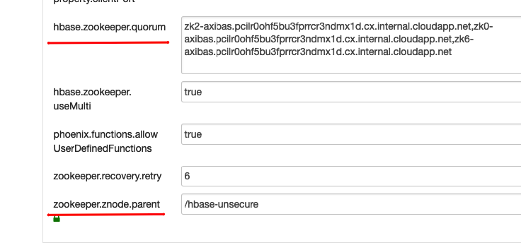

# Installation: Azure HDInsight

## Overview

The document describes how to deploy ATSD on  [Azure HDInsight](https://docs.microsoft.com/en-us/azure/hdinsight/) cluster

## Create HDInsight Cluster

* Create [Apache HBase cluster on HDInsight in Azure Virtual Network](https://docs.microsoft.com/en-us/azure/hdinsight/hbase/apache-hbase-provision-vnet).  The cluster named `axibase-cluster` in the example below.
  

* To ensure that Hbase version is `1.1.2` click the **Edit Template** button and verify that `clusterversion` set to version `3.6`.

  

## Create ATSD VM

* Go to **Home > Virtual Machines**. Click **Add** button to create a Linux VM.

 

* Go to **Networking** tab abd place VM in the same Virtual Network with cluster. It's required that VM has the same location as network.

 

* Ensure that ssh port is open.


* Click **Review + Create** button and check all preferences once again.


* After creation, navigate to the VM. Go to **Networking** page and **Add inbound port rule** and open ATSD network ports to make the ATSD available by public IP address.


> In the next commands `clusterhost` is used for connection to active namenode of HDInsight cluster and `atsdhost` is for VM where ATSD is installing. Both hostname can be replaced with `Public Ip address` that can be found on the Overview page of the cluster and VM as well. SSH user for both hosts is `axibase`.

## Install ATSD

* Connect with VM by ssh

```bash
ssh axibase@atsdhost
```

* Install [Java 8](https://axibase.com/docs/atsd/administration/migration/install-java-8.html) on your VM.

### Download Distribution Files

* Download cluster version of atsd.

```bash
curl -O https://axibase.com/public/atsd-cluster.tar.gz
```

* Extract archive.

```bash
tar xzvf atsd-cluster.tar.gz -C .
```

### Deploy Co-processor

:::tip Co-processors
The `atsd-hbase.$REVISION.jar` file contains ATSD filters and procedures invoked by ATSD on each node in the HBase cluster for optimized data processing.
:::

* Copy coprocessors to cluster via scp.

```bash
scp ./atsd/atsd-hbase.*.jar axibase@clusterhost:/home/axibase/atsd-hbase.jar
```

* Connect to cluster by ssh

```bash
ssh axibase@clusterhost
```

* Put co-processors to `hbase.dynamic.jars.dir` distributed directory which is `/hbase/lib/` by default.

  * The directory does not exist by default, hence it must be created.

  ```bash
  hdfs dfs -mkdir /hbase/lib
  ```

  * Copy coprocessors from the local filesystem to distributed filesystem directory.

  ```bash
  hdfs dfs -put atsd-hbase.jar /hbase/lib
  ```

  * Ensure that file has been copied.

    ```bash
    hdfs dfs -ls /hbase/lib/
    ```

    The output must like the following:

    ```bash
      Found 1 items
      -rw-r--r--   1 axibase supergroup     668613 2019-03-11 09:00   /hbase/lib/atsd-hbase.jar
    ```

## Set up ATSD

For following set up  get `hbase.zookeeper.quorum` and `zookeeper.znode.parent` from `hbase-site.xml` configuration file. You c or by searching the settings using `grep` utility or  find it in Amabari UI available on `clusterhost` on HTTP port on the **Hbase>Configs>Advanced hbase-site**.



```bash
cat /etc/hbase/conf/hbase-site.xml | grep hbase.zookeeper.quorum -A1
```

The output must like this:

```xml
<name>hbase.zookeeper.quorum</name>
<value>zk2-axibas.pcilr0ohf5bu3fprrcr3ndmx1d.cx.internal.cloudapp.net,zk0-axibas.pcilr0ohf5bu3fprrcr3ndmx1d.cx.internal.cloudapp.net,zk6-axibas.pcilr0ohf5bu3fprrcr3ndmx1d.cx.internal.cloudapp.net</value>

```

* Save the value to the file.

* Repeat the operation for `zookeeper.znode.parent` setting.

```bash
cat /etc/hbase/conf/hbase-site.xml | grep zookeeper.znode.parent -A1
```

* Log back to ATSD VM.

* Verify that zookeper hosts available from your VM

```bash
ping zk2-axibas.pcilr0ohf5bu3fprrcr3ndmx1d.cx.internal.cloudapp.net
```

The output must like this

```bash
  64 bytes from zk2-axibas.pcilr0ohf5bu3fprrcr3ndmx1d.cx.internal.cloudapp.net (10.0.0.11): icmp_seq=1 ttl=64 time=0.763 ms
```

* Open `./atsd/atsd/conf/hadoop.properties` file and  set the properties to retrieved values.

```properties
hbase.zookeeper.quorum = zk2-axibas.pcilr0ohf5bu3fprrcr3ndmx1d.cx.internal.cloudapp.net,zk0-axibas.pcilr0ohf5bu3fprrcr3ndmx1d.cx.internal.cloudapp.net,zk6-axibas.pcilr0ohf5bu3fprrcr3ndmx1d.cx.internal.cloudapp.net
zookeeper.znode.parent=/hbase-unsecure
```

* Open `./atsd/atsd/conf/server.properties` and set `coprocessors.jar` to `wasb:///hbase/lib/atsd-hbase.jar` value.

```properties
coprocessors.jar=wasb:///hbase/lib/atsd-hbase.jar
```

* Start atsd

```bash
./atsd/atsd/bin/start-atsd.sh
```

* Ensure that atsd has been started. The message `ATSD Server started` must appear in the log within several minutes.

```bash
tail -f -n 100 ./atsd/atsd/logs/atsd.log
```

* Log in in ATSD UI using open ports

```bash
https://atsdhost:8443
```