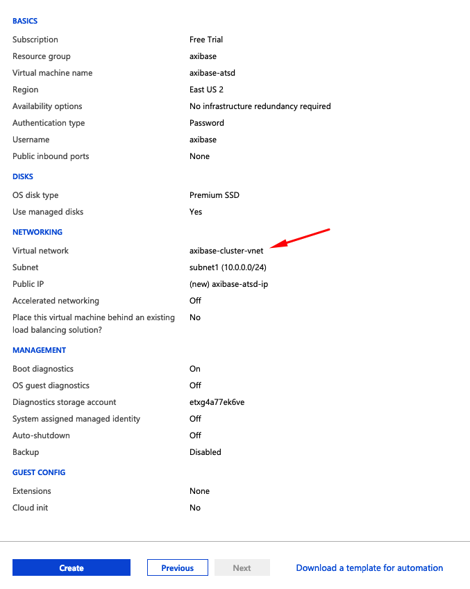

# Installation: Azure HDInsight

## Overview

The document describes how to deploy ATSD on [Azure HDInsight](https://docs.microsoft.com/en-us/azure/hdinsight/), a fully managed HBase cluster service available on the Microsoft Azure cloud platform.

## Requirements

* Azure HDInsight, version `3.6`.

## Create HDInsight Cluster

* Create an HDInsight cluster in the [Azure Virtual Network](https://docs.microsoft.com/en-us/azure/hdinsight/hbase/apache-hbase-provision-vnet).

  

* Specify `axibase` in the **SSH User Name** field.

* Click the **Edit Template** button. Ensure that `clusterVersion` is set to `3.6`.

  

## Create ATSD VM

* Open the **Home > Virtual Machines** page in the Azure portal.
* Click **Add** button to create a Linux VM.
* Select `Ubuntu 16.04` or another [supported](requirements.md#operating-systems) Linux distribution in the **Image** field.
* Select a VM type with `16+` gigabytes of [memory](requirements.md) in the **Size** field. `8` GB is sufficient for a test installation.

  

* Open the **Networking** tab and place the VM in the **same** virtual network as the HDInsight cluster created earlier.

  

* Ensure that SSH port to the ATSD VM is open.

  

* Click **Review + Create** button and check the settings.

  

* Once the VM is created, open the VM resource page.
* Open the **Networking** page and click **Add inbound port rule** for ports `8081,8088,8443` to ensure that ATSD is reachable on these ports. The ports can be [modified](../administration/server-properties.md#networking) if necessary.

  

## Configure Cluster

* Connect to the ATSD VM via SSH.

  ```bash
  ssh axibase@atsd_vm_hostname
  ```

* Download ATSD distribution files to the ATSD VM.

  ```bash
  curl -O https://axibase.com/public/atsd-cluster.tar.gz
  ```

* Extract the archive.

  ```bash
  tar xzvf atsd-cluster.tar.gz -C .
  ```

* Lookup the hostname or IP address of an active HDInsight node on the cluster summary page.

* Copy coprocessor file `atsd-hbase.$REVISION.jar` from the ATSD VM to the cluster VM via SCP.

  ```bash
  scp ./atsd/atsd-hbase.*.jar axibase@cluster_hostname:/home/axibase/atsd-hbase.jar
  ```

* Connect to the cluster via SSH from the ATSD VM. The cluster's IP address is accessible on the Overview page.

  ```bash
  ssh axibase@cluster_ip_address
  ```

  

* Copy `atsd-hbase.$REVISION.jar` file into the `/hbase/lib/` directory in HDFS.

  * Create the `/hbase/lib/` directory in HDFS.

  ```bash
  hdfs dfs -mkdir /hbase/lib
  ```

  * Copy `atsd-hbase.$REVISION.jar` from the local file system to HDFS.

  ```bash
  hdfs dfs -put atsd-hbase.jar /hbase/lib
  ```

  * Check that the file is present in HDFS.

    ```bash
    hdfs dfs -ls /hbase/lib/
    ```

    ```txt
      Found 1 items
      -rw-r--r--   1 axibase supergroup     668613 2019-03-11 09:00   /hbase/lib/atsd-hbase.jar
    ```

* Retrieve `hbase.zookeeper.quorum` setting from `hbase-site.xml` configuration file. This setting is required for subsequent ATSD setup.

  ```bash
  cat /etc/hbase/conf/hbase-site.xml | grep hbase.zookeeper.quorum -A1
  ```

  ```xml
  <name>hbase.zookeeper.quorum</name>
  <value>
    zk2-axibas.pcilr0ohf5bu3fprrcr3ndmx1d.cx.internal.cloudapp.net,
    zk0-axibas.pcilr0ohf5bu3fprrcr3ndmx1d.cx.internal.cloudapp.net,
    zk6-axibas.pcilr0ohf5bu3fprrcr3ndmx1d.cx.internal.cloudapp.net
  </value>
  ```

* Retrieve `zookeeper.znode.parent` setting from `hbase-site.xml` configuration file. This setting is also required for subsequent ATSD setup.

  ```bash
  cat /etc/hbase/conf/hbase-site.xml | grep zookeeper.znode.parent -A1
  ```

  ```xml
  <name>zookeeper.znode.parent</name>
  <value>/hbase-unsecure</value>
  ```

* Verify that HBase is available:

  ```bash
  echo "status" | hbase shell
  ```

  The sample output is presented below. Check that the count of dead servers is zero.

  ```txt
  HBase Shell; enter 'help<RETURN>' for list of supported commands.
  Type "exit<RETURN>" to leave the HBase Shell
  Version 1.1.2.2.6.5.3006-29, r1c7fdea305d6153591b318f14cabdb37ef2eb152, Fri Feb  1 02:51:33 UTC 2019

  status
  1 active master, 2 backup masters, 2 servers, 0 dead, 22.5000 average load
  ```

* Exit the SSH session with the cluster VM.

## Install ATSD

* Install [JDK 8](../administration/migration/install-java-8.md) on the ATSD VM.

* Verify that JDK 8 is installed on the server.

  ```bash
  javac -version
  ```

  ```bash
  java version
  ```

* Check that one of Zookeeper hosts listed in the `hbase.zookeeper.quorum` is accessible.

  ```bash
  ping zk2-axibas.pcilr0ohf5bu3fprrcr3ndmx1d.cx.internal.cloudapp.net
  ```

  ```bash
  64 bytes from zk2-axibas.pcilr0ohf5bu3fprrcr3ndmx1d.cx.internal.cloudapp.net (10.0.0.11): icmp_seq=1 ttl=64 time=0.763 ms
  ```

* Open `./atsd/atsd/conf/hadoop.properties` file and set the properties to the values retrieved from the cluster.

  ```properties
  zookeeper.znode.parent=/hbase-unsecure
  hbase.zookeeper.quorum = zk2-axibas.pcilr0ohf5bu3fprrcr3ndmx1d.cx.internal.cloudapp.net,zk0-axibas.pcilr0ohf5bu3fprrcr3ndmx1d.cx.internal.cloudapp.net,zk6-axibas.pcilr0ohf5bu3fprrcr3ndmx1d.cx.internal.cloudapp.net
  ```

* Open `./atsd/atsd/conf/server.properties` and add `coprocessors.jar` setting.

  ```properties
  coprocessors.jar=wasb:///hbase/lib/atsd-hbase.jar
  ```

* Increase Java memory allocation. Open `atsd/atsd/conf/atsd-env.sh` file and increase `-Xmx` setting to 50% of total physical memory installed in the VM.

  ```txt
  JAVA_OPTS="-server -Xmx8000M -XX:+HeapDumpOnOutOfMemoryError -XX:HeapDumpPath="$atsd_home"/logs"
  ```

* Start ATSD

  ```bash
  ./atsd/atsd/bin/start-atsd.sh
  ```

* Watch the `atsd.log`.

  ```bash
  tail -F -n 100 ./atsd/atsd/logs/atsd.log
  ```

  It can take ATSD several minutes to create tables after initializing the system.

  ```txt
  ...
  2018-08-31 22:10:37,890;INFO;main;org.springframework.web.servlet.DispatcherServlet;FrameworkServlet 'dispatcher': initialization completed in 3271 ms
  ...
  2019-03-11 12:10:37,927;INFO;main;org.eclipse.jetty.server.AbstractConnector;Started SelectChannelConnector@0.0.0.0:8088
  2019-03-11 12:10:37,947;INFO;main;org.eclipse.jetty.util.ssl.SslContextFactory;Enabled Protocols [TLSv1, TLSv1.1, TLSv1.2] of [SSLv2Hello, SSLv3, TLSv1, TLSv1.1, TLSv1.2]
  2019-03-11 12:10:37,950;INFO;main;org.eclipse.jetty.server.AbstractConnector;Started SslSelectChannelConnector@0.0.0.0:8443
  ```

* Log in to ATSD web interface on the HTTPS port.

  ```bash
  https://atsd_hostname_:8443
  ```

* Open the **Settings > System Information** page and verify that the co-processor file is compatible with the ATSD version.

  