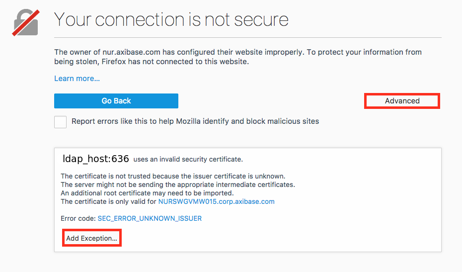
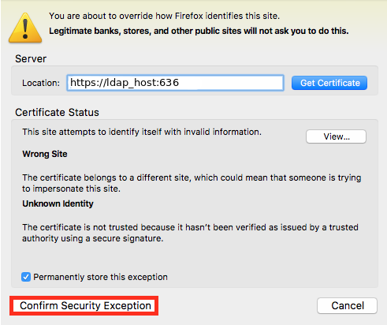
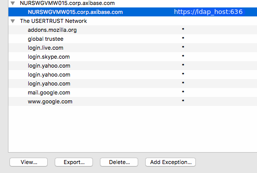

# Secure Connection to Active Directory

To setup a secure connection between ATSD and an Active Directory (AD) server for the purpose of LDAP user authentication, you need to import an LDAP Server Certificate from the target AD server into ATSD.

## Obtain SSL Certificate from LDAP Server

There are several ways of obtaining the SSL server certificate:

### Use LDAP Search or Windows `certutil`

Refer to [Sun Java System Identity Synchronization for Windows 6.0 Installation and Configuration Guide](https://docs.oracle.com/cd/E19656-01/821-0422/aarjd/index.html) for additional information.

### Export Certificate using a Web Browser such as Mozilla Firefox

* Enter HTTPS, LDAP server hostname and SSL port in the browser address bar, for example `https://ldap_host:636`

* Press **Advanced > Add exception** to retrieve the certificate.



* Confirm the security exception.



* Open **Preferences > Advanced > Certificates > View Certificates** page.


* Open the **Servers** tab and click the required AD server certificate to export it.



## Import Server Certificate into ATSD Keystore File

* Add `servername.corp.company.com.crt` certificate:

```css
keytool -importcert -keystore /opt/atsd/atsd/conf/server.keystore -storepass password -keyalg "RSA" -trustcacerts -file servername.corp.company.com.crt
```

## Import Server Certificate into Jxplorer Keystore

* Open **Security > Trusted Servers and Certificate Authorities**


* Click **Add Certificate**, select the `.crt` file and add it to the keystore.


<!-- markdownlint-enable MD032 -->
:::warning Note
`cacerts` keystore file has a default password of `changeit` (see [Jxplorer documentation](http://jxplorer.org/help/Setting_a_Keystore_Password.htm)).
:::
<!-- markdownlint-disable MD032 -->