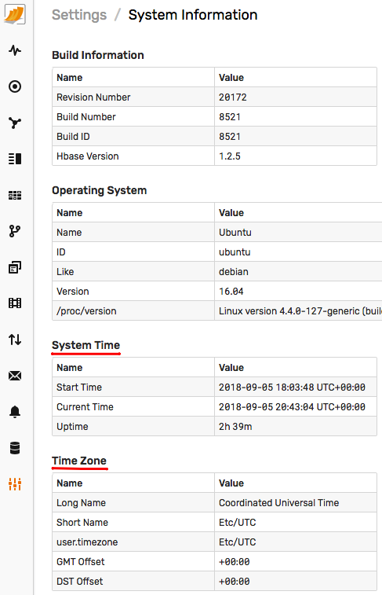

# Post-Installation Steps

## Configure Firewall

* Allow access to the ATSD web interface and command ports by adding [`iptables`](firewall.md) rules.

## Increase Network Buffers

Increase [receiving buffers](../administration/networking-settings.md) if you anticipate insertion rates with bursts of more than 100K samples per second.

## Verify System Time

* Open the **Settings > System Information** page and check the time and time zone information. Change the [time zone](../administration/timezone.md#changing-the-time-zone), if necessary.

  

* Synchronize system time and setup NTP to keep server time accurate.

## Allocated Memory

* [Enable swap space](../administration/swap-space.md).
* Increase memory to [Java processes](../administration/memory-allocation.md).

## Relocate ATSD

* Relocate ATSD to a [different file system](../administration/change-base-directory.md), if the `/opt/atsd` directory does not provide sufficient free space.

## Setup Notifications

* Configure the built-in [Mail Client](../administration/mail-client.md) for email notifications.
* Configure outgoing webhooks for [Slack](../rule-engine/notifications/slack.md), [Discord](../rule-engine/notifications/discord.md), [HipChat](../rule-engine/notifications/hipchat.md), and [Telegram](../rule-engine/notifications/telegram.md).
