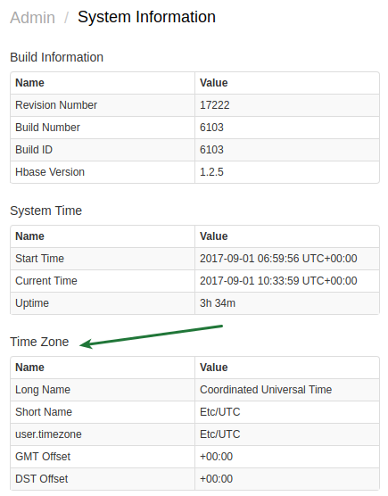

# Post-Installation Steps

## Configure Firewall

* Allow remote access to the ATSD network services by adding [`iptables` rules](firewall.md).

## Setup Mail Client

* See [Mail Client Setup](../administration/mail-client.md).

## Verify System Time

* Open the **Settings > System Information** page in ATSD web interface and verify the time and time zone information.
* [Synchronize](../administration/timezone.md#changing-the-time-zone) system time or setup NTP to keep server time accurate.

## Increase Network Buffers

If you are anticipating insertion rate with bursts of 100K+ packets per second, increase maximum receiving buffer.

* See [Networking Settings](../administration/networking-settings.md).

## Enable Swap Memory

* See [Enabling Swap Space](../administration/enabling-swap-space.md).

## Increase Java Memory Allocations

* See [Allocating Memory](../administration/allocating-memory.md).

## Review Log Files

* See [Logging](../administration/logging.md).

## Relocate ATSD

* [Relocate ATSD](../administration/change-base-directory.md) to a different file system, if the `/opt/atsd` directory does not provide sufficient free space.