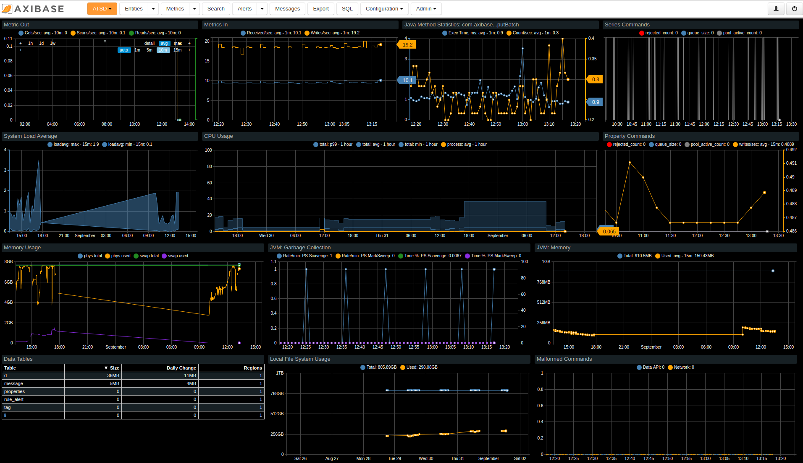

# Verifying Installation

Depending on available resources, it can take 5-20 minutes for ATSD to initialize.

## Web Interface

At the end of the installation process the log displays the ATSD IP address and ports.


Access the database web interface on the HTTPS protocol, port `8443`.

```txt
https://192.0.2.116:8443
```

## Administrator Account

Upon initial access to the ATSD web interface, setup an administrator account.

## Portals

Open the **Portals** tab in the top menu of the ATSD web interface. Pre-defined **ATSD** portal displays application, operating system, and usage metrics for the database itself and the server where ATSD is running.



<!-- markdownlint-enable MD032 -->
:::tip Note
The **Data Tables** portal can be empty for a few minutes after start.
:::
<!-- markdownlint-disable MD032 -->

## Reboot Verification

Verify that the database is able to auto-start in case of system reboot.

On **RHEL**:

```sh
sudo systemctl stop atsd
```

```sh
sudo systemctl start atsd
```

On other Linux distributions:

```sh
sudo service atsd stop
```

```sh
sudo service atsd start
```

If running ATSD on a shared server with a heavy workload, edit `/etc/systemd/system/atsd.service` and replace default `Type` parameter setting `oneshot` with `forking`.

```yaml
[Service]
#Type=oneshot
Type=forking
User=axibase
ExecStart=/etc/init.d/atsdService start
ExecStop=/etc/init.d/atsdService stop
RemainAfterExit=true
TimeoutSec=600
```
