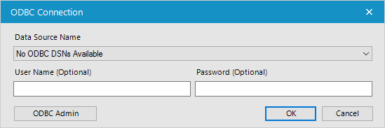
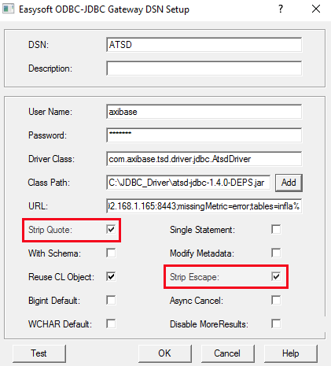
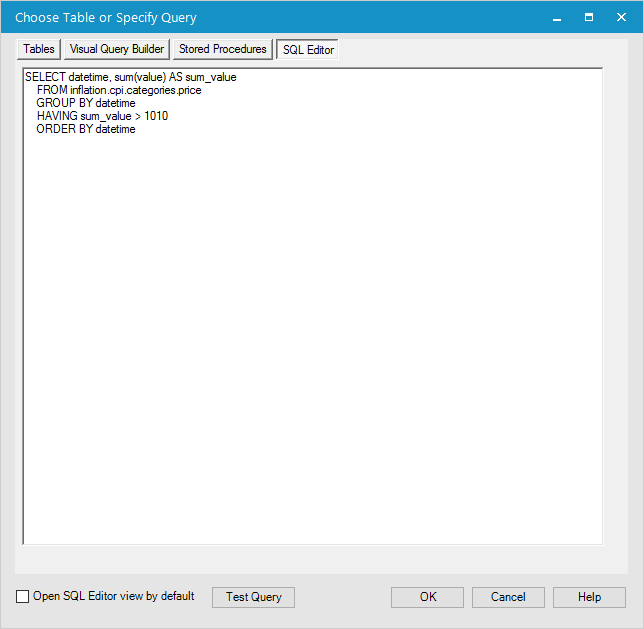
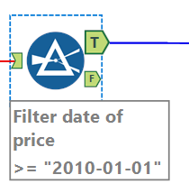
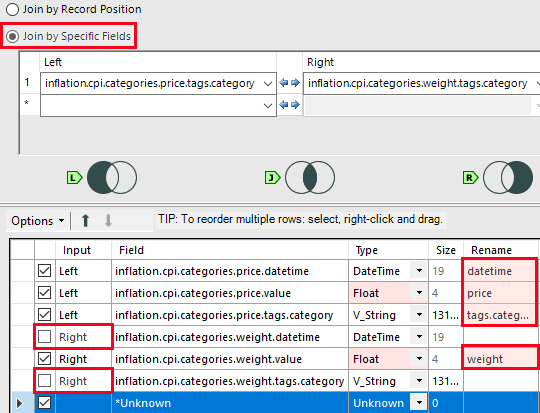
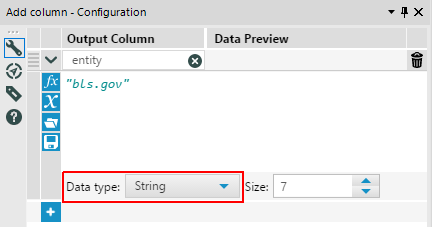

# Alteryx Designer

## Overview

Alteryx Designer is a graphical design environment to create and edit ETL
(Extract, Transform, Load) workflows. The following guide includes examples of
loading time series data from ATSD, calculating derived time series in Alteryx and storing the results back in ATSD.

## Sample Dataset

For the purpose of instruction, we use sample [`series` commands](./resources/commands.txt).
The series contain the Consumer Price Index (CPI) for each category
of items in a consumer basket as well as a weight for each category in the CPI
basket. The weights are stored as fractions of 1000. The CPI is tracked from 2013 to
2017 and uses Year 2016 values as the baseline. Weight values are available only for
year 2017.

To load the data into ATSD, log in to the database web interface and submit
these commands on the **Metrics > Data Entry** page.


## Prerequisites

* Install [Alteryx Designer](https://www.alteryx.com/products/alteryx-designer), version 11.x.
* Install [ODBC-JDBC gateway](../odbc/README.md).

## Create Database Connection

* Create a new Alteryx Designer workflow.

* Add the **Input Data** tool to your workflow.

  

* Choose **Other Databases > ODBC...** in the **Input Data** configuration window.
* Open **ODBC Connection** dialog.

  

  

* Open the **ODBC Data Source Administrator** window by pressing the **ODBC Admin** button in the **ODBC Connection** dialog.

* Configure the [data source](../odbc/README.md#configure-odbc-data-source).

* Add the [`missingMetric=error`](https://github.com/axibase/atsd-jdbc#jdbc-connection-properties-supported-by-driver) property to the DSN URL to ensure that the driver functions properly.

```txt
jdbc:atsd://atsd_hostname:8443;missingMetric=error
```

* If the target ATSD installation contains more than 10000 metrics, consider adding the `tables` property to the DSN URL to filter metrics by name in the Query Builder. For example, `tables=infla%` shows only metrics that start with the characters `infla`.

```txt
jdbc:atsd://atsd_hostname:8443;missingMetric=error;tables=infla%
```

> Refer to the [JDBC driver](https://github.com/axibase/atsd-jdbc#jdbc-connection-properties-supported-by-driver) documentation for additional details.

* Check (enable) the **Strip Quote** and **Strip Escape** options, click **OK**.

  

* Select the name you specified for DSN during bridge configuration from the **Data
  Source Name** list and click **OK**.

  

## Building Queries

After creating a connection, open the **Choose Table or Specify Query** dialog.


This allows you build a query by choosing a table or entering query
text manually.

* Table names visible in the **Tables** tab satisfy the `tables` pattern
  specified in the DSN URL. Click **Refresh** to reload the list, if
  necessary.

  

* In the **Visual Query Tab**, you can specify particular columns in the `SELECT` expression as well as add optional
  sorting and grouping to prepare your
  data before processing it in the workflow. Below is an SQL query and corresponding
  configuration.

```sql
SELECT datetime, sum(value) AS sum_value
  FROM inflation.cpi.categories.price
GROUP BY datetime
  HAVING sum_value > 1010
ORDER BY datetime
```

  

* The **SQL Editor** allows you to review and modify pre-built queries or write
  your own.

* The **Test Query** button truncates the query after the `FROM` clause and sends only the remaining
  `SELECT ... FROM ...` expression to the database for validation.

  

Click **OK** when the query is ready for processing.

### Check Query Results

Click **Run Workflow**, to see the result of the query.


## Calculate and Store Derived Series

This section describes how to create a workflow that retrieves existing
data from ATSD to produce new series in Designer and then store these series back in ATSD.
To calculate a weighted inflation index, we multiply the CPI of each category by
its weight divided by 1000 and sum the products.

The resulting workflow is implemented as follows:


You can download [this workflow](./resources/atsd-workflow.yxmd) for review in your own Alteryx Designer installation.

The workflow consists of these steps (nodes):

1. **Input Data** tool.
   Repeat the steps in the [Create Database Connection](#create-database-connection) section for this tool, choose
   `inflation.cpi.categories.price` table. Select `datetime`,
   `value` columns and manually add `tags.category` as shown below.

   

2. **Input Data** tool. Follow the same procedure as above for the
   `inflation.cpi.categories.weight` table.

3. **Filter** tool. Specify the condition `>= January 1st, 2010`
   and use the **T** (`true`) node output to retrieve the series created after 2009 only.

   

   

4. **Filter** tool. Follow the same procedure as above.

5. **Join** tool. Join prices and weights by `tags.category` field. Clear
   fields as shown on the image. Rename `value` fields for
   `inflation.cpi.categories.price` and `inflation.cpi.categories.weight` to
   `price` and `weight` respectively, `inflation.cpi.categories.price.datetime` to `datetime` and `inflation.cpi.categories.price.tags.category` to `tags.category`.

   

   > **Note**
   >
   > To check input or output of any node, _run the workflow_ and click its
   > input/output.
   >
   > 

6. **Formula** tool. Connect its input to the **J** (_inner join_)
   output of the **Join** node. Next, create a new column named `value` to
   store the result. Fill in the expression to calculate it, and specify the
   correct data type.

   

   

7. **Summarize** tool. Select fields from above to get the actions list as shown
   below on the image. Input `value` into  **Output Field Name**.

   

8. **Sort** tool. Apply it to sort records by date.

   

9. **Formula** tool. Create a new column named `entity` with the **Formula** tool. Name it
   `"bls.gov`.

   

10. **Output Data** tool. Choose ODBC Connection as before and enter a name for
    the new metric, in this case `inflation.cpi.composite.price`.
    Edit **Output Options** in the configuration dialog.

    

    

11. **Browse** tool. View the final result.

Click **Run Workflow**.

The data is retrieved from the database and processed in Designer by the workflow
with the new series stored back in the database.

Click **Browse** to view the results.

   
