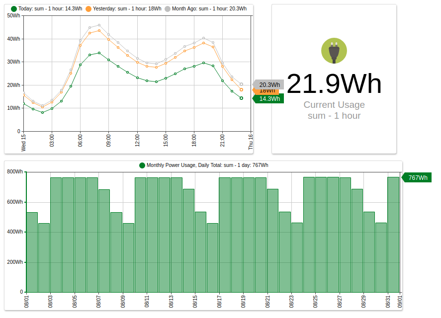
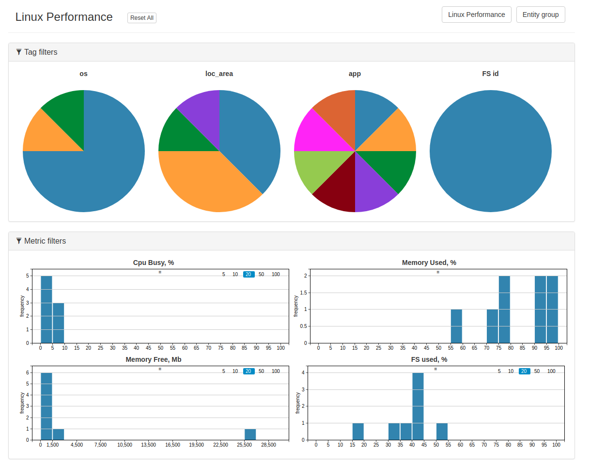
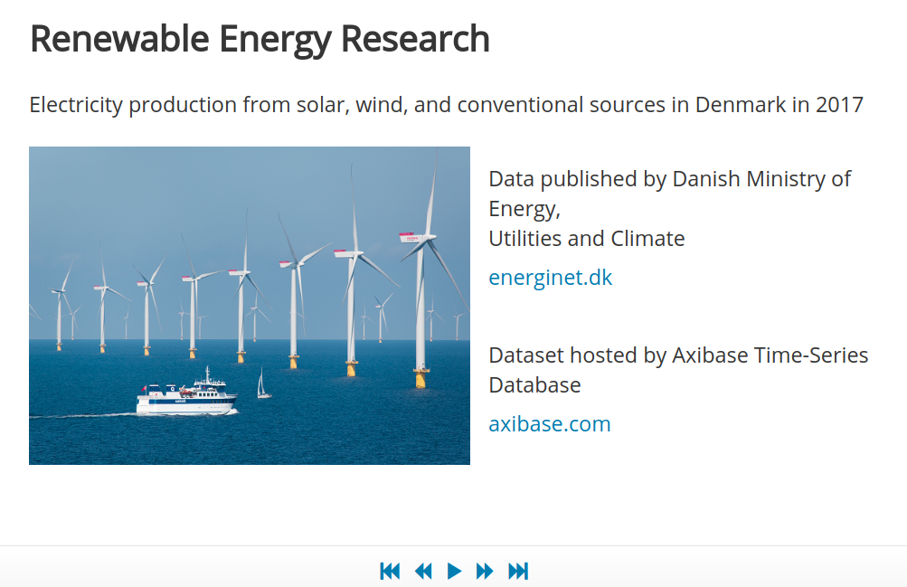

# Data Applications

Axibase developed a set of data applications to demonstrate binding ATSD with [popular programming languages](https://axibase.com/use-cases/chart-of-the-day/stack-exchange/). These applications are released as open-source software under the [Apache 2.0 License](https://www.apache.org/licenses/LICENSE-2.0). Use these [Sample Applications](https://apps.axibase.com/) as templates to develop custom applications with comprehensible ATSD Clients.

## Power Meter Reporter

Power Meter is built with [PHP](http://php.net/) using the [ATSD PHP Client](https://github.com/axibase/atsd-api-php/blob/master/README.md). Power Meter Reporter displays power usage statistics collected with smart meters and provides customized CSV reports.

**Application Credentials**:

Username: `user1`, `user2`, `admin`, `guest` 
Password: `demo`

> Learn more about [Power Meter Reporter](./power-meter-reporter.md).

## Cross Filter

Cross Filter is built with [Go](https://golang.org/) using the [ATSD GO Client](https://github.com/axibase/atsd-api-go). Cross Filter displays performance statistics for a set of entities selected based on [entity groups](../../configuration/entity_groups.md), metrics, and tags.

> Learn more about [Cross Filter](./cross-filter.md).

## Data Slider

Data Slider is built with [`node.js`](https://nodejs.org/en/) using the [ATSD `node.js` API Client](https://github.com/axibase/atsd-api-nodejs/blob/master/README.md). The application is used to interactively display data similar to a PowerPoint presentation.

> Learn more about [Data Slider](https://axibase.com/products/axibase-time-series-database/data-applications/data-slider/).

## Performance Viewer

Performance Viewer is built with [PHP](http://php.net/) using the [ATSD PHP Client](https://github.com/axibase/atsd-api-php/blob/master/README.md). Performance Viewer displays performance statistics alongside host machine and VM properties and configurations.

> Learn more about [Performance Viewer](https://axibase.com/products/axibase-time-series-database/data-applications/performance-viewer/).

**Application Credentials**:

Username: `user1`, `user2`, `user3` 
Password: `demo`

## Data Monitor

Data Monitor is built with [PHP](http://php.net/) using the [ATSD PHP Client](https://github.com/axibase/atsd-api-php/blob/master/README.md). The application delivers data reliability reporting for entities and [entity groups](../../configuration/entity_groups.md).

> Learn more about [Data Monitor](https://axibase.com/products/axibase-time-series-database/data-applications/data-monitor/)
.

**Application Credentials**:

Username: `admin` 
Password: `demo`