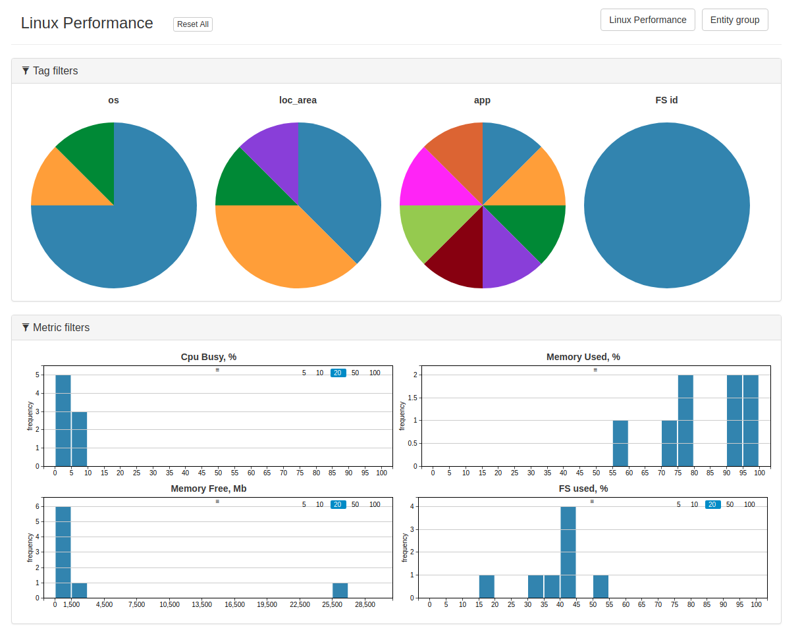

# Cross Filter

## Overview

Cross Filter is open source. Access the code on [GitHub](https://github.com/axibase/go-cross-filter).

Cross Filter is built with [Go](https://golang.org/) using the [ATSD GO Client](https://github.com/axibase/atsd-api-go). Cross Filter displays performance statistics for a set of entities selected based on [entity groups](../../configuration/entity_groups.md), metrics, and tags.

## Details

* Cross Filter charts support interactive filtering for displayed series.
* The dataset (table) is selected and loaded into the client in CSV format
* Filter a particular subset by clicking a tag which displays only entities which contain the selected tag.
* The application consists of two parts: **Charts** and **Tables**.
  * **Charts** display the distribution of last values.
  * **Tables** display the last value for a pre-defined interval.
* Tables are described in the application configuration which consists of several components:
  * List of entity tags which are displayed as columns.
  * List of metrics and their API queries which are displayed as columns.
    * API queries contain user-defined intervals from which the last value is retrieved and displayed in the tables and charts.
* Dataset update interval is also defined in the configuration.
* **Metric Filters** charts display the distribution of last insert values for each entity on a [histogram](https://github.com/axibase/charts/blob/master/widgets/histogram/README.md). Each histogram displays one of the metrics contained in the table.
* Each widget acts as a filter for both the table and other widgets. Selecting a tag in **Tag Filters** charts filters the table and other widgets to display only entities containing the selected tag.
* Further filter entities by selecting specific entity groups, displaying only the entities contained in the group as long as it satisfies other currently active filters.