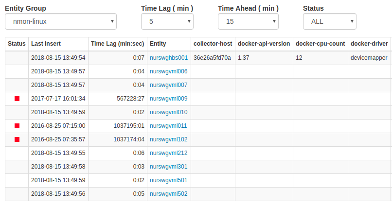

# Data Monitor

**Application Credentials**:

Username: `admin` 
Password: `demo`

## Overview

Data Monitor is open source. Access the code on [GitHub](https://github.com/axibase/atsd-api-php/tree/master/data-monitor).

Data Monitor is built with [PHP](http://php.net/) using the [ATSD PHP Client](https://github.com/axibase/atsd-api-php/blob/master/README.md). The application delivers data reliability reporting for entities and [entity groups](../../configuration/entity_groups.md).

## Details

* Selecting an entity group displays a table consisting of all associated entities and entity tags.
* The last insert time of each metric is displayed in the **Last Insert** column along with **Time Lag** from current server time.
* Based on **Time Lag (min:sec)**, the application assigns one of two statuses to each metric:
  *  `Lagging`: **Time Lag (min:sec)** is greater than amount indicated in the **Time Lag (min)** drop-down list.
  *  `Ahead`: **Time Lag (min:sec)** is greater than the amount indicated in the **Time Ahead (min)** drop-down list.
* Clicking an entity shows a table containing all associated metrics, along with status, last insert time, and time lag.

