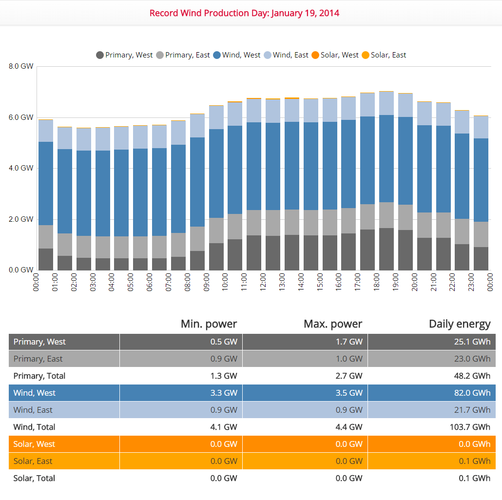

# Data Slider

## Overview

Data Slider is open source. Access the code on [GitHub](https://github.com/axibase/nodejs-dataslider).

Data Slider is built with [`node.js`](https://nodejs.org/en/) using the [ATSD `node.js` API Client](https://github.com/axibase/atsd-api-nodejs/blob/master/README.md). The application is used to interactively display data similar to a PowerPoint presentation.

Data Slider demo presents energy-related data from the public data source [`EnergiNet.dk`](https://energinet.dk/).

This application describes the success of Danish renewable energy efforts with data.

## Details

* Data is continuously updated.
* Build presentations for any previous year or the current calendar year.
* Employ over a dozen [analytical widgets](https://github.com/axibase/charts#widgets) for diverse data presentation.
* No coding required: Build presentations from simple configuration files with macro support for enhanced productivity.
* When creating slides that visualize consecutive periods of time use a template configuration to create iterated configurations for each sequential slide.
* Query results from ATSD are cached on the server to increase application speed.
* Slide configurations are organized in folders and ordered using a table of contents file which determines the order they are displayed.

