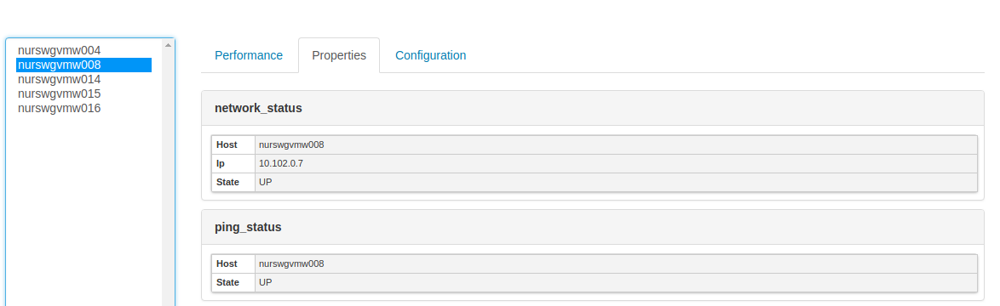
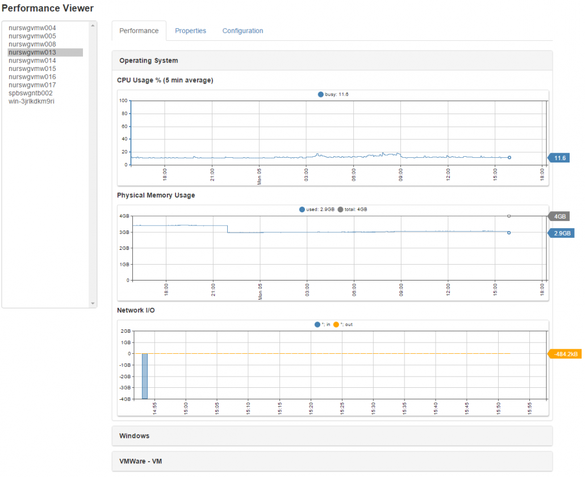

# Performance Viewer

**Application Credentials**:

Username: `user1`, `user2`, `user3` 
Password: `demo`

## Overview

Performance Viewer is open source. Access the code on [GitHub](https://github.com/axibase/atsd-api-php/tree/master/performance).

Performance Viewer is built with [PHP](http://php.net/) using the [ATSD PHP Client](https://github.com/axibase/atsd-api-php/blob/master/README.md). Performance Viewer displays performance statistics alongside host machine and VM properties and configurations.

## Details

### Available Reports

* The application consists of three pages:
  * **Performance**
  * **Properties**
  * **Configuration**
* When loading each page, the application collects available metrics for the selected entity and displays only those categories and charts.
* **Performance** contains several categories:
  * Operating System
    * Common performance metrics collected by Windows and Linux.
  * Windows
  * Linux
  * [collectd](../collectd/README.md)
  * VMware
  * VM
  * [scollector](../scollector/README.md)
* Add additional categories by including widgets configuration files on the local file system.
* **Properties** shows all available properties for the selected entity.
* **Configuration** shows all entity tags for the selected entity.

### Access Controls

* Users are assigned access to entity groups in [`user-group.ini`](https://github.com/axibase/atsd-api-php/blob/master/performance/users-group.ini).
* Each user is limited to viewing only the entities in their assigned entity group.
* Entities available to each user are displayed on the left menu.
* Requests for other entities are blocked.

### Security

* The list of users authorized to access this application is configured in [`.htpasswd`](https://httpd.apache.org/docs/2.4/programs/htpasswd.html) using [`htdigest`](https://httpd.apache.org/docs/2.4/programs/htdigest.html).
* Requests for time series data generated by embedded widgets are sent to [`ApiProxy.php`](https://github.com/axibase/atsd-api-php/blob/master/performance/ApiProxy.php).
* API PHP proxy serves as a façade and validates that the entities specified in series data request belong to the list of entities which the active user is authorized to view.
* API PHP proxy acts as a client and transmits series requests to ATSD on behalf of the active user. Responses from ATSD are returned to the browser by the same API proxy, eliminating direct communication between users and ATSD.

