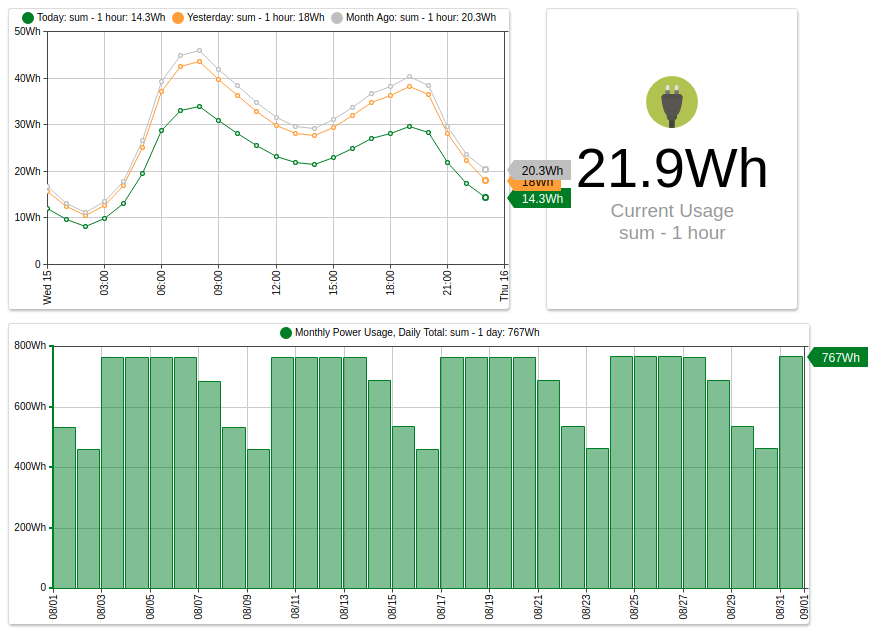
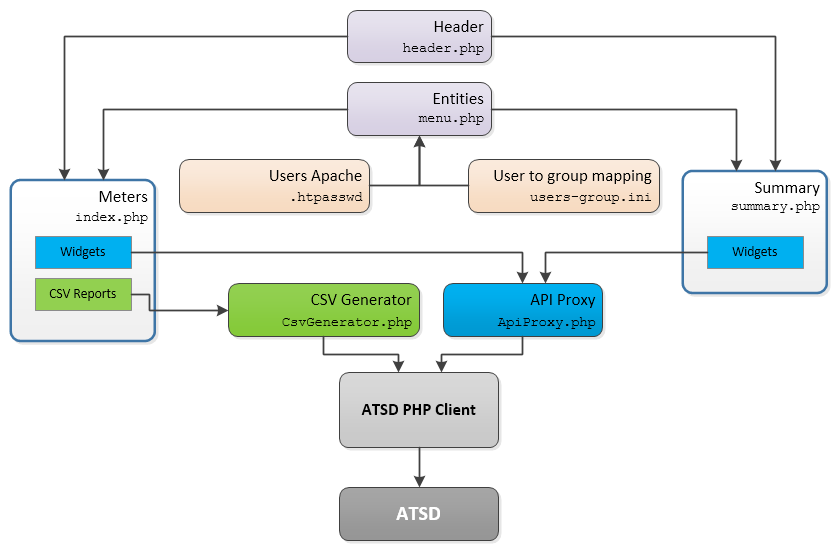

# Power Meter Reporter

**Application Credentials**:

Username: `admin`, `user1`, `user2`, `guest` 
Password: `demo`

## Overview

Power Meter Reporter is open source. Access the code on [GitHub](https://github.com/axibase/atsd-api-php/blob/master/Meters.md).

Power Meter is built with [PHP](http://php.net/) using the [ATSD PHP Client](https://github.com/axibase/atsd-api-php/blob/master/README.md). Power Meter Reporter displays power usage statistics collected with smart meters and provides customized CSV reports.

## Details

* This PHP application consists of two pages: **Meter Report** (`index.php`) and **Summary Report** (`summary.php`).
* These pages share the same header, user information, and left menu with the list of meters.
* The header and menu are imported into these PHP pages using [`include`](http://php.net/manual/en/function.include.php) statement.
* The list of meters for the current user is obtained by querying ATSD with the name of the specified [entity group](../../configuration/entity_groups.md) in [`users-group.ini`](https://github.com/axibase/atsd-api-php/blob/master/meters/users-group.ini).
* The list of users authorized to access this application is configured in [`.htpasswd`](https://httpd.apache.org/docs/2.4/programs/htpasswd.html) using [`htdigest`](https://httpd.apache.org/docs/2.4/programs/htdigest.html).
* Requests for time series data generated by embedded widgets are sent to API Proxy ([`ApiProxy.php`](https://github.com/axibase/atsd-api-php/blob/master/meters/ApiProxy.php)).
* Requests for CSV reports are sent to CSV Report Generator ([`CsvGenerator.php`](https://github.com/axibase/atsd-api-php/blob/master/meters/CsvGenerator.php)).
* API PHP proxy serves as a façade and validates that the entities specified in series data request belong to the list of entities which the active user is authorized to view.
* API PHP proxy acts as a client and transmits series requests to ATSD on behalf of the active user. Responses from ATSD are returned to the browser by the same API proxy, eliminating direct communication between users and ATSD.

## Entity Group Permissions

Meters are sorted into entity groups in ATSD. Users are granted access to entity groups based on their permissions. Each user is mapped to specific entity groups in PHP.

User | Entity Group | Meters |
| --- | --- | --- |
`user1`|  `org-001-entities`  |  `vs-meter-pwr-001` `vs-meter-pwr-002` `vs-meter-pwr-003`|
`user2`|  `org-002-entities`  |  `vs-meter-pwr-004` `vs-meter-pwr-005`  |
`admin`|  `org-all-entities`  |  `vs-meter-pwr-001` `vs-meter-pwr-002`   `vs-meter-pwr-003` `vs-meter-pwr-004` `vs-meter-pwr-005`|
`guest` | None | None
