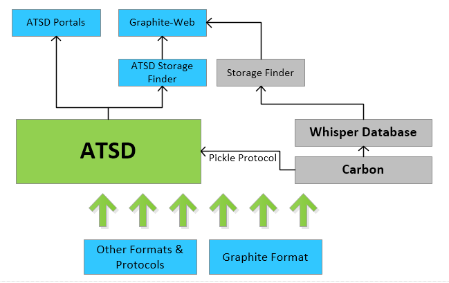

# Graphite

* [Graphite Format](graphite-format.md)
* [Storage Finder](storage-finder.md)
* [Pickle Protocol](pickle-protocol.md)
* [Data Migration from Graphite to ATSD](data-migration.md)
* [Installing Graphite-Web with ATSD Storage Finder](installation.md)

## Overview

[Graphite](https://graphite.readthedocs.org/en/latest/) is a monitoring tool that stores numeric time-series data and renders graphs of this data on demand.

ATSD supports both the Graphite format and the Pickle protocol, therefore tools that send data into Graphite can also send data to ATSD.

ATSD provides a [Storage Finder](storage-finder.md) for Graphite-Web, which means that you can use ATSD as the back-end for Graphite instead of the default Whisper database.

### Data Collection Tools that support Graphite Format

* [collectd](../collectd/README.md): Linux agent which collects system performance statistics.
* [StatsD](../statsd/README.md): simple daemon for statistics aggregation.
* [collectl](http://collectl.sourceforge.net/): collection tool for system metrics that can be run both interactively and as a daemon.
* [Ganglia](http://ganglia.info/): monitoring system for high-performance computing systems such as clusters and Grids.