# Storage Finder

ATSD Storage Finder is an alternative to the default Graphite [storage finder](https://graphite.readthedocs.org/en/latest/storage-backends.html).

Refer to Graphite and ATSD Storage Finder [installation instructions](installation.md).

ATSD Storage Finder configuration parameters are set in the `local_settings.py` file.

The configurations are set under `ATSD_CONF`.

There are two versions of the ATSD Storage Finder:

* ATSD Storage Finder Default – allows you to view metrics as they are stored in ATSD.
* ATSD Storage Finder Virtual – allows you to create custom paths to entities, metrics, and tags.

ATSD Storage Finder settings in `local_settings.py`:

```python
STORAGE_FINDERS = (
    'atsd_finder.AtsdFinder',
    'atsd_finder.AtsdFinderV',
    'graphite.finders.standard.StandardFinder',
)
```

ATSD Storage Finder and ATSD Storage Finder Virtual can be used together (their settings can be combined in `ATSD_CONF`).

## ATSD Storage Finder Default

```python
STORAGE_FINDERS = (
    'atsd_finder.AtsdFinder',
)
```

`local_settings.py` settings:

| Setting | Description | Default Value |
| --- | --- | --- |
|  url  |  ATSD hostname or IP  |  localhost:8088  |
|  username  |  ATSD user username  |  –  |
|  password  |  ATSD user password  |  –  |
|  entity_folders  |  List of folders for grouping entities by name.<br>Grouping is done according to the beginning of each entity name.<br>If entity name is matched to a folder name, then the entity name is listed in that folder.<br>For example if an entity name begins with<br>`com` (like `com_axibase`)<br>then the entity is listed in the folder called `'com'`.<br>If the entity name does not satisfy any of the listed folder names, then the entity is listed in the default `_` folder.  |  `'entity_folders' : 'abcdefghijklmnopqrstuvwxyz_'`<br>Generates folders from a to z (iterates through the string).  |
|  metric_folders  |  List of folders for grouping metrics by name.<br>Grouping is done according to the beginning of each metric name.<br>If the metric name is matched to a folder name, then the metric is listed in that folder.<br>For example if a metric name begins with<br>`statsd` (`statsd_cpuload_avg5`)<br>then the metric is listed in a folder called `'statsd'`.<br>If metric name does not satisfy any of the listed folder names, the metric is placed into the `"_"` folder by default.  |  `'metric_folders' : 'abcdefghijklmnopqrstuvwxyz_'`<br>Generates folders from a to z, iterates through the string.  |
|  aggregators  |  List of aggregators.  |  `'aggregators' : {'avg': 'Average','min': 'Minimum','max': 'Maximum','sum': 'Sum','count': 'Count','first': 'First value','last' : 'Last value','percentile(99.9)': 'Percentile 99.9%','percentile(99)': 'Percentile 99%','percentile(99.5)': 'Percentile 99.5%','percentile(95)': 'Percentile 95%','percentile(90)': 'Percentile 90%','percentile(75)': 'Percentile 75%','median': 'Median','standard_deviation': 'Standard deviation','delta': 'Delta','wavg' : 'Weighted average','wtavg': 'Weighted time average'}`  |

If you use an underscore at the beginning of a setting value (`entity_folders` or `metric_folders`), then all folders that do not satisfy any other setting are placed there.

For example:

`'_other'`

## Storage Finder Example

`local_settings.py` example.

```python
ATSD_CONF = {
    'url': 'http://atsd_hostname:8088',
    'username': 'username',
    'password': 'password',
    'entity_folders': ['_other',
                       'com_',
                       'nur',
                       'dkr',
                       'us',
                       'emea-1',
                       'emea-2'],
    'metric_folders': ['_other',
                       'nmon',
                       'collectd',
                       'statsd',
                       'vmware',
                       'wordpress'],
    'aggregators':    {'avg' : 'Average',
                       'min' : 'Minimum',
                       'max' : 'Maximum',
                       'median' : 'Median',
                       'delta' : 'Delta'}
}
```

## ATSD Storage Finder Virtual

```python
STORAGE_FINDERS = (
    'atsd_finder.AtsdFinderV',
)
```

ATSD Storage Finder Virtual has an additional setting: `views`.

Under `views`, use `type` to control which folders to display in the `graphite-web` interface.

| Type | Description |
| --- | --- |
|  `'type': 'entity folder'`  |  Node representing entity filters.  |
|  `'type': 'entity'`  |  Node representing entities.  |
|  `'type': 'tag'`  |  Node representing tag values.  |
|  `'type': 'metric folder'`  |  Node representing metric filters.  |
|  `'type': 'metric'`  |  Node representing metrics.  |
|  `'type': 'interval'`  |  Node representing selection intervals.  |
|  `'type': 'collection'`  |  Node representing different types of nodes.  |
|  `'type': 'aggregator'`  |  Node representing statistics.  |
|  `'type': 'period'`  |  Node representing statistics periods.  |

## `local_settings.py` example with "views"

```python
ATSD_CONF = {
    'views': {'DistributedGeoMon':
    [
        {'type': 'entity folder',
            'value': [{'com.axibase'  : 'com.axibase'},
                    {'com.axibase.*': 'com.axibase.*'}]},
        {'type': 'entity',
            'value': ['*']},
        {'type': 'tag',
            'value': ['path'],
            'global': [{'type': 'metric',
                        'value': ['distgeomon.connect-dns']}]},
        {'type': 'tag',
            'value': ['geo-target', 'geo-source']},
        {'type': 'metric folder',
            'value': [{'distgeomon.response*': 'response'},
                    {'distgeomon.connect*' : 'connect'}]},
        {'type': 'metric',
            'value': ['*']},
        {'type': 'interval',
            'value': [{'count': '30',
                    'unit': 'minute',
                    'label': '30 minutes'},
                    {'count': '2',
                    'unit': 'hour',
                    'label': '2 hours'},
                    {'count': '1',
                    'unit': 'day',
                    'label': '1 day'}]},
        {'type': 'collection',
            'value': [{'type': 'aggregator',
                    'value': [{'detail': 'Detail'}],
                    'is leaf': True},
                    {'type': 'const',
                    'value': ['Aggregate']}]},
        {'type': 'aggregator',
            'value': [{'count'        : 'Count'},
                    {'min'          : 'Minimum'},
                    {'max'          : 'Maximum'},
                    {'avg'          : 'Average'},
                    {'median'       : 'Median'},
                    {'sum'          : 'Sum'},
                    {'percentile(75)': 'Percentile 75%'},
                    {'delta'        : 'Delta'}]},
        {'type': 'period',
            'value': [{'count': '30',
                    'unit': 'second',
                    'label': '30 seconds'},
                    {'count': '10',
                    'unit': 'minute',
                    'label': '10 minutes'},
                    {'count': '1',
                    'unit': 'hour',
                    'label': '1 hour'}],
            'is leaf': True}
        ]
    }
}
```

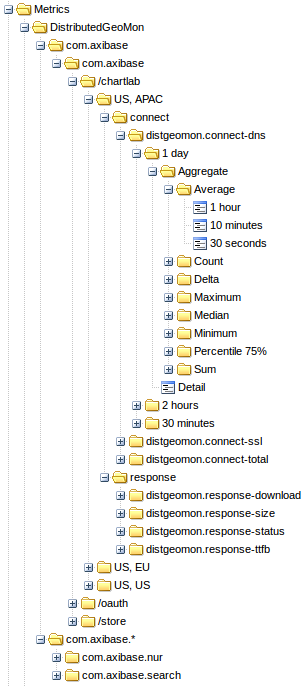

## "views" example breakdown

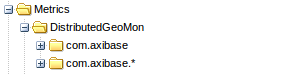

```python
{'type': 'entity folder',
 'value': [{'com.axibase'  : 'com.axibase'},
           {'com.axibase.*': 'com.axibase.*'}]}
```

Below two entity folders are shown. One filters out only the entity `com.axibase`. The other one filters out entities that begin with `com.axibase`.

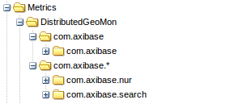

```python
{'type': 'entity',
 'value': ['*']}
```

List of entities filtered by the folder they’re in.

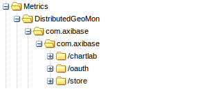

```python
{'type': 'tag',
 'value': ['path'],
 'global': [{'type': 'metric',
             'value': ['distgeomon.connect-dns']}]}
```

Values of the tag path. To retrieve tags we need a metric; however, it has not been established yet. We can make a global token inside this one to make the metric become `distgeomon.connect-dns` until stated otherwise.

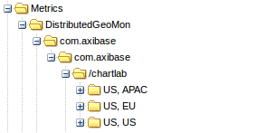

```python
{'type': 'tag',
 'value': ['geo-target', 'geo-source']}
```

Values of tags `geo-target` and `geo-source` separated by a comma.

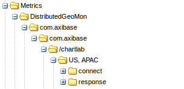

```python
{'type': 'metric folder',
 'value': [{'distgeomon.response*': 'response'},
           {'distgeomon.connect*' : 'connect'}]}
```

Two metric folders.

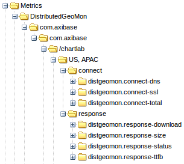

```python
{'type': 'metric',
 'value': ['*']}
```

List of metrics.

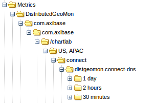

```python
{'type': 'interval',
 'value': [{'count': 30,
            'unit': 'minute',
            'label': '30 minutes'},
           {'count': 2,
            'unit': 'hour',
            'label': '2 hours'},
           {'count': 1,
            'unit': 'day',
            'label': '1 day'}]}
```

List of aggregation intervals.

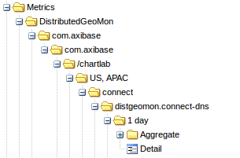

```python
{'type': 'collection',
 'value': [{'type': 'aggregator',
            'value': [{'detail': 'Detail'}],
            'is leaf': True},
           {'type': 'const',
            'value': ['Aggregate']}]}
```

If we want to make two different types of tokens at the same level, for example a leaf and a branch (as shown below), we can create a collection. In this collection, there is a detail aggregator, which is a leaf. Click it and see the chart and an Aggregate folder, which expands the tree further.

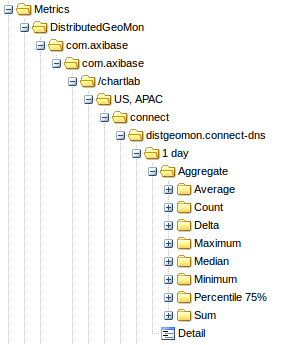

```python
{'type': 'aggregator',
 'value': [{'count'        : 'Count'},
           {'min'          : 'Minimum'},
           {'max'          : 'Maximum'},
           {'avg'          : 'Average'},
           {'median'       : 'Median'},
           {'sum'          : 'Sum'},
           {'percentile(75)': 'Percentile 75%'},
           {'delta'        : 'Delta'}]}
```

The list of aggregators is provided below. First we create a named ATSD aggregator.

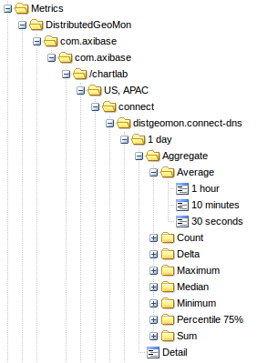

```python
{'type': 'period',
 'value': [{'count': 30,
            'unit': 'second',
            'label': '30 seconds'},
           {'count': 10,
            'unit': 'minute',
            'label': '10 minutes'},
           {'count': 1,
            'unit': 'hour',
            'label': '1 hour'}],
 'is leaf': True}
```

Final leaf representing possible aggregation periods.

When the storage finder is enabled, metrics from ATSD become available for visualization in the Graphite-web application.

ATSD metrics displayed in Graphite-web application:

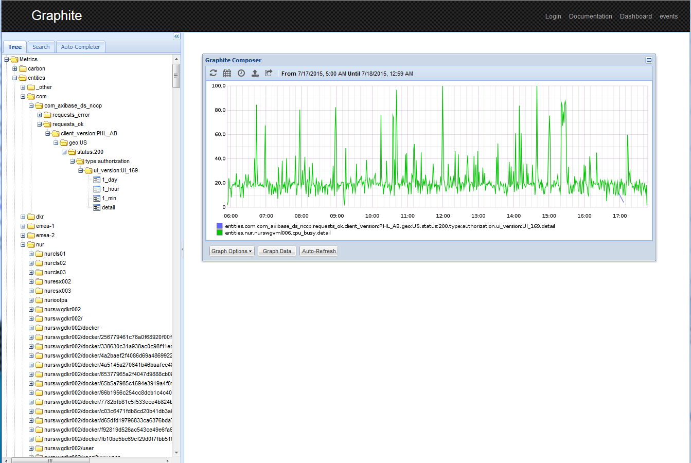
