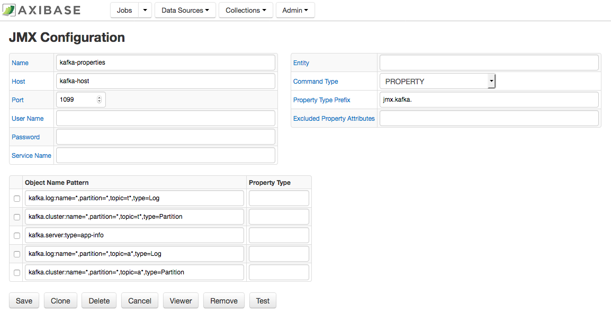
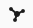
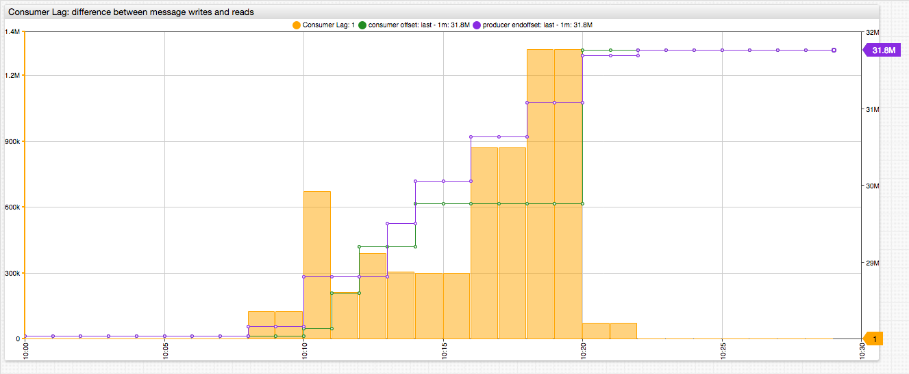

# Monitoring Kafka with ATSD

This document describes the process of configuring availability and performance monitoring Kafka with the Axibase Collector and the Axibase Time Series Database.

## Step 1: Configure Axibase Collector

1. Login into Axibase Collector at https://collector_hostname:9443
1. Click the Jobs tab in the top menu and press the Import button.
1. Click the Browse button, open [kafka-jmx](resources/job_jmx_kafka-jmx.xml) job and press the Import button.

1. Go back, locate the `kafka-jmx` job and open it.
1. On the JMX Job page, enable its status by checking on the Enabled check box.
1. Adjust the cron expression if required. By default, the job will be executed every 10 minutes. For more information on cron expressions, see [Scheduling](https://github.com/axibase/axibase-collector/blob/master/scheduling.md).  
1. Select a database for storing data.
1. Click Save.


### Configuring kafka-series

1. Select kafka-series configuration.
1. On the JMX Configuration page, enter the JMX connection parameters:

   **Host** — Kafka hostname.  
   **Port** — JMX port.  
   **User Name** — JMX user name.  
   **Password** — Password for JMX user.  
   **Entity** — Optionally, specify the output of the hostname command on the Kafka server if it’s different from `kafka_hostname` (for example if `kafka_hostname` represents a fully qualified name).  
Other parameters are optional. For more information on JMX configuration, see [JMX](https://github.com/axibase/axibase-collector/blob/master/jobs/jmx.md).   

1. Click Test to validate the configuration.  
If the specified configuration is correct, this indicates that there must be no errors in the test results.
1. Click Save.

    

### Configuring kafka-properties

1. From the table on the JMX Job page, click Edit next to the kafka-properties configuration.
1. Set Host, Port, User Name, Password, and Entity fields as described in the previous section.
1. Click Test to validate the configuration.
1. Click Save.

    

## Step 2: Configure ATSD

1. Login into Axibase Time Series Database at https://atsd_hostname:8443.
1. Go to Metrics page and verify that `jmx.kafka.*` metrics are available.
1. Go to Entities page and verify that `jmx.kafka.*` properties are available for entities from `kafka-properties` configuration.
1. Go to `Settings -> Entity Groups` and import [Kafka](resources/groups.xml) entity group.
1. Go to `Portals -> Configure` and import [Kafka](resources/portal-configs.xml) portals (check on the Auto-enable New Portals check box).
1. Go to  `Alerts -> Rules` and import [Kafka](resources/rules.xml) rules (check on the Auto-enable New Rules check box).
1. Go to  `Entity Views -> Configure` and import [Kafka](resources/entity-views.xml) entity view.
1. Go back, locate `Kafka` Entity View and open it.
1. Set `Multi-Entity Portal` dropdown to `Kafka`.
1. Click Save.


## Step 3: Verification

1. Select `Kafka` on `Entity Views` menu and open it:

    

1. Verify that portal in table header is available and refer to Kafka portal:

    

1. Verify that portals for each entity is refer to Broker portal:

    


## Consumer lag

Consumer lag calculation requires information about log end offset and consumer offset. If former is collected by JMX Job
with Axibase Collector, the latter - directly from `__consumer_offset` topic on Kafka server. 
This information can be retrieved on Kafka host using the following command (replace topic-name with required):

```
# Move into kafka bin
cd /opt/kafka/bin  

# Create consumer config
echo "exclude.internal.topics=false" > /tmp/consumer.config

# Consume all offsets
./kafka-console-consumer.sh --consumer.config /tmp/consumer.config --formatter "kafka.coordinator.group.GroupMetadataManager\$OffsetsMessageFormatter" \
--zookeeper localhost:2181 --topic __consumer_offsets --from-beginning | grep topic-name | awk \
'match($0, /\[([^\]]+)/) { meta=substr( $0, RSTART+1, RLENGTH-1 ) } \
 match($0, /OffsetMetadata\[([^,]+)/) { meta_offset=substr( $0, RSTART+15, RLENGTH-15 ) } \
 match($0, /CommitTime\ ([^,]+)/) { print meta "," meta_offset "," substr( $0, RSTART+11, RLENGTH-11 ) }' > topic-name.csv
```  

1. Import [csv-parser](resources/csv-parser-consumer-offset.xml) into ATSD on `Data -> CSV Parsers` page
1. Select imported consumer-offset parser and upload the topic-name.csv file.
1. Check that entity `kafka` created and metric `consumer_offset` available in ATSD interface.
1. The following [portal](https://apps.axibase.com/chartlab/67b46203) can be created based on uploaded data:



