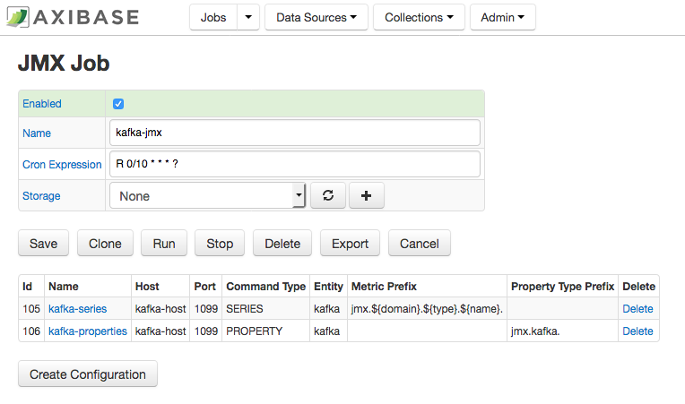
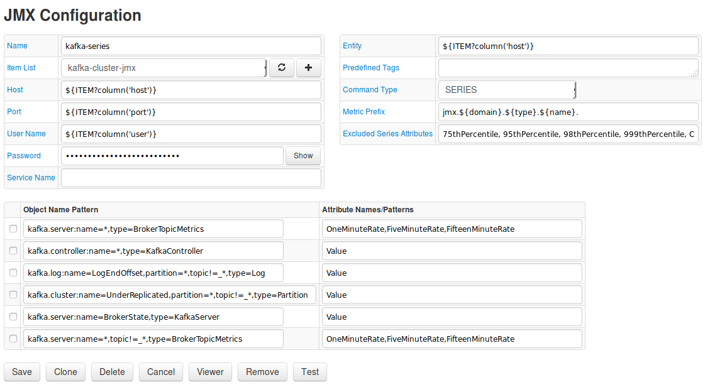
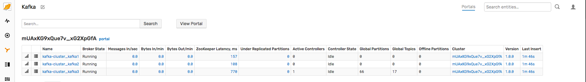
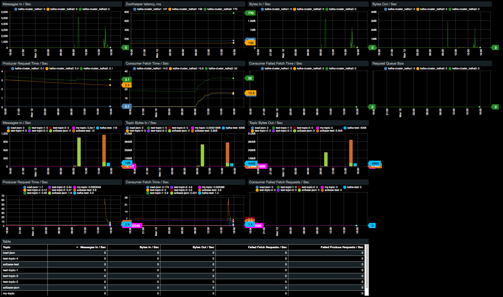
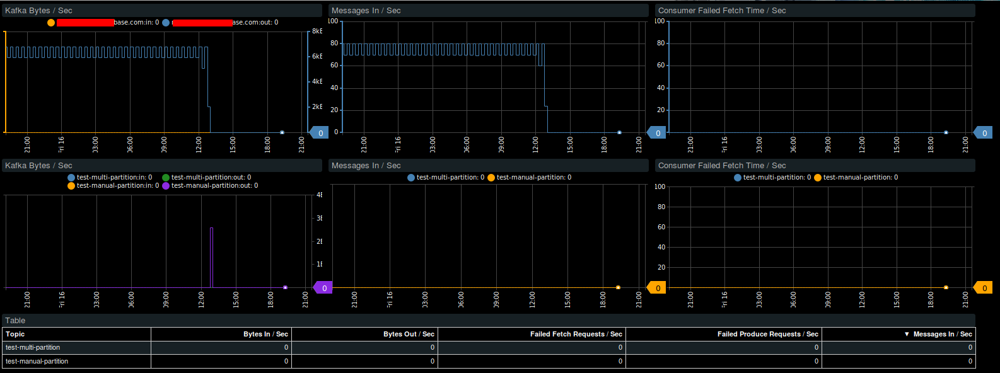

# Monitoring Kafka with ATSD

This document describes the process of configuring availability and performance monitoring Kafka with the Axibase Time Series Database.

## Step 1: Configure Kafka JMX Job

1. Login into Axibase Collector at https://collector_hostname:9443
1. Click the Jobs tab in the top menu.
1. Click the Import button.
1. Click the Browse button and open [kafka-jmx](resources/job_jmx_kafka-jmx.xml) job.
1. Click the Import button.

1. Click the Back button.
1. Locate the `kafka-jmx` job.
1. On the JMX Job page, enable its status by checking on the Enabled check box.
1. Adjust the cron expression if required. By default, the job will be executed every 10 minutes. For more information on cron expressions, see [Scheduling](https://github.com/axibase/axibase-collector/blob/master/scheduling.md).  
1. Select a database for storing data.

### Configuring kafka-series

1. Select kafka-series configuration.
1. On the JMX Configuration page, enter the JMX connection parameters as specified in Step 1.6 above:

   **Host** — Kafka hostname.  
   **Port** — JMX port.  
   **User Name** — JMX user name such as monitorRole. Read-only permissions are sufficient.  
   **Password** — Password for JMX user.  
   **Entity** — Optionally, specify the output of the hostname command on the Kafka server if it’s different from `kafka_hostname` (for example if `kafka_hostname` represents a fully qualified name).  
Other parameters are optional. For more information on JMX configuration, see [JMX](https://github.com/axibase/axibase-collector/blob/master/jobs/jmx.md).   

1. Click Test to validate the configuration.  
If the specified configuration is correct, this indicates that there must be no errors or empty fields in the test results.
1. Click Save.

    

### Configuring kafka-properties

1. From the table on the JMX Job page, click Edit next to the kafka-properties configuration.
1. Set Host, Port, User Name, Password, and Entity fields as described in the previous section.
1. Click Test to validate the configuration.
1. Click Save.

## Step 2: Configure ATSD

1. Login into Axibase Time Series Database at https://atsd_hostname:8443.
1. Go to Metrics page and verify that jmx.kafka.* metrics are available.
1. Go to Entities page and verify that jmx.kafka.* properties are available for entities from kafka-properties configuration.
1. Go to Settings -> Entity Groups and import [Kafka](resources/groups.xml) entity group.
1. Go to Entity Views and import [Kafka](resources/entity-views.xml) entity view.

1. Go to Portals -> Configure and import [Kafka](resources/portal-configs.xml) portals.

1. Go to Alerts -> Rules and import [Kafka](resources/rules.xml) rules.

