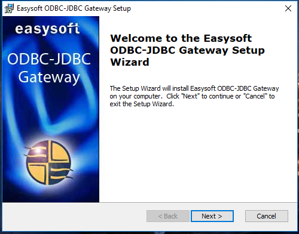
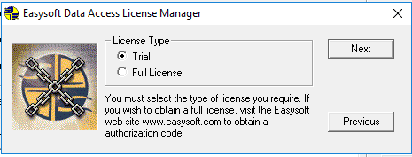
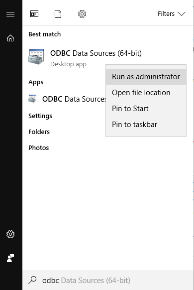
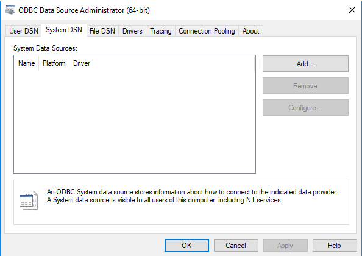
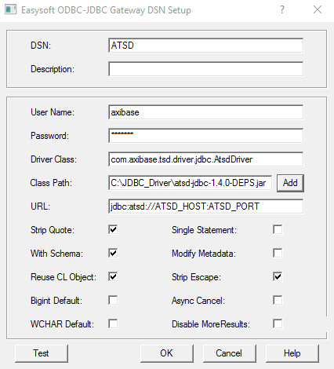
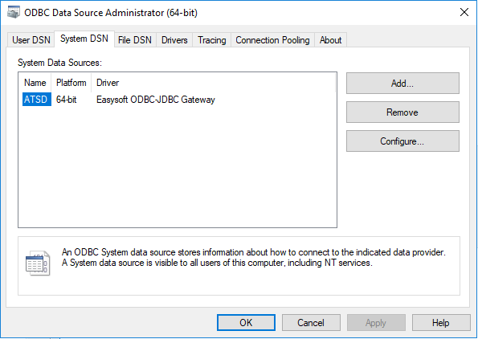

# ODBC

## Overview

This document describes how to install an `ODBC-JDBC` bridge on a Windows machine. The bridge serves as a data link between ATSD and Windows applications that do not support [JDBC](https://docs.oracle.com/javase/tutorial/jdbc/overview/) driver technology.

The bridge intercepts SQL queries from client applications via the Microsoft [ODBC](https://docs.microsoft.com/en-us/sql/odbc/microsoft-open-database-connectivity-odbc) protocol and transmits the queries into ATSD using the [ATSD JDBC driver](https://github.com/axibase/atsd-jdbc).

## Prerequisites

* Windows `7`, `8`, `10` operating system, **64-bit edition**.
* Java `7`.
* [ODBC-JDBC](https://www.easysoft.com/products/data_access/odbc_jdbc_gateway/#section=tab-1) bridge.

## Downloads

1. Download and install **Java `7`**. Note that Java `8`** is not fully supported by the ODBC-JDBC bridge vendor.
2. [Register](https://www.easysoft.com/cgi-bin/account/register.cgi) an account with the bridge vendor. This account is required for trial license activation.
3. [Download](https://www.easysoft.com/products/data_access/odbc_jdbc_gateway/#section=tab-1) the trial version of the ODBC-JDBC bridge.
4. [Download](https://github.com/axibase/atsd-jdbc/releases) ATSD JDBC driver with dependencies.

## Bridge Installation

Install and activate the bridge:

* Run the installer under an Administrator account.

  

* Bypass the Welcome page.

  

* Accept the license agreement.

  

* Choose an installation path.

  

* Confirm the installation.

  

* Check the **License Manager** box and finish.

  

## License Activation

The License Manager window appears after the installation wizard exits. If the window does not appear, open the **Start** menu and search for **License Manager**. Fill out the form fields as entered in the registered account and click **Request License**

  

* Choose **Trial**, click **Next**.

  

* Choose **ODBC JDBC Gateway** from the drop-down list, click **Next**.

  

* Click **On-line request**.

  

* If activation succeeds, a popup window appears.

  

* A new **Installed Licenses** window with license information is visible in the License Manager

  

## Configure ODBC Data Source

* Open the **Start** menu, type `ODBC` and launch ODBC Data Source Manager under an Administrator account.

  

* Open **System DSN** tab, click **Add...**.

  

* Choose the **ODBC-JDBC Gateway**, click **Finish**.

  

* Enter the following settings in the DSN Setup window:

```txt
DSN         :   ATSD
User name   :   <atsd username>
Password    :   <atsd password>
Driver class:   com.axibase.tsd.driver.jdbc.AtsdDriver
Class Path  :   <path to ATSD driver, for example C:\drivers\atsd-jdbc-1.3.2-DEPS.jar>
URL         :   jdbc:atsd://atsd_hostname:8443
```

Refer to ATSD [JDBC Documentation](https://github.com/axibase/atsd-jdbc#jdbc-connection-properties-supported-by-driver)  for additional details about the URL format and the driver properties.

 

* Enable **Strip Quote** option to remove quotes from table and column names.

* Enable **Strip Escape** option to remove [ODBC escape sequences](https://docs.microsoft.com/en-us/sql/odbc/reference/appendixes/odbc-escape-sequences).

* Click **Test** to verify the settings. If result is correct, save the settings.

> In case of `Unable to create JVM` error, run a **Repair** task in **Windows Program** for the bridge program. The error occurs if the bridge is installed prior to Java installation.

* The **System DSN** tab now displays the new data source.

  
